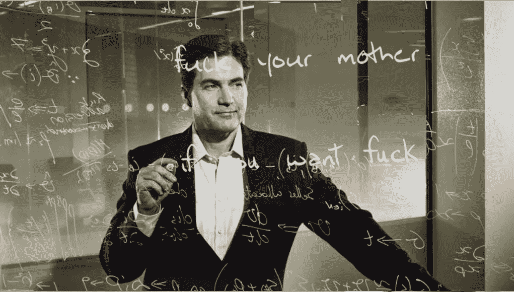
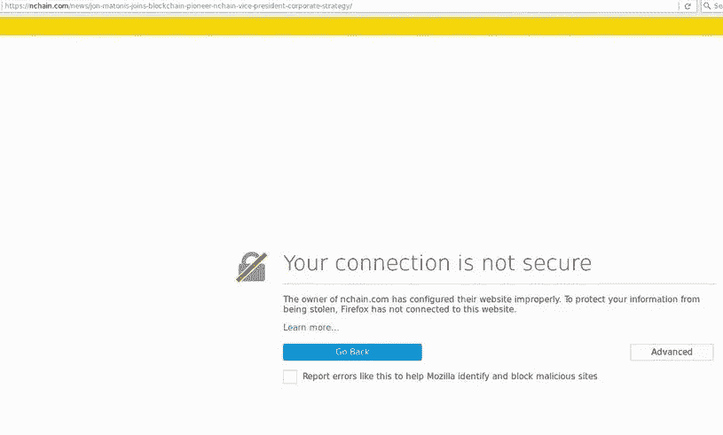
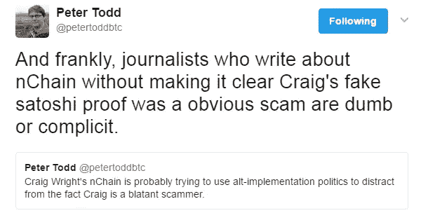

# 大脑中的锁链:假聪的回归

> 原文：<https://medium.com/hackernoon/nchain-in-the-brain-return-of-the-fake-satoshi-1415a8b07f04>

(我希望有些人得到标题所指的参考文献

谣言开始于几个月前:克雷格·史蒂夫·赖特(CSW)计划复出。在今年的 [Satoshi 圆桌会议](http://www.coindesk.com/bitcoin-new-satoshi-nakamoto-rumors/)之后，谣言变得更加响亮，并开始来自多个来源。

4 月 12 日传来消息: [nChain 被高科技私募股权基金 SICAV plc](http://fortune.com/2017/04/13/bitcoin-inventor-nchain/) 收购

> 一家围绕声称发明了比特币加密货币的克雷格·赖特的研究建立的公司被出售给一家私人股本公司，该公司表示，这是迄今为止涉及比特币底层区块链技术的最大一笔交易。

当访问实际的网站(nchain.com)时要小心，因为显然*“60 位世界级的科研、工程和其他专业人士”*无法创建一个简单而安全的网站。

出于某种原因，他们似乎真的在申请专利:

昨天，他们宣布前比特币基金会董事乔恩·马托尼斯(Jon Matonis)将加入 nChain，担任公司战略副总裁。这真的不应该是一个大惊喜，因为他确信 CSW 实际上是聪。

**n chain 为什么相关？**不在这一点上。
**那为什么还要写呢？**因为我看到某个故事正在被推动，而与之相关的人有很多钱，或者以前被欺骗过。最好传播一些关于它的意识。
**如果 CSW 真的签了提前封杀怎么办？从我所听到和读到的关于与聪的互动的一切来看:对我来说，不可能是他。如果他签了只有聪能签的早期合同，我更担心他是怎么拿到的。**

# nChain & CSW 的游戏计划:

这部分将属于纯粹的猜测，但是有一些有趣的事情正在浮出水面。

*   加文·安德森昨天在推特上发布了关于区块流的消息。我肯定他在 nChain 的候选名单上，因为他是 T21 的忠实信徒。在 crypto 中已经完全没有可信度了，他仍然可以成为下一个 nChain PR-push 的有用补充。
*   罗杰·维耶与 CSW·查因有直接联系。他们都在 Bitclub 的会议上，罗杰删除了一条旧推文。
*   nChain 似乎很喜欢专利，最近有几起( [1](https://twitter.com/Falkvinge/status/858929781739573248) ， [2](https://twitter.com/rogerkver/status/858327206443053057) )针对 Segwit 和 Blockstream 的专利攻击。CSW 也有充满专利的历史。

我还没有找到与比特大陆的直接联系。

游戏计划:

1.  让更多“著名”的比特币人站在你这边，给人一种相关性和权威性的错觉。
2.  专利巨魔人人。
3.  利润。
4.  额外收获:创建你自己的实现，由一个富有的投资者、一个假的 Satoshi 和一个控制“火核”的 hashrate 的矿工支持。

*编辑*发现了一个有趣的帖子，与[潜在的 CSW 相关的空壳公司](https://www.reddit.com/r/btc/comments/68vyqp/jon_matonis_joins_nchain_as_vice_president_of/dh2dhiz/)。*/编辑*

想要开怀大笑，一定要去看看 [hoaxchain](http://hoaxchain.com/aboutus1.html) 。

相关:

捐赠地址:1 fmy 1 kpec y 7 beswuavcm 5 xay 1 bmawjaxkv。

> [黑客中午](http://bit.ly/Hackernoon)是黑客如何开始他们的下午。我们是 AMI 家庭的一员。我们现在[接受投稿](http://bit.ly/hackernoonsubmission)并乐意[讨论广告&赞助](mailto:partners@amipublications.com)机会。
> 
> 如果你喜欢这个故事，我们推荐你阅读我们的[最新科技故事](http://bit.ly/hackernoonlatestt)和[趋势科技故事](https://hackernoon.com/trending)。直到下一次，不要把世界的现实想当然！

