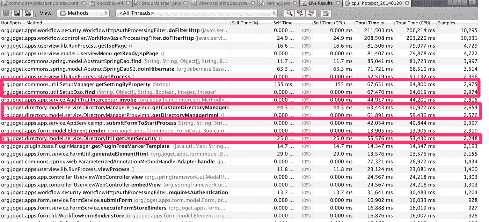
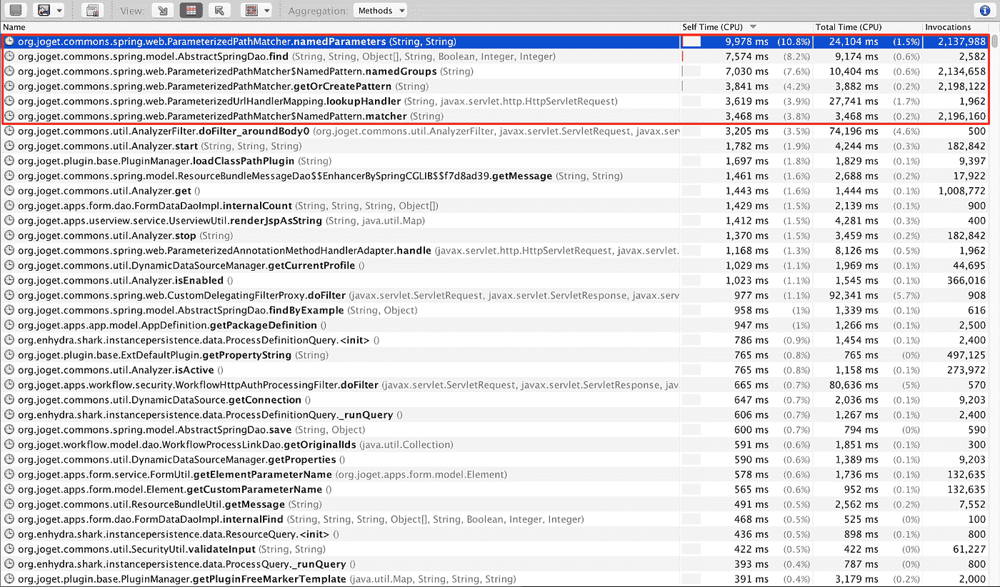
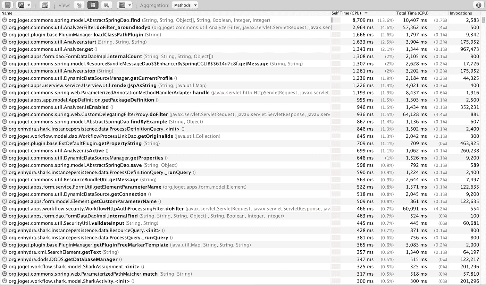
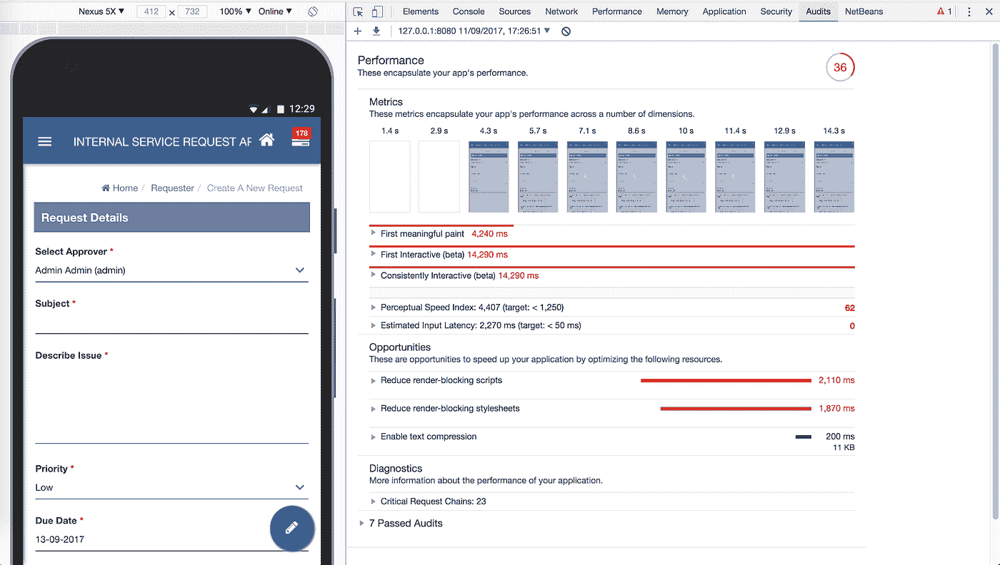
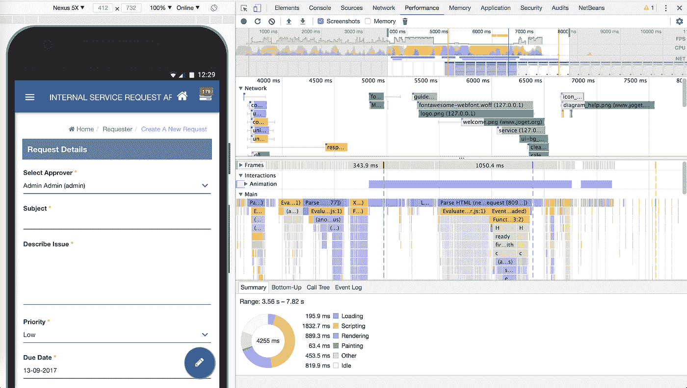
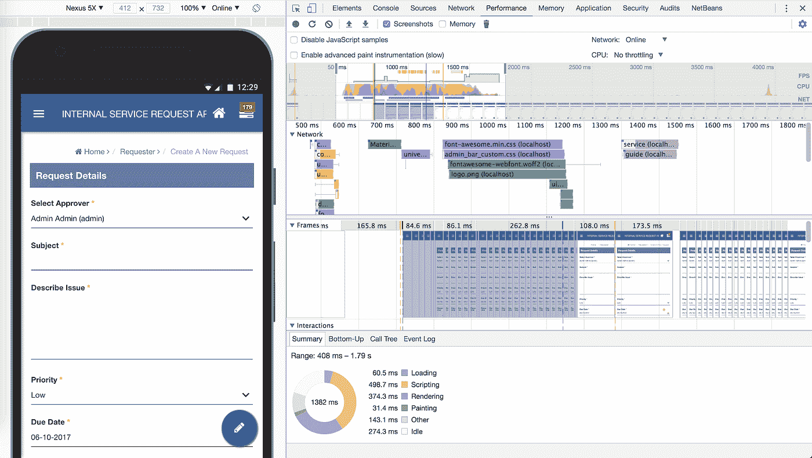
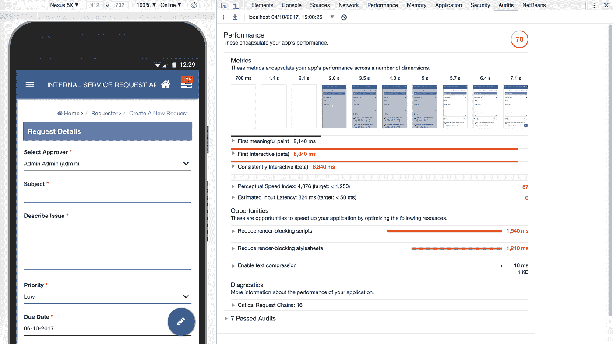
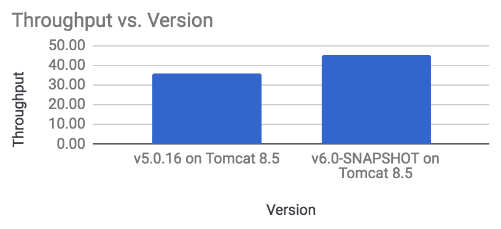

# 对速度的需求:我们如何在 Joget Workflow v6 平台中优化性能

> 原文：<https://medium.com/hackernoon/need-for-speed-how-we-optimized-performance-in-the-joget-workflow-v6-platform-efc565f8e8d8>

作为一个[开源](https://hackernoon.com/tagged/open-source) [的低代码/无代码应用平台](https://www.joget.org/)，Joget Workflow 让非编码人员和编码人员都可以可视化地快速构建应用。然而，在这种简单的背后，有很多事情在进行，性能一直是优先考虑的问题。重点是为应用程序提供一个快速的运行时，我们努力确保在平台层面上有尽可能少的开销。

Joget 团队一直在努力开发 [Joget Workflow v6](https://www.joget.org/joget-workflow-v6/) ，目前处于公开测试阶段。我们最近一直在寻找进一步简化和优化平台性能的方法。

这篇技术文章详细介绍了在最新的测试版中是如何做到这一点的，并且可以为您自己的项目或产品提供有用的提示。这篇文章非常专业，面向对平台内部工作感兴趣的开发人员。让我们来看看引擎盖下。

# 服务器端代码分析

Joget 平台是基于 Java 构建的，所以只需在 Google 上搜索一下，就可以获得大量的代码分析工具。在我们的[开发](https://hackernoon.com/tagged/development)环境中，我们使用了 [Netbeans Profiler](https://profiler.netbeans.org/) ，这是一个集成到 NetBeans IDE 中的全功能 Java 分析工具。

早在 2014 年，我们就已经对 v4 进行了性能分析。这里有一个在采样时发现的热点的截图。

v4 Snapshot Hot Spots

自 v4 版本以来，通过代码优化和适当的缓存，所有这些突出的热点和瓶颈都已消除。

在最新的 v6 快照中，我们发现了几个控制器方法中的一些额外的热点，它们可能是优化的候选对象。

v6 Snapshot Pre-Optimization Hot Spots

方法调用实际上非常快，但似乎有很多调用，所以我们决定尝试使用 [Ehcache 库](http://www.ehcache.org/)实现一些重构和缓存，以减少所需的调用数量。

优化后的结果显示，所有这些调用都被避免了，这将减少高负载下的 CPU 周期。

v6 Snapshot Post-Optimization Hot Spots

所有可避免的服务器端热点看起来都已经被消除了，所以接下来我们转移到客户端浏览器渲染部分的性能。

# 客户端浏览器关键渲染路径和感知速度测量

使用 Chrome 60 中引入的由 Lighthouse 支持的新[谷歌 Chrome 审计](https://developers.google.com/web/updates/2017/05/devtools-release-notes#lighthouse)面板，我们运行了一系列测试，以测量使用最新[材料设计](https://material.io/guidelines/)灵感 [v6 通用主题](https://dev.joget.org/community/display/KBv6/V6+Universal+Theme)的 Joget 应用程序的质量。

这是我们开始优化之前的审计结果:

Pre-Optimization Performance Audit

性能得分很低，只有 36 分，对于 4 秒钟后才看到 UI 的第一个有意义的绘制的用户来说，感知速度很慢。哎哟！为什么会发生这种情况？

使用 Chrome DevTools [性能分析](https://developers.google.com/web/tools/chrome-devtools/evaluate-performance/reference)，我们发现[关键渲染路径](https://developers.google.com/web/fundamentals/performance/critical-rendering-path/)没有优化。这仅仅意味着浏览器必须做很多工作，比如加载和解析 HTML、脚本和 CSS，然后才能向用户呈现一些东西。

Pre-Optimization Performance Analysis

在这种特殊情况下:

*   有一个客户端 AJAX 请求来处理一个少于[的 CSS](http://lesscss.org/) 文件，并且
*   在能够执行第一次有意义的绘制之前，当浏览器需要加载所有资源文件(脚本、CSS 等)时，出现了阻塞。
*   在 onload 和 document ready 事件中有一些阻塞的 JavaScript 函数。

所有这些因素共同延迟了页面的呈现，因此影响了用户对页面加载速度的感知。

发现这些问题后，我们开始着手解决它们:

*   使用 [LESS 引擎](https://github.com/asual/lesscss-engine)将 LESS CSS 处理移至服务器端并缓存。
*   我们通过利用[异步加载脚本](https://bitsofco.de/async-vs-defer/)以及 [CSS](https://github.com/filamentgroup/loadCSS) 移除了不必要的资源加载阻塞。
*   在 onload 和 document ready 事件期间调用的非关键 JavaScript 函数被修改为使用 [setTimeout](https://www.w3schools.com/jsref/met_win_settimeout.asp) 异步调用。

进行更改后，运行 Chrome 性能分析得出以下结果:

Post-Optimization Performance Analysis

渲染速度有很大差异，第一次有意义的绘制时间大幅下降。绩效审计也显示出显著的改进。

Post-Optimization Performance Audit

# 那么，优化的结果是什么呢？

我们使用 [Apache JMeter](http://jmeter.apache.org/) 运行了一个负载测试，以比较当前稳定版本的 Joget Workflow v5 与最新版本的优化版本 6 代码的性能。在 Apache Tomcat 8.5.16 上运行混合用例测试应用程序，吞吐量(每秒请求数)提高了 26.2%，因此看起来优化是有回报的。如果听起来不多，那可能是因为以前的版本已经进行了很好的优化，最新的优化工作挤出了剩余的低效部分。

Throughput Comparison

# 下一步是什么

由于强调平台级的性能优化，Joget Workflow 在运行应用程序时开销较低。从 v4 开始就是这样，甚至在即将到来的 v6 中也有所改进。

如果有任何特定的瓶颈，通常是在应用程序级别。在应用程序级别，在 [Joget 工作流知识库](https://dev.joget.org/community/display/KBv6/Joget+Workflow+v6+Knowledge+Base)的[性能优化和可伸缩性技巧](https://dev.joget.org/community/display/KBv6/Performance+Optimization+and+Scalability+Tips)文章中提供了各种指南和最佳实践。v6 还提供了[性能分析器](https://dev.joget.org/community/display/KBv6/Performance+Analyzer)，并引入了易于使用的缓存功能，如[使用用户视图缓存提高性能](https://dev.joget.org/community/display/KBv6/Performance+Improvement+with+Userview+Caching)中所述。

要了解更多信息并开始使用 Joget 工作流，请访问[https://www.joget.org](https://www.joget.org/)