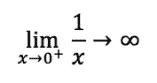
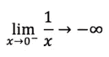

# 负零

> 原文：<https://medium.com/hackernoon/negative-zero-bbd5fd790af3>

每当我妻子想证明我迂腐时，她都会提起下面这个故事:当我的一个女儿上二年级时，她的数学老师告诉全班，任何数除以零都是一。我给老师发了一封充满激情的电子邮件，坚持说结果必须是不确定的。据说这是我有时难以相处的证据。

原来玩笑可能开在我身上——虽然还是很难支持二年级老师的回答。我最近学到了一堆我不知道的浮点数学知识:

*   负零有一个值，与常规(正？)零。这两个零被定义为彼此相等，但它们是不同的值。
*   x ÷ 0.0，对于 x ≠ 0.0，不算误差。相反，按照通常的符号约定，结果要么是正无穷大，要么是负无穷大。
*   0.0 ÷ 0.0 的情况是错误的(具体来说就是“不是数字”或者 NaN)。
*   –0.0+–0.0 =–0.0，–0.0+0.0 = 0.0，以及–0.0×0.0 =–0.0

这些规则源于 IEEE 754“浮点运算标准”，它标准化了跨平台的浮点表示。该标准的最新版本是在 2008 年完成的，但原始版本是在 1985 年发布的，因此这种行为并不新鲜。上述规则在我的 Mac 上的 C (gcc)和 Swift 中都适用，在 iPhone 上的 Swift 中也适用。Mac 上的 Python 支持浮点数的负零，但是当你试图用任何符号的零除时会抛出一个异常。

这些规则有几个令人惊讶的推论:

*   因为 0.0 和-0.0 的比较结果必须相等，所以测试(x < 0.0)不会对每个负数都返回 true 它对负零失败。因此，要确定零值的符号，您需要使用平台的内置符号函数，例如 Swift 中的 Double.sign。或者我想你可以对 double 的原始表示进行位操作，这是一个非常适合 C 程序员的答案。
*   如果 a = b ÷ c，并不一定得出 b = a × c，因为这也不适用于 c 的符号为零的情况。

我不是数字理论家，但我发现上面的概念令人惊讶。

一个迫在眉睫的问题是:无穷大不是一个数字，像零或 3.25 或π。相反，无限是一个概念。的确，有理数是可数无穷的——但是无穷不是有理数集合中的一员。

此外，从数论的角度来看，被零除是没有意义的。如果你能准确理解除法的意思，你就能理解为什么了。从技术上讲，“除法”是“乘以一个数的倒数”，其中倒数满足:a × a^-1 = 1。零是实数集合中唯一没有乘法倒数的数。因为这个逆不存在，我们不能到处乘以它。

但是设计浮点数的人肯定都知道这些。所以，我想知道*为什么*所描述的行为会被写入 IEEE 标准。

首先，让我们考虑浮点数学试图解决的问题。实数是不可计数的无穷大，然而我们希望在有限的计算机内存范围内表示整个集合。对于 64 位 double，存在 2^64 可能符号，IEEE 标准的设计者试图将这些符号映射到实数集上，这种方式既有利于现实世界的应用，又在 80 年代早期硅的限制下经济可行。给定基本要求，显然要使用近似值。

负零的推理似乎可以追溯到威廉·卡汉 1987 年的一篇论文[1]，他是伯克利的教授，被认为是“浮点之父”，后来因起草 IEEE 754 而获得图灵奖。事实证明，负零的存在与除以零的能力密切相关。

让我们从讨论不允许被零除的通常原因开始。除以零的一个简单方法是观察到:

换句话说，随着 x 变小，1/x 的结果变大。但这只在 x 从正方向接近 0 时才成立(这就是为什么上面有一个小加号)。从负面进行同样的思考实验:

结果，当 x 接近 0 时，1/x 的一般极限是未定义的，因为在函数 1/x 中有一个不连续点(卡汉称之为*狭缝*)

然而，通过引入一个带符号的零，Kahan 和 IEEE 委员会可以解决这个难题。直观上，零的符号被用来表示接近极限的方向。正如卡汉在他 1987 年的论文中所说:

> 不要把+0 和-0 看作截然不同的数值，而要把它们的符号位看作是一个辅助变量，它传达了关于任何取 0 为值的数值变量的一位信息(或错误信息)。通常这些信息是不相关的；对于 x := +0 和 x := -0，3+x 的值没有什么不同。然而，一些特殊的算术运算*受到零符号的影响；例如 1/ (+0) = +∞，但 1/(–0)=–∞。*

我已经接受了我的合作伙伴迈克·帕金斯提出的合理化建议:2^64 可用符号显然不足以代表一组实数的整体。因此，IEEE 的设计者们将这些符号中的一部分保留下来，以表示特殊的含义。从这个意义上说，∞并不真正意味着“无穷大”，相反，它意味着“一个比我们在浮点符号集中所能表示的要大的实数。”因此+0 实际上并不意味着“零”，而是“一个大于真 0 但小于我们所能表示的任何正数的实数。”

顺便提一下，在研究这个问题时，我发现即使是卡汉也不喜欢负零的想法:

> 有符号的零——好吧，有符号的零是一个棘手的问题，如果我们使用投影模式，就可以消除它。如果只有一个无穷大和一个零，你可以做得很好；那么你不关心零的符号，也不关心无穷大的符号。但是另一方面，如果你坚持我认为是两个无穷大中较小的一个，那么你将会得到两个有符号的零。真的没有办法绕过这一点，你被它卡住了。”(摘自[2005 年对卡汉的一次采访](http://history.siam.org/pdfs2/Kahan_final.pdf)。)

我不确定十年后写博客是否能弥补对一个可怜的二年级老师的指责。对我女儿来说，当我在晚餐上开始谈论被零除的时候，她只是翻了翻白眼。所以也许“难以相处”是遗传的。

[1] Kahan，w .，“复杂初等函数的分支切割，或无事生非的符号位”，*《数值分析的最新发展水平*，(Eds .Iserles and Powell)，牛津克拉伦登出版社，1987 年，这里有[的](https://people.freebsd.org/~das/kahan86branch.pdf)。