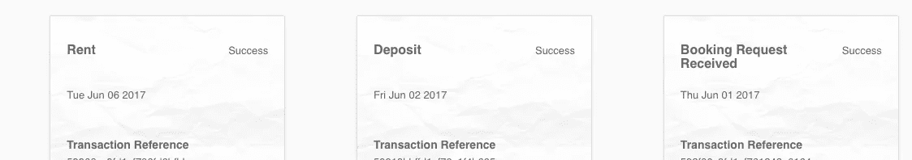
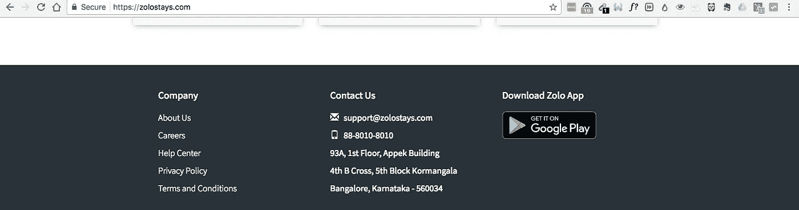
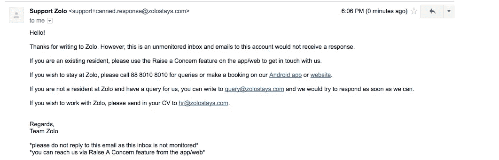

# 疏忽的印度创业公司

> 原文：<https://medium.com/hackernoon/negligent-idiots-in-indian-startups-zolostays-2137cda3bc14>

6 月 1 日和 [Zolo](https://zolostays.com/) 订了 PG。第二天我给他们客服打了电话。一个代理人接了我的电话，他确认了房间，并要求我支付押金。我是通过他们网站交的定金。他说我可以在 6 月 6 日随时来拜访。

# **6 月 6 日**

我打电话给他们的客服，问我今天能不能入住。她说*“你可以，在你付了第一个月的租金之后”。*我付钱了。

我最近做了左膝手术。我不能给它太大的压力。当我背着沉重的包走进来。业主说的第一句话是

> “6 月 10 日回来，房间 khali nahi hai。我们什么也做不了，他们没有和我们确认是佐洛的错。”

我呆在那里，给他们的客服打了很多电话。每次打电话，我都要等 5 到 10 分钟才能和他们的代理人通话。他们说*“我会再联系你的”*。他们没有回电话。

他们要求在底层调整几天，我们会把你转移到另一个房间。“另一个房间”不是我付钱买的房间。它甚至没有附属浴室。我等了一个小时。现在，他们正四处寻找一把钥匙。我不确定那是不是一场戏剧，间接地要求我离开前提。

我通过电子邮件联系了 Zolo support@zolostays.com 客户服务部(他们的网站上提到了这一点)。

回复是“谢谢你给 Zolo 写信。但是，这是一个不受监控的收件箱，发送到此帐户的电子邮件不会收到回复。”

幸运的是，这里是 HSR，我在这里有一群很棒的朋友，他们可以接纳我。

但是，我想知道如果是别人，谁是新来班加罗尔？这个可怜的家伙会很无助。

> 这些创业公司追求的是增长，根本不在乎客户体验。

***更新:Zolo 客户服务台的一名代理打电话来解决了问题。他代表整个组织道歉。他向我保证这样的事情再也不会发生了。我分析了这种情况，并在这里写了另一篇关于如何防止这种情况发生的文章。***

> [黑客中午](http://bit.ly/Hackernoon)是黑客如何开始他们的下午。我们是这个家庭的一员。我们现在[接受投稿](http://bit.ly/hackernoonsubmission)并乐意[讨论广告&赞助](mailto:partners@amipublications.com)机会。
> 
> 如果你喜欢这个故事，我们推荐你阅读我们的[最新科技故事](http://bit.ly/hackernoonlatestt)和[趋势科技故事](https://hackernoon.com/trending)。直到下一次，不要把世界的现实想当然！

