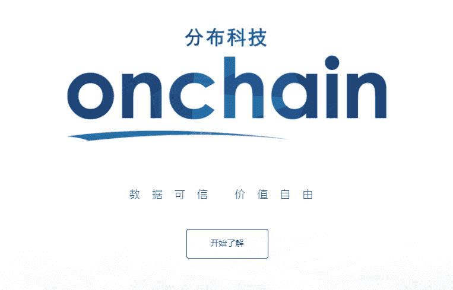
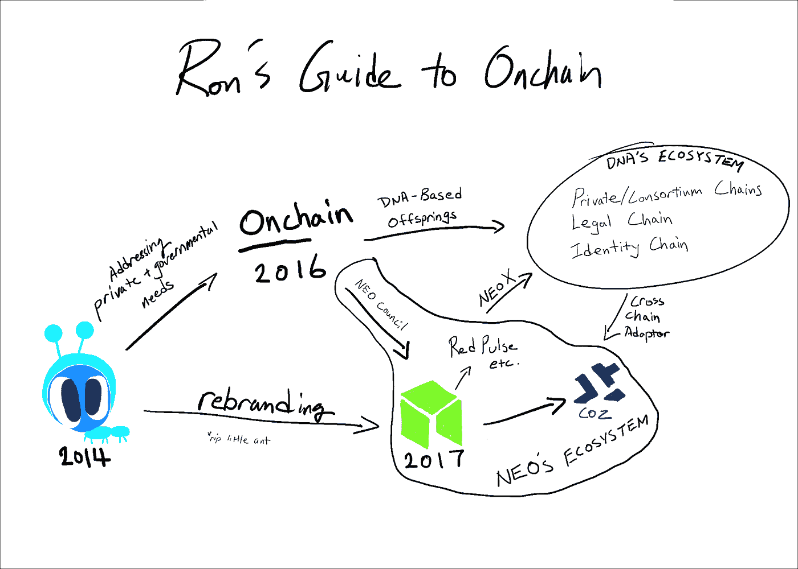
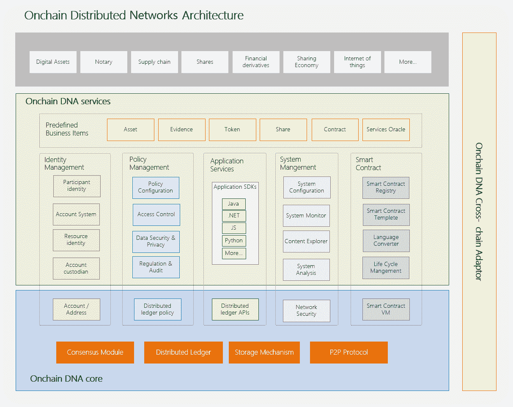

# NEO: Onchain 背后的公司及其最终计划——DNA

> 原文：<https://medium.com/hackernoon/neo-onchain-and-its-ultimate-plan-dna-4c33e9b6bfaa>

**Onchain**

如果你是 NEO 的粉丝但对 Onchain DNA(分布式网络架构)了解不多，那么你还没有真正完成你的功课。不过，我不怪你。考虑到 Onchain 对其产品 DNA 的巨大期望，他们并没有在向世界传达它方面做得特别好；至少英语世界不是这样。也许 Onchain 需要一个圆滑的更名，就像 Antshares(现在被称为 NEO)必须认真地让世界知道他们在过去三年半里一直在悄悄地做什么。在这篇文章中，我将告诉你为什么在提到中国和区块链时不能不提到 T4 的 DNA。

总部位于上海的区块链 R&D 公司 Onchain 于 2014 年 2 月首次开始开发 Antshares，这最终将成为 DNA 的基础。Onchain 由首席执行官达和首席技术官埃里克·张(Erik Zhang)创立，以回应中国第一家上市的区块链蚂蚁金服的发展引起的私营公司的关注。与区块链世界目前成立仅数周的初创企业推出 ICOs 形成对比的是，他们花了长达 22 个月的 R&D 时间，才开始向第一批客户提供服务。终于在 2016 年 4 月，中国第一部共识协议白皮书诞生——dBFT(delegated Byzantine Fault Tolerance)协议。

2016 年对于 Onchain 来说是忙碌的一年，这一年他们真的加快了步伐。除了继续发展 Antshares，与财富 500 强公司擦肩而过之外，Onchain 还成为了第一家加入 Hyperledger 的中国区块链公司。Hyperledger 是由 Linux 基金会发起的一个开源区块链项目，专门致力于为企业开发私有和联盟链。正是在这里，Da 和 Erik Zhang 进入了现在被称为 Fabric 的双曲线时间室，这是 Hyperledger 为分布式分类帐解决方案提供的一个平台，并因此帮助他们开发了支持 DNA 设计的许多方面。

*Rare leaked photo of Da Hongfei and Erik Zhang during their time at Hyperledger (2016)*

In June of 2016, during the first of many future partnerships with Microsoft China, Onchain founded Legal Chain specifically targeting the inadequacies of the digital applications within the legal system. In 2005, 《电子签名法》 (Digital Signature Act) was passed into national law which permitted an effective digital signatures to gain the same legal rights as a real signature. However, practically there hasn’t been anything that has been able to fulfil what constitutes as “effective” according to the regulation. Legal Chain’s first project is to apply blockchain’s immutability and transparency on digital signatures and complying with those regulations effectively. In company with Microsoft China, they are also aiming to integrate the technology with Microsoft’s face and voice recognition API function to kick start this digital revolution within the legal system. At the same time, a partnership was formed with FaDaDa, a third-party platform for electronic contracts that has processed over 27 million contracts to date, to provide secure evidence storage with DNA. If that’s not enough, they were also voted as KPMG’s top 50 Fintech Company in China and established a relationship with the Japanese Ministry of Economy, Trade and Industry which led to the recent tour to Japan. Finally, at the end of 2016 they announced a partnership with Alibaba to provide attested email service for Ali Cloud with Legal Chain where it provides a proof-of-existence for a blockchain-powered email evidence repository for enterprise-level use.

*It is important to note the technical difference between Onchain and NEO at this point. Onchain is a private VC-backed company with over 40 employees. NEO is a public platform with different community-led groups contributing to this public project. There exists NEO council comprised of the original NEO creators, employees from Onchain, full time NEO council members and there is also the first Western based group called City of Zion. This confusion is likely the source of the rumour about Antshares and Alibaba having a connection. Onchain and NEO are separate entities who are intimately related via cross-chain communications and similar designs.*

这一趋势一直持续到 2017 年。与财富 500 强企业海航集团的子公司 e-King Technologies 建立战略合作伙伴关系，探索 DNA 在民营企业的应用。此外，目前在大数据行业处于全国领先地位的贵州省政府正在与 Onchain 合作开发 Identify chain，为实现数字身份又迈出了一步，并成为首个致力于开发基于区块链的公共服务系统的省份。Onchain 最近还为中国结算(China Clear)提供了一份股权众筹概念证明。中国结算是一家中央证券存管机构，类似于美国的 DTCC，在买卖双方的证券交易中扮演第三方角色。最后，中国最大的民营企业集团复星集团(Fosun Group)最近投资了 Onchain，以便将 DNA 应用于其所有业务。目前，复星国际在香港交易所的市值为 1029.8 亿美元，这还只是其国际分支机构。

虽然令人遗憾的是 Onchain 的英语交流很少，但令人欣慰的是，他们并不只是站在一边。事实上，我们正在慢慢地看到一个由私人、公共、政府和金融机构组成的相互联系的区块链生态系统，所有这些都基于我们眼前形成的 DNA。这个区块链内部的网络听起来非常熟悉这个有趣的技术，它允许你阅读我现在写的东西。

Schematic representation of DNA taken from Onchain’s website

**DNA, The National Blockchain Standard 《国家标准测试的区块链系统》 and The National 1–3–5 Plan 《国家十三五规划》**

企业和政府将 DNA 作为进入区块链的门户有很多优势。开发人员的主要优势是他们可以专注于构建应用程序，而不必构建整个区块链。同时，这将确保一个拥有共享技能和价值观的生态系统的发展。

“我们的愿景是让 Onchain 成为一个真正通用的区块链框架，”Onchain 创始人兼首席执行官、Antshares 创始人达洪飞表示。“利用不同的插件模块，我们的框架可以应用于公共链、联盟链甚至私有链。我们的跨链适配器模块目前正在开发中，可以在这些不同的链之间创建互操作性。”达洪飞，2016 年 10 月 5 日。

DNA 的模块化设计允许区块链的灵活应用，以满足我们社会不同领域的特定用例。您不必担心遵守政府法规、选择使用哪种共识协议、无法找到开发人员来开发自己的应用程序、无法与区块链社区的其他成员无缝连接:您仍然可以完全控制您的区块链。

During the end of last year, China published their 13th Five-Year Plan also known as 1–3–5\. 1–3–5 specifically mentioned blockchain as a priority of development in the next five years. Furthermore, in June 27th this year, the largest bank in the world, China’s Central Bank, published their own 1–3–5 plan on Fintech development: “Strengthen foundation, Increase safety, Promote innovation, Develop standardisation and Improve regulation” (夯实基础、强化安全、支持创新、深化标准、提升治理). Finally, in May 16th of this year, The National Blockchain Standard was published by the Ministry of Industry and Information Technology of the People’s Republic of China and Onchain became the first group of companies to successfully pass this standard. Within this document lists the 4 main functions of this standard as: “Development, Management, Safety and Regulation”. The key points specifically under “Safety” and “Regulation” are “Confirmation and identity management, Safety strategies management, Privacy” and “Supportive of regulation, Auditable” (安全：认证和身份管理、授权和安全策略管理、隐私保护. 监管审计：监管支持、审计实现). Needless to say, Onchain already had the foresight when Antshares was first developed and planned accordingly. In a recent Q&A hosted by Blockchain Labo, Da alluded to Ethereum’s tagline on the website, “Build Unstoppable Applications”, and stated that anti-censorship is not a high priority of NEO and complying with the national regulations is of utmost importance. The recent news of ICO regulation by the Chinese government further validates the foresight Onchain had.

**最大化主义者的对立面**

到目前为止，Onchain 的角色除了更强调政府合作之外，还让人想起以太坊的 EEA。Onchain 已经发现了目前在 NEO 和 Ethereum 等公共平台上大肆宣传的激光焦点的缺点，并通过 DNA 解决了这一问题。DNA 设想了一个未来的网络，其中各种各样的、专门设计的区块链服务于私营企业、财团、政府和公众，相互交流，形成一个互联的区块链网络。

这就是 DNA 的目标——渗透到每一个在区块链发明之前没有更好选择的低效领域。在这个爆炸性的炒作时期，尤其需要记住的是，并非区块链能填补的每一个小缺口都会为你提供自己的小 ICO，让你“乘坐你的火箭动力兰博基尼去月球”。获得的部分效率将被私人公司或公共系统(如法律系统)所消耗。

就我个人而言，如果我可以购买 DNA 代币，我会毫不犹豫地购买，这将是最终的 hodl 购买。在大学开设“区块链 101”课程之前，这可能是你需要掌握的东西，这就是 Onchain 在 DNA 方面的进展。我当然不能，更重要的是，这违背了 DNA 追求的基本理念。为了让区块链海啸技术真正提升所有船只，并让区块链在尽可能广泛的意义上被采用，需要一个允许在现有结构上简单实现的平台。也就是说，提供实现者将从实现中获得最直接的好处。一个平台对平台的平台，如果你愿意的话。

在撰写本文时(2017 年 8 月)，就 CMC 的市值而言，Dogecoin 领先 Factom 等革命性产品整整 4 位。没有更好的证据表明，我们还没有完全从中本聪使用区块链技术作为货币的预言白皮书开始的余震中走出来。目前对智能合约功能的短视宣传也进一步分散了我们对区块链未来的关注。智能合约，很像因比特币而流行的分布式公共账本的想法，只是区块链技术之上许多令人难以置信的发展之一。仅仅通过智能合约的共性将 NEO 等同于以太坊是一种短视的过度强调智能合约的做法，并且低估了区块链技术的其他同等重要的方面，例如主流采用或跨链通信的容易程度。

通过戴上 DNA 眼镜，这种近视将得到极大的改善，希望它将变得透明，NEO 和 Onchain DNA 不仅仅是中国的以太坊。相反，它们是中国未来的区块链产业。

在这个萌芽和令人振奋的区块链产业中，有许多比赛同时进行，这主要是由赢家通吃的错误想法所引导的。存在成为主要加密货币的竞赛(BTC、BCH、LTC、DASH)、成为主要 dApps 平台的竞赛(ETH、NEO、LSK、QTUM)、成为主要“加密钱包”的竞赛(OMG、MTL、PAY、MCO)、成为主要 DEX 的竞赛(BTS、BNB、ZRX)等。然而，在这些破坏性的部落主义种族中，还有一个至关重要(但讨论较少)的种族，那就是成为第一个将区块链技术纳入主流的国家的种族。到目前为止，在我看来，Onchain 努力让中国成为这场竞赛的赢家是显而易见的。

TL；DR:智能经济=数字身份+数字资产+智能合约。区块链的微软公司。DNA = Windows 1.0。NeoX/跨链适配器= Internet Explorer。中国=寻找任何机会停止生活在西方的阴影下。

**鼓掌支持我 50 次**:)
NEO:ayvtuzkeanrhsc 5 q 6 th 8 ge 7 tcpwzvzzbdf
BTC:1 M6 DJ 82 uxz 2 kokcw 9 skepnrx 45 qgphzws 2
ETH:0x 45 EEC 8652003 C1 c 52 c 48 f 3d 31 b 8 b 035 cc 34 BC 383

**参考文献:**

[https://silicon angle . com/blog/2016/10/20/onchain-partners-with-Alibaba-for-区块链-powered-email-evidence-repository/](https://siliconangle.com/blog/2016/10/20/onchain-partners-with-alibaba-for-blockchain-powered-email-evidence-repository/)

[http://www.onchain.com/en-us/](http://www.onchain.com/en-us/)

[http://www . the-block chain . com/2016/10/05/Chinese-区块链-startup-ant shares-raises-4-500 万-crowdsale-build-onchain/](http://www.the-blockchain.com/2016/10/05/chinese-blockchain-startup-antshares-raises-4-5-million-crowdsale-build-onchain/)

[https://en . Wikipedia . org/wiki/Depository _ Trust _ % 26 _ Clearing _ Corporation](https://en.wikipedia.org/wiki/Depository_Trust_%26_Clearing_Corporation)

[https://www.youtube.com/watch?v=Y1rmePScqXs](https://www.youtube.com/watch?v=Y1rmePScqXs)

[https://www . Reuters . com/article/us-复星-区块链-iduscn1b 30k m](https://www.reuters.com/article/us-fosun-blockchain-idUSKCN1B30KM)

[http://www.gz.chinanews.com/content/2017/05-28/73545.shtml](http://www.gz.chinanews.com/content/2017/05-28/73545.shtml)

[http://finance . Sina . com . cn/roll/2017-04-13/doc-ifyeifqx 5554606 . shtml](http://finance.sina.com.cn/roll/2017-04-13/doc-ifyeifqx5554606.shtml)

[https://www . Bloomberg . com/news/articles/2016-10-16/going-gung-ho-in-Guangzhou-shows-why-China-set-to-beat-6-5-growth](https://www.bloomberg.com/news/articles/2016-10-16/going-gung-ho-in-guizhou-shows-why-china-set-to-beat-6-5-growth)

http://www.8btc.com/onchain-ribenjingjichanyesheng

【https://www.fadada.com/aboutus/ 

[http://www.8btc.com/onchain-microsoft](http://www.8btc.com/onchain-microsoft)

[http://www.8btc.com/onchain-hyperledger](http://www.8btc.com/onchain-hyperledger)

[http://www.8btc.com/onchain-paper-antshares#comment](http://www.8btc.com/onchain-paper-antshares#comment)

[http://8btc.com/forum.php?mod=viewthread&tid = 24261&extra = page % 3d 1% 26 order by % 3d heats&page = 1](http://8btc.com/forum.php?mod=viewthread&tid=24261&extra=page%3D1%26orderby%3Dheats&page=1)

[https://en.wikipedia.org/wiki/Hyperledger](https://en.wikipedia.org/wiki/Hyperledger)

[http://news . 8 BTC . com/ctos-read-mainstream-区块链-structure-analysis-by-ant shares-Erik-Zhang](http://news.8btc.com/ctos-read-mainstream-blockchain-structure-analysis-by-antshares-erik-zhang)

[http://www.8btc.com/onchain-dna](http://www.8btc.com/onchain-dna)

[http://whb.cn/zhuzhan/jiaodian/20170311/86126.html](http://whb.cn/zhuzhan/jiaodian/20170311/86126.html)

[https://www . cryptocoinsnews . com/China-support-区块链-development-new-five-plan/](https://www.cryptocoinsnews.com/china-support-blockchain-development-new-five-year-plan/)

[http://www . gov . cn/zhenge/content/2016-12/27/content _ 5153411 . htm](http://www.gov.cn/zhengce/content/2016-12/27/content_5153411.htm)

[https://www . coin desk . com/China-central-bank-誓言-推动-区块链-五年计划/](https://www.coindesk.com/chinas-central-bank-vows-push-blockchain-five-year-plan/)

[http://www.gov.cn/xinwen/2017-06/27/content_5205951.htm](http://www.gov.cn/xinwen/2017-06/27/content_5205951.htm)

[https://www.easyaq.com/news/1476613044.shtml](https://www.easyaq.com/news/1476613044.shtml)

 [## 分布科技 DNA 框架通过国家区块链标准测试 - 51CTO.COM

### 5 月 16 日，在杭州举办的首届中国区块链开发大赛上宣布，Onchain（分布科技）DNA 系统 V0.5 版本，成为首批通过国家标准测试的区块链系统。

www.51cto.com](http://www.51cto.com/art/201705/539824.htm?mobile)