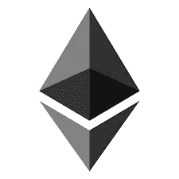
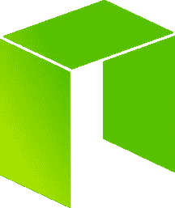
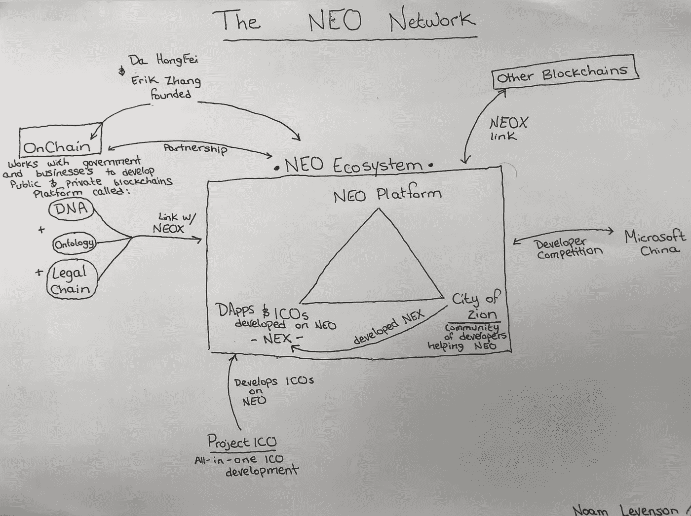
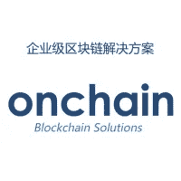
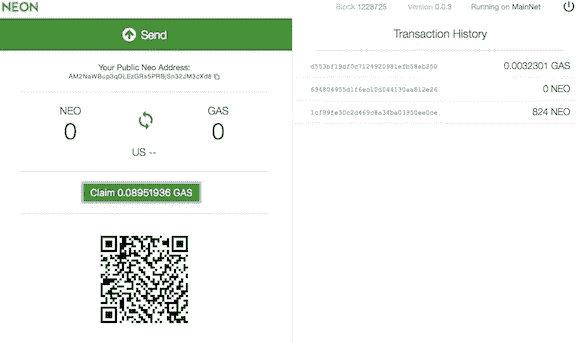

# NEO 对以太坊:为什么 NEO 可能是 2018 年最强的加密货币

> 原文：<https://medium.com/hackernoon/neo-versus-ethereum-why-neo-might-be-2018s-strongest-cryptocurrency-79956138bea3>

NEO 是一个有目的的平台。能和以太坊抗衡吗？或者更好的是，它需要吗？

## 为什么要看这篇文章？

尼奥和以太坊——你会吃哪种药丸？抱歉，我控制不了自己。我们关心这场辩论，因为我们是投资者。从开发者的角度来看，功能性是最重要的。在区块链还没有品牌忠诚度。所以如果一个平台能比竞争对手做得更好，就会赢得开发者。那么哪个做得更好呢？

这篇文章之所以长，是因为我已经把我能找到的关于 NEO 和以太坊的所有信息都咀嚼了一遍，并为你消化了。有很多文章总结了**以太坊**和 **NEO** 之间的“差异”，但是它们并没有很好地解释这场争论。他们浏览事物，没有很好地探索它们，只探索一个方面，或者在他们的分析中不全面，不解释为什么差异甚至重要，以及它们与现实世界的相关性是什么。我因缺乏一篇全面的文章而感到沮丧。这篇文章是我的回应。

我会承认我对 NEO 的探索比以太坊更深入。这是因为以太坊可以广泛获得如此多的信息。有了 NEO，就少多了。因此，我将重点解释 NEO，然后将这种解释与以太坊的功能进行比较。

所以忍耐一下，给自己拿一杯浓缩咖啡，把自己锁在你“工作”的房间里。这将非常值得你花时间。如果你只是读了 TLDR 的文章——太懒了，没读——我也不会怪你。

## 我们开始吧

如果以太坊是歌利亚，尼奥就是大卫。如果以太坊是布拉德·皮特，尼奥就是布拉德·皮特的表弟扎克·皮特——更年轻，穿着更好，也更有才华——但现在他只能为布拉德和他的朋友们提供鸡尾酒，而他只是兼职。以太坊先做的。这是革命性和令人兴奋的，并采取了密码世界的风暴。Web 3.0。今天，几乎每一个 ICO 都建立在以太坊的 ERC20 令牌平台上，Vitalik Buterin 是我们这个时代最伟大的思想之一。然而，如果我们从阿里巴巴正在逼近亚马逊的市值、微信主导中国社交媒体领域的事实中学到了什么，那就是中国在按自己的规则行事。红龙之地使用他们自己的[技术](https://hackernoon.com/tagged/technology)，他们自己的网络，并不关心美国在做什么。问题是，NEO 能和以太坊竞争吗，甚至有必要吗？

最终，NEO 和以太坊的目标是在加密社区中扮演相似的角色。两者都想成为新互联网的平台:DApps(去中心化应用)、ICOs(首次发行硬币)和智能合约。

## **以太坊和 Neo 概述**

虽然 NEO 和以太坊都推广了区块链，为潜在开发者提供了一个工具箱，但它们的目标不同。我将每个平台的目标总结如下:

以太坊的目标是为 DApps 的开发创造一个平台，以创造一个“更全球化、更自由、更值得信赖的互联网”，一个互联网 3.0。

**NEO 是区块链的一个项目，“利用区块链技术和数字身份将资产数字化，使用智能合同自动管理数字资产，并通过分布式网络实现‘智能经济’。”**

*真拗口*。让我们分解这些目标以充分理解项目。理解这两个平台共享许多相同的功能是很重要的，但是它们的品牌目标的区别是非常重要的。

以太坊的目标是成为 DApps 的平台，他们在很大程度上实现了这个目标。他们现在拥有 DApp 市场。他们的路线图就是让用户和开发人员在开发他们的应用程序时有更多的控制权和更多的选择。

NEO 正致力于开发一款面向未来的产品。它不仅在 2017 年 6 月从 Antshares 更名为 NEO，而且他们也重新调整了营销重点，取得了巨大的成功。Neo 的目标是成为一个新的智能经济的平台，尽管最终会利用许多与以太坊相同的技术。

**简而言之:以太坊是为了应对新的需求而发展的。NEO 正在开发他们的平台，以满足未来的需求。**

# 什么是智能经济？

NEO 和以太坊最大的区别是 NEO 专注于智能经济。如果我们想完全了解近地天体，我们需要理解为什么这种区别是重要的。

智能经济将以数字化的实物资产为特征。所有这些新数字化的资产在区块链都有所有权证明。这些资产可以通过智能合约出售、交易和利用。他们的所有权可以通过区块链的分权模式得到保护和确认。我们已经看到了这样的反复:从提议的供应链改革到 DAOs(分散的自治组织——本质上是没有领导者的分散公司)。在这篇文章中，我提供了一些关于这种经济的真实例子。现在，虽然以太坊可能会支持 NEO 拥有的许多相同的功能，但以太坊和 NEO 的目标之间的区别才是我们所关心的。

这种区别很重要，因为一个聪明的经济体仍将处于政府和政府监管之下。我不像你的下一个自由主义者那样信任政府； *1984* 看多了。但事实仍然是，政府哪儿也不去。因此，对于一个服务于这种“智能经济”的平台来说，该平台需要将特定的**思想**和**意图**放入它将如何适应政府监管。因此，虽然以太坊可能提供类似的区块链能力，但 NEO 正在为此目的开发*这一事实是至关重要的。*

TLDR:智能经济是我们的未来。为了适应这种智能经济的需求，该平台将需要为这种新经济专门设计*。*

## NEO 如何为智能经济做准备？

NEO*特别强调*遵守法规。

为此，他们需要:

Governments don’t love these guys

## **数字身份**

匿名很好。我认为隐私应该是当今技术发展和讨论的前沿。但是，如果公司和政府在区块链上运作，数字化他们的资产，并发布智能合同，所有这些都在政府的监视之下，他们就不能匿名。对于一个符合监管要求的平台来说，数字身份——以数字形式存在的可验证身份——是不可避免的。

今天，数字身份是基于一个叫做 **PKI(公钥基础设施)X.509 标准**的系统。这对你和我的意义可能一样大。这只是意味着对于什么构成数字身份有一个国际公认的标准。NEO 的计划是根据该标准发布数字身份，然后使用区块链对其进行保护。簿记员(稍后阅读)将拥有数字身份和真实姓名。因此，如有必要，可以对他们采取司法行动。当在网络上注册金融资产并保持法规合规性时，这是必不可少的。

出于监管原因，也可能存在只与拥有数字身份的人进行交易的企业和项目。近地天体使这种可能性成为可能。

NEO 已经与关键的 T21 建立了战略伙伴关系，这是一个在 NEO 平台上开发的项目，将有助于提供数字身份识别。

以太坊呢:以太坊要求其他 DApps 开发数字身份，然后在以太坊区块链上保护这些身份。这与它将如何与 NEO 一起工作并无太大不同——然而，NEO 已经明确表示，通过其将数字身份与其簿记员节点相结合的计划，数字身份的集成对于 NEO 生态系统至关重要。

**TLDR:政府不喜欢匿名。工业界不喜欢惹恼政府。如果 NEO 想要被工业采用，它需要有数字身份。**

## **数字资产**

A future digital asset?

如果你想要一个基于智能合约的智能经济，你需要能够利用和交换货币以外的资产。我们需要能够将房屋、财产和汽车所有权等资产数字化；黄金、钻石和其他贵重元素；电脑、衣服和食物；甚至那些你妈妈一直求你扔掉的棒球卡。当我们有能力数字化所有这些资产时，智能合同变得更加强大。

**以太坊呢:**非常类似于数字身份 blurb。以太坊绝对可以保护数字资产，但它们不一定符合法规。NEO 正在确保颁发的数字资产证书符合要求。

TDLR:读一下就好了

# **近地天体的复杂网络**

经济是复杂的；它有如此多相互关联的部分。NEO 的平台很复杂，有大量的合作伙伴。充分研究和理解这一点是困难的。但我做到了，所以你不必！回头参考这个视频，对这个网络如何互动有一个清晰的了解。

Even though this looks like the deranged drawings of a conspiracist, it will make sense as you reference it while learning about NEO’s network

## OnChain

NEO 的创始人达和 Erik Zhang 创办了一家名为 [**OnChain**](http://www.onchain.com/en-us/) **的公司。**理解OnChain 对于理解 NEO 至关重要。他们不是同一家公司，但是他们的利益一致，他们是合作伙伴。OnChain 的系统被称为 DNA(去中心化网络架构),旨在与中国企业和政府合作。 **NEO 充当 DNA 的基础。如果 OnChain 能与中国企业和政府整合，这将极大地刺激 NEO 的应用。**

最终，DNA 为企业开发公共和私人区块链。这些区块链然后链接到 NEO，加入分散经济。 企业于是拥有了私人和公共区块链的所有好处。可以认为 NEO 提供了公共的区块链，OnChain 的 DNA 提供了私人的区块链。然后，他们可以连接起来，得到最好的两个世界。

OnChain 还有几个项目和合作伙伴，值得一提的是，它们都对 DNA 生态系统做出了贡献:

1.  这家成立于 2014 年的公司并不新鲜
2.  第一家加入 Hyperledger 的中国区块链公司，Hyperledger 是一个旨在将区块链与现有企业整合的合作项目。
3.  ***法律链*** —与*微软中国*合作，通过区块链技术数字化和保护签名。
4.  *微软中国*在多个项目上的战略合作伙伴
5.  [与](http://www.8btc.com/onchain-ribenjingjichanyesheng)日本经济产业省合作
6.  [被毕马威评为中国金融科技公司 50 强](https://assets.kpmg.com/content/dam/kpmg/cn/pdf/en/2016/09/2016-china-leading-fintech-50.pdf)
7.  [与阿里巴巴合作，为阿里云提供电子邮件认证服务](https://siliconangle.com/blog/2016/10/20/onchain-partners-with-alibaba-for-blockchain-powered-email-evidence-repository/)
8.  来自中国最大的民营企业集团复星集团的投资，旨在整合他们的业务。
9.  [与中国地方政府合作](http://finance.sina.com.cn/roll/2017-04-13/doc-ifyeifqx5554606.shtml) —使用 OnChain 开发公共服务和数字身份

OnChain 最近的发展是 ICO ***本体论。Ontology 使用与 NEO 相同的架构，但最终会与企业合作创建一个私有的加密数据网络。本质上，当我们有需要保护的信息时，这是很重要的，但是我们也需要它是私有的。这将使人们能够以安全的方式将这些信息带到区块链。***

关于 [OnChain 路线图的参考资料](http://www.onchain.com/en-us/)

老实说，我不明白为什么 NEO 不更多地宣传他们与 OnChain 的合作。NEO 本身是坚固的，提供了一些超越以太坊的潜在好处。但与 OnChain 结合后，NEO 真正有潜力成为东方的智能经济平台。

以太坊比较:以太坊的对等物是企业以太坊联盟，这是一个开源的区块链倡议，致力于将以太坊与商业世界联系起来。他们的合作伙伴名单强大而令人印象深刻——对于熟悉以太坊的人来说，这并不奇怪。他们的成员包括:英国石油公司、惠普公司、丰田公司、万事达卡公司、微软公司和英特尔公司等。

**TLDR: OnChain 是一家与 NEO 合作的公司。他们拥有丰富的经验，并在将区块链引入商业领域方面获得了许多荣誉。他们与东部的公司和政府合作。它们是近地天体潜力的巨大组成部分。**

## **NEOX:**

NEOX 是 NEO 版本的原子互换(直接交换令牌，没有任何交换)和跨链集成。想想[方舟生态系统](/@noamlevenson/why-ark-deserves-your-attention-c57acd51846a)。这将使人们能够在不同的区块链之间交换加密资产和交易。它还允许智能合约跨链交互。

NEOX 很重要，因为它允许 OnChain 创建的区块链(私有和公共)和 NEO 的公共区块链之间的协作。随着智能经济更多组成部分的发展，NEOX 将把它们连接在一起。

**以太坊对比:**以太坊有做原子互换的能力，但只完成过一次这个——这不是放下以太坊；尼奥从来没有完成过。然而，以太坊将需要一个外部应用程序来适应大规模的跨链集成。

Not quite the City of Zion we’re talking about…

## 锡安城:

[锡安城](https://cityofzion.io/) (CoZ)是一个独立的开源社区，由致力于改进 NEO 的开发人员、翻译人员和设计人员组成。他们得到了 NEO 的资助，以帮助激励项目开发。该社区为近地天体做出了巨大贡献。他们开发了 NEON wallet，创建了 NEO block 扫描仪，为 NEO 翻译了文档，并开发了 NEX 平台(见下文)。他们最近获得了 NEO 的资助，向 10 名获奖者颁发了 27 万美元，作为他们的 [DApp 竞赛](https://neonewstoday.com/development/winners-first-city-zion-dapps-competition-announced/)的一部分。拥有像 CoZ 这样的支持网络是非常有利的。

以太坊比较:在以太坊网络上没有一个真正好的比较。

## **NEX:**

Nex 是即将推出的 ICO，由锡安城开发，为在 NEO 上创建支付解决方案和分散交易提供了一个平台。它通过 NEOX 连接到 NEO。

由于与以太坊相比，NEO 在令牌模型、帐户余额和智能合约交互方式方面存在差异，因此 NEO 需要一种能够有效容纳分散式交易所的解决方案。NEX 提供了这种解决方案。

**以太坊比较:**已经**ERC 20 代币很容易在分散交易所交易。**

## **ProjectICO:**

帮助区块链公司发展的统包式一体化 ICO 公司:从最初的想法到 ICO。他们最近决定从以太坊转移到 NEO。他们有一个有趣的 Reddit AMA 关于他们转换的原因。

**以太坊对比:** [TokenHub](https://tokenhub.com/) 是在以太坊上开发的类似项目。

## 微软中国:

NEO 目前正与微软中国合作举办一场[开发者竞赛](https://neo.org/competition.html)，奖金为 49 万美元。

以太坊比较:以太坊与知名企业的关系非常好。尼奥在玩追赶游戏。

## **dapp 和 ico:**

平台的面包和黄油；到目前为止，NEO 只有一个 ICO ( [红色脉冲](https://coin.red-pulse.com/))和一个 DApp ( [AdEx](http://adex.network/) )。然而，随着几个计划在不久的将来和上个月的升级，将使 NEO 智能合同与网站界面互动，我认为这只是 NEO 的开始。

**以太坊对比:**以太坊在这方面轻而易举击败了 NEO。以太坊是 ico 和 DApps 的首选平台。

## 生态系统概述

我们希望对以太坊和 NEO 的目标差异有很强的理解，并对 NEO 的网络和网络在智能经济中的优势有很好的概述。对于近地天体来说，理解这个网络很重要，因为近地天体不仅仅是一个公共区块链，它是更大图景中的一部分。当 NEO 的公共区块链可以与 OnChain 的私人和商业导向的区块链连接起来，并最终与其平台上的所有其他 DApps 连接起来，它可能会真正成为一个智能经济。

# 以太坊和 NEO 最大的区别

Ethereum’s energy consumption could power 1,025,438 American homes for a year. — [Source](https://digiconomist.net/ethereum-energy-consumption) —

## **协议**

以太坊使用与比特币相同的协议——工作证明(PoW)。有了工作证明，网络上的计算机竞相解决数学公式，赢得进入区块链的交易确认权，从而确保网络安全。PoW 协议的两个主要缺点是 51%攻击的危险和网络安全所需的大量能量消耗。出于这些原因，我认为随着区块链过渡到一种叫做利益证明(PoS)的新协议，PoW 将很快成为一种过时的系统。

利益证明的工作方式与 PoW 类似，只是 PoS 使用令牌持有者，而不是计算机验证网络并获得与其相对计算能力相当的奖励。那些持有代币的人可以“下注”他们的代币(下注是指将代币暂时放在锁定的智能合约中，直到下注结束)，作为交换，他们可以根据所持代币的相对数量确认交易并获得奖励。**在 PoW，如果你操作了网络总计算能力的 5%，你可以期望获得 5%的区块奖励。在 PoS 中，如果您拥有 5%的代币，您还可以获得 5%的块奖励。**

PoS 为困扰 PoW 的问题提供了一个解决方案，主要是 PoS 的运行几乎不需要任何能源，而且不影响安全性。我认为它实际上提高了安全性。对于以太坊和所有其他 PoW 协议，难度算法(求解数学公式有多难)必须不断更新，以考虑更好的计算机硬件和更强大的采矿组。有了 PoS，就不需要这么做了。有了以太坊，你可以购买足够的计算硬件来实现 51%的攻击；即使在组成网络后，你仍然拥有所有的硬件，并有可能用它来攻击其他 PoW 平台。在 PoS 中，因为您必须下注您的硬币，任何恶意行为都会导致所有下注硬币的*损失。因此，如果你购买了所有代币的 51%,你将立即失去你的大量投资。此外，购买 51%网络令牌的成本对每个人来说都是一样的。获得 51%计算机能力的成本——由于大规模购买计算机的折扣和电力极其便宜的国家——并没有。*

Byzantine Fault Tolerance attempts to solve the Byzantine General’s Problem

**NEO 使用一种称为 dBFT** (委派拜占庭容错)的协议，听起来像是你在 AP 历史测试中看到的术语。拜占庭容错最简单的解释是如何让网络上的每个人诚实并一起工作的问题——因为一个坏苹果可能会毁掉一切。 NEO 的 dBFT 是对经典 PoS 协议的修改，具有一些显著的优点和一个主要缺点。

我想象 dBFT 的工作方式类似于美国参议院的工作方式(如果这种类比让你想完全放弃 Neo，我理解，但请坚持…继续阅读)。如果美国的每一个人——全部 3.231 亿人——都被允许直接参与政府决策过程，那将是灾难性的。这将是残酷的缓慢，因为数百万人争夺麦克风，所有人都喊着他们的意见，并相互争论。做决定也会极其缓慢。所以相反，这个国家的每个人都有投票权。有了这一票，他们可以选出他们的代表，代表他们说话的人。这个系统直接反映了 NEO 的治理。持有 NEO 令牌的人可以投票选举代表，而不是每个人都参与验证过程——这在交易速度方面可能会有难以置信的限制。这些代表(被称为记账员)为每个人维护网络。因此，NEO 可以更快、更有效地运行，并做出更快、更有限的决策，而您可以呆在家里，喝百威啤酒，在电脑处于睡眠模式时观看爱国者队的比赛。

也请记住，这些簿记员将有他们的数字身份已知，使 NEO 更符合国家法规。

这种制度的缺点是缺乏分权。在最纯粹的意义上，治理集中在几十个验证器中，而不是成千上万的验证器分散在世界各地。这些节点中的大多数目前由近地天体小组运营。然而，截至 2018 年第一季度，NEO 将持有不到 2/3 的股份，并且随着时间的推移，将继续持有更少的股份。无论如何， **NEO 永远不会像其他纯 PoS 平台那样去中心化。**

然而，我认为**以太坊也没有你想象的那么分散。虽然 PoW 协议是分散的，但一方面你可以计算以太坊的核心开发者的数量。此外，虽然我信任维塔利科·布特林，但他确实对以太坊的方向拥有巨大的权力和影响力。**

以太坊将来会过渡到一个 PoS 协议。他们已经开始了这一过程，确认新区块的开采难度将呈指数增长，直到无法再开采，所有人都必须过渡到 PoS 协议。这将会发生，但可能要一年多以后。

TLDR:以太坊使用了一个工作协议证明，并且将会发展成为利益证明。NEO 使用委托拜占庭容错(dBFT)协议，该协议是对标准 stake 证明协议的修改。

## **交易速度:**

因为 NEO 不在 PoW 上运行，有更精简的 PoS 协议，所以 NEO 处理交易的速度远比以太坊快。现在当我们比较这些时，既有*理论*又有*实际*速度。*理论上的*交易速度是网络在数学上可能达到的绝对最高速度。对于 NEO，这个数字是 **10，000tps** (事务/秒)。以太坊可以做 **30tps。**在*实用性*上，由于现实世界的不一致和困难，相比以太坊的 **15tps，NEO 可以做到**1000 TPS**。**随着协议的改进，两个平台都有可能接近其理论速度。

这是一个巨大的差异，也是近地天体的巨大优势。NEO 的交易速度可以想象地适应他们所设想的智能经济；以太坊的可不行。现在换来这个速度，NEO 还不如以太坊去中心化。此外，重要的是要认识到 Vitalik 和 Ethereum 非常清楚这种局限性。诸如 Raiden 和 sharding(两种迷人的技术，但远远超出了本文的范围)之类的解决方案正在以太坊的路线图上，可以极大地提高以太坊的交易速度。

**TLDR:以太坊可以 15tps 交易，最高 30tps。NEO 可以以 1，000 万亿次/秒的速度处理事务，最高速度为 10，000 万亿次/秒。以太坊有计划和解决方案来缩小这一差距。**

## **分叉和缩放:**

以太坊分叉更新其软件，就像比特币一样。我在这里描述这个。叉子不一定是坏的，但它们肯定可能是坏的。看看以太坊的刀叉就是一个例子。在一份以太坊智能合约被盗数百万美元后，以太坊将这笔钱退还给了原持有者。不管这个决定是否正确，它分裂了社区，以太坊经典与以太坊一起被创造出来。

分叉发生是因为以太坊的共识机制中没有*终结*。在区块链可以一次创建多个链-最终，两个链都是有效的，可以继续开采。分叉经常发生，但通常会在拥有最多计算机能力的链被选为合法链时得到解决。有了以太坊，我们总是建议你在进行交易的时候，等到你的上面已经有几个区块被开采完了，再考虑永久交易。

近地天体已经*终结*。这是因为*簿记员*必须达成 66%的共识，交易才能放入区块链。这里打个比方来理解这一点。想象一个一年级的班级。提米问巧克力牛奶多少钱。辛西娅对价格没有概念(看在上帝的份上她才上一年级)喊着 15 美元！几个学生走到她跟前表示同意。鲍比是个巧克力牛奶爱好者，他对牛奶了如指掌。他说 1.25 美元。房间里的大部分人都向他走去。他有多数票。现在假设辛西娅的小组意识到他们的缺陷，并加入鲍比的小组，然后小组达成共识。但是如果辛西娅有一天特别固执，她可以坚持她的决定——一把叉子。**这可能不是正确的答案，但她仍然有一个有效的答案**。以太坊就是这样运作的。

Only in Israel do they have chocolate milk in a bag…

NEO 是这样工作的。想象一下同样的场景。提米又问巧克力牛奶多少钱。首先，辛西娅大声说:“15 美元！”一些人小声表示支持，但显然不是全班的 66%，所以她的想法被放弃了。接着鲍比说“1.25 美元”班上 66%的人支持他的主张，因此，他的想法是最终的。有了 NEO，*簿记员*各自提出下一个块的正确状态。当 66%的人支持这个提议时，这个街区就被确定下来了。

这意味着巨大的影响。对于 NEO 希望支持的经济类型来说，终结是极其重要的。金融业和其他复杂、快速变化的市场(例如股票市场)不能在一个没有终结性的系统上运行。他们需要知道，当他们的信息被放入区块链时，它就永远存在了。他们还需要确保他们的区块链不会因为一个分叉而突然变得无关紧要。

**TLDR:以太坊可以叉；NEO 不能——这对我们的现实世界经济的采用很重要。**

## **气体和近地天体的分离**

这很可能是尼奥最巧妙的特点。以太坊的原生令牌是*以太。*运行以太坊网络(执行合同、进行交易等)所需的气体。)其实只是小单位的以太。乙醚和气体之间没有分离。

然而，NEO 将自己与运行网络所需的令牌:气体脱钩。NEO 令牌相当于 NEO 平台的部分所有权。NEO token 持有者有权投票选举*簿记员。* NEO 是公司的股份，而非代币，NEO 的不可分割性进一步增强了 NEO 的用途。尼奥不是用来交易的——这就是为什么会有气体。

GAS 用于近地天体网络上的所有操作。现在，当一家公司在近地天体区块链上注册或变更资产时，他们用天然气支付——这些天然气随后被分配给所有近地天体持有者。任何人只要把他们的 NEO 放在个人钱包里，就可以获得这种气体。比如这个:[霓虹](https://github.com/CityOfZion/neon-wallet/releases)

簿记员有权对区块链上只有他们(簿记员)收到的一般交易收取交易费(天然气)。然而，通过使 NEO 和 GAS 脱钩，就有了保持低交易费用的动机；原因如下:

高昂的交易费用只会让簿记员*、*受益，这将阻止人们在区块链登记他们的资产。登记的资产越少，NEO 持有者获得的奖励就越少。因此，NEO 持有人被鼓励投票给*簿记员*，他们将保持低交易费用。

> "低交易费=更多的用户=更多的注册资产=更多的天然气给近地天体持有者."——Malcolm le rider 摘自他的[文章](/@MalcolmLerider/clarification-on-neo-gas-and-consensus-nodes-aa94d4f4b09):

簿记员的主要动机是他们保护网络安全的愿望。他们使用网络，从中受益，并在 NEO 上投资。因此，对他们来说保护它是有利的。

当以太坊成为赌注的证据时，还不清楚奖励将如何在以太持有者之间分配。然而，似乎只有大型以太坊持有者才能下注并获得奖励。

The NEON Wallet with the “claim gas” button

NEO token 的高明之处在于，它允许用户被动获取钱包中的汽油。无需运行电脑、打开钱包或消耗电力。没有必要“标上”你的代币——簿记员会为你做的。你甚至可以把你的 NEO 放在一个纸钱包里。当你按下“索取气体”按钮时，气体被收集。这也确保了 NEO 网络不需要计算每个区块的 NEO 持有人的利息，减少了流量，简化了复利公式。**委托记账员维护网络；你的投资获得利息。如果没有两个独立的令牌，这是不可能的。**

NEO 和 GAS 的上限都是 1 亿代币。

**TLDR:以太坊有一个令牌:以太。尼欧有两个:尼欧和瓦斯。当使用利害关系证明协议时，拥有两个令牌有巨大的优势。**

[Source](https://www.draglet.com/blockchain-applications/smart-contracts)

## **智能合同语言**

以太坊和 NEO 智能合约最大的区别是可用的编码语言选项。有了以太坊，合同必须用 ***实度****——*一种专门为以太坊打造的编码语言来写。另一方面，NEO 支持各种不同的语言，包括最常见的语言。NEO 支持五种编程语言，并计划在未来再支持五种。

为特定的平台设计特定的语言当然有好处。以太坊开发者为以太坊设计了 solidity *。然而，知道踏实的人要少得多。通过支持最常见的编码语言， **NEO 在促进采用方面具有优势**。今天的大多数程序员在使用以太坊之前必须学习 solidity，而使用 NEO，他们的知识已经可以应用了。也有可能现有的商业平台不需要太多的修改就可以放到新区块链上。*

**TLDR(说真的？就像两段话):以太坊有一种编码语言:坚固。NEO 支持许多不同的编码语言。**

## 智能合同执行

智能合约使用所谓的*虚拟机(VM)* 。本质上，通俗地说，虚拟机就是执行智能合约的机器，运行在矿工或其他验证者的电脑内部。虚拟机是智能合约运行的环境。因此，如果我们想知道智能合约的效率和效果如何，我们需要分析 VM。

NEO 的 VM *在执行合同之前优化*智能合同代码。这意味着它获取代码并重新组织它以使它更有效。想象你妈妈给你一张购物清单。如果它和我妈妈的清单一样——她可能会反对——这些项目没有条理，我经常在杂货店里来回穿梭。但是，通过将所有商品分类，我可以在商店的同一个地方一起购买(乳制品、罐头食品、谷类食品)，我的工作变得更快更容易。NEO 这样做；以太坊没有。现在，虽然从长远来看这使事情变得容易得多，但在初始阶段，组织列表需要更长的时间。NEO 的合同执行时间比以太坊稍长，但从长远来看效率要高得多。

以太坊计划推出这一机制，但没有时间表。最终，这使得 NEO 能够比以太坊更快、更高效地执行和运行复杂的智能合约。

TLDR: NEO 有一种比以太坊更高效、更快捷的方式来执行智能合约。

## 其他重要差异

1.  理论上，近地天体可以抵抗量子计算机，以太坊则不能。 —当量子计算机发展到一定程度时，区块链可能会变得脆弱。NEO 在理论上设计了他们的区块链来解决这个问题。以太坊没有这种能力。
2.  **sk-Snarks:以太坊的新隐私工具**。sk-Snarks 是 [ZCash](https://z.cash/) 的隐私协议。虽然有更聪明的人可以比我更聪明地解释这项技术，但当我们想要拥有内容隐私或机密的数据或合同时，sk-Snarks 非常重要。我们需要维护数据的隐私，但同时证明我们拥有数据的所有权。sk-Snarks 允许用户在不实际放弃私人数据的情况下证明他们拥有所有权。NEO 没有这种能力。然而，NEO 与 OnChain 的 [**本体**](https://www.reddit.com/r/NEO/comments/7f8bvb/ontology_network_ama_answers/) 的合作关系为 NEO 提供了一个企业隐私解决方案。

# 尼奥的成功秘诀

在我看来，NEO 有两种可能的成功途径。NEO 的两条成功之路是:

1.  上面提到的好处使它能够直接与以太坊竞争，并开始成为 ICOs 和区块链开发的首选平台。
2.  它不与以太坊竞争，而是成为东方智能经济的 DApp 平台和基础。

## 第一种可能性

我认为这是两条成功之路中可能性最小的一条。是的，NEO 在几个方面击败了以太坊。但是以太坊已经是一个成熟的平台。以太坊将在未来缩小其规模计划的差距。超越以太坊将会非常困难。然而，我确实认为 NEO 还有很多更大的增长空间，即使它不能完全与以太坊竞争。我们已经看到大量 ico 在 NEO 上开发——这还会增加。随着这种情况的发生，NEO 的价格将会上涨。我也相信最终市场会支持不止一个平台。但这并不意味着 NEO 会取代以太坊，尤其是在西方。

## 第二种可能性——这里也有一些政治分析

这绝对是两种可能性中最令人兴奋的。以差不多 14 亿中国人为例；此外，周边地区还有一个更大的未开发市场，这意味着占领这个市场的区块链平台将使以太坊 440 亿美元的市值看起来像是小钱。正如我之前写的，中国使用他们自己的产品和企业。问题是，我们甚至不知道中国是否在寻找一个平台。目前，中国已经禁止所有 ico 和交易所。如果禁令继续，没有人会占领中国的 ICO 市场——因为没有东西可以占领。因此，接下来的问题是，*如果*——这是一个大问题*如果*——中国使 ICOs 合法化，Neo 能成为大人物吗？

在我看来，中国将很快开放区块链发展。中国现在看到了成为全球政治和经济领袖的机会。已经拥有世界第二大 GDP 的中国，不怕为了他们的经济利益而适应和发展。他们对可再生能源的贡献就是例证。中国当然不是以环保著称的；但是他们认识到世界正朝着这个方向发展。他们认识到它提供的好处；他们意识到如果他们能领导这个群体，将会有巨大的潜力。现在呢？中国是可再生能源的主要投资者。

此外，中国的政治结构意味着发展会很快*。因为他们是一党制国家，所以他们可以快速发展**并领导世界可再生能源事业**。这里没有权力平衡，也不需要像美国那样吸引一个拖延发展的分裂的选民基础。*

中国知道区块链将会极具破坏性。他们在发布区块链五年计划时展示了这一点。中国禁止交易所和 ico 是因为他们认识到了区块链的潜力。如果他们不理解它的意义，他们永远不会禁止它。他们禁止它，因为他们想控制它；因为他们会控制它。他们禁止它来展示他们的肌肉，建立他们的力量，并给他们时间来制定一个计划，如何以及何时前进。当收养来临时，很难影响事情；更容易的是施加早期的限制，并确定破坏的方向。

当他们有了自己的计划，他们将有可能成为世界领先的区块链技术国家。随着经济快速发展的能力，当中国开放 ICOs 和区块链发展时…小心。

接下来的问题是，中国将利用什么？他们有可能设计自己的政府区块链服务，但我认为这不太可能。中国融入了社交媒体，而不是通过禁止它或创建自己的平台。相反，他们通过有选择地禁止西方社交媒体并将中国市场导向**腾讯**——作为交换，**腾讯**雇佣共产主义工人，保持监管合规，并维持党的审查制度。而现在，**腾讯**比脸书还大。因此，我相信中国将通过整合一个已经存在的平台来加入区块链世界；一个愿意与中国政府合作；其重点和框架将支持政府合规性。NEO 和 OnChain 符合这种模式。他们在中国的工作和伙伴关系，NEO 的发展和对合规的奉献，以及他们设想的智能经济让我相信，当这一天到来时，NEO 可能成为中国的平台。

承认这是我自己的看法。没有什么是可以保证的，尤其是在加密领域。我们所能做的就是制定一个假设，并提供一个强有力的支持论据；我希望我至少做到了。

## 摘要

最后，如果我必须用几句话对 NEO 和以太坊进行分类，我会说 **NEO 是以太坊，但有一个特定的目的:实现智能经济。以太坊只是一个支持创业、创新和发展的平台——它的发展方向取决于那些在以太坊基础上发展的个人。NEO 有方向；它正在塑造自己的平台，心中有一个目标。**

是的，NEO 比以太坊有一些明显的优势，但正如我所说，随着平台的普及，以太坊可能会缩小差距。 **NEO 的真正价值在于致力于为符合监管要求的智能经济平台打造合适的模型**。他们正在这样做；现在中国只需要引起注意。

***免责声明:我对以太坊和 NEO 都有投入。这不是投资建议，仅仅是我对平台的看法。自己做研究。***

不过，如果你确实想购买，币安是我的最爱:[链接](https://www.binance.com/?ref=10928176)

在 Twitter 上关注我:@ noamlevenson

*如果你喜欢该内容，请按住鼓掌按钮！它帮助我获得曝光率。*

***鼓掌 50 次！***

我喜欢收到问题或建议，所以请留言吧！