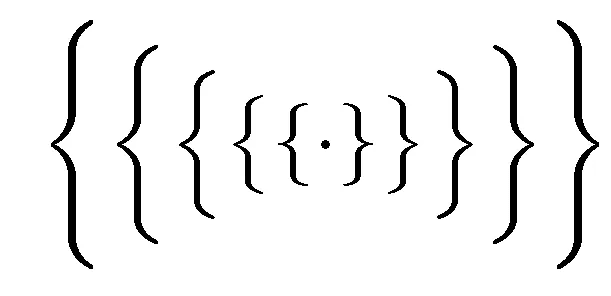

# 被认为有害的嵌套地图

> 原文：<https://medium.com/hackernoon/nested-maps-considered-harmful-143add482247>



## 基于在纽约 Clojure 会议上的发言

使 [Clojure](https://hackernoon.com/tagged/clojure) 成为我最喜欢的语言之一，当我想流畅地说出一个想法时，我首先选择的语言，是它对泛型[编程](https://hackernoon.com/tagged/programming)的承诺。

由于标准模板库，大多数人将泛型编程与 C++联系在一起，但是很少有人知道 STL 的思想最初是由亚历山大·斯捷潘诺夫在 Scheme 中构思的。这就是 C++向量得名的原因(毕竟，数学意义上的向量是固定长度的)。

斯捷潘诺夫最初的课程笔记仍然可以在他的网站上找到。他首先介绍了列表处理的基本原理，然后介绍了递归、map 和 reduce 等高阶函数，最后介绍了迭代器的概念——他通过实现几种常见的排序和搜索算法来演示迭代器。

我自己也有计划背景，我被 Clojure 如何无缝扩展列表处理范式以应用于最前沿的不可变数据结构所震惊:关联数据的散列数组映射尝试([由 Phil Bagwell 在](http://lampwww.epfl.ch/papers/idealhashtrees.pdf)之前仅六年引入)，类似设计的顺序数据的二分搜索法尝试，加上我所见过的严格语言中惰性序列的最佳实现之一。

熟悉的缺点、car 和 cdr 仍然是最重要的(尽管名称不同，尽管“first”和“next”在我出生之前很久就出现在 Lisp 的方言中),除了针对接口而不是具体的实现。甚至更高阶的函数也是通用的，例如，为了提高效率，内置的 reduce 使用 Java 的迭代器接口，而不是 first/next 递归。

Clojure 似乎真的做了不可思议的事情，并且再次提出了 Lisp 的含义。

# 问题是

在核心语言中构建对基于集合的通用操作的支持并非没有缺点。将复杂的数据结构与用于操作它们的一组公共函数紧密耦合会导致糟糕的设计决策。作为一个例子，我将转向这篇文章的标题，讨论我在 Clojure 代码中看到的最常见的反模式之一——深度嵌套的哈希映射——并展示我开发的一种替代它的技术。

嵌套散列映射被如此频繁地使用，因为从它们的实现中抽象出来，它们只是作为一种组织数据的方式有意义。众所周知，Clojure 从未提供许多显而易见的函数来使用它们，其中许多函数填充了各种实用程序库，但核心语言确实提供了复制基本[范·拉霍文透镜](https://arxiv.org/abs/1103.2841) : `assoc-in`，`update-in`和`get-in`的函数，所有这些函数都接受一个键向量，以便充当嵌套映射中值的 getters 和 setters。

就我个人而言，我已经编写了代码，在递归生成数据的过程中生成嵌套的哈希映射，这些数据在每一级上都“散开”。我的 [Madhava](https://github.com/Sophia-Gold/Madhava-v2) 库中的一个例子是一个计算给定函数的所有偏导数的函数，使用 n 元组以稀疏形式存储，直到某个顺序。每一阶都是从前一阶生成的，并且包含 n^k 偏分，其中 n 是维数，k 是阶。在一个三变量的方程中，一阶包含三个部分，二阶包含九个部分，三阶包含二十七个部分，依此类推。对于我来说，在编写执行计算的函数和需要访问某些部分(尤其是相关部分)的函数时，使用嵌套映射是有意义的:

```
{0 [[5 4 3 3] [8 2 1 2] [1 0 4 0] [2 0 0 3] [5 1 0 0]],
   1 
     {1 [[20 3 3 3] [16 1 1 2] [5 0 0 0]],
      2 [[15 4 2 3] [8 2 0 2] [4 0 3 0]],
      3 [[15 4 3 2] [16 2 1 1] [6 0 0 2]]},
   2
   {1 {1 [[60 2 3 3] [16 0 1 2]], 
       2 [[60 3 2 3] [16 1 0 2]],
       3 [[60 3 3 2] [32 1 1 1]]},
    2 {1 [[60 3 2 3] [16 1 0 2]],
       2 [[30 4 1 3] [12 0 2 0]],
       3 [[45 4 2 2] [16 2 0 1]]}
    3 {1 [[60 3 3 2] [32 1 1 1]],
       2 [[45 4 2 2] [16 2 0 1]],
       3 [[30 4 3 1] [16 2 1 0] [12 0 0 1]]}}}
```

好吧，即使印刷精美也有点难看。但是希望仍然可以清楚地看出花括号是如何将它们前面的函数的一部分组合在一起的。使用这种嵌套方式，我可以访问 x 变量的二阶偏导数，如下所示:`(get-in diff-map [1 1])`。

对于嵌套映射的一个非常不同的(也不那么可怕的)用法，让我们看看在[Ladders](https://www.theladders.com/)DSL 的团队提取 SQL 查询到 clo jure hash-maps:[sqlium](https://github.com/TheLadders/sqlium)。我无意挑他们的毛病；他们是优秀的工程师，sqlium 是一个非常酷的想法。

Sqlium 将单个 SQL 查询的结果表示为独立的映射，这些映射基于查询来自的表，关键字表示表名。下面是一个典型查询的结果示例:

```
{:name "Abbey Road"
 :artist [{:name "The Beatles"}]
 :tracks [{:name "Come Together"
           :number 1
           :artist [{:name "The Beatles"}]
           :songwriter [{:name "John Lennon"}
                        {:name "Paul McCartney"}]
           :producer [{:name "George Martin"}]}
          {:name "Something"
           :number 2
           :artist [{:name "The Beatles"}]
           :songwriter [{:name "George Harrison"}]
           ...}
          ... etc
          ]}
```

它有三层深度，这意味着表示所有此类查询的地图将有四层深度*。然而，顶层——也是迄今为止元素最多的一层——将完全是平的，这就是为什么我把这个例子比作我自己的例子。事实上，Ladders 团队可能非常关注垂直伸缩，以至于为了通过 ETL 管道显式地传送原始数据的结构，每个单独条目中的嵌套所造成的性能损失是更可取的。*

不管怎样，这两个例子有很大的不同，应该清楚的是，对于各种各样的应用程序，嵌套的散列映射以各种各样的方式产生，在所有这些应用程序中，它们在语义上似乎是正确的选择。

# W 怎么了？

哈希表是树，是递归的数据结构，所以希望以分层批处理的方式存储数据是有意义的。Clojure 哈希映射是尝试，不可变的，但具有令人印象深刻的 log32(n)插入和查找时间(实际上可视为常数)，因此这些批处理将采用具有公共父节点的叶子的形式，嵌套模式一直追溯到根节点。

但这真的是我们在上面的例子中得到的吗？显然不是。大多数时候，这比 HAMT 的一片叶子成为另一个 HAMT 的根还要糟糕。HAMTs 对于少量数据没有意义，所以 Clojure 的实现使用一个简单的数组(属于类`PersistentArrayMap`)来存储少于 16 个元素(或 8 个键值对),然后随着它的增长优雅地切换到一个`PersistentHashMap`。这意味着在上面的两个例子中，我们都是从双箱(元素本身以及包含数据结构的附加类)Java 数组中创建特定的树。这明明是*一堆屎*。

我解决这个问题的方法源于两个信念:

1.  从 API 设计的角度来看，用嵌套语义成批存储元素仍然是有意义的。这在查找时间以及人类易读性的定性价值方面带来了好处。
2.  答案不能包括用核心语言进一步完善数据结构。换句话说，我们不想为了让程序员获得更细粒度的优化而公开值实际上是如何存储的细节。这很可能只会鼓励进一步的虐待。封装实现也有很大的好处，几个满足相同接口的可选版本证明了这一点:包括我们马上要看到的一个。

# 一个解决方案

我不会厚颜无耻地声称这是一个对每个人都理想的解决方案。软件架构显然不是双射的。然而，这是一个对我非常有效的方法，我希望它能让其他人思考如何更好地组织他们自己的数据。

我以前很喜欢信息论。我最喜欢的一件琐事是克劳德·香农如何在以书籍形式出版他的著名论文[《沟通的数学理论》](http://math.harvard.edu/~ctm/home/text/others/shannon/entropy/entropy.pdf)时将其名称改为*《沟通的数学理论》*。我记得第一次实现霍夫曼编码是在 SICP。这些类型的编码方案是我解决嵌套映射问题的灵感来源。

我首先应该注意到，大多数关键的编码方案，包括我将在这里介绍的两种方案，都要求对映射进行排序。这对我个人来说不是问题，因为我没有使用内置的 Clojure hash-map，而是使用了 Zach Tellman 的 [int-map](https://github.com/clojure/data.int-map) ，这是一种针对整数键优化的基数 trie。能够使用整数键不仅让我的速度提高了大约 10%,而且排序是免费的。

很明显，这种约束在大多数情况下是不可能的，尽管我认为使用整数键的人比他们想象的要多——可能是通过开发他们自己的编码方案和构建定制的漂亮打印机，仅在必要时将它们转换成字符串。因此，我也将提出一个使用 Clojure 内置`sorted-map`关键字的解决方案。在这种情况下，排序确实带来了大约 10%的插入速度损失，但是与使用嵌套数组相比，使用平面 HAMT 弥补了这一损失。

一旦我想到这个解决方案，它似乎太明显了。它甚至是我使用的数据结构类型的名称:“基数”我所需要的只是简单地增加键的数量级，对于每一阶偏导数。在生成分部时，这意味着在每次递归调用时，将索引与前一个分部一起传递，并将其乘以 10。对于查找，我同样只需要将索引乘以 10。如果我需要一个给定顺序的所有部分，比如一个标量函数的梯度或拉普拉斯，我可以使用一个谓词，比如`(and (> k 9) (< k 100))`，简单地过滤给定范围内的键。

这是我的局部地图现在的样子:

```
{0 [[5 4 3 3] [8 2 1 2] [1 0 4 0] [2 0 0 3] [5 1 0 0]],
 1 [[20 3 3 3] [16 1 1 2] [5 0 0 0]],
 2 [[15 4 2 3] [8 2 0 2] [4 0 3 0]],
 3 [[15 4 3 2] [16 2 1 1] [6 0 0 2]],
 11 [[60 2 3 3] [16 0 1 2]],
 12 [[60 3 2 3] [16 1 0 2]],
 13 [[60 3 3 2] [32 1 1 1]],
 21 [[60 3 2 3] [16 1 0 2]],
 22 [[30 4 1 3] [12 0 2 0]],
 23 [[45 4 2 2] [16 2 0 1]],
 31 [[60 3 3 2] [32 1 1 1]],
 32 [[45 4 2 2] [16 2 0 1]],
 33 [[30 4 3 1] [16 2 1 0] [12 0 0 1]]}
```

当然，这将我限制在九个维度的函数中(因为为了清楚起见，我从一个维度开始索引)，但是在这种情况下，这似乎已经足够了。我并不真正理解弦理论，但从我所能收集的来看，即使描述 15 个自由度的方程也只使用闵可夫斯基时空的四个独立变量，因为保角对称意味着来自庞加莱群的十个变量以及时间膨胀的一个变量相互抵消。我得出结论，我的表示对于最复杂的实际应用已经足够了。

如果我在嵌套的第一阶段需要十个以上的键，一种选择是使用不同的基底。然而，我几乎肯定会坚持使用 decimal，并根据需要增加尽可能多的数量级来表示每一级嵌套。

由此得出的一个重要结论是，对键本身的任何非常复杂的操作都会抵消编码方案的大部分价值。这种方法最大的好处之一是插入和查找只需要简单的乘法运算。如果我需要在每一次操作中来回转换成一个数字序列，它可能会变成禁止性的。在我不能使用整数键的更困难的情况下，这是一个重要的指导。

总的来说，与上面的嵌套混乱相比，使用我的键编码方案的平面映射，我体验到了大约 18%的插入加速。许多程序员可能会对此嗤之以鼻，但在数字世界中，18%是相当重要的。此外，仅使用一个映射允许我充分利用 Clojure 的`transient`特性，该特性临时创建数据结构的可变版本以进行激进操作。*使用瞬态* `*int-map*` *将插入速度提高了近 4 倍。*

# 关键词呢？

关键字版本，我承认，有点黑。我还被告知它在 ClojureScript 中不起作用，当名称空间不能解析时会抛出异常。我还没有在我自己的代码中使用过它，但是正如前面提到的，我希望它至少能让人们考虑他们自己用例的替代方案。

首先，让我们从总体上谈一谈关键词。它们是在 Common Lisp 中开发的一个相当特殊的约定，我看到 Clojurians 人经常使用字符串作为键，所以解释起来很清楚。

Lisps 在历史上有一个概念，即*符号*，它指的是包括内置函数在内的所有全局引用。Clojure 通过区分作为名字的符号本身和*变量*，或者引用一个值或函数的符号，使这个问题变得有点复杂。这是因为大部分语言是用 Java 编写的，编译器会发出 JVM 字节码，但是为了简单起见，从这里开始我只讨论符号。

关键字只是一个对自身求值的符号。在 Clojure 中，它以一个或两个冒号为前缀，以自动用当前名称空间限定它，例如`:my-keyword`或`::my-keyword`，这与`my-app.core/my-keyword`相同。关键字被实现为 Java 对象，这些对象存储它们自己的名称和命名空间，每个对象都有公共的 getters 和 setters。当在关联数据结构中用作键时，Clojure 关键字使用由谷歌的奥斯丁·艾波开发的通用[mur hash 3](https://github.com/aappleby/smhasher/wiki/MurmurHash3)的 Java 实现进行散列。仅此一点就是使用它们而不是字符串的明显原因。

使用关键字而不是字符串的另一个原因是*字符串天生就很慢*。如果你是一个专业的字符串销售人员，在那个领域有很多有趣的问题，但是我认为更多的程序员认为他们在字符串业务中，而不是实际上。例如，如今大量的开发都是由编写 [CRUD 应用](https://en.wikipedia.org/wiki/Create,_read,_update_and_delete)组成的。尽管被混洗的“crud”的绝大部分是由字符串组成的，这个首字母缩略词暗示它们没有被直接操作。

Clojure 甚至将大多数字符串函数放在一个单独的名称空间中，这是有充分理由的。使用字符串作为中间格式是很诱人的，例如将整数转换成数字序列——这是我们前面回避的问题。这绝对是最糟糕的，因为你根本就没有在处理字符串。*就是不做。*

从整数案例中我们得到的教训是，编码方案只有在需要对键本身进行最少的操作时才有价值，我们的经验法则是，尽管关键字显然只是存储在对象中的字符串，但我们永远不应该直接进行任何实际的字符串操作。

正是这种启发引导我利用关键字将名称空间存储为单独的值这一事实(更重要的是，在 JVM 上，Clojure 不检查它们是否解析为实际的名称空间),以便处理复合字段名称，而不用将它们转换为字符串。

诀窍是这样的:

```
(keyword "foo" "bar")  => :foo/bar
(name :foo/bar)        => "bar"
(namespace :foo/bar)   => "foo"(keyword "foo" (str (keyword "bar" "baz")))  => :foo/bar/baz
(namespace (keyword (name :foo/bar/baz)))    => “bar"
```

让我们用[标准](https://github.com/hugoduncan/criterium)运行一些微基准测试，看看这种技术与拆分字符串相比如何:

```
(bench (namespace :foo/bar))                            ;; ~3.6 ns
(bench (clojure.string/split (str :foo/bar) #”/”))      ;; ~170 ns (bench (namespace (keyword (name :foo/bar/baz))))       ;; ~51 ns
(bench (clojure.string/split (str :foo/bar/baz) #”/”))  ;; ~212 ns
```

有了一层嵌套，它几乎和我们例子中整数键的乘法一样快。有了两个级别，由于需要将由`name`返回的字符串转换回一个关键字，所以速度会慢很多。然而，它仍然比字符串操作快 4 倍以上。进一步的研究表明这是线性扩展的，正如人们所预料的那样，对`keyword`的调用完成了这里的所有工作:

```
(bench (namespace (keyword (name (keyword (name (keyword (name :foo/bar/baz/qux/quz))))))))
;; ~153 ns(bench (clojure.string/split (str :foo/bar/baz/qux/quz) #”/”))
;; 290 ns
```

这让我想知道:这种多名称空间关键字黑客在多少层嵌套上能与`clojure.string/split`相提并论？

```
(bench (namespace (last (take 10 (iterate (comp keyword name) :foo/bar/baz/qux/quux/quuz/corge/grault/garply/waldo/fred)))))
;; ~631 ns(bench (clojure.string/split (str :foo/bar/baz/qux/quux/quuz/corge/grault/garply/waldo/fred) #”/”)) ;; ~615 ns
```

我不能说我见过 11 层深的嵌套哈希表。

为了使事情更完整，我们可以测试创建嵌套关键字是否也线性扩展:

```
(bench (keyword “foo” “bar”))                           ;; ~18.7 ns
(bench (keyword “foo” (str (keyword “bar” “baz”))))     ;; ~32 ns
(bench (keyword “foo” (str (keyword “bar” (str (keyword “baz” “qux”))))))                                             ;; ~51.8 ns
```

并且花费不到一半的呼叫时间`str`:

```
(bench (keyword “foo” (str (keyword “bar” “baz”))))     ;; ~32 ns
(bench (keyword “foo” (str “bar/” “baz”)))              ;; ~77.9 ns
(bench (keyword (str “foo/” “bar/” “baz”)))             ;; ~127 ns
```

使用这种技术，Ladders 对 Abbey Road 的 SQL 查询可以变成:

```
{:name "Abbey Road",
 :artist/name "The Beatles",
 :tracks/name/Come Together/name "Come Together",
 :tracks/Come Together/number 1,
 :tracks/Come Together/artist/name "The Beatles",
 :tracks/Come Together/songwriter/name/1 "John Lennon"
 :tracks/Come Together/songwriter/name/2 "Paul  McCartney"],
 :tracks/Come Together/producer/name "George Martin",
 :tracks/Something/name "Something",
 :tracks/Something/number 2,
 :tracks/Something/artist/name "The Beatles",
 :tracks/Something/songwriter/name "George Harrison",
 ... etc}
```

显然，这涉及到如何处理重复键的一些设计决策，应该根据具体数据仔细考虑。

# 经验教训

当在[的 C 编程笔记](http://doc.cat-v.org/bell_labs/pikestyle)中讨论 Unix 哲学时，Rob Pike 写道:

> 数据主导。如果你选择了正确的数据结构并且组织得很好，算法几乎总是不言自明的。数据结构，而不是算法，是编程的核心。

他明确引用了弗雷德·布鲁克斯的 [*神话中的人月*](https://www.amazon.com/Mythical-Man-Month-Software-Engineering-Anniversary/dp/0201835959) :

> 给我看你的流程图，隐藏你的表格，我会继续迷惑，给我看你的表格，我通常不需要你的流程图；他们会很明显。

在泛型编程的上下文中，我将更进一步:

## "给我看看你的钥匙，我就不需要你的数据结构了."