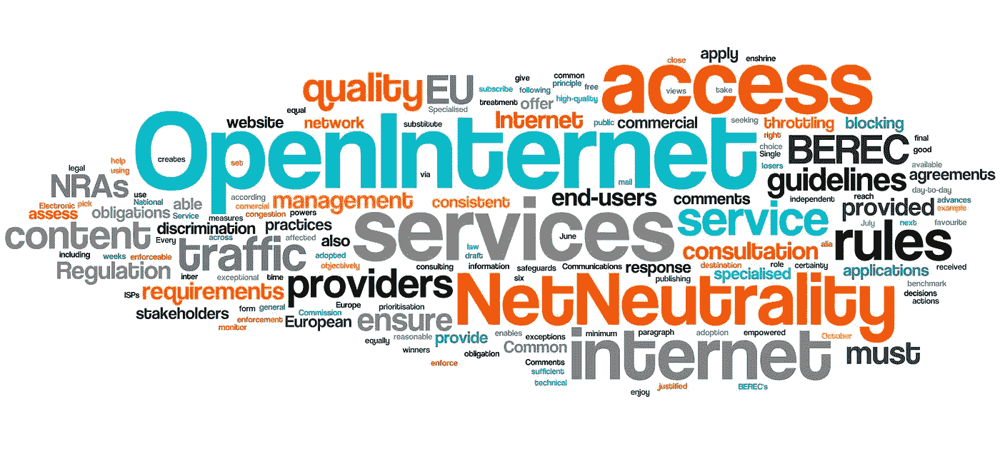
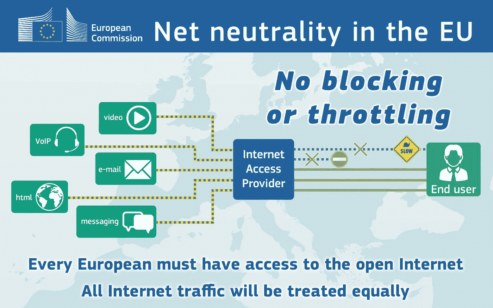

# 欧洲的网络中立

> 原文：<https://medium.com/hackernoon/net-neutrality-in-europe-2a88c3b5efb>

## 欧洲开放网络监管者的新指南

欧洲电子通信监管机构(BEREC)向国家监管机构(NRAs)发布了关于实施新网络中立性的[指南。](http://berec.europa.eu/eng/document_register/subject_matter/berec/regulatory_best_practices/guidelines/6160-berec-guidelines-on-the-implementation-by-national-regulators-of-european-net-neutrality-rules)

新指南的发布是[欧洲议会和欧洲理事会](http://europa.eu/rapid/press-release_IP-15-5927_en.htm)努力降低数字单一市场壁垒的一部分，包括取消欧盟内部的漫游费，以及在欧盟法律中首次创建网络中立规则。

> 除非有必要，否则禁止 ISP(互联网服务提供商)阻止或减慢互联网流量。例外情况仅限于:遵守法律秩序的流量管理、确保网络完整性和安全性以及管理拥塞，前提是同等类别的流量得到平等对待。这些条款还在欧盟法律中规定，用户有权“自由访问和分发信息和内容，运行应用程序和使用他们选择的服务”。具体规定确保国家当局能够执行这项新权利。

正如 The Verge 报道的那样，“BEREC 在 6 月份公布了欧盟成员国将如何实施这些规则的指导方针草案，并公开征求公众意见，收到了超过 48 万份回复。”

7 月，在公众咨询结束的前几天，万维网之父、[网络基金会](https://medium.com/u/aabc4af7ffad?source=post_page-----2a88c3b5efb--------------------------------)创始人[蒂姆·伯纳斯·李爵士、](https://medium.com/u/f4c52f5a54b0?source=post_page-----2a88c3b5efb--------------------------------)[斯坦福大学](https://medium.com/u/1022fa5dee6d?source=post_page-----2a88c3b5efb--------------------------------)法学院互联网与社会中心主任[芭芭拉·范·舍维克](https://medium.com/u/548c5492e42f?source=post_page-----2a88c3b5efb--------------------------------)教授和[哈佛大学](https://medium.com/u/cb35da43ade5?source=post_page-----2a88c3b5efb--------------------------------)拉里·莱西格教授给欧洲公民、立法者和监管者写了一封[公开信](http://webfoundation.org/2016/07/four-days-to-save-the-open-internet-in-europe-an-open-letter/)，呼吁采取行动保护网络中立。

> [黑客中午](http://bit.ly/Hackernoon)是黑客如何开始他们的下午。我们是 AMI 家庭的一员。我们现在[接受投稿](http://bit.ly/hackernoonsubmission)并乐意[讨论广告&赞助](mailto:partners@amipublications.com)机会。
> 
> 如果你喜欢这个故事，我们推荐你阅读我们的[最新科技故事](http://bit.ly/hackernoonlatestt)和[趋势科技故事](https://hackernoon.com/trending)。直到下一次，不要把世界的现实想当然！

