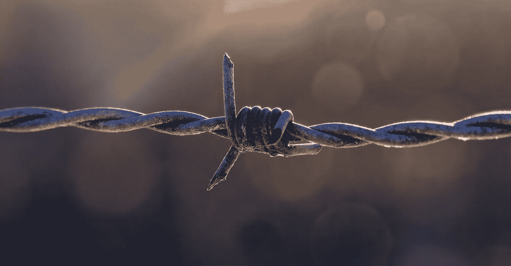

# 网络中立不是一件好事。这也不是什么坏事。

> 原文：<https://medium.com/hackernoon/net-neutrality-is-not-a-good-thing-its-not-a-bad-thing-either-51a9d6baf92c>

Credit: Pixabay ([https://pixabay.com/en/pasture-fence-barbed-wire-fencing-1995820/](https://pixabay.com/en/pasture-fence-barbed-wire-fencing-1995820/))

互联网目前似乎正处于战争状态，反对 T2 网络中立的人被视为愚蠢或贪婪。人们普遍认为，反对网络中立的人只会从反竞争行为中获益，并从伤害在线内容消费者的交易中赚很多钱。**这不是真的**。

# 网络中立 ELI-5

网络中立原则上很简单。这本质上是一种预防性的监管，试图阻止反竞争行为，以保护消费者免受互联网上合法内容的禁止。就像我能稀释它一样简单。

网络中立将互联网视为一个破碎的行业，并将其置于第二章的监管之下(尽管他们排除了其中的一些规则)。这实质上赋予了联邦通信委员会控制互联网服务提供商和防止节流和付费优先等行为的权力。通过这样做，FCC 也暗示了互联网行业和数字经济已经到了崩溃的程度，就像电力和电信行业一样。

网络中立性的存在是为了确保任何 ISP 都不能垄断互联网，并为了自己的业务而限制特定服务的流量。在网络中立之前，有一个主要问题伴随着这种行为，我现在将解释它。

# 康卡斯特，威瑞森，美国电话电报公司 vs FaceTime

有一个主要问题是，互联网服务提供商被发现对客户进行限制，并对特定服务的访问收费。这是在 FaceTime 上。几个互联网服务提供商被发现参与了这一行为。这成了一个大问题，消费者开始大声抱怨。

这给其他 ISP 带来了机会。一些互联网服务提供商已经开始宣传他们不会限制你的流量。结果呢？几家正在节流的互联网服务提供商将客户流失到了竞争对手那里。

展望未来，最初要求额外付费使用 FaceTime 的互联网服务提供商停止了这种行为，以重获他们的品牌，并带回客户。这是在网络中立之前，虽然它并不完美，但它已经在工作了。

# 网络中立是好是坏？

我不相信网络中立从根本上也是。我认为，网络中立的最初目的是先发制人地监管互联网，以确保没有违法的事情发生。它的建立是为了阻止反竞争行为，本质上意味着互联网市场将永远保持不变。

这种先发制人的监管将不可避免地禁止有利于竞争的商业安排。这是因为几乎所有的事情都会被视为非法，而不是在个案的基础上被仔细考虑。不仅如此，这也将减少投资，因为监管框架看起来极其沉重。这减少了该领域的创新和竞争。

如果你想让互联网看起来像电信和电力行业，网络中立将确保这种情况发生。在我看来，互联网在网络中立之前没有被打破，在网络中立之后也不会被打破。

# 谷歌、网飞和微软呢？

你可能已经听说一些大玩家已经表达了他们对网络中立的支持。这个行业中最大的玩家说他们支持它，并且网络中立是重要的。

然而，谁是网络中立的最大受益者？我真的相信会是这些大公司。我相信，这些公司害怕互联网服务提供商将互联网服务提供商的内容服务推广到他们自己的内容服务之上。我也相信他们支持网络中立，因为这可以防止竞争变得像他们一样大。

我为什么采取这种立场？这些公司是 DRM——严格限制你访问内容的技术和标准——的忠实拥护者。他们正在创造这些技术，几乎他们做的任何事情都是为了在经济上获利。

他们推 DRM 却主张网络中立的事实应该会给你一种不安全感。对我来说的确如此。对我来说，这意味着这些大型企业将从网络中立性中获得货币价值。

# 节流呢？

联邦通信委员会主席已经明确表示，他们不希望节流发生。他们想一件一件来处理。就是他们所说的“*事后监管*”。如果发现反竞争行为或限制，他们会采取行动。如果互联网受到威胁或消费者受到伤害，他们将采取行动。

你受到了保护。取消网络中立的想法是为了让你能够受到事后监管，而不是事前监管。我个人会把这比作无罪直到被证明有罪。

目前，这个行业的每个人都被认为有罪，直到被证明是无辜的。我宁愿看到整个行业是无辜的，直到被证明有罪。

# 结论

这没什么大不了的。我认为网络中立是有害的，但不是故意的。我相信大公司正在推动它，因为这是对他们的财务激励，因为他们在整个互联网上推行有害的 DRM。

如果先发制人的监管被取消，我相信互联网将会以更快的速度发展。我理解很多人会不同意这篇文章。然而，我认为我们需要对此进行更多的讨论。不是“我不想被节流”这么简单。

这里有一个关于这个话题的惊人视频:[https://www.youtube.com/watch?v=csK3KspB-6A](https://www.youtube.com/watch?v=csK3KspB-6A)

如果你喜欢这篇文章，请考虑在 Medium 上关注我。本文所有观点均为本人观点。