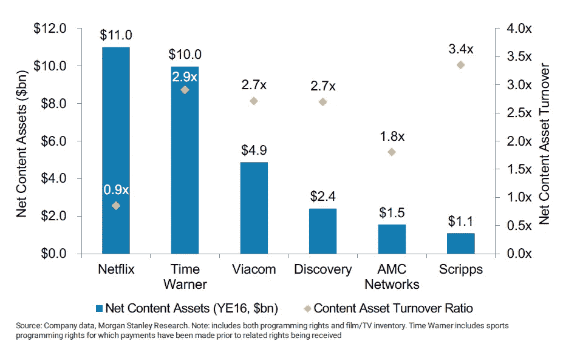

# 网飞:商业模式分析

> 原文：<https://medium.com/hackernoon/netflix-b50868ad4f1c>

## 网飞不应被视为流媒体业务。流媒体不是商业模式，而是数据的来源。

好莱坞和硅谷差不多。这是一个创业生态系统，相当于风险资本——工作室。

风投们试图利用数据来改善他们的投资决策。他们取得了一定的成功。问题是很难为初创公司收集可比较的数据集。

网飞[拥有一切内容](https://www.theatlantic.com/technology/archive/2014/01/how-netflix-reverse-engineered-hollywood/282679/?lipi=urn%3Ali%3Apage%3Ad_flagship3_pulse_read%3BzWMNp5eBQfCDUxYur1b%2Btg%3D%3D)。

它确切地知道谁在看什么，什么时候看，看了多长时间。他们追踪[的演员阵容和流派](https://www.theatlantic.com/technology/archive/2014/01/how-netflix-reverse-engineered-hollywood/282679/?lipi=urn%3Ali%3Apage%3Ad_flagship3_pulse_read%3BzWMNp5eBQfCDUxYur1b%2Btg%3D%3D)。传统制作人没有接近那种水平的洞察力。

数据允许网飞[更精确地预测内容的受欢迎程度。](https://www.slideshare.net/JeffMagnusson/watching-pigs-fly-with-the-netflix-hadoop-toolkit)

这并不意味着他们每次都是对的。但是他们有更高的成功率。这转化为更好的单位经济。

Kissmetrics [发表了一份分析报告](https://blog.kissmetrics.com/how-netflix-uses-analytics/),从中可以看出这种影响有多大:

> “当一个电视网给一个节目开绿灯时，它有 35%的机会成功，有 65%的机会被取消。在写这篇文章的时候，网飞有 7 个电视节目，其中 5 个已经更新了一季。如果这种速度能够持续多年，网飞的成功率将达到 70%左右。”

网飞已经成为一个精心收集数据的投资工具。

内容制作业务(电视、电影、单口相声专场等。)大于电缆。流媒体已经蚕食了有线电视。网飞可以从其流媒体业务中收取租金。相反，他们用它来生成数据并主导内容生产。

网飞的行动似乎证实了这一理论。

他们关注的内容是从大量数据中获益最多的类型。网飞在其网站上声明:

> “我们不是一家普通的“视频”公司，我们提供各种类型的视频，如新闻、用户生成的视频、体育、色情、音乐视频、游戏和现实。我们是电影电视剧娱乐网。”

《纽约时报》在关于网飞的文章中引用了投资银行分析师迈克尔·帕切特的话:

> “网飞陷入了他们发明的军备竞赛中，”帕切特总结道。“他把网飞比作一只在轮子上赛跑的老鼠，只有越跑越快，花费越来越多，才能保持领先地位:随着成本不断上升，它需要不断吸引更多的用户，才能保持领先地位。”

这种观点忽略了一点，那就是网飞正在打一场持久战。随着时间的推移，它所制作的内容将会获得回报。在收支平衡或亏损的情况下增加用户是合理的。看来这就是他们正在做的事情。

It seems like Netflix is getting less out of its content than other companies. What this comparison is missing is accounting for the value of data that is leveraged to lower the cost of buying new content. Source: [Investopedia](http://www.investopedia.com/news/netflixs-11-bn-content-fetching-it-lower-revenue-rivals/?ad=dirN&qo=investopediaSiteSearch&qsrc=0&o=40186)

这个策略有双重回报。

首先，网飞可以收集更多的数据。这意味着更好的投资决策。第二，已经制作的内容的回报率提高。已经付过钱了。现在它获得了新的观众。

网飞拥有的内容也可以在订阅服务之外实现货币化。雷德·哈斯汀斯在【T2 致股东信(2017 年 4 月 17 日)】中承认这是一个选项:

> “既然我们的成员在资助这些电影，他们应该是第一批看到这些电影的人。但我们也愿意支持大型连锁影院。”

# 创新者的困境

网飞正在颠覆内容生产，正如克莱顿·克里斯腾森在《T4》中描述的那样。首先，它们主宰了对老牌玩家没有吸引力的类别。

单口相声特辑就是一个很好的例子。网飞拥有[这一类别](http://www.cinemablend.com/television/1631000/why-netflix-is-spending-so-much-on-stand-up-comedy-specials)。它不需要去争取。这不是大型电影公司感兴趣的内容类型。现在，网飞正凭借众星云集的电影向他们的领地扩张。

雷德·哈斯汀斯告诉投资者，网飞的主要竞争对手是 sleep。争论的焦点是不止一个流媒体服务的空间。

这是事实。暂时如此。

# 亚马孙

杰夫·贝索斯似乎也有同样的想法。[他还说](https://www.recode.net/2016/6/1/11826718/jeff-bezos-amazon-full-video-code)不止一个流媒体服务有空间。

贝佐斯被问及为什么亚马逊视频不在所有设备上。他解释说，拥有自己的球员是不可能的，也太贵了。

这很能说明问题。有理由假设原因是亚马逊想要收集收视率数据。他们也在[对内容](http://www.businessinsider.de/amazon-video-budget-in-2017-45-billion-2017-4?r=US&IR=T)进行大量投资。

网飞仍然做得更好。它有更多的经验，积累了更多的数据。然而，亚马逊对网飞构成威胁似乎是有道理的。

这是我能想到的唯一一个可能获得更好单位经济效益的实体。在所有条件相同的情况下(订户、定价、内容赌注)，亚马逊赚得更多。亚马逊视频与亚马逊 Prime 捆绑销售，因此推动了整体销售。

# 利润

资本流向能获得最高回报的地方。有了更好的单位经济，网飞和亚马逊可以筹集足够的资金让老玩家出局。

那么他们将不得不相互竞争。不是用户，而是内容。这将推动价格上涨，利润下降。

亚马逊很可能会在未来的某个时候试图接管网飞。它可能在单位经济学上有优势，而且它能够在利润上榨干竞争对手。直到他们同意出售。

这在[不会是第一次发生了。](http://allthingsd.com/20131010/how-jeff-bezos-crushed-diapers-com-so-amazon-could-buy-diapers-com/)