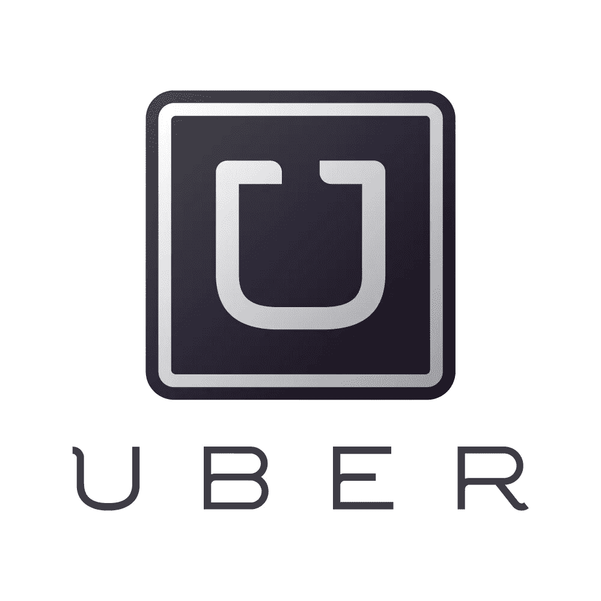

# 网飞的优步估值

> 原文：<https://medium.com/hackernoon/netflix-s-uber-valuation-bb13434ad277>

作为方的主要成员之一，(NFLX)是仅次于亚马逊(AMZN)的第二贵组件。尽管其市盈率接近 300 倍，但该股仍能在 2015 年继续猛烈飙升。考虑到如此昂贵的传统估值，大多数金融专家预计网飞的股票会在任何市场调整期间真正崩溃。事实上，在当前的市场环境下，它的交易价格仍然在 100 美元以上，而不是 85 美元左右，这在某种程度上否定了这一理论。

那么，如果我们不能传统地评价网飞，我们该如何评价它呢？就估值而言，我将网飞视为一只上市的“独角兽”。我眼中的其他公共独角兽包括 Twitter、GoPro、Etsy 等。业务本身很好，但不一定要发展到竞争对手的规模。如果这冒犯了你，我不在乎。对于网飞，我觉得回到 2015 年夏天，根据一只私人独角兽对它进行估值才是公平的。这是一项颠覆性的服务，其全球影响力不断增长，而且似乎在很大程度上被高估了。我认为优步是最接近的独角兽类型，我可以公平地评估网飞的价值，因为它拥有同样的资质。过去几个月，随着有关优步估值变化的新报告出炉，我对网飞的目标价也发生了变化。最近的报告对优步的估值为 625 亿美元(比网飞的当前价格高出近 200 亿美元)。自然，我的网飞目标随之上升。
根据目前的流通股，我的$NFLX PT 是$146。
到了那里，我会卖掉；不问任何问题。

正如我们已经开始看到的那样，私人独角兽公司的投资者已经开始看到估值过高的真相，富达等公司对其股份进行了减记。除了网飞之外，上市独角兽公司也遭受了重创。

目前，我在 NFLX 没有职位。然而，通过忽略熊市与之比较的传统指标，我在 2015 年用它赚了相对容易的钱。除了网飞之外，我不会用这种方法来评估任何其他公司的价值，如果我这样做的话，我会很愚蠢。我希望这篇文章能够对网飞“疯狂的估价”背后的一些观点。不知何故，我不认为我是唯一一个重视公共独角兽和私人独角兽的人。

> [黑客中午](http://bit.ly/Hackernoon)是黑客如何开始他们的下午。我们是 [@AMI](http://bit.ly/atAMIatAMI) 家庭的一员。我们现在[接受投稿](http://bit.ly/hackernoonsubmission)并乐意[讨论广告&赞助](mailto:partners@amipublications.com)机会。
> 
> 如果你喜欢这个故事，我们推荐你阅读我们的[最新科技故事](http://bit.ly/hackernoonlatestt)和[趋势科技故事](https://hackernoon.com/trending)。直到下一次，不要把世界的现实想当然！

