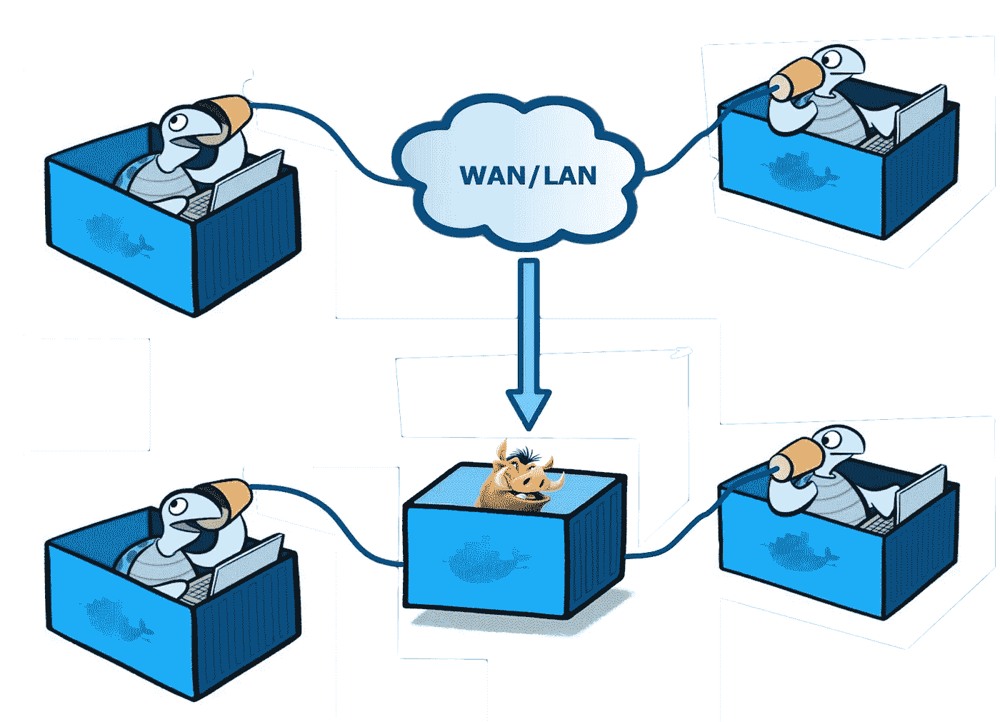

# Docker 容器的网络仿真

> 原文：<https://medium.com/hackernoon/network-emulation-for-docker-containers-f4d36b656cc3>

## TL；速度三角形定位法(dead reckoning)

> [*Pumba*](https://github.com/gaia-adm/pumba)****【netem 延迟】*** *和****【netem 丢失】*** *命令可以模拟 Docker 容器之间的网络*延迟*和*数据包丢失*，甚至在单个主机上。试试看！**

## *介绍*

*软件团队已经采用微服务架构作为更快交付商业价值的方式。容器技术支持将微服务交付到任何环境中。Docker 为开发团队提供了一个易于使用的工具集来构建、发布和运行分布式应用程序，从而加速了这一进程。这些应用程序可以由打包在 Docker 容器中的数百个微服务组成。*

*在最近的 NGINX 调查中，“阻碍开发者的最大挑战”是质量和速度之间的权衡。正如 Martin Fowler 指出的，[微服务架构中的测试策略](http://martinfowler.com/articles/microservice-testing/)可能非常复杂。创建一个现实而有用的测试环境是这种复杂性的一个方面。*

*一个挑战是**模拟网络故障**以确保应用和服务的**弹性**。*

*[网络](https://hackernoon.com/tagged/network)是确保任何分布式应用程序可靠性的关键干线系统。根据应用程序的访问位置，网络条件会有所不同。网络行为会极大地影响整个应用程序的可用性、稳定性、性能和用户体验(UX)。在用户注意到之前模拟和理解这些影响是非常重要的。测试这些条件需要进行真实的网络测试。*

*Docker 容器部署在集群中后，容器之间的所有通信都通过网络进行。这些容器在单个主机、不同主机、不同网络和不同数据中心上运行。*

> *我们如何测试网络行为对应用程序的影响？我们可以做什么来模拟单个主机上的容器之间或多个主机上的集群之间的不同网络属性？*

# ***带网络仿真的 Pumba】***

*[**Pumba**](http://github.com/gaia-adm/pumba) 是 Docker 容器的混沌测试工具，灵感来自[网飞混沌猴](https://github.com/Netflix/SimianArmy/wiki/Chaos-Monkey)。主要的好处是它与容器而不是虚拟机一起工作。Pumba 可以终止、停止、重启正在运行的 Docker 容器，或者暂停指定容器中的进程。我们用它来测试分布式应用程序的弹性。弹性测试确保系统的可靠性。它允许团队验证他们的应用程序是否正确恢复，而不管任何事件(预期的或意外的)，没有任何数据或功能丢失。Pumba 为分布式和容器化的应用程序模拟这些事件。*

## *彭巴*

**

*我们从*延迟*和*数据包丢失*开始，增强了 **Pumba** 的网络仿真能力。使用**【pumba netem】**命令，我们可以在任何 Docker 容器上应用*延迟*或*数据包丢失*。在引擎盖下，Pumba 使用 Linux 内核流量控制( [tc](http://man7.org/linux/man-pages/man8/tc.8.html) )和 [netem](http://man7.org/linux/man-pages/man8/tc-netem.8.html) 排队规则。为了工作，我们需要将 [iproute2](https://wiki.linuxfoundation.org/networking/iproute2) 添加到我们想要测试的 Docker 图像中。一些基本 Docker 映像已经包含了 [iproute2](https://wiki.linuxfoundation.org/networking/iproute2) 包。*

***Pumba****【netem delay】**和**【netem loss】**命令可以模拟 Docker 容器之间的网络*延迟*和*数据包丢失*，甚至在单个主机上。*

*从内核 2 . 6 . 7(14 年前发布)开始，Linux 具有内置的网络仿真功能。Linux 允许我们操纵流量控制设置，使用 [tc](http://man7.org/linux/man-pages/man8/tc.8.html) 工具，可在 [iproute2](https://wiki.linuxfoundation.org/networking/iproute2) 获得； [netem](http://man7.org/linux/man-pages/man8/tc-netem.8.html) 是 [tc](http://man7.org/linux/man-pages/man8/tc.8.html) 工具的扩展(*排队规则*)。它允许仿真网络特性— *延迟*、*分组丢失*、*打包器重新排序*、*复制*、*损坏*和*带宽速率*。*

***Pumba****【netem】**命令可以帮助开发团队在 Docker 容器中构建、发布和运行微服务时模拟真实的网络条件。*

***Pumba** 带有低级**【netem】**选项，大大简化了它的用法。我们使得模拟不同的网络属性来运行 Docker 容器变得更加容易。*

*在当前版本中， **Pumba** 仅通过为指定容器添加*延迟*或*数据包丢失*来修改*出口*流量。可以通过名称(单个名称或空格分隔的列表)或通过正则表达式( [RE2](https://github.com/google/re2/wiki/Syntax) )来指定目标容器。Pumba 在指定的持续时间内修改集装箱网络条件。在设定的时间间隔后， **Pumba** 恢复正常网络状态。 **Pumba** 也通过 **pumba** 进程( *Ctrl-C* )的正常关闭或通过**【停靠站停止】**命令停止 **Pumba** 容器来恢复原始连接。*

*可以选择将 IP 范围过滤器应用于网络仿真。使用此选项， **Pumba** 将修改指定 IP 的传出流量，并保持其他传出流量不变。使用此选项，我们可以更改特定容器间连接以及特定 Docker 网络的网络属性—每个 Docker 网络都有自己的 IP 范围。*

## *Pumba 延迟:[netem 延迟]*

*为了演示，我们将运行两个 Docker 容器:一个正在运行一个**【ping】**命令，另一个是 **Pumba** Docker 容器，它将 3 秒的网络*延迟*添加到 ping 容器 1 分钟。1 分钟后， **Pumba** container 在正常退出时恢复 ping 容器的网络连接属性。*

*[](https://asciinema.org/a/82428?t=7) [## Pumba [netem delay]演示

### 演示 Pumba netem delay 命令的用法——向 Docker 容器添加网络延迟。

asciinema.org](https://asciinema.org/a/82428?t=7) 

```
# open two terminal windows: (1) and (2) # terminal (1) 
# create new 'tryme' Alpine container (with iproute2) 
# and ping `www.example.com` 
$ docker run -it --rm --name tryme alpine sh -c \
    "apk add --update iproute2 && ping www.example.com" # terminal (2) 
# run pumba: add 3s delay to `tryme` container for 1m 
$ docker run -it --rm \
    -v /var/run/docker.sock:/var/run/docker.sock \
    gaiaadm/pumba \ 
    pumba netem --interface eth0 --duration 1m \
    delay --time 3000 tryme # See `ping` delay increased by 3000ms for 1 minute 
# You can stop Pumba earlier with `Ctrl-C`
```

## [网络延迟]示例

本节包含更多关于**Pumba【netem delay】**命令的网络仿真示例。

```
# add 3 seconds delay for all outgoing packets 
# on `eth0` (default) device of `mydb` Docker container 
# for 5 minutes 
$ docker run -it --rm \
    -v /var/run/docker.sock:/var/run/docker.sock gaiaadm/pumba \
    pumba netem --duration 5m \ 
    delay --time 3000 \ 
    mydb# add a delay of 3000ms ± 30ms, 
# with the next random element depending 20% on the last one, 
# for all outgoing packets on device `eth1` of all Docker container,
# with name start with `hp` 
# for 10 minutes 
$ docker run -it --rm \
    -v /var/run/docker.sock:/var/run/docker.sock gaiaadm/pumba \
    pumba netem --duration 5m --interface eth1 \ 
    delay \ 
      --time 3000 \ 
      --jitter 30 \ 
      --correlation 20 \ 
    re2:^hp# add a delay of 3000ms ± 40ms, where variation in delay is 
# described by `normal` distribution, # for all outgoing packets
# on device `eth0` of randomly chosen Docker container 
# from the list for 10 minutes 
$ docker run -it --rm \
    -v /var/run/docker.sock:/var/run/docker.sock gaiaadm/pumba \
    pumba --random \ 
    netem --duration 5m \ 
    delay \ 
      --time 3000 \ 
      --jitter 40 \ 
      --distribution normal \ 
    container1 container2 container3
```

## Pumba 数据包丢失:[netem loss/-state/-gemodel]

让我们从一个*丢包*演示开始。这里我们将运行三个 Docker 容器。iperf **服务器**和**客户端**用于发送数据和 Pumba Docker 容器，这将增加客户端容器的打包损失。我们使用**执行网络吞吐量测试**工具 [iperf](http://manpages.ubuntu.com/manpages/xenial/man1/iperf.1.html) 来演示*数据包丢失*。

[](https://asciinema.org/a/82430) [## Pumba [netem loss]演示

### 演示 Pumba netem loss 命令的用法——向 Docker 容器添加网络数据包丢失。

asciinema.org](https://asciinema.org/a/82430) 

```
# open three terminal windows # terminal (1) iperf server 
# server: `-s` run in server mode; `-u` use UDP; 
#         `-i 1` report every second 
$ docker run -it --rm --name tryme-srv alpine sh -c \
    "apk add --update iperf && iperf -s -u -i 1" # terminal (2) iperf client 
# client: `-c` client connects to <server ip>; 
# `-u` use UDP 
$ docker run -it --rm --name tryme alpine sh -c \
    "apk add --update iproute2 iperf && iperf -c 172.17.0.3 -u" # terminal (3) 
# run pumba: add 20% packet loss to `tryme` container for 1m 
$ docker run -it --rm \
    -v /var/run/docker.sock:/var/run/docker.sock gaiaadm/pumba \
    pumba netem --duration 1m \
    loss --percent 20 tryme # See server report on terminal 
# (1) 'Lost/Total Datagrams' - should see lost packets there
```

一般理解 IP 网络中的*丢包*分布是“突发性”的。为了模拟更真实的*丢包*事件，使用了不同的概率模型。Pumba 目前支持针对*数据包丢失*的 3 种不同的丢失概率模型。Pumba 为每个概率模型定义单独的*损失*命令。

*   **损失** —独立概率损失模型(伯努利模型)；这是使用最广泛的丢失模型，其中数据包丢失是由伯努利轨迹组成的随机过程建模的
*   **损失状态** —二状态、三状态和四状态马尔可夫模型
*   **损失-吉模型** —吉尔伯特和吉尔伯特-埃利奥特模型

网络打包器损失模型论文；

*   “深度:丢包突发性”[链接](http://www.voiptroubleshooter.com/indepth/burstloss.html)
*   “为分组网络定义一个通用而直观的丢失模型，并在 Linux 内核的 Netem 模块中实现。”[链接](http://blog.terranillius.com/post/pumba_docker_netem/netgroup.uniroma2.it/TR/TR-loss-netem.pdf)
*   man**netem**T42【链接

# “净损失”示例

```
# loss 0.3% of packets 
# apply for `eth0` network interface (default) 
# of `mydb` Docker container for 5 minutes 
$ docker run -it --rm -v /var/run/docker.sock:/var/run/docker.sock \
    gaiaadm/pumba pumba \
    netem --duration 5m \ 
      loss --percent 0.3 \ 
    mydb# loss 1.4% of packets (14 packets from 1000 will be lost) 
# each successive probability (of loss) depends by a quarter
# on the last one: 
#     Prob(n) = .25 * Prob(n-1) + .75 * Random 
# apply on `eth1` network interface of Docker containers 
# (name start with `hp`) for 15 minutes 
$ docker run -it --rm -v /var/run/docker.sock:/var/run/docker.sock \
    gaiaadm/pumba pumba \
    netem --interface eth1 --duration 15m \
      loss --percent 1.4 --correlation 25 \ 
    re2:^hp# use 2-state Markov model for packet loss probability: 
#   P13=15%, P31=85% 
# apply on `eth1` network interface of 
# 3 Docker containers (c1, c2 and c3) for 12 minutes 
$ docker run -it --rm -v /var/run/docker.sock:/var/run/docker.sock \
    gaiaadm/pumba pumba \
    netem --interface eth1 --duration 12m \
      loss-state -p13 15 -p31 85 \ 
    c1 c2 c3# use Gilbert-Elliot model for packet loss probability: 
#    p=5%, r=90%, (1-h)=85%, (1-k)=7% 
# apply on `eth2` network interface of `mydb` Docker container 
# for 9 minutes and 30 seconds 
$ docker run -it --rm -v /var/run/docker.sock:/var/run/docker.sock \
    gaiaadm/pumba pumba \
    netem --interface eth2 --duration 9m30s \
      loss-gemodel --pg 5 --pb 90 --one-h 85 --one-k 7 \ 
    mydb
```

## 贡献

特别感谢[尼尔·格哈尼](/@GehaniNeil)对我这篇文章的帮助，以及[因巴尔·妮莎](https://github.com/inbarshani)用**【netem】**命令提出的初始拉取请求。

## 然后

要查看更多关于如何将 **Pumba** 与**【netem】**命令一起使用的示例，请参考 [Pumba GitHub Repositor](https://github.com/gaia-adm/pumba) y。我们已经对其进行了开源。我们乐意接受想法、请求、问题或任何其他贡献。

**Pumba** 可以从 [GitHub 项目发布页面](https://github.com/gaia-adm/pumba/releases)下载为预编译二进制(Windows、Linux 和 MacOS)。它也可以作为 [Docker 图像](https://hub.docker.com/r/gaiaadm/pumba)使用。

[Pumba GitHub 库](https://github.com/gaia-adm/pumba)

## 更大的

对于更全面的(不仅仅是 Docker networking)和企业就绪的网络虚拟化解决方案，我推荐尝试一下 [HPE 的网络虚拟化](http://www.hpe.com/software/nv)产品。

*原载于*[*blog.terranillius.com*](http://blog.terranillius.com/post/pumba_docker_netem/)*。*

[](http://bit.ly/HackernoonFB)[](https://goo.gl/k7XYbx)[](https://goo.gl/4ofytp)

> [黑客中午](http://bit.ly/Hackernoon)是黑客如何开始他们的下午。我们是 [@AMI](http://bit.ly/atAMIatAMI) 家庭的一员。我们现在[接受投稿](http://bit.ly/hackernoonsubmission)并乐意[讨论广告&赞助](mailto:partners@amipublications.com)机会。
> 
> 如果你喜欢这个故事，我们推荐你阅读我们的[最新科技故事](http://bit.ly/hackernoonlatestt)和[趋势科技故事](https://hackernoon.com/trending)。直到下一次，不要把世界的现实想当然！

[](https://goo.gl/Ahtev1)*