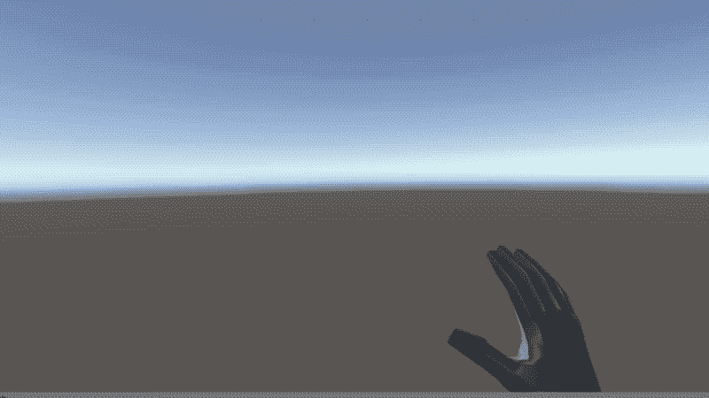
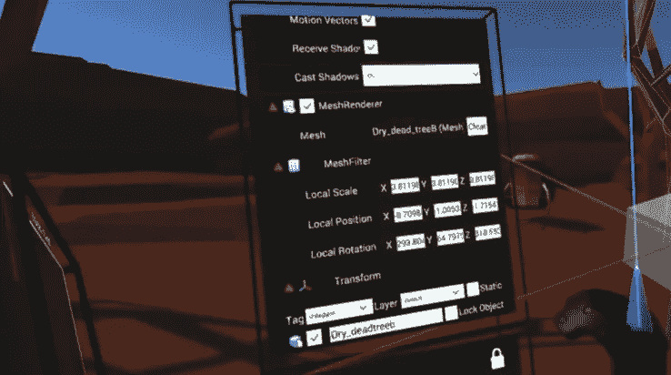
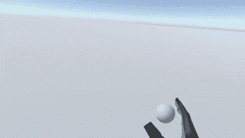
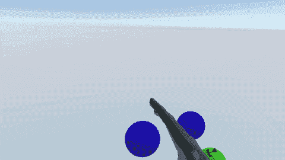
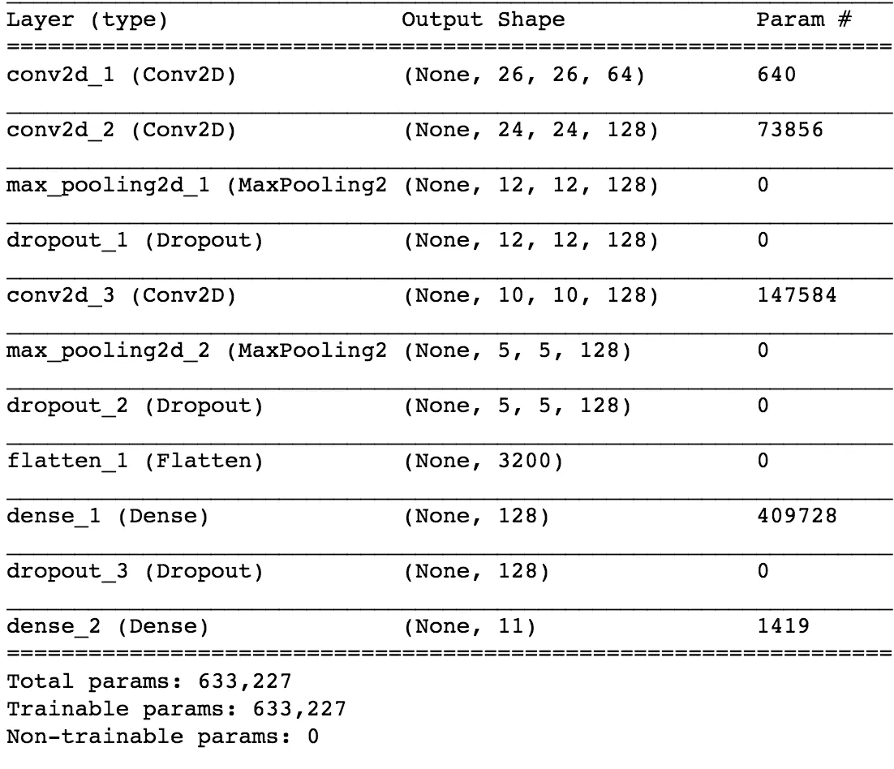
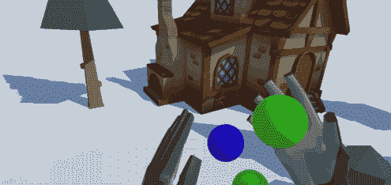
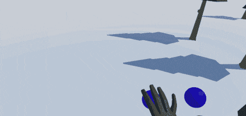
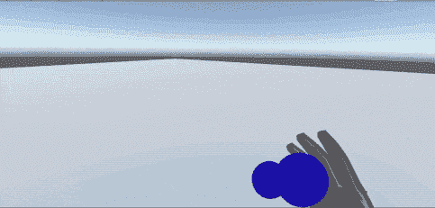

# 神经网络+虚拟现实=魔术！

> 原文：<https://medium.com/hackernoon/neural-nets-vr-magic-3b066538aa5d>

A gif demonstrating how a Convolutional Neural Network can be used for a VR level editor type interface.

说真的…就像哈利波特。

TLDR；视频[这里](https://www.youtube.com/watch?v=50ohFOo1wzM&feature=youtu.be)。

不久前，我写了我在[的第一篇博文](/towards-data-science/neural-networks-and-the-future-of-3d-procedural-content-generation-a2132487d44a)，是关于人工智能、创造力和 3D 内容生成的交集。这篇博文是那个系列的延续。

我梦想中的 VR 应用最终是我想象力的无缝延伸。当然，这是一个崇高的目标，但我的直觉是，[机器学习](https://hackernoon.com/tagged/machine-learning)技术可以帮助这个想法成为现实。

具体来说，这篇博客探索了卷积神经网络的使用，以极大地改变虚拟现实中的交互设计。

## **在 VR 中设计 VR**

任何设计过虚拟现实应用程序的人都会告诉你，在传统的 2D 媒介中工作只能让你到此为止。为了制作 VR，你需要置身于 VR 之中。

但是，既然 VR 是这样的新媒介，那么支持 VR 创作的行业也是新的。像 Unity 和 Epic 这样的公司正在创建 VR 级别的编辑器，但是他们最终感觉就像 VR 桌面一样，菜单在菜单之上，这是 2D 媒体的设计原则。

A demonstration of a VR editor.

对我来说，实时创建 VR 环境的过程需要快速且毫不费力。但是我们如何在不使用 2D 菜单的情况下创建这样一个系统呢？

如果我们能画出我们想要的东西呢？如果系统可以理解我需要什么，而不是在一系列选项中导航，会怎么样？

## 进入机器学习

如果你想一想，通过进入虚拟现实环境，你在该环境中所做的一切都被转化为数据。你看的每一样东西，你手臂的每一次抽动，你采取的每一个行动都有可能被记录下来。

抛开反乌托邦式的赛博朋克分支不谈，从人工智能的角度来看，这是非常令人信服的，因为任何人工智能模型都需要大量高质量的数据。出于这篇博客的目的，我们将看看卷积神经网络(CNN)如何用于手势识别，以取代当前的 2D 菜单设计原则。

CNN 在识别具有任何空间关系的数据(如图像)方面有着非凡的能力。如果我们可以利用这种能力来创建界面，找出你想要的是什么呢？。例如，与其从一长串物品中挑选一个道具，不如我把它画出来怎么样？

我肯定不是第一个想到这个的人。我本质上说的是虚拟现实中的谷歌[快速绘制](https://quickdraw.withgoogle.com/)或[自动绘制](https://www.autodraw.com/)。事实上，像 Adobe 这样的公司已经在他们的产品中探索这种类型的效果。看看这个最近的[项目演示。虽然我不确定这些实现是使用 CNN 还是其他什么，但功能上是一样的。](https://www.youtube.com/watch?v=Fqf7wTFS208&feature=youtu.be&t=1m57s)

# 我的第一个模特

作为第一步，我从[快速绘制数据集](https://github.com/googlecreativelab/quickdraw-dataset)中提取了三个类，并用它们来训练一个简单的 CNN。对于架构，我举了一个基本的 MNIST 例子，因为 MNIST 和 Quickdraw 的数据非常相似。

Drawing a circle creates a sphere, while drawing a triangle creates a cube. For those that are detail oriented, I’m sorry, drawing a triangle on a trackpad is much easier than drawing a square :(

作为概念验证，我从我的 MacBook Pro 上的 2D 界面开始。网络[在圆形、正方形和三角形上训练。其思想是，当用户绘制形状时，相关联的形状将在 3D 中被实例化。](https://hackernoon.com/tagged/network)

知道了基本原理起作用，是时候把整个事情带入 VR 了！

我决定使用 Leap Motion，因为我想让互动感觉自然、轻松。虽然 leap motion 的跟踪不像 Vive 控制器那样精确，但我发现一旦我解释了 leap 的跟踪怪癖，交互就变得非常流畅。

A simple model with classes for “tree”, “bush”, and “flower”

这真是太酷了，它的效果令人惊讶。但这是我的假设遇到的第一个问题。

绘画是一种非常无摩擦的互动，然而这只是你第一次这么做。例如，想象一下必须为虚拟森林中的每棵树绘制一幅树的草图。需要一些额外的 UI 思考。

如果我不画一棵树，而是画一个正方形呢？换句话说，如果我将每个对象映射到一个原始形状会怎么样？

“Circle” = “Bush”, “Square” = “Tree”, “Triangle” = “Flower”

这使得交互更容易、更快捷，并且非常令人满意。然而，很容易想象如何快速用完原始形状。也许你可以用数字，但是我们已经脱离了毫不费力地创造一个 3D 物体的想法。如果你必须记住一个任意的映射，那就太难了。

我的下一步是分离绘图和放置机械。通过点击与我手腕对齐的不同球体来切换模式。我的手上方是一个图标，指示我当前选择了哪个对象。这让我可以快速直观地选择一个新对象，并快速轻松地放置它。

Switching things up with a very hacky interface. Here you can see drawing and placement as two separate interaction modes.

是时候真正深入 CNN，开始制作一个可以使用更多类的定制模型了。由于我还是一个 ML 新手，所以我使用了 11 个类的相对较小的数据集。手动摆弄了一两天架构后，我偶然发现了 [Hyperas](https://github.com/maxpumperla/hyperas) ，这是一个可以帮助我自动化架构优化的库。我使用的最后一个模型是这样的:

这使得评估集的准确率超过 95%。现在我有了更多的类，这意味着我可以神奇地从稀薄的空气中取出更多的物体。然而，由于 Quick Draw 中的类看起来是任意的，我只能选择一个相当随机的模型。

This place could use a house!

and some chairs!

we definitely need a pirate ship (sailboat)!

These kids aren’t going to drive themselves to school!

How about some flying lessons?

要获得更流畅的视图，请查看 youtube 上的屏幕截图:

# 结论

凭空画出物体的体验还是挺神奇的。但是有用吗？

老实说，在目前只有几个职业的形式下，没有。

是的，它更直观，但并不比标准但设计良好的菜单系统更快。这个系统需要的是一个更大的模型，可以识别大约 1000 个类。不幸的是，那有点超出我的能力范围。

从 1000 个对象中任意画出一个对象的能力确实比在标准菜单系统中找到相同的对象要快。然而，在这一点上，你可以只使用语音命令，如“房子”，也许这将更加直观。

基于绘图的系统成为粒度由简单视觉特征定义的对象的最佳解决方案。也许画一朵蒲公英或向日葵比语音识别系统处理“蒲公英”或“向日葵”的音频更容易、更快捷。或者甚至是一个大而复杂的模型，它有像 20 种花这样的粒度级。也许你不记得什么东西的名字了？或者，如果您在繁忙的办公室环境中，音频样本变得过于嘈杂，该怎么办？画实物 vs 只说文字感觉很好。也许两者的结合效果最好？

无论如何，虽然这个原型没有取代菜单系统，但我认为它成功地展示了机器学习在创造性的 VR 环境或 VR UI 环境中的力量。

3D 环境允许我们发展过去基于桌面的设计，机器学习无疑是用户交互的强大工具。在接下来的几篇博文中，我将探索虚拟现实中 creative ML 的其他可能更强大的实现。

*👋🏾了解塑造我们日常使用产品的人和想法。* [***订阅值得关注的***](https://usejournal.typeform.com/to/YDVRgX?utm_source=usejournal.com&utm_medium=blog&utm_content=sam_sinder-heald&utm_campaign=guest_post) *—产品&设计简讯由* [*期刊*](https://usejournal.com/?/utm_source=usejournal.com&utm_medium=blog&utm_content=sam_sinder-heald&utm_campaign=guest_post) *团队撰写。*

