# Javascript 语言学家的神经网络(第一部分——感知器)

> 原文：<https://medium.com/hackernoon/neural-networks-from-scratch-for-javascript-linguists-part1-the-perceptron-632a4d1fbad2>

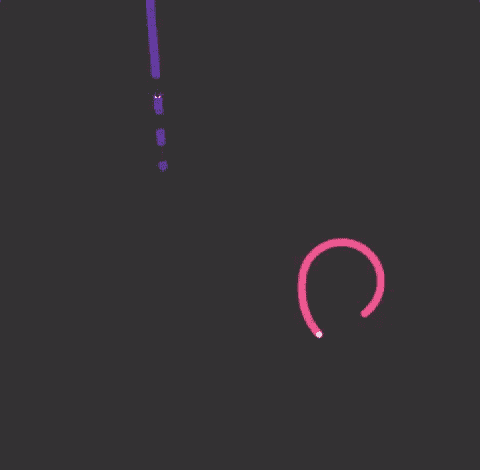

Snakes surviving thanks to machine learning: [here](http://snakeneuralnetwork.herokuapp.com)

在前几个月的过程中，你很有可能听说过神经网络和人工智能，它们似乎可以实现奇迹，从[对你的自拍进行评级](http://karpathy.github.io/2015/10/25/selfie/)到 [SIRI](http://mashable.com/2014/08/18/siri-fails/#hMwSkraMiPqp) 理解你的声音，在国际象棋和[围棋等游戏中击败玩家](http://www.cbc.ca/news/technology/go-google-alphago-lee-sedol-deepmind-1.3488913)，[将一匹马变成斑马](https://twitter.com/goodfellow_ian/status/851124988903997440)或者让你看起来更年轻、更老，或者从另一性别看起来更老。

事实上，这些关键词在很多不同的上下文中被使用了很多次，使得整个“人工智能”词汇领域如此混乱，以至于它充其量只能与“看起来聪明的东西”相关联。

也许是因为困惑，机器学习看起来太复杂，太难掌握，就像“我打赌有太多的数学，这不是我的！!"。

嗯，别担心，我也是，所以让我们开始一段**旅程**，我会告诉你我学到的一切，我的一些误解，如何解释结果，以及一些基本词汇和沿途有趣的事实。

# 我们在谈论什么？

想象一个**盒子**，你在里面刻上一些洞，然后扔进去一个**预定义的** **数量** **的数字，**要么是`0`要么是`1` **。然后盒子剧烈震动，盒子从每个孔中喷出一个数字:`0`或`1`。太好了。**

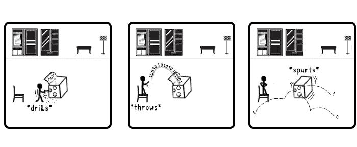

Now what?

最初，你的盒子**笨得要命**，它不会神奇地给你预期的结果，你必须**训练**它才能达到你想要的**目标**。

# 通过历史了解

我最大的错误是试图通过只看冰山一角来理解概念，玩库，当它不起作用时就抓狂。有了神经网络，你真的负担不起。

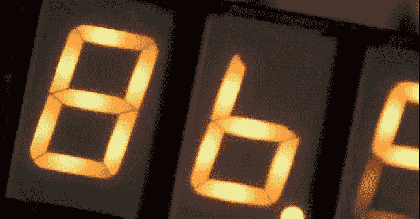

Time to go back

这种奇妙的纸板奶酪的发明起源于 1943 年左右，当时 45 岁的神经生理学家沃伦·斯特吉斯·麦卡洛克和他的同事沃尔特·皮茨写了一篇论文，名为:“[对神经活动](http://www.cs.cmu.edu/~./epxing/Class/10715/reading/McCulloch.and.Pitts.pdf)中固有思想的逻辑演算”。

为了追寻古希腊古典哲学家的探索，他试图用数学方法**模拟大脑的工作方式**。

考虑到我们对神经元的了解有多长时间(大约 1900 年)，以及神经元信号交流的电特性在 20 世纪 50 年代末之前不会被证明，这确实是非常光明的。

让我们在这里花一点时间记住，发表的论文并不意味着写这篇论文的人绝对**正确**，它意味着这个家伙:**有一个假设**，在这个领域知道一点，有某种结果，有时不适用并发表了它。
然后该领域的其他合格人员必须尝试，**复制结果**并决定它是否是一个很好的基础。

当任其发展，玩弄 **p-hacking** 时，一些论文会产生一些异常，就像 2011 年的这篇论文所说的[人们可以在未来看到的](https://www.youtube.com/watch?v=42QuXLucH3Q)。

然而，我们现在知道我们的[麦卡洛克](https://en.wikipedia.org/wiki/Warren_Sturgis_McCulloch)是一个好人，在他的论文中，他试图模仿物理大脑的一些算法，物理大脑由**神经系统**(大多数多细胞动物都有)组成，实际上是一个由**神经元组成的网络。**

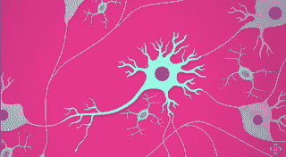

Hoping you won’t lose too many of these reading the following. ([Source](https://www.youtube.com/watch?v=qPix_X-9t7E))

人类大脑有~ 860 亿个这样的家伙，每个都有**轴突**和**树突和突触**，它们将**每个**神经元连接到 **~7000** 其他**。**几乎和宇宙中[个星系](http://www.esa.int/Our_Activities/Space_Science/Herschel/How_many_stars_are_there_in_the_Universe) **一样多的连接。** 既然我们不擅长形象化大数字，下面就来看看如何看待$1B:

Now imagine 86 times that

麦卡洛克的问题是，1943 年的经济环境并不繁荣:我们处于战争中，富兰克林·罗斯福冻结了价格、薪水和工资以防止通货膨胀，尼古拉·特斯拉去世了，当时最好的电脑是 [ENIAC](https://en.wikipedia.org/wiki/ENIAC) ，它价值 700 万美元，售价 [30 吨](http://img04.deviantart.net/73c7/i/2011/249/1/f/your_mom_by_khelsiieexkhaotika-d4943v7.jpg)(科技领域的性别歧视相当猖獗(呃？)当时以及 ENIAC 是 **6 女** 发明的[这个事实导致她们的男同事错误的低估了它)。
作为对比，2005 年的标准三星翻盖手机拥有**1300 倍**的 ENIAC 计算能力**。**](http://blogs.smithsonianmag.com/smartnews/2013/10/computer-programming-used-to-be-womens-work/)

然后在 1958 年，计算机做得稍好一点**、**和**弗兰克·罗森布拉特**，受麦卡洛克的启发，给了我们 [**感知器**](https://en.wikipedia.org/wiki/Perceptron) 。

每个人都乐于深入挖掘，直到 11 年后，马文·明斯基(Marvin Minsky)决定他不喜欢那个想法(T30)，弗兰克·感知器(Frank Perceptron)不适合这份工作，他在出版的一本书中解释说:“(T31)罗森布拉特的大部分著作……没有科学价值……(T32)。”这本书的影响在于，它耗尽了该领域本已很低的资金。

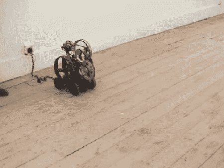

Classic Minsky.

明斯基为什么反对麦卡洛克学徒？

## 线性难题

虽然这听起来像是*生活大爆炸*的剧集标题，但它实际上代表了明斯基理论的基础，以偏离最初的感知机。

Rosenblatt 感知器看起来与我们的盒子非常相似，这次我们在盒子里**钻了一个单孔**:

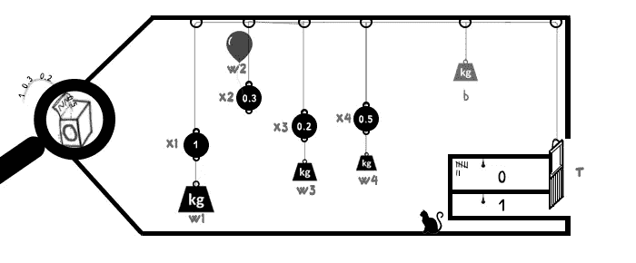

A Neural Network can actually take inputs ***between*** 0 and 1

如果我们的**输入信号(x1…x4)** 乘以它们各自的**权重(w1…w4)** 加上**偏置(b)** 之和足以使**结果**门高于**阈值(T)** ，否则，我们的门将释放值`1`，`0`。

为此，将阈值与 [**激活功能**](https://en.wikipedia.org/wiki/Activation_function) **的结果进行比较。**就像大脑神经元对**刺激**的反应一样。如果刺激太低，神经元就不会沿着轴突向树突发出信号。

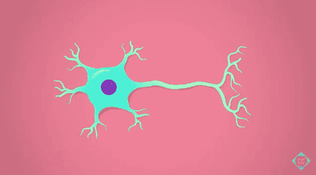

Depolarization of a neuron thanks to the magic of the [sodium-potassium pump](https://www.youtube.com/watch?v=OZG8M_ldA1M)

就代码而言，它在全局看起来是这样的:

```
// Defining the inputs
const x1 = 1;
const x2 = 0.3;
const x3 = 0.2;
const x4 = 0.5;// Defining the weights
const w1 = 1.5;
const w2 = 0.2;
const w3 = 1.1;
const w4 = 1.05; const Threshold = 1;
const bias = 0.3;// The value evaluated against the threshold is the sum of the
// inputs multiplied by their weights
// (1*1.5)+(.3*0.2)+(.2*1.1)+(.5*1.05)const sumInputsWeights = x1*w1 + x2*w2 + x3*w3 + x4*w4; // 2.305
const doorWillOpen = activation(sumInputsWeights + bias) > Threshold; // true
```

在人体中，神经元的电关闭状态为-70mV，当达到-55mV 时，其激活阈值为。

在原始感知器的情况下，该激活由 **Heaviside 阶跃函数**处理。

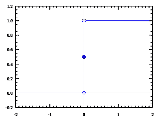

**0** if x is negative, **1** if x is null or positive. x being the sumInputsWeights+bias.

其中最广为人知的激活函数是 **sigmoid 函数:** `**f(x) = 1 / (1 + exp(-x))**` 和 **bias** 一般用于 **shift** **其激活阈值**:

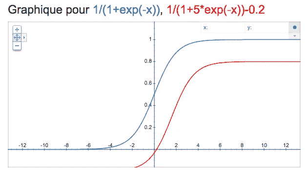

Tweaking the activation function can yield to adjusted results altering when the neuron fires

一些激活函数允许输出负值，一些不允许。当使用一个感知器的激活函数的结果作为另一个感知器的输入时，这将证明它是重要的。

使用`0`作为输入总是抑制其相关权重，导致其连接在总和中不存在。

因此，它的作用就像是一张弃权票，而不是有降低权重的可能性。然而，有时我们可能希望`0`作为一个输入，是对相反候选人的投票。


Many other activations functions [exist](https://en.wikipedia.org/wiki/Activation_function)

感知器被称为**二元分类器**意思是它只能在 **2** **选项之间进行分类(**垃圾邮件对非垃圾邮件，橙子对非橙子…等等)

它也被称为 [**线性分类器**](https://en.wikipedia.org/wiki/Linear_classifier) 意为它的目标是**根据一个对象的**特征**(或“特征”:我们的 **x1 到 x4**)**来识别该对象属于**的哪一类，通过迭代直到它找到**一条单独的线**来正确地将**与**实体从每一个中分离开来**

**给定一些输入，我们给我们的分类器一些预期结果的例子，它将**训练自己**找到这种分离，通过调整**权重**分配给每个输入和它的**偏差**。**

**作为一个例子，让我们根据两个特征将一些实体分类在“**友好或不友好**”之间:使用感知器的**牙齿**和**大小****

**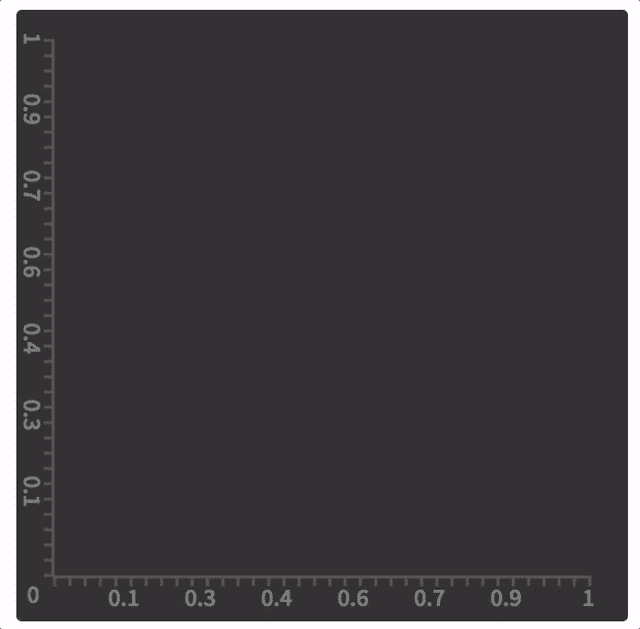**

**Depending on the sources the cat seems very borderline indeed**

**现在我们训练了我们的感知机，我们可以预测以前从未见过的样本:**

***[***这里的***](https://rosenblattperceptron.herokuapp.com) ***为现场直播*** [***演示******。不，说真的，检查一下。***](https://rosenblattperceptron.herokuapp.com)***

***明斯基对罗森布拉特的指责是这样的:如果我的训练器械中突然多了一条**巨蛇**，它几乎没有牙齿，但却和大象一样大。***

***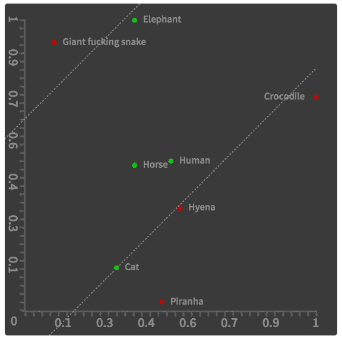***

***The training set is not separable by one line anymore***

***现在需要 **2** 条线来正确区分红色实体和绿色实体。使用单个感知器，这种不可能性将导致感知器尝试并永远运行，无法用**单直线** **线**进行分类。***

***到现在为止，你应该能够处理感知器的通常表示:***

***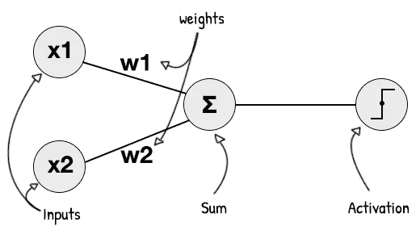***

***The bias can be applied either after the sum or as an added weight for a fictional input being always 1***

## ***解决双线性问题:***

***解决这个问题的一个方法是简单地训练两个感知器，一个负责左上分离，另一个负责右下分离，我们**用一个**和**规则把它们**插在一起，创建某种 [**多类感知器**](https://en.wikipedia.org/wiki/Perceptron#Multiclass_perceptron) 。***

```
*const p1 = new Perceptron();
p1.train(trainingSetTopLeft);
p1.learn(); // P1 ready.const p2 = new Perceptron();
p2.train(trainingSetBottomRight);
p2.learn(); // P2 ready.const inputs = [x1,x2];const result = p1.predict(inputs) & p2.predict(inputs);*
```

***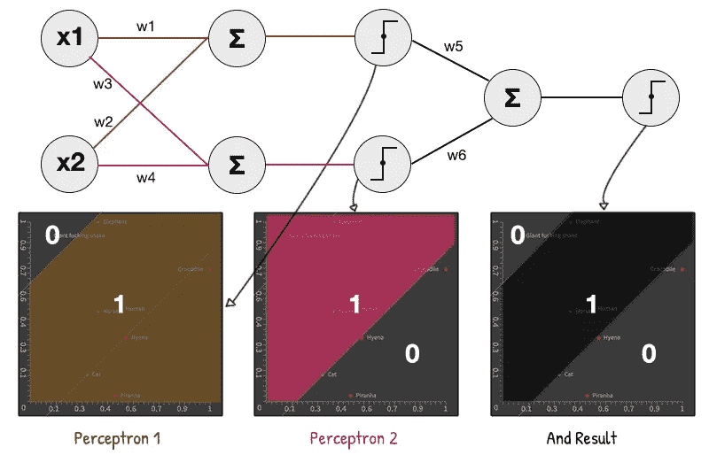***

***There are other ways to solve this that we’ll explore in part 2***

***“与”运算又名“A^B”是感知器可以执行的逻辑运算的一部分，通过将 **w5** 和 **w6** 置于`0.6`附近，并对我们的和应用偏差`-1`，我们确实创建了一个“与”预测器。
记住与 w5 和 w6 相连的输入来自 Heaviside 阶跃函数的激活，仅产生`0`或`1`作为输出。***

```
*For 0 & 0 : (0*0.6 + 0*0.6)-1 is <0, Output: 0
For 0 & 1 : (0*0.6 + 1*0.6)-1 is <0, Output: 0
For 1 & 1 : (1*0.6 + 1*0.6)-1 is >0, Output: 1*
```

***通过这种链接和“拉长”我们的原始感知机，我们创造了所谓的**隐藏层，**基本上是一些神经元插在原始输入和最终输出之间。***

***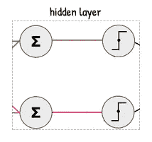***

***They should really be called “[feature detectors layers](https://www.cs.cmu.edu/~dst/pubs/byte-hiddenlayer-1989.pdf)” or “sub problem layers”***

***最糟糕的是**明斯基知道这一切**仍然决定专注于最简单版本的感知机来唾弃罗森布拉特的所有工作。罗森布拉特早在 1962 年就已经在他自己的书*神经动力学原理:感知器和大脑机制理论*中介绍了多层&交叉耦合感知器。***

***这有点像出版一本名为*晶体管的书，*表示其中单个一文不值，从不承认计算机。***

## ***但是感知器线从何而来？***

***下面这些方程你们应该都很熟悉:`y=f(x)
y = mx + c`或者`y = ax + b`。那么我们如何从我们训练过的感知机中找到这个`m`和`c`？***

***为了解决这个问题，我们必须记住我们感知机的原始方程:`x1*w1 + x2*w2 + bias > T`***

***偏差和阈值是[相同的概念](http://stackoverflow.com/questions/16609310/in-neural-networks-does-a-bias-change-the-threshold-of-an-activation-function)，对于感知器`T = 0`来说，这意味着等式变成了`x1*w1 +x2*w2 > -bias`，可以改写为:
`x2 > (-w1/w2)*x1 + (-bias/w2)`将此与:
`y = m*x + b`进行比较，我们可以看到***

***`y`代表`x2
x`代表`x1
m`代表`(-w1/w2)`，而`b`代表`(-bias/w2)`***

***也就是说我们线的**坡度(m)** 由 2 个权值决定，线与垂直轴相交的**位置由偏差和第 2 个权值决定。*****

***我们现在可以简单地选择两个`x`值(0 和 1)，在线方程中替换它们并找到相应的`y`值，然后在两点之间画一条线。`(0;f(0))`和`(1;f(1))`。***

***就像一个好的犯罪现场一样，使用等式可以让我们进行一些观察:***

```
*y = (-w1/w2)x + (-bias/w2)*
```

***线的**坡度(陡度)**仅取决于两个权重
`w1`前面的**减**符号意味着如果两个权重符号相同，线将像`\`一样向下倾斜，如果它们完全不同，线将向上倾斜`/` 调整 **w1** 将影响陡度，但不影响它与垂直轴相交的位置， **w2 而不是**将对**和** 都有影响，因为**偏差是分子**(分数的上半部分)，增加它将把线推到图中更高的位置。 (将在更高的点切割垂直轴)***

***您可以通过输入`app.perceptron.weights`在[演示](https://rosenblattperceptron.herokuapp.com)的控制台中检查最终重量***

***这正是我们的感知机试图优化的，直到它找到正确的线***

***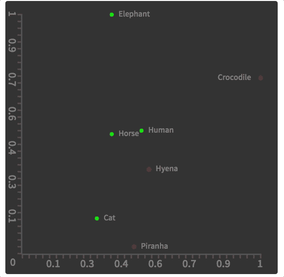***

***I know it might look like 2 lines but it’s really one moving super fast***

## ***你说的“优化”是什么意思？***

***正如你所猜测的，我们的感知器不能盲目地猜测和尝试它的权重的每个值，直到它找到一条正确分隔实体的线。我们要应用的是 [**德尔塔法则**](https://en.wikipedia.org/wiki/Delta_rule) **。*****

***这是一个学习规则，用于更新与单层神经网络中的输入相关联的权重，表示如下:***

***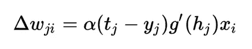***

***Oh god math!***

***别担心，它可以这样“简化”:***

***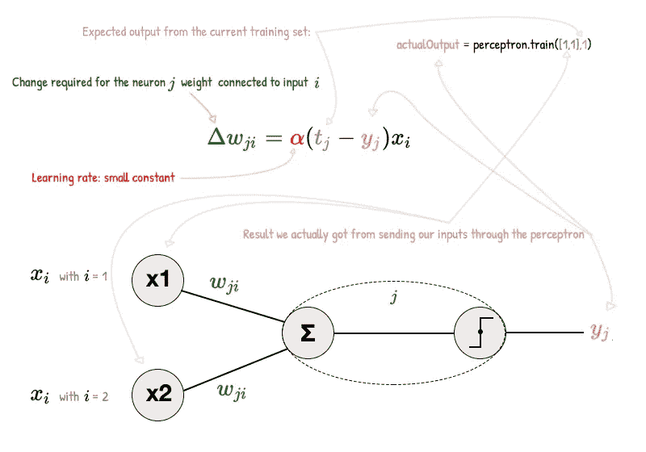***

***We do this for every item in the training set.***

***做`expected — actual`代表一个**误差**值(或成本)。目标是遍历训练集，并通过在每个输入的权重上增加或减去少量的值，将这种误差/成本降低到最小，直到它验证了所有的训练集预期。***

***如果在一些迭代之后，对于训练集中的每个项目，误差**为`**0**` 。我们的感知器被训练，使用这些最终权重的线方程正确地分成两部分。*****

## ***当心学习速度***

***在上面的等式中， **α** 代表一个常数:学习率，它将对每个权重的改变量产生影响。***

***如果 **α** 太小，将需要**比需要**更多的迭代来找到正确的权重，你可能会陷入局部最小值。
如果 **α** 太大**学习可能**永远找不到**一些正确的权重。*****

***一种理解方式是想象一个穿着金属靴的可怜人想要到达悬崖底部的宝藏，但是他只能通过跳跃米来移动:***

***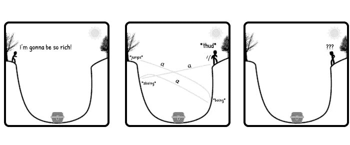***

*****α** too big***

***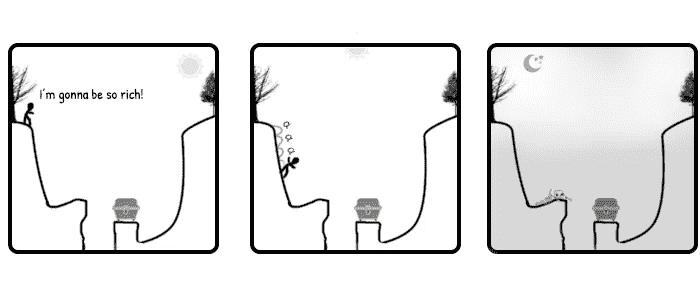***

*****α** too small***

***当你在维基百科上阅读一篇文章时，你可能想做的一件事是前往“ *Talk* ”部分，该部分讨论了内容中有争议的领域。***

***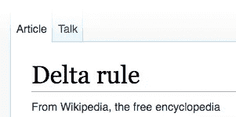***

***在德尔塔公式的情况下，*内容*说它不能应用于感知器，因为亥维赛导数在`0`不存在，但是*谈话部分*提供了麻省理工学院教师使用它的文章。***

***通过把我们学到的所有东西放进去，我们最终编码了一个感知机:***

***Can’t be used as is. Actual code [here](https://github.com/Elyx0/rosenblattperceptronjs/blob/master/src/Perceptron.js)***

***此外，感知器属于**前馈神经网络**类别，这只是一种花哨的措辞，表示单元之间的连接不形成循环。***

***为了对 Minsky 宽容一些，虽然感知器算法在线性可分离训练集的情况下保证收敛于*某个*解，但是它仍然可以挑选*任何有效的*解，并且一些问题可能允许许多不同质量的解。***

***一旦你的大脑找到了与肌肉对话的正确方式(即:肌肉做出正确的反应)，它就会满足于此。这个大脑到肌肉的代码每个人都不一样！***

***知识分子喜欢像明克斯和罗森布拉特那样一直争论不休。甚至**爱因斯坦**在[量子不确定论](https://en.wikipedia.org/wiki/Bohr%E2%80%93Einstein_debates)上与**尼尔斯·玻尔**的斗争中也被证明是错误的，他反驳了爱因斯坦的名言:“*上帝不和宇宙*玩骰子”。***

***我们将以神经网络之父我们亲爱的沃伦麦卡洛克的一些诗歌来结束(*他* [*真的*](https://en.wikipedia.org/wiki/Warren_Sturgis_McCulloch#Biography) *是个诗人*)。我希望你学到了一些东西，我们将在第二部分再见。***

> ***我们对世界的认识，包括我们自己，就空间而言是不完整的，就时间而言是不确定的。这种隐含在我们所有人大脑中的无知，是使我们的知识变得有用的抽象的对应物。***

***[](http://bit.ly/HackernoonFB)******[](https://goo.gl/k7XYbx)******[](https://goo.gl/4ofytp)***

> ***[黑客中午](http://bit.ly/Hackernoon)是黑客如何开始他们的下午。我们是 [@AMI](http://bit.ly/atAMIatAMI) 家庭的一员。我们现在[接受投稿](http://bit.ly/hackernoonsubmission)，并乐意[讨论广告&赞助](mailto:partners@amipublications.com)机会。***
> 
> ***如果你喜欢这个故事，我们推荐你阅读我们的[最新科技故事](http://bit.ly/hackernoonlatestt)和[趋势科技故事](https://hackernoon.com/trending)。直到下一次，不要把世界的现实想当然！***

******