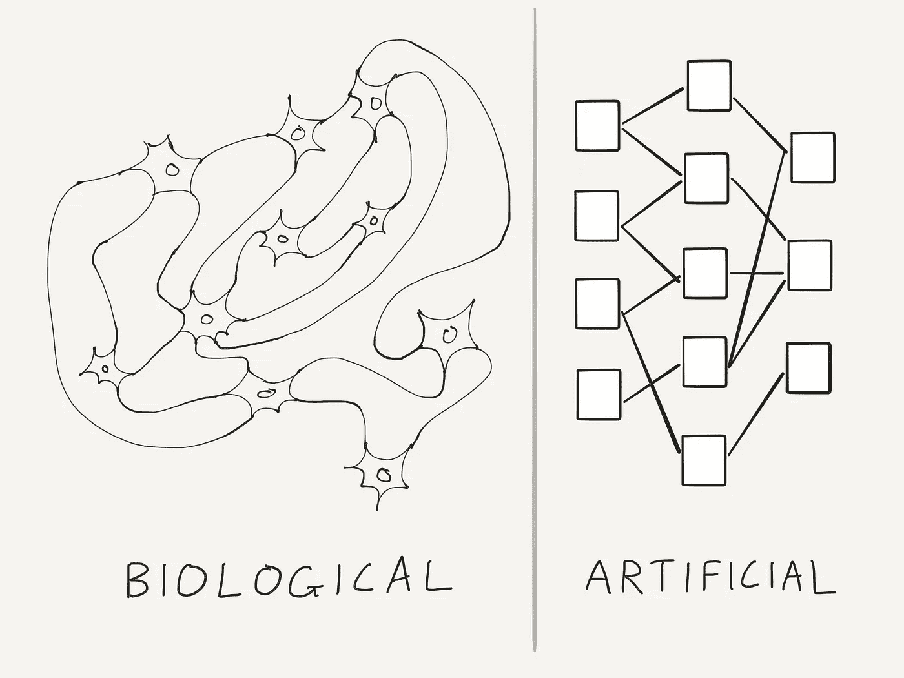
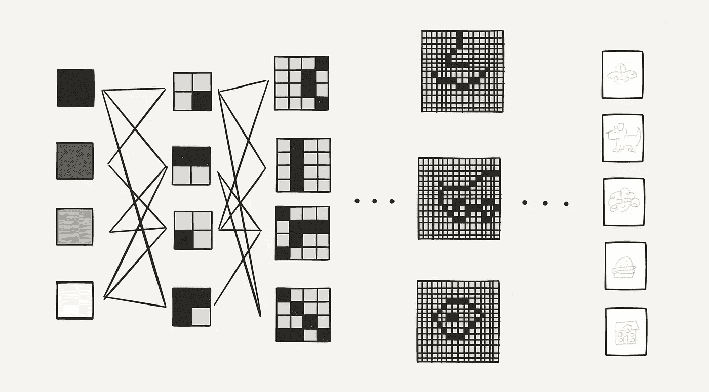

# 神经网络:1 分钟指南

> 原文：<https://medium.com/hackernoon/neural-networks-the-1-minute-guide-a2909507f350>

我们想要建造能够学习智能的系统。

我们所知道的最伟大的学习系统是人脑。它由数十亿个被称为**神经元**的非常简单的细胞组成。我们的智力来自这些神经元之间的复杂连接。

Biological neural networks vs Artificial neural networks

**神经网络**就是以此为模型的。

每一层神经元都学习一些小的东西，并将其传递给下一层。一层一层，网络可以学习非常复杂的东西。

我们连接和排列这些层的确切方式创造了在不同类型的问题上很棒的网络。以下是网络如何识别图像中的对象:

第一层简单地学习识别像素亮度。下一层学习把它们组合成线段。随后的每一层都学习越来越复杂的视觉特征。到了最后一层，网络已经学会识别感兴趣的物体。

神经网络是一种神奇的工具，有许多应用，从**计算机视觉**到**自然语言处理**。