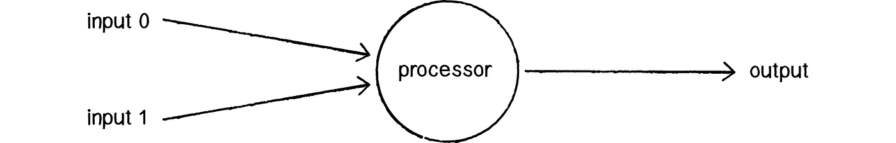
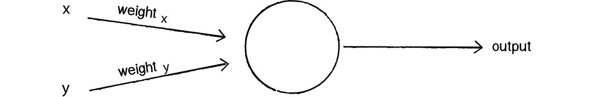

# 无博士学位的神经网络:神经网络的组成部分

> 原文：<https://medium.com/hackernoon/neural-networks-without-a-phd-components-of-a-neural-network-9d98b056995b>

> 神经网络(也称为连接主义系统)是一种计算方法，它基于大量神经单元(也称为人工神经元)的集合，松散地模拟生物大脑解决由轴突连接的大型生物神经元集群问题的方式。— [维基百科](https://en.wikipedia.org/wiki/Artificial_neural_network)

本质上，**神经网络**是其生物对应物的数字表示，虽然这听起来令人生畏——除非你有很强的统计学或认知科学背景——但一旦你理解了神经网络的各个组成部分，神经网络就不会那么复杂。

为了便于说明，让我们看看最简单的神经网络，**感知器**:



感知器是单个神经元的计算模型，正如我们所见，它由 3 个基本神经节点组成，每个节点都有独特的功能:

*   **输入**:也称为传感器，负责与软件或硬件通信，并将信号(数据)传递给神经网络，例如软件情况下的数据源或硬件情况下的网络摄像头。
*   **神经元**:计算的基本单位，它从其他节点(传感器)获取输入，并进行计算和输出。
*   **输出**:也称为执行器，允许我们的神经网络与其环境交互，输出可以是硬件或软件，例如返回真或假值或激活步进电机。

# 层

除了神经元可以有更多层之外，每种节点类型通常都安排在一个层中，为了清楚起见，让我们来看一个更复杂的神经网络类型，一个**前馈神经网络**:


输入和输出层是不言自明的，但是什么是**隐藏层**？

## 隐藏层

隐藏层是一层或多层**人工神经元**的集合，它们负责进行计算，将输入转换成输出层可以使用的东西。为了理解这个隐藏层内部发生了什么，我们需要首先理解涌现的概念:

> 在哲学、系统理论、科学和艺术中，涌现是一种现象，其中较大的实体通过较小或较简单的实体之间的相互作用而出现，使得较大的实体表现出较小/较简单的实体没有表现出的特性。— [维基百科](https://en.wikipedia.org/wiki/Emergence)

每个隐藏层神经元都有一个内部机制，该机制控制神经元是否变得活跃，并向下一层发送自己的信号，该层可以是另一个隐藏层或输出层本身。

如果我们想分解它，我们可以说神经网络接受一个或多个输入，**执行某种计算**并返回一个值——通常以向量的形式——可用于进一步处理。

# 神经元如何做决定

为了理解神经元如何计算输入值并进而做出决策——也就是返回输出——我们需要为我们的神经网络理解增加两个元素。

*   **连接**:每个节点(输入、神经元、输出)之间的独立连接。
*   **连接权重**:每个单独的权重代表节点间连接的强度。另一种思考方式是每个“神经元”对特定输入值的关心程度。

有了这两个新组件，让我们回顾一下我们最初的感知器图:



好了，现在我们已经扩展了关于神经元如何连接的知识，让我们看看它们如何根据输入做出决定。

## 激活功能

每个神经元将采用所有连接的输入及其相应的权重，并应用所谓的激活函数，然后返回单个输出值。

现在，我们可以从这里开始进入神经网络背后的**数学；但正如承诺，但现在我们不会；我们需要知道的是，神经网络可以使用许多常见的激活函数。举几个例子:**

*   阶跃函数
*   乙状结肠的
*   线性的
*   高斯的

在我们的感知器将使用**阶跃函数**的情况下，将返回两个值 **0(关)或 1(开)**中的一个，这意味着我们的神经元将总是一个**二进制值**——也就是说，神经元要么激活，要么不激活，该函数的图形表示如下:


# 把所有的放在一起

让我们快速地把我们所学的东西放在一起，写一个简单的感知器:

这个 python 感知器正在做一些我们还没有涉及到的事情，比如**训练**，以及根据误差调整连接权重。目前，需要理解的唯一重要的事情是，我们的感知器接受 3 个输入，对这些值应用阶跃函数，并尝试预测输出值。

运行感知器将返回如下内容:

```
Training Perceptron for 1000 iterations
Starting weights: [ 0.90185083  0.75965753  0.10658775]
.......................................................
Training completed
Weights after training: [ 0.90185083  0.35965753 -0.49341225]
Running trained Network against Test Data
[0 0 0]: 0.0 -> 0
[0 1 0]: 0.359657525652 -> 1
[1 1 1]: 0.768096100245 -> 1
[0 0 1]: -0.49341225179 -> 0
[1 0 0]: 0.901850826383 -> 1
```

## 结果呢

你能发现神经网络应该预测的模式吗？如果你认为你弄清楚了模式以及我们的感知机做得有多好，请留下评论。

# 摘要

我们在这个系列的第二篇文章中讨论了很多内容，现在我们对神经网络中的单个元素有了更好的理解，接下来我们将讨论 T2 神经网络拓扑或如何组织和连接我们所有的神经元。

*本文原帖* [*在我自己的网站*](http://coderoncode.com/machine-learning/2017/03/26/neural-networks-without-a-phd-part2.html) *。*

[](http://bit.ly/HackernoonFB)[](https://goo.gl/k7XYbx)[](https://goo.gl/4ofytp)

> [黑客中午](http://bit.ly/Hackernoon)是黑客如何开始他们的下午。我们是 AMI 家庭的一员。我们现在[接受投稿](http://bit.ly/hackernoonsubmission)并乐意[讨论广告&赞助](mailto:partners@amipublications.com)机会。
> 
> 如果你喜欢这个故事，我们推荐你阅读我们的[最新科技故事](http://bit.ly/hackernoonlatestt)和[趋势科技故事](https://hackernoon.com/trending)。直到下一次，不要把世界的现实想当然！

