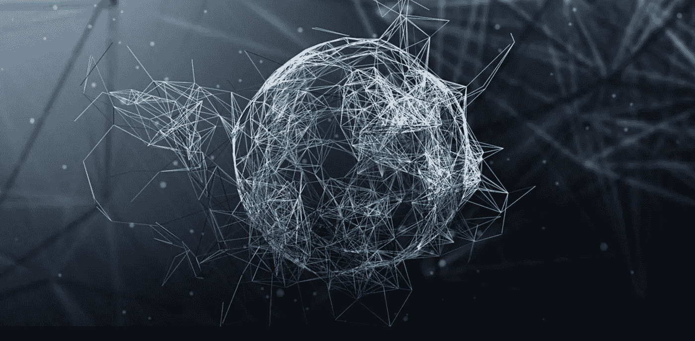

# 无博士学位的神经网络:简介

> 原文：<https://medium.com/hackernoon/neural-networks-without-a-phd-introduction-ae7cce1ef3c>

可以说，目前在软件开发中没有什么比所有新的研究更令人兴奋的了，人工智能的进步，像机器学习、深度学习，当然还有人工神经网络等术语在开发人员的行话中变得更加常见。

Source: Shutterstock

对于人工智能来说，这是一个令人兴奋的时代，这不是没有原因的，因为该技术继续以前所未有的速度发展，并越来越深入我们的日常生活，几乎每周都有更多新颖的应用程序出现在新闻中。

最后一年，我迷上了机器学习和人工智能；我坚信，在你能想象到的几乎每一个市场和领域，人工智能都将极大地影响我们与技术的关系。

人工智能的一个特别的方面引起了我的注意，那就是人工神经网络的发展和应用。就我个人而言，我发现模仿大脑有机过程的概念不仅有趣，而且很有前途；最重要的是，人工神经网络是在过去几年中取得了很大进展的技术之一。

然而，我们还远远没有达到这项技术的民主化，也就是说，进入的门槛仍然相当高——尽管一直在下降。对于许多开发者和爱好者来说，这意味着人工智能的许多方面仍然遥不可及。

如果你像我一样，你是一个潜在的计算机科学背景的软件开发人员，或者是一个拥有多年专业开发经验的自学开发人员；然而，当看着人工智能编程像神经网络一样时，你会感到相当的力不从心，面前似乎有一条不可逾越的知识鸿沟。

## 这个系列

本系列的目标有两个，第一:成为我自己学习人工神经网络所需的基本和重要知识的学习笔记本，第二:使我的笔记可用，并以一种其他面临与我当前相同挑战的开发人员可用的方式进行组织。

我选择关注的主题如下:

*   第 1 部分:导言
*   [第二部分:神经网络的组成](/@allanmacgregor/neural-networks-without-a-phd-components-of-a-neural-network-9d98b056995b#.dvmm0rbbw)
*   [第三部分:拓扑](https://hackernoon.com/neural-networks-without-a-phd-topologies-2e7a199bf18f)
*   第 4 部分:监督学习
*   第 5 部分:无监督学习
*   第 6 部分:梯度下降
*   第 7 部分:反向传播
*   第 8 部分:构建一个简单的神经网络
*   第 9 部分:添加一些偏见

请记住，本系列绝不是对上述每个主题的全面细分，而是以一种有用的方式进行足够的细分，并允许我和你在处理神经网络时应用和处理所述概念，所以不要期望在数学或理论方面有很深的造诣；相反，我在合理的范围内，尽可能地简化数学和理论。

最后，由于我是从一个学生的角度来看这个系列的，没有正式的学术背景，所以有很多不准确和错误的地方，所以如果你发现了，不要犹豫，留下评论或直接联系我。

快乐学习！！

*本文原帖* [*在我自己的网站*](http://coderoncode.com/machine-learning/2017/03/26/neural-networks-without-a-phd-part1.html) *。*

> [黑客中午](http://bit.ly/Hackernoon)是黑客如何开始他们的下午。我们是 [@AMI](http://bit.ly/atAMIatAMI) 家庭的一员。我们现在[接受投稿](http://bit.ly/hackernoonsubmission)并乐意[讨论广告&赞助](mailto:partners@amipublications.com)机会。
> 
> 如果你喜欢这个故事，我们推荐你阅读我们的[最新科技故事](http://bit.ly/hackernoonlatestt)和[趋势科技故事](https://hackernoon.com/trending)。直到下一次，不要把世界的现实想当然！

