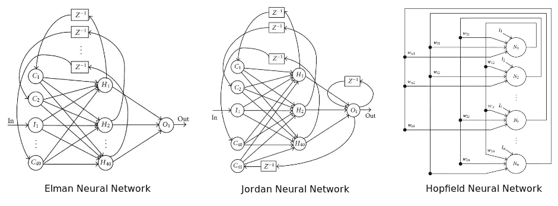

# 没有博士学位的神经网络:拓扑

> 原文：<https://medium.com/hackernoon/neural-networks-without-a-phd-topologies-2e7a199bf18f>

> 神经网络的拓扑是指神经元连接的方式，它是网络功能和学习的重要因素。无监督学习中的常见拓扑是将输入直接映射到表示类别的单元集合(例如，自组织映射)。— [斯普林格](http://link.springer.com/referenceworkentry/10.1007%2F978-0-387-30164-8_837)

在我们之前的帖子中，我们了解了构成神经网络的组件:

*   输入节点
*   神经元
*   输出节点

并且这些元素将被组织在以下层中:

*   输入层
*   隐藏层
*   输出层

然而，仍然不太清楚组织和连接这些神经网络的过程是什么；我们如何确定需要创建多少隐藏层？我们如何将这些神经元连接到输入、输出以及彼此之间？我们如何知道我们需要创建多少输出节点？

## 如何组织我们的神经网络

我们需要的是一种方法来表示神经元如何连接以形成网络，一种**神经网络拓扑**。神经网络的拓扑在它的功能和性能中起着重要的作用。

需要注意的重要一点是，**多种拓扑**可以用来学习同一组数据，它们甚至可能产生相似的结果；因此，对于单个神经网络来说，不存在“最佳”拓扑；也就是说，拓扑结构会极大地影响神经网络学习数据所需的时间以及对新数据进行分类时的准确性。

拓扑选择的一种方法是简单地使其成为一个试错过程，其中我们通过修改诸如**隐藏层**、**节点之间的连接、**等的数量来手动调整神经网络。采用这种方法会极大地限制我们，因为即使对于一个简单的神经网络来说也有许多可能的排列。更复杂的是，神经网络并不局限于我们之前见过的相对简单的**前馈**布局，仅举几个例子:

*   前馈
*   复发的
*   长短期记忆
*   约旦
*   埃尔曼
*   霍普菲尔德

因此，除了非常简单的应用、已知问题或学习练习**之外，手动拓扑选择**并不可行，为了找到理想的拓扑，我们必须让我们的神经网络也从训练数据中学习拓扑。目标是为我们的神经网络找到一种拓扑结构，使新数据的误差最小化。*

实现这一目标的最新颖的方法之一是使用遗传编程。

## 遗传编程和神经进化

遗传算法基于**自然选择**、**变异**、**适者生存**的进化原理；遗传算法将通过生成大量潜在解决方案并找到具有最佳**适应值**的解决方案来解决特定问题。

无需深入研究，一个**适应值**是一种测量解决方案与已知结果或预期指标接近程度的方法；在神经网络的情况下，我们有训练数据可以用作参考点。

遗传算法将一代又一代地调整和变异我们的神经网络，直到达到期望的适应度分数，或者直到我们达到最大迭代次数。

**免责声明:以上是对遗传算法如何工作的过于简化的描述**

我强烈推荐,[Erlang 的《神经进化手册》](https://link.springer.com/book/10.1007/978-1-4614-4463-3),即使你对 Erlang 不感兴趣，该书作者在分解概念和介绍遗传算法方面做得非常好。

# 摘要

重要的是，我们要理解拓扑结构，也就是我们神经网络的**层数以及它们是如何连接的**如何影响它们的有效性；有许多现有类型的人工神经网络，其中一些最适合特定的应用任务，熟悉最常见的类型是很重要的。

此外，为了找到最佳拓扑，可以使用**遗传算法**来尝试为给定的应用开发**“完美的”**拓扑。

还有很多要学的和要做的，但是如果你发现任何事实错误或者你认为有些事情需要更多的澄清，请随意留下评论。

*本文原帖* [*在我自己的网站*](http://coderoncode.com/machine-learning/2017/04/16/neural-networks-without-a-phd-part3.html) *。*

> [黑客中午](http://bit.ly/Hackernoon)是黑客如何开始他们的下午。我们是 [@AMI](http://bit.ly/atAMIatAMI) 家庭的一员。我们现在[接受投稿](http://bit.ly/hackernoonsubmission)，并乐意[讨论广告&赞助](mailto:partners@amipublications.com)机会。
> 
> 如果你喜欢这个故事，我们推荐你阅读我们的[最新科技故事](http://bit.ly/hackernoonlatestt)和[趋势科技故事](https://hackernoon.com/trending)。直到下一次，不要把世界的现实想当然！

