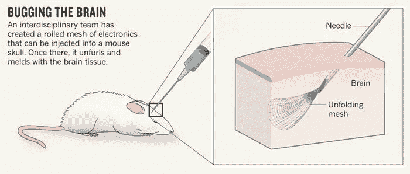

# Neuralink 正在构建我们这个时代最具隐私侵犯性的技术

> 原文：<https://medium.com/hackernoon/neuralink-is-building-the-most-privacy-invasive-technology-of-our-time-3edf51ce448c>

由埃隆·马斯克资助的初创公司 Neuralink 正在开发神经鞋带。神经系带是一种允许人脑和计算机直接连接的装置。这个设备有可能成为我们这个时代最具隐私侵犯性的技术。另一方面，埃隆·马斯克(Elon musk)对人工智能的潜在破坏力的立场越来越强硬。由于神经花边会增加人类对人工智能的接触，我认为埃隆·马斯克对 Neuralink 的投资非常伪君子。

对于那些没有读过这方面内容的人来说:神经系带是一种非常微小的聚合物网，可以通过动脉系统注射。随着血液流向大脑，网状物会展开并融化到大脑组织中。它也被称为脑机接口(BCI)，因为它允许计算机直接与我们的大脑连接。听起来像一些史诗科幻狗屎，对不对？

There are already experiments involving injecting neural laces in mice.

神经花边的可能性是无限的。埃隆·马斯克本人宣称以下是神经鞋带的短期机会:

1.  **放大人类的输入/输出通道**。目前，我们的眼睛是最大的输入渠道，手/嘴是最大的输出渠道。
2.  帮助人们应对**脑部疾病**(老年痴呆症、帕金森症)

在马斯克 2016 年的推文中，他暗示了共生现象，这是人类和机器之间的一种整合关系。因此，当人类学会与他们的人工智能对手互动时，我提出了一个简短的可能性列表:

1.  瞬间**学会**复杂的概念(理解女人)
2.  **外包**复杂的推理任务(生成搭讪台词)
3.  生成**实时反馈**(“你没看出来她对你有意思吗，傻逼？”)
4.  完美的**助手**(刷你的火绒，总是播放正确的音乐，帮你网购)
5.  重温过去的经历(不要再想你的前任了……)

你，一个聪明的人，可能会对这项新技术犹豫不决，但是这些商业广告确实打动了你:

> “你是不是从班上最好的学生变成了唯一一个没有戴神经带的学生？你一直梦想着硅谷的理想工作吗？获得新的 Neural-Licious 3000，让您的梦想成真。”

你最终得到了一个，什么可能会出错，对不对？

“Get your Neural-Licious 3000 now and get Dating skills level 3 and Instant Python for free!”

你完蛋了。

人类又一次没有把事情想清楚。你可能会把你的神经带视为你和你的专用人工智能之间的直接连接。这可能会给你一种保护感:*“我的人工智能永远不会伤害我”*(试着用一种非常讨厌的美国口音大声说出来)。它可能会有一个很好的名字，专门为你量身定做，但不会有专门的人工智能。

我们都将与一个超级怪物相连。随着接口数量的增加，这个怪物将学会发现数据中无监督的关系，迅速变得更加智能。在某个时候，它将能够:

监视你:它会监视你的耳朵、视觉、动作、行为、感觉，甚至更多。它将生成有史以来最先进的人工分析数据集。目前仅依靠网络或社会行为的数据集就已经价值数十亿，所以这将更有价值。

**强制实施不受欢迎的行为**:你知道当你看广告想喝一杯可口可乐的感觉吗？*《品尝鹅肝》*。你的神经系统也许能够复制这种情绪，成为最先进的广告机器。人类已经非常容易上瘾，因此神经系统可能会轻易地引导我们上瘾。

**屏蔽内容**:如果您正在观看非法内容或下载的电影，连接的计算机屏蔽您的视线可能是合理的。然后也有可能被人挡住，所以你不可能再看到或听到他们。作为惩罚，它甚至可以走得更远，一个人根本不能见人。对不起，伙计们，我从黑镜的白色圣诞节那一集偷了这个想法，我喜欢那一集！

You better be nice to your wife my friend.

即使产品开发人员保证没有什么会变坏，这个世界上总有其他人以破坏我们的生活为生。侵入隐私硬件的黑客行为将是一个巨大的风险。

我知道你们可能都在想:“汤姆，你能不能停止你悲观的话语？”不要误解我的意思，我热爱科技，希望有一天能连接到一台出色的电脑上。但是当你享受这些新玩意的时候，别忘了思考。当涉及到新技术时，我们往往会跳得很深，往往没有意识到它的真正潜力。

或许埃隆·马斯克没有恶意，但是我们怎么能确定呢？我们应该能够拥抱技术，而不必担心后果。这就是为什么创造以人为本的技术和将危险的技术大众化是重要的。在埃隆·马斯克能够证明事实并非如此之前，我仍然非常怀疑。

**感谢您阅读我的文章。**👏如果你喜欢我的文章，请鼓掌。 [**这里是一个关于赢家通吃的市场**](/the-thinking-paradox/https-medium-com-the-thinking-paradox-will-we-be-enslaved-by-tech-giants-6b2019ba6153) **。随时与我联系，我随时欢迎讨论！**