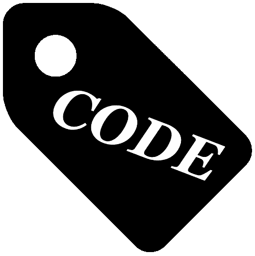
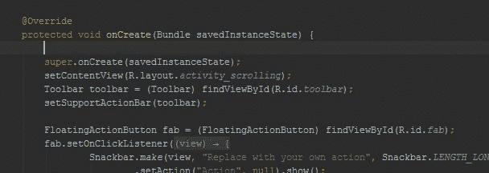

# 在编码之前、之后和期间，永远不要忘记任何事情

> 原文：<https://medium.com/hackernoon/never-forget-anything-before-after-and-while-coding-98d187ae4cf1>



## 使用“代码标签”注释作为有效的提醒

# 介绍

你好，我叫 Eido，我是一名软件开发人员，我想问你一个问题:

你有没有遇到过这样的时刻，当你有一个**超级愚蠢的想法**你想在编码的时候实现*，而*刚刚跳进你的脑海*？*

你猜怎么着？这也发生在我身上！几率有多大？！

因此，您创建了如下一些不错的注释:

```
// todo implement <**super duper idea**>
```

这篇精彩的评论肯定有几个很好的理由，比如:

*   你不想给它太多的关注。
*   你知道它与你代码的另一部分相关。
*   你假设它应该在另一个时间自己实现。
*   您不希望这些“数据”丢失。

事实是，这种事情发生了，发生了，还会发生在你身上，发生在我身上，发生在所有正在编码的程序员身上，多美好啊！

但是使用这种方法来记住你的超级点子有一些难以捉摸的问题，它们是什么？

*   没有包含这种注释的术语(TODO、FIXME 等。)
*   不可理解的不一致的简短书面评论
*   “我在做什么”的时间浪费在阅读你的代码上，不管是在实际编码之前还是在任何休息时间(比如午餐时间)后。

幸运的是，你来对了地方，而 **codetags** 的概念将解决你那些问题:

*   **从现在开始**使用术语 **codetag** (或者复数 codetag **s** ，你甚至可以对其进行 codetag！不错吧？)无论何时引用任何类型的代码注释。
*   为你节省很多“我在做什么”的时间浪费。
*   永远不要忘记你正在考虑的、想要做的、为进一步实施而保留的、目前正在做的事情等等。

是时候采取行动了，这种评论的概念几乎可以在任何软件项目中找到。

# 你是谁，“代号”？

通过阅读简介，您可能已经理解了，codetag 是:

> 一个广泛使用的特定代码注释标记约定，作为需要仔细检查或评审的代码部分的**提醒**。

我第一次从 Micah Elliott 在 2005 年写的[pep 350-code tags](https://www.python.org/dev/peps/pep-0350/)中读到这个主题。在这篇文章中，我们将为了[生产率](https://hackernoon.com/tagged/productivity)的目的对它进行一点改进。

# 如何使用代码标签？

Codetags 可以用**任何支持注释的** [**编程**](https://hackernoon.com/tagged/programming) **语言**编写。

我已经在 Java 编程语言、XML、JavaScript 和 C#中使用它们一段时间了。

我还发现它们在同时处理多个项目时很有用(不要问我为什么，但它发生了)，当我用它们来提醒我几天后回到一个项目时我想做什么(使用助记法)。

## 如何不写代码标签

```
// fixme <incomprehensible short summary of tech important note>
```

上述代码标签中的一个问题是“数据”丢失——当您阅读一个写得不够准确的代码标签时，下面的问题开始出现:

作者*到底是什么意思*？*谁*有这个古怪的想法？看在上帝的份上，这里放了多少钱？

这些问题可能真的很关键，因为这个“codetag”的*作者*可能是这个类在*早期阶段的开发者，*和*他的意思是*他认为这个类的开发者应该通过代码编写一个特定技术的重要实现，以防止将来最有可能出现的减速，但他没有时间这样做，而且当时也没有减速，所以他继续，也许转移到另一个项目，这部分就不做了。

如何才能避免这种难以捉摸的“数据”丢失？

## 如何编写代码标签

*   编写代码标签时，就好像你是写给一个根本不知道你在写什么的人，即使你是写给自己的。
*   使用 codetag 格式作为下面的代码部分(以您使用的编程语言注释字符开始这些行):

```
<CODETAG MNEMONIC>: <Codetag subject>
<Optional codetag multi-line message>
<(date)> <Author>
```

下面是一个代码标签的例子，它遵循了上面写的规则:

```
/*
 * *TODO: Change client request from this server*
 * The login will happen automatically when the service starts up.
 * A get service status will be called.
 * The methods that he calls will use server responses cache.
 * (23/01/2017) Aurobindo Boghos */
```

你可能会问自己“为什么我要写那些行，浪费我的时间，而不是继续朝着我的目标更快地编码？”

这个问题的答案分为两部分:

1.  通过坚持这种格式，其他队友和你可以很容易地快速阅读和理解它，而不用浪费任何时间试图弄清楚发生了什么以及“诗人”的意图是什么。
2.  您没有浪费时间——您可以避免输出*可变文本*(如助记符、日期、作者和优先级)的时间，这些文本可以通过使用自定义**代码片段来编写脚本。**



Quickly writing well-formatted codetag in Android Studio IDE using Live Templates feature

## 记忆术及其目的

在 [PEP350 —代码标签—助记符](https://www.python.org/dev/peps/pep-0350/#mnemonics)中提到了许多助记符，我发现对我最有用的助记符如下:

```
TODO - something that someone need to do someday (not 
necessarily) in the below section of code.DOING - self reminder for what are you currently DOING (not 
necessarily) relate to the below section of code.CONSIDER - reminder to CONSIDER some sort of things (not 
necessarily) about the below section of code.BUG - the below section of code causes BUG.FIXME - the below section of code need to be FIXed.HACK - the below section of code is a workaround.XXX - important note for you and other programmers (not 
necessarily) relate to the below section of code.CLARIFY - very incomprehensible section of code below that you need someone to CLARIFY for you.
```

# **工具**

所以，你写了一些格式良好的代码标签，以节省你的**超级骗子想法**使用片段和你的队友阅读它们时的宝贵时间，你可能会想办法*轻松管理*这些代码标签，这样你和你的队友就更容易组织和导航回它们，看看你有多少代码标签，根据它们的助记符过滤它们等等。

*截至今天*，以下推荐的工具是我所熟悉的，它们将为您提供轻松管理代码标签的解决方案:

*   [im done](https://imdone.io/)——“…像 Trello 一样在看板板上组织你的代码标签。它与 GitHub 问题集成，并利用 TODO.txt 元数据语法……”，支持使用 Markdown 标记语言编写和良好显示代码标签，目前作为 Atom IDE 包提供(感谢* (18/01/2017) Eido */// *CONSIDER: Do we need secret key?*
    // (28/11/2016) Eido<!--
    *DOING: Add a video which constructed from h264 aac*
    priority on 1080p and multi speakers usage.
    (06/11/2016) Eido -->/*
    * *TODO: Change to user friendly message*
    * or remove by being irrelevant for the user.
    * (16/01/2017) Bob */[](http://bit.ly/HackernoonFB)[](https://goo.gl/k7XYbx)[](https://goo.gl/4ofytp)

    > [黑客中午](http://bit.ly/Hackernoon)是黑客如何开始他们的下午。我们是阿美族家庭的一员。我们现在[接受投稿](http://bit.ly/hackernoonsubmission)并乐意[讨论广告&赞助](mailto:partners@amipublications.com)机会。
    > 
    > 如果你喜欢这个故事，我们推荐你阅读我们的[最新科技故事](http://bit.ly/hackernoonlatestt)和[趋势科技故事](https://hackernoon.com/trending)。直到下一次，不要把世界的现实想当然！

    