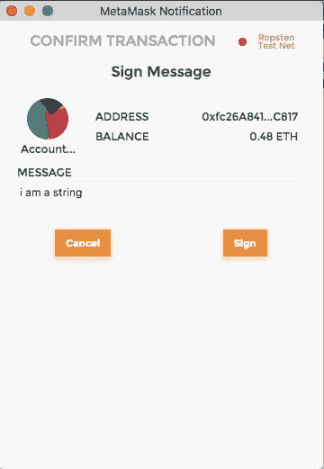

# 永远不要在以太坊和元掩码中使用密码

> 原文：<https://medium.com/hackernoon/never-use-passwords-again-with-ethereum-and-metamask-b61c7e409f0d>


我在 [ConsenSys](https://consensys.net/enterprise/) 为各种客户建立了许多概念证明，通常他们想要利用[以太坊](/@asmiller1989/what-is-ethereum-c82a4b558553)区块链来解决一些业务用例。奇怪的是，这些系统通常被设计成标准的网络登录(即用户名和[密码](https://hackernoon.com/tagged/password))。

我总是问自己为什么要这样设计，毕竟，这是以太坊现在可以解决的每个 web 应用程序的一个恼人的方面。因此，我终于下定决心，设计出了这个解决方案。

# JSON Web 令牌

登录标准 web 系统(和/或使用其 API)的一种非常流行的方式是向身份验证端点提交密码(在客户端经过哈希处理),并接收一个令牌作为回报。这(通常)被称为 JSON Web 令牌，通常在有限的时间内有效(几分钟到几天)。这里的是一个关于标准实现的很好的教程。

JSON Web 令牌很棒，但我认为在区块链上验证自己很容易。其实你在使用以太坊的时候，也是在不断的做。

如果你把一个以太坊地址(它只是你公钥的 sha3 散列)想象成一个网站上的账户，那么通过用你的私钥签署一段数据来证明你拥有那个账户是非常容易的。这些数据是任意的，可以是网站 API 提供的任何随机字符串。因此，我们可以使用地址作为用户名，而不需要密码。事实上，我们甚至不需要使用区块链来做到这一点。

下面是使用 Express 时的样子:

首先，我们需要用私钥做一个椭圆曲线签名:

```
var ethUtil = require(‘ethereumjs-util’);  // >=5.1.1var data = ‘i am a string’;
// Elliptic curve signature must be done on the Keccak256 Sha3 hash of a piece of data.
var message = ethUtil.toBuffer(data);    
var msgHash = ethUtil.hashPersonalMessage(message);    
var sig = ethUtil.ecsign(msgHash, privateKey);    
var serialized = ethUtil.bufferToHex(this.concatSig(sig.v, sig.r, sig.s))    
return serialized
```

现在还不用太担心这些参数是什么。这里有一些加密技术，我鼓励你阅读椭圆曲线签名。比特币维基是一个不错的起点。

无论如何，一旦我们有了我们的签名组件，我们就可以将它们与用户的地址一起打包，并将其全部发送到一个身份验证端点。

**发布/认证**

```
var jwt = require(‘jsonwebtoken’);
var ethUtil = require('ethereumjs-util');function checkSig(req, res) {
  var sig = req.sig;
  var owner = req.owner; // Same data as before
  var data = ‘i am a string’; var message = ethUtil.toBuffer(data)
  var msgHash = ethUtil.hashPersonalMessage(message) // Get the address of whoever signed this message  
  var signature = ethUtil.toBuffer(sig)
  var sigParams = ethUtil.fromRpcSig(signature)
  var publicKey = ethUtil.ecrecover(msgHash, sigParams.v, sigParams.r, sigParams.s)
  var sender = ethUtil.publicToAddress(publicKey)
  var addr = ethUtil.bufferToHex(sender)

  // Determine if it is the same address as 'owner' 
  var match = false;
  if (addr == owner) { match = true; } if (match) {
    // If the signature matches the owner supplied, create a
    // JSON web token for the owner that expires in 24 hours.
    var token = jwt.sign({user: req.body.addr}, ‘i am another string’,  { expiresIn: “1d” });
    res.send(200, { success: 1, token: token })
  } else {
    // If the signature doesn’t match, error out
    res.send(500, { err: ‘Signature did not match.’});
  }}
```

因此，基本上，给定一些数据、地址和 EC 签名的组成部分，我们可以用密码证明该地址属于签署数据的人。很酷吧。

一旦我们对签名和地址匹配感到满意，我们就可以为地址服务器端签署一个 JSON Web 令牌。在这种情况下，令牌的有效期为 1 天。

现在我们只需要放入一些中间件来保护任何提供或修改受保护信息的路由。

**中间件/auth.js**

```
function auth(req, res, next) {
  jwt.verify(req.body.token, ‘i am another string’, function(err, decoded) {
    if (err) { res.send(500, { error: ‘Failed to authenticate token.’}); }
    else {
      req.user = decoded.user;
      next();
    };
  });
}
```

**app.js**

```
// Routes
app.post(‘/UpdateData’, auth, Routes.UpdateData);
…
```

如果提供的令牌对应于发送请求的用户，我们继续请求的路由。注意中间件**修改了请求**。我们需要引用的就是这个新的“用户”参数，因为我们知道它是在我们的中间件中设置的。

**发布/更新数据**

```
function UpdateData(req, res) {
  // Only use the user that was set in req by auth middleware!
  var user = req.user;
  updateYourData(user, req.body.data);
  ...
}
```

我们做到了！您的用户实际上已经*登录*了，但是不需要密码。

# UI 材料

但是用户如何在浏览器中签署这些数据呢？ [Metamask](https://metamask.io/) 来救援了！Metamask 是一个简洁的 chrome 扩展，它将 web3 注入到你的浏览器窗口中。

**mycomponent.jsx**

```
makeSig(dispatch) {

 function toHex(s) {
   var hex = ‘’;
   for(var i=0;i<s.length;i++) { hex += ‘’+s.charCodeAt(i).toString(16); }
   return `0x${hex}`;
 }

 var data = toHex(‘i am a string’);
 web3.currentProvider.sendAsync({ id: 1, method: 'personal_sign', params: [web3.eth.accounts[0], data] },
   function(err, result) {
     let sig = result.result;
     dispatch(exchange.authenticate(sig, user))
    })
  }
}render(){
  let { dispatch, _main: { sig } } = this.props;
  if (Object.keys(sig).length == 0) { this.makeSig(dispatch); }
  return (
   <p>I am a webpage</p>
  );
}
```

这将触发 Metamask 弹出一个窗口，要求用户签署消息:



一旦回调被调用，它将调用以下操作:

```
authenticate(sig, user) {
  return (dispatch) => {
    fetch(`${this.api}/Authenticate`, {
      method: 'POST',
      body: JSON.stringify({ owner: user, sig: sig}),
      headers: { "Content-Type": "application/json" }
    })
    .then((res) => { return res.text(); })
    .then((body) => {
      var token = JSON.parse(body).token;
      dispatch({ type: 'SET_AUTH_TOKEN', result: token})
    })
  }
}
```

一旦在 reducer 中保存了 auth 令牌，就可以调用经过身份验证的端点了。我们做到了！

请注意，`v`、`r`和`s`值必须从签名中恢复。元掩码有一个[签名实用程序模块](https://github.com/MetaMask/eth-sig-util)，它显示了签名是如何构造的。可以这样解构:

```
var solidity_sha3 = require('solidity-sha3').default;let hash = solidity_sha3(data);
let sig = result.result.substr(2, result.result.length);
let r = sig.substr(0, 64);
let s = sig.substr(64, 64);
let v = parseInt(sig.substr(128, 2));
```

其中`r`将被解析为`0`或`1`。还要注意，这使用了 [solidity-sha3 模块](https://github.com/raineorshine/solidity-sha3)来确保这个哈希算法与 solidity 的本地哈希方法使用的是同一个算法(我们正在哈希之前签名的十六进制字符串)。

# 生产就绪

我再怎么强调也不为过，每一个使用 JSON web 令牌的 web 应用程序都可以很容易地利用今天的 T30 和 T31。任何具有元掩码扩展的用户都可以简单地绕过登录屏幕，其安全性可以说比您当前用来管理登录的任何东西都要好。这意味着忘记的密码更少，浪费的时间更少，用户群更快乐。

而且，你知道，如果你想让你的用户在没有中介的情况下互相支付(或者你，或者任何其他使用它的系统上的用户),或者如果你想利用以太坊的数百万其他[功能](https://github.com/ethereum/wiki/wiki),这也能让你做到这一点。

今天就做出改变。[加入](https://www.reddit.com/r/ethereum/)美国以太坊民间，征服世界。

— — — —

*以上作者表达的观点不一定代表 Consensus Systems LLC DBA Consensys 的观点。ConsenSys 是一个分散的社区，ConsenSys Media 是一个供成员自由表达其不同想法和观点的平台。要了解更多关于 ConsenSys 和以太坊的信息，请访问我们的网站。如果你喜欢这个作品，在这里注册*[](http://consensys.us11.list-manage.com/subscribe?u=947c9b18fc27e0b00fc2ad055&id=257df01285)**为我们的每周简讯。**

*[](http://bit.ly/HackernoonFB)**[](https://goo.gl/k7XYbx)**[](https://goo.gl/4ofytp)*

> *[黑客中午](http://bit.ly/Hackernoon)是黑客如何开始他们的下午。我们是 AMI 家庭的一员。我们现在[接受投稿](http://bit.ly/hackernoonsubmission)并乐意[讨论广告&赞助](mailto:partners@amipublications.com)机会。*
> 
> *如果你喜欢这个故事，我们推荐你阅读我们的[最新科技故事](http://bit.ly/hackernoonlatestt)和[趋势科技故事](https://hackernoon.com/trending)。直到下一次，不要把世界的现实想当然！*

**