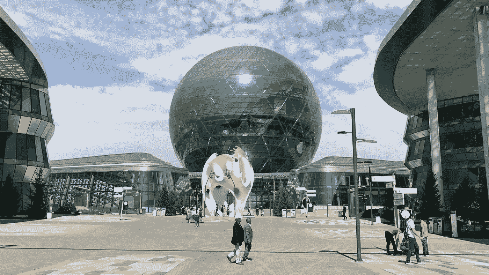
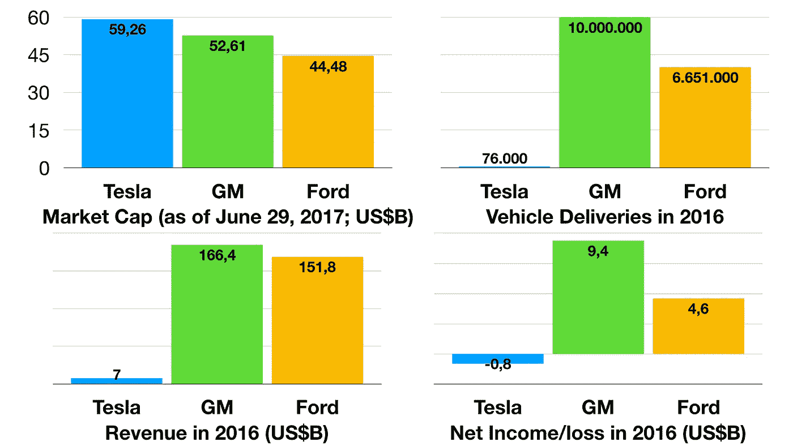
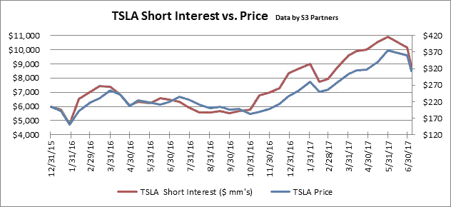
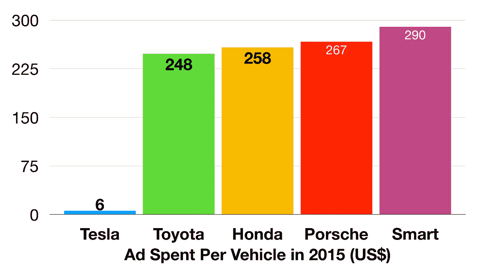
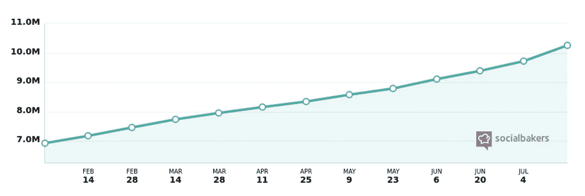

# 新经济、新能源、新领导:来自特斯拉的埃隆·马斯克的教训

> 原文：<https://medium.com/hackernoon/new-economy-new-energy-new-leadership-the-lessons-from-teslas-elon-musk-c14c7eb4444b>

> **打造跑车**
> 
> **用那笔钱造一辆买得起的车**
> 
> **在做上述工作的同时，还提供零排放发电选择**

这是埃隆·马斯克于 2006 年 8 月 2 日发布在特斯拉网站上的总体规划的简短版本。

总体规划的目的是说明看似分离和独立的行动/目标对于启动“可持续能源经济”的发展是多么必要。

**为什么这在 2017 年很重要？**

嗯，六月份我在哈萨克斯坦阿斯塔纳经济论坛上发言。“新能源——新经济”是此次活动的主题。

在论坛期间，来自世界各地的发言者讨论了*可持续经济增长*、*国际贸易和基础设施*、*创新和“绿色经济”*等领域的话题。

同样在阿斯塔纳举行的 2017 年世博会进一步激发了关于“未来能源”的辩论。公众对环境、化石燃料枯竭和全球气候变化影响的日益关注迫使政府、非政府组织和公司采取行动。

辩论主要集中在新能源和可再生能源(例如水电、风能、太阳能)目前如何取代化石燃料，以及如何加快这一进程。

这提出了一个相关但经常被忽视的问题:

我们应该如何组织和资助新经济中的“新能源”?

这个问题很难回答。显然，在一个迄今为止一直由旧的能源技术、政策和公司主导的世界里，新能源技术和项目的融资极具挑战性。

这就是特斯拉(以及埃隆·马斯克)的用武之地。

# 为什么是特斯拉(以及埃隆马斯克)？

这是一个合理的问题。显然，投资者、策略师和分析师对特斯拉的看法不一致。一些人认为这是一个巨大的投资机会。他们指的是如果你在 2010 年 6 月 29 日特斯拉首次公开募股时投资了该公司，你将获得的投资回报。假设你在 2017 年 6 月 29 日仍持有这些股份，你的投资回报率将为 2，022%。

其他人发现特斯拉股价的上涨令人担忧。他们警告说，特斯拉潜在的泡沫正在逼近，因为其巨大的“市场资本总额”和“市场现实”之间似乎存在脱节。例如，*特斯拉*在 2016 年仅交付了 76，000 辆汽车，收入相对较低(与其他汽车公司相比)为 70 亿美元，或许最令人担忧的是，“再次”出现重大净亏损(2016 年为 8 亿美元)。

Source: Statistica and Business Insider

这种脱节导致了两种反应。首先，投资者表达了他们的担忧，并试图通过敦促特斯拉改变其治理结构和做法来防止泡沫破裂。特别是，他们坚持在*特斯拉的*董事会中增加两名新的独立董事。

其次，投资者开始做空*特斯拉的*股票。这是目前华尔街卖空最严重的股票之一。

Source: [https://www.s3partners.net](https://www.s3partners.net)

最近，由于围绕*特斯拉*的负面浪潮，这一策略开始奏效。例如，当交付数量低于预期(由于无法生产足够的 100 千瓦时电池组)以及*特斯拉* Model S 在车辆安全测试中仅被评为“可接受”时，股票暴跌。

对竞争日益加剧和激烈的担忧(在*沃尔沃*宣布将专注于电动汽车并于 2017 年 5 月停止开发柴油发动机后)加剧了投资者的悲观情绪。

这令人惊讶。随着电动汽车在未来十年左右取代燃气汽车，埃隆·马斯克的公司拥有了一个有竞争力的品牌。

甚至*沃尔沃的*首席执行官哈坎·萨缪尔森也承认*特斯拉在创造全电动汽车需求方面的*成就(尽管许多人反对:最明显的是经销商——更少的维护——以及在改进柴油和其他内燃机方面投入大量资金的汽车制造商):

> “我们必须承认，特斯拉已经设法提供了这样一款人们正在排队购买的汽车。”

然而，*特斯拉最大的创新并不是生产电动汽车，而是围绕消费者、投资者、竞争对手、供应商、创新者和其他利益相关者建立和培养一个“开放和包容的生态系统”的成功。*

在做出这一声明时，我不想争辩说特斯拉的市值应该超过其收入的八倍。但其开放和包容的生态系统可以解释为什么自 2017 年初以来一直做空该股票的投资者在六个月后损失了超过 30 亿美元(根据金融分析公司 *S3 合伙人*)。

这其中的关键是什么？运用华尔街的传统投资模式、战略和战术，无法理解在可持续能源经济中运营的公司。

# 那么，我们能从特斯拉(和埃隆·马斯克)身上学到什么？

埃隆·马斯克在 Twitter 上回应悲观投资者的担忧时是正确的，他给出了以下信息:

这条推文获得了大约 1500 个赞和 382 次转发。133 份回复清楚地表明了反企业情绪，从任命“独立”但“缺乏创造力”的董事会成员的不利之处，到针对“短期”投资者利益的警告，不一而足。

投资者应该意识到，特斯拉不是一家传统的、封闭的、等级森严的汽车制造公司。这在 2017 年 7 月 18 日再次变得清晰，当时它在一篇公司博客文章中宣布，他们在董事会中增加了两名独立董事:琳达·约翰逊·赖斯和詹姆斯·鲁珀特·默多克。这些董事没有汽车制造业的经验。

如前所述，*特斯拉*是一个开放和包容的生态系统。 ***特斯拉*不遵守“普遍接受的企业经营规则”。**这可能是*特斯拉*在新经济中引入的最重要、最具革命性的变化。

这是什么意思？

## 技术共享平台

> “我们相信*特斯拉*、其他制造电动汽车的公司以及整个世界都将受益于一个共同的、快速发展的技术平台”

这是埃隆·马斯克(Elon Musk)在 2014 年 6 月 12 日的一篇博文中写的。这基本上意味着*特斯拉*将其专利提供给竞争对手。埃隆·马斯克认为分享其技术将会加强而不是削弱特斯拉的竞争地位。

这个想法并不像听起来那么牵强。*特斯拉*想要确保*每个人*在不久的将来都会驾驶电动汽车。这只会增加对电力的需求。美国共同基金经理兼投资者罗恩·巴伦认为，这创造了一个巨大的机会。

想想吧。电网没有增长。目前没有多少新的发电厂正在建设中。为了解决不断增长的电力需求，特斯拉可以利用其在(太阳能)发电和储存方面的经验和资源来彻底改造电网。Ron Baron 提到了特斯拉的巨型电池工厂，他预测特斯拉的电池将成为一个网络，使公用事业公司能够应对高电力需求。

这种共享平台的想法是*特斯拉的*商业模式中的关键思想。最终目标是无人驾驶和自动驾驶汽车的车主在不使用汽车时将与*特斯拉*分享他们的汽车，使汽车能够运送其他乘客。

## 高管是企业家

为了迎接与发明和组装未来产品和服务相关的挑战，*特斯拉*允许(并鼓励)其高管保留他们的企业家精神。

大多数高管都参与了其他公司或有几个副业项目。例如，JB Straubel、 *Tesla* 的联合创始人和现任首席技术官，以及特别项目负责人 Andrew Stevenson 都是材料回收创业公司 *Redwood Materials* 的幕后支持者。

埃隆·马斯克(Elon Musk)除了是*特斯拉*的首席执行官和董事长，还是 *SpaceX* 、 *OpenAI* 、 *Boring Company* 等企业的创始人、首席执行官、首席技术官、董事长或投资者。

这里的关键思想是,*特斯拉*的特点不是一个“稳定”的组织，在这个组织中，活动由管理者协调和控制，管理者的权力来自他们在等级秩序中的位置。对短期财务回报的关注也是如此。

相反，*特斯拉*被组织成**一个不断进化的自主生态系统，拥有多个具有不同身份、知识和专长的互动利益相关者——包括高管、其他员工和初创公司。**这个生态系统中的每个人都应该更加开放、更加包容、更具创业精神。

这种新的开放性和包容性的关键是企业沟通的形式和内容。与传统“企业”相关的大量制造和中介的通信技术和策略被一种完全不同的方法所取代。事实上，这种新的交流方式对于建立一个可持续发展的生态系统是至关重要的。

## “新经济”平台

为了让消费者和其他利益相关者参与进来，*特斯拉*不使用大量“生产”或捏造的营销和投资者关系声明。例如，每卖出一辆车，它只花了 6 美元的广告费用，这在业内是最低的。

Source: Teslarati

根据 NYU/斯特恩商学院市场营销教授 Scot Galloway 的说法， *Tesla* 发现媒介公关和“新经济”平台可以创造一个新的**接近利益相关者**。

想想*特斯拉* Model 3、 *YouTube* 上发布的 Powerwall 2 和太阳能屋顶。除了产生了大量的观点，这些公告充满了悬念，产生了前所未有的影响和围绕新产品的“嗡嗡”声。

效果？人们在特斯拉商店外排队订购新款 model 3，却没有看到或驾驶过它。

更值得注意的是埃隆·马斯克对 Twitter 的处理。他有超过 1030 万的粉丝。

Source: Socialbakers

## **利用 Twitter 的力量**

埃隆·马斯克超越了大多数“社交媒体活跃”的首席执行官(也没有那么多)在 Twitter 上做的事情。

当然，他的推文包含“公司信息和链接”、“个人观点”、“当前和新产品的公告”、“客户参考(及其故事和体验)”、“管理举措”、“关于战略和绩效的信息”以及“外部验证，如奖项和优秀评论”。

但是他做的远不止这些。

以下是马斯克使用的一些技术:

(1)他与所有对他、他的想法和产品感兴趣的人进行了一场无中介的对话。马斯克直接和他的听众交流。这是一种没有等级之分的交流，他的话不受律师、公关顾问或其他营销“专家”的影响。

(2)他真实地回应了**的问题，表现出了**的自然、人性的风格**，也就是说，有时会情绪化，愿意透露弱点和不安全感，以及感激之情。我们看到的就是我们得到的。个人真诚比设计一个精心设计的——通常是人为的——公司形象更重要。**

(3)他愿意以社交媒体为平台**做出承诺** **和其他承诺**。例如，解决南澳大利亚的电力危机。

(4)他利用社交媒体投射出特斯拉未来的愿景，以及未来生活方式的愿景。从这个角度来看，社交媒体绝对是马斯克领导风格的核心。

怀疑论者可能(也经常)认为这只是一种行为，使用社交媒体是一种逃避更传统的企业沟通渠道责任的方式。但这种观点是错误的。

关键的是——这是(5)——马斯克呼吁**“群众的智慧**”检查和验证他的推文。

社交媒体不断地“聚集”起来，无情地检查矛盾和不一致之处。如果这些问题被发现，他们会叫他出来。在这方面，这种方法的问责制远远超过传统的公司沟通，传统的公司沟通通常发生在一个封闭的专家群体中，其中许多人在不检查或揭示不一致或错误方面有既得利益。

# 关键外卖

**那么，我们应该如何组织和资助新经济中的“新能源”呢？**

为了吸引人们的兴趣并加速可持续能源经济的发展，有必要围绕“新能源”项目和创新建立和培育一个开放的生态系统。**分享**、**创业**和**人性化和开放的交流方式**绝对是这个生态系统的重要组成部分。

正如特斯拉一样，它将围绕“新能源”创建一个更广泛的社区，整合并吸引各种各样的参与者。

马斯克明白，传统的商业模式和战略在新经济中根本行不通。他明白，成功建设可持续能源经济的唯一途径是接受这种新的领导方式。

*感谢您的阅读！请按下“心脏按钮”或留下评论。*

每周都有一个新故事。因此，如果你关注我，你不会错过我关于颠覆性技术的指数增长如何改变我们生活和工作方式的最新见解。