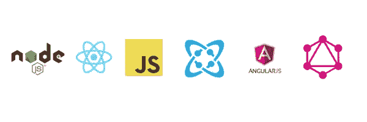
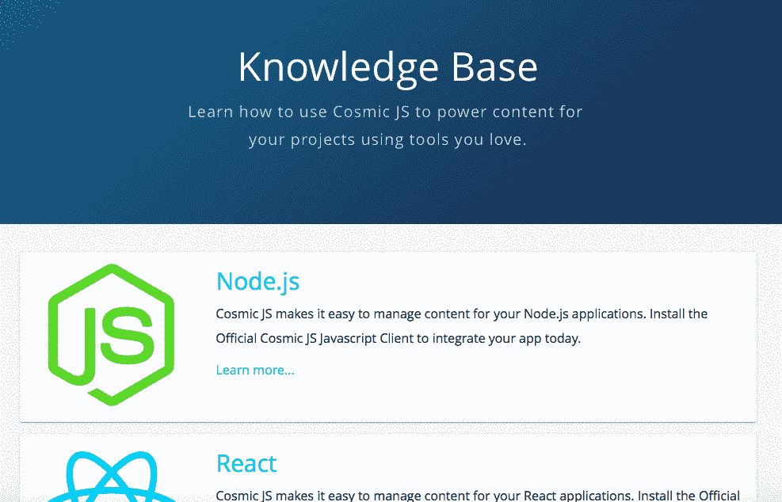
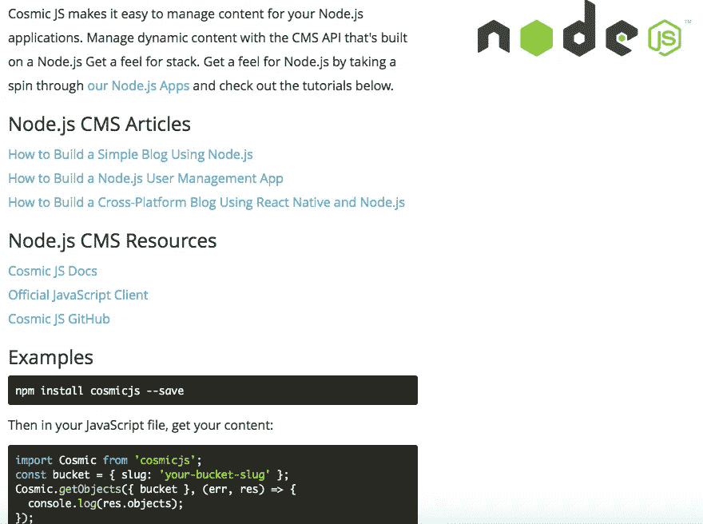
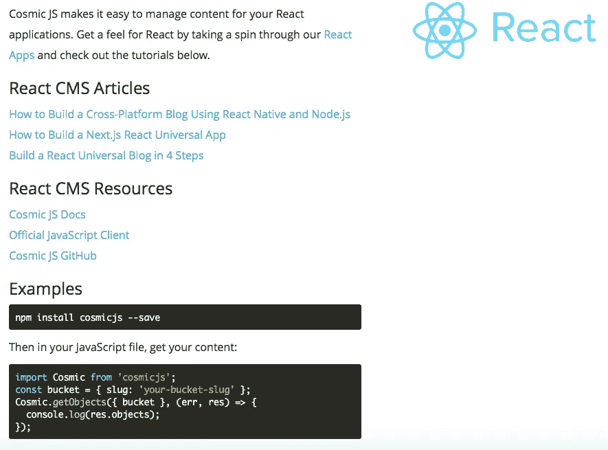
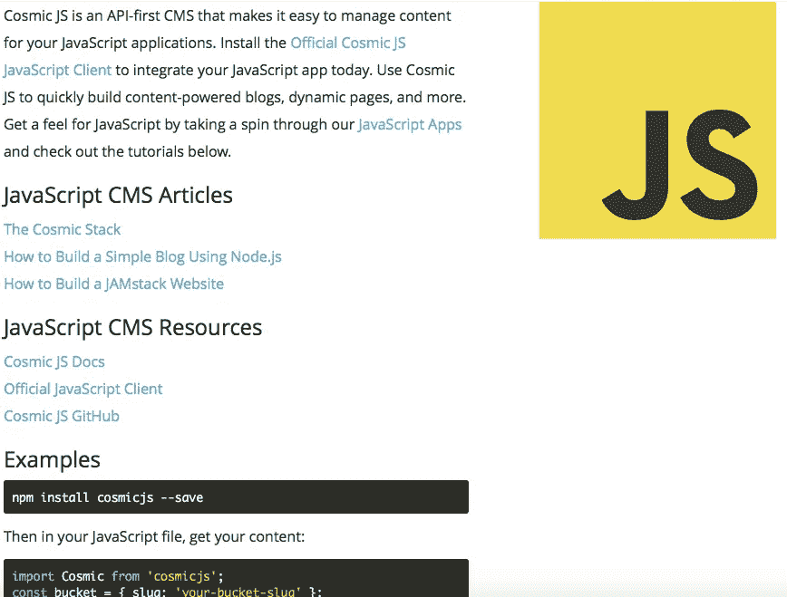
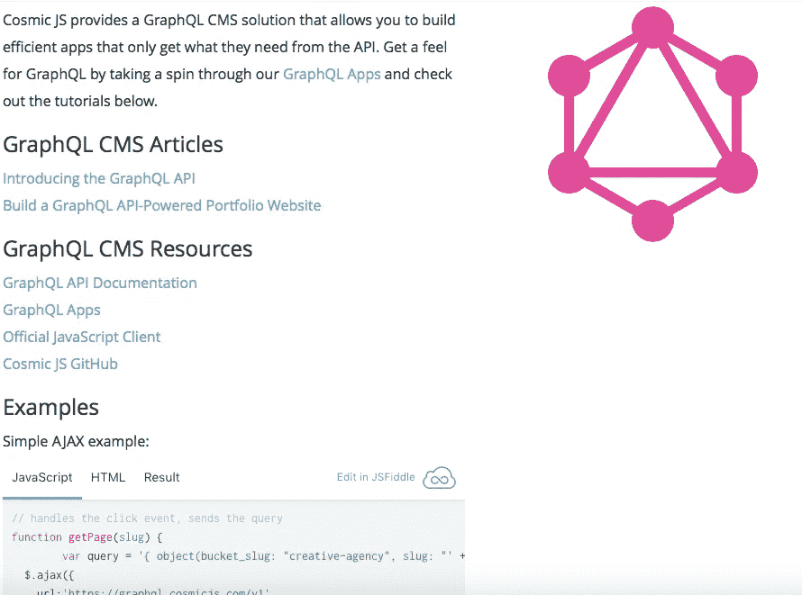

# 在 Cosmic JS 上推出新的知识库

> 原文：<https://medium.com/hackernoon/new-knowledge-base-launched-on-cosmic-js-b5380145c24a>

[Cosmic JS](https://cosmicjs.com/) 是 API 优先的基于云的 CMS，其核心是强大的 JSON API。它通过分离内容和代码来工作，允许开发人员以任何编程语言构建应用程序，同时还允许内容编辑器通过 Cosmic JS Web 应用程序中直观的内容编辑器体验来部署和管理内容。Cosmic JS 可以插入到任何应用程序中来开始管理动态内容，我们鼓励您使用您已经喜欢并熟悉的工具，知道 Cosmic JS 已经集成了。

本周我们在 Cosmic JS 中增加了一个[知识库](https://cosmicjs.com/knowledge-base)，通过编程语言或工具有针对性地提供文章、教程&资源。了解如何使用 Cosmic JS，使用您喜欢的工具为您的项目提供内容。下面是一些流行的编程语言的链接和预览，更多的工具语言位于[宇宙 JS 知识库](https://cosmicjs.com/knowledge-base)。

# Node.js CMS

查看 [Node.js CMS 知识库](https://cosmicjs.com/knowledge-base/nodejs-cms)。

# 反应 CMS

查看 [React CMS 知识库](https://cosmicjs.com/knowledge-base/react-cms)。

# 角状细胞质雄性不育

查看 [AngularJS CMS 知识库](https://cosmicjs.com/knowledge-base/angularjs-cms)。

# Javascript CMS

查看 [JavaScript CMS 知识库](https://cosmicjs.com/knowledge-base/javascript-cms)。

# GraphQL CMS

查看  [GraphQL CMS 知识库。](https://cosmicjs.com/knowledge-base/graphql-cms)

# 没有照片

[Python CMS](https://cosmicjs.com/knowledge-base/python-cms)
PHP CMS
[iOS CMS](https://cosmicjs.com/knowledge-base/ios-cms)
[Android CMS](https://cosmicjs.com/knowledge-base/android-cms)
[GitHub CMS](https://cosmicjs.com/knowledge-base/github-cms)
[ASP.net CMS](https://cosmicjs.com/knowledge-base/aspnet-cms)
[Go CMS](https://cosmicjs.com/knowledge-base/go-cms)
[Ruby on Rails CMS](https://cosmicjs.com/knowledge-base/ruby-on-rails-cms)

[Cosmic JS](https://cosmicjs.com/) 是一个 API 第一的基于云的内容管理平台，可以轻松管理应用和内容。如果你对 [Cosmic JS CMS API](https://cosmicjs.com/) 有疑问，请在 [Twitter](https://twitter.com/cosmic_js) 或 [Slack](https://cosmicjs.com/community) 上联系创始人。

[卡森·吉本斯](https://twitter.com/carsoncgibbons)是 [Cosmic JS](https://cosmicjs.com/) 的联合创始人& CMO，这是一个 API 第一的基于云的内容管理平台，它将内容与代码分离，允许开发人员用他们想要的任何编程语言构建流畅的应用程序和网站。

> [黑客中午](http://bit.ly/Hackernoon)是黑客如何开始他们的下午。我们是 [@AMI](http://bit.ly/atAMIatAMI) 家庭的一员。我们现在[接受投稿](http://bit.ly/hackernoonsubmission)并乐意[讨论广告&赞助](mailto:partners@amipublications.com)的机会。
> 
> 如果你喜欢这个故事，我们推荐你阅读我们的[最新科技故事](http://bit.ly/hackernoonlatestt)和[趋势科技故事](https://hackernoon.com/trending)。直到下一次，不要把世界的现实想当然！

