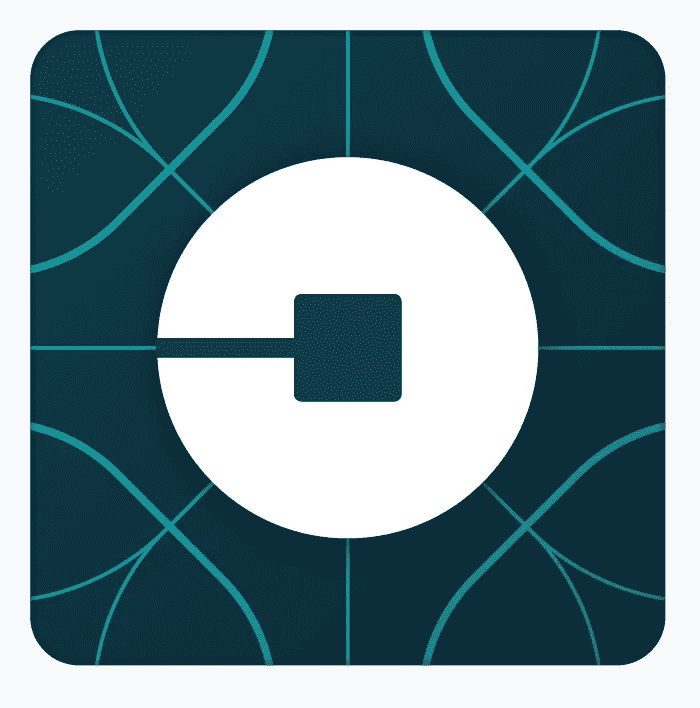

# 新标志。但是同一个优步？

> 原文：<https://medium.com/hackernoon/new-logo-but-same-uber-f5291743ca1e>

尽管苹果和星巴克没有将其与 90 年代的发型进行比较，但它们是一些改变标识的大公司之一，因为像优步一样，它们都觉得自己与以前有所不同。

“大约两年前，沙林·阿明和我开始了一场重塑优步的旅程，以便它能更好地代表我们将成为的样子，”优步首席执行官兼联合创始人特拉维斯·卡兰尼克在[的一份声明](https://newsroom.uber.com/celebrating-cities-a-new-look-and-feel-for-uber/)中说。

优步准备好拉苹果还是星巴克了？

根据五年前《哈佛商业评论》的[分析](https://hbr.org/2011/01/starbucks-new-logo-apple-or-le/)，史蒂夫·乔布斯从苹果的标题中去掉了“电脑”一词，当他环顾四周，看到公司已经不仅仅在兜售电脑，星巴克在表达了从仅仅提供咖啡的束缚中解放出来的愿望后，修改了自己的名称。报告解释说，两者中风险较大的是星巴克，因为消费者尚未将[品牌](https://hackernoon.com/tagged/brand)与咖啡之外的任何东西联系起来，而苹果的产品线已经表明它不仅仅是一家电脑商店。

对于消费者来说，优步已经不仅仅是一家叫车服务公司，它改变了自己的标志，还是新标志仅仅是为了推广公司战略？

后者是星巴克面临的批评，清理警笛和放弃“星巴克咖啡”是“不承认顾客的现实”自从标志改变后，星巴克继续收购 Teavana，并与 Square 达成协议，后者当时是硅谷一家初创企业。优步在宣布商标变更时，似乎认为它介于苹果和星巴克之间:有点已经在做其他事情(苹果)，但肯定想做其他事情(星巴克)。

> 优步不再仅仅感动人；我们现在正在运送食物、货物，很快可能会运送更多。

专家说，寻求更新的公司面临的另一个问题是，新标志并不代表一切。事实上，一个品牌的感知和形象可能更重要，这对优步来说尤其重要，这家公司被许多人视为肮脏的参与者。

一项研究观察了烟草公司的商标和图像对大脑的影响。研究发现，潜意识或不明确的吸烟图像——如西式场景——比烟盒图像更能引发吸烟者和前吸烟者的神经反应。换句话说，人们对一个品牌的联想可能不仅仅意味着一个标志。

“品牌不仅仅是一个名字或一个标志，”[写道](https://hbr.org/2011/06/a-logo-is-not-a-brand/)HBR 的另一位专家。“归根结底，品牌是关于关心你的业务的每一个层面和每一个细节，从使命和愿景这样的大事，到你的员工、你的客户，以及任何人与你的每一次互动，无论多小。”

换句话说，优步可能需要做的不仅仅是设计一个新的标志，如果它想摆脱与价格飙升和不正当商业行为的联系，让消费者认为这个品牌“像自来水一样可靠，无处不在，面向所有人”