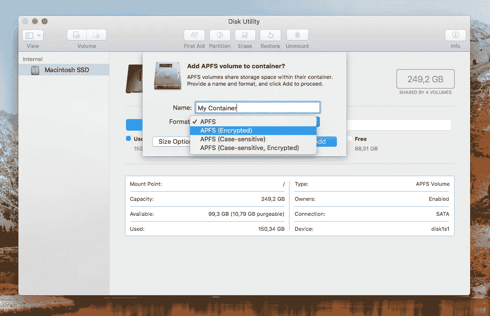
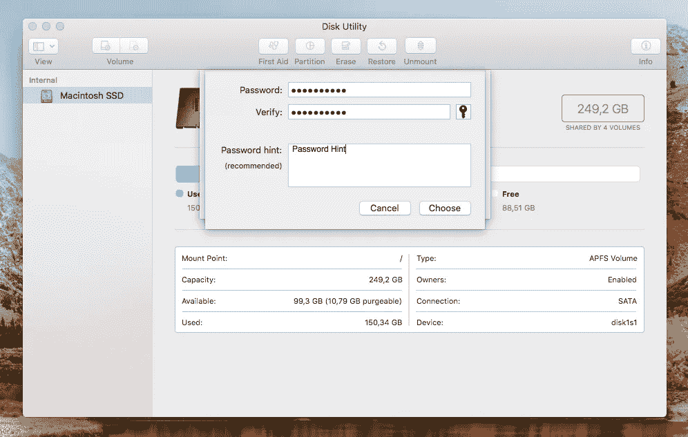
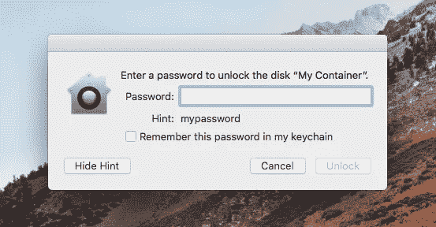

# 新的 macOS High Sierra 漏洞暴露了加密的 APFS 容器的密码

> 原文：<https://medium.com/hackernoon/new-macos-high-sierra-vulnerability-exposes-the-password-of-an-encrypted-apfs-container-b4f2f5326e79>

本周，苹果发布了新的 macOS High Sierra，其新文件系统名为 APFS(苹果文件系统)。没过多久，我就遇到了这个更新的问题。这不是一个简单的问题，而是一个潜在的漏洞。

我创建了一个新的加密 APFS 容器。

并放了一个带提示的密码(mypassword)。

创建后，我卸载并再次安装我的新容器。

瞧。

该问题仅影响配备 SSD 的 MAC。

我真不知道这是怎么被苹果(和其他任何人)忽视的。反正已经被我举报给苹果了。