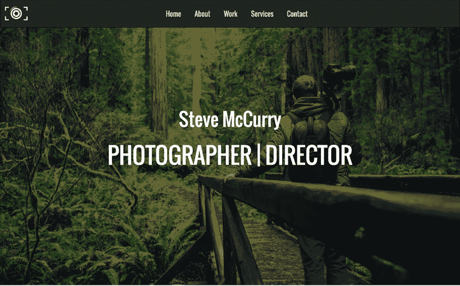
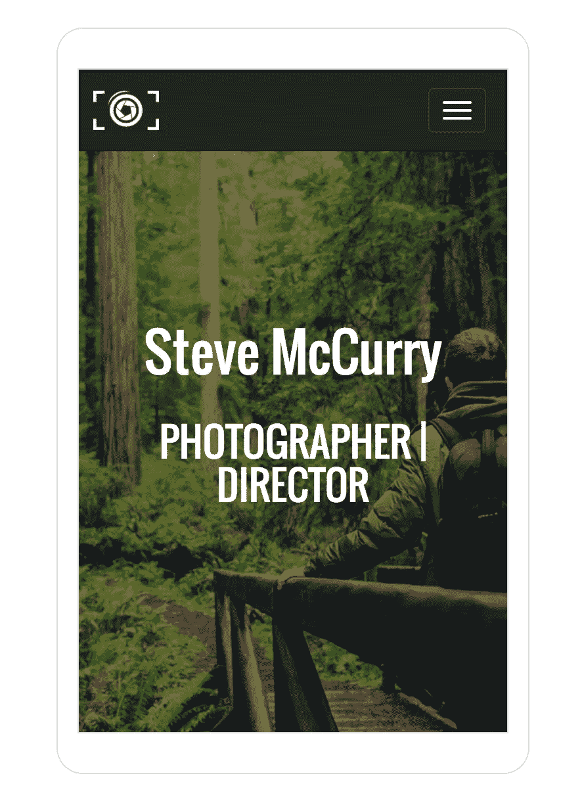

# 全新响应式应用演示体验

> 原文：<https://medium.com/hackernoon/new-responsive-app-demo-experience-d05c211d94ab>

> 最初由托尼·斯皮罗为 CosmicJS.com 写的。托尼·斯皮罗是 [Cosmic JS](https://cosmicjs.com) 的联合创始人&兼首席执行官，这是一个 API 第一的基于云的[内容管理平台](https://cosmicjs.com)，它将内容与代码分离，允许开发人员用他们想要的任何编程语言构建流畅的应用程序和网站。

Cosmic JS 的使命是将 API 优先的内容管理带给世界。除了提供直观的 API 和内容编辑体验，我们的目标是提供优秀的例子，告诉你如何使用 [Cosmic JS](https://cosmicjs.com) 快速开始构建网络的未来。

今天，我们推出了新的应用程序演示体验，允许您在不同的设备屏幕分辨率上演示我们的任何 web 应用程序。在桌面、平板电脑和移动观看体验之间轻松切换。

[点击此处查看新的响应式演示页面。](https://cosmicjs.com/apps/static-website/demo)

浏览我们的[应用](https://cosmicjs.com/apps)是给你如何建立下一个网站的好方法。点击我们的任何[应用](https://cosmicjs.com/apps)并点击“查看演示”进入响应演示体验。点击“查看代码”查看我们的应用程序如何使用不同的编程语言(包括 Node.js、React、PHP 和 Angular)使用 [Cosmic JS](https://cosmicjs.com) 为内容提供动力。在响应式演示体验中，单击左上角的图库图标可快速导航至另一个应用。

我希望这篇教程对你有所帮助。 [Cosmic JS](https://cosmicjs.com/) 是一个 [API 第一的基于云的内容管理平台](https://cosmicjs.com/)，使得管理应用和内容变得容易。[注册 Cosmic JS](https://cosmicjs.com/signup) 来安装我们的任何一个应用程序，以便轻松定制。如果你对 API 优先的好处有任何疑问，[在 Twitter 上联系我们](https://twitter.com/cosmic_js)和[加入我们的 Slack 社区](https://cosmicjs.com/community)。

# 阅读更多

*   [如何构建一个 API 驱动的静态网站](https://cosmicjs.com/blog/how-to-build-an-api-powered-static-website-the-best-of-both-worlds)
*   [JSON 助力世界](https://hackernoon.com/json-powers-the-world-4dab9f1cf94b#.uavdf9sma)
*   [创建通过 API 提供的可扩展内容对象](https://hackernoon.com/creating-extendable-content-objects-served-via-api-dbab075f7fe4#.n0agoguvl)
*   [与内容管理 API 共享资源](https://cosmicjs.com/blog/sharing-resources-with-a-content-management-api)
*   [如何使用 React Native 和 Node.js 构建跨平台博客](https://cosmicjs.com/blog/how-to-build-a-cross-platform-blog-using-react-native-and-nodejs)
*   [如何创建直观的网站导航菜单](https://cosmicjs.com/blog/how-to-create-an-intuitive-website-navigation-menu)
*   [用 4 个步骤创建博客](https://carsongibbons.com/build-a-blog-in-4-steps)
*   [宇宙堆栈](https://cosmicjs.com/blog/the-cosmic-stack)

> [黑客中午](http://bit.ly/Hackernoon)是黑客如何开始他们的下午。我们是这个家庭的一员。我们现在[接受投稿](http://bit.ly/hackernoonsubmission)并乐意[讨论广告&赞助](mailto:partners@amipublications.com)机会。
> 
> 如果你喜欢这个故事，我们推荐你阅读我们的[最新科技故事](http://bit.ly/hackernoonlatestt)和[趋势科技故事](https://hackernoon.com/trending)。直到下一次，不要把世界的现实想当然！

