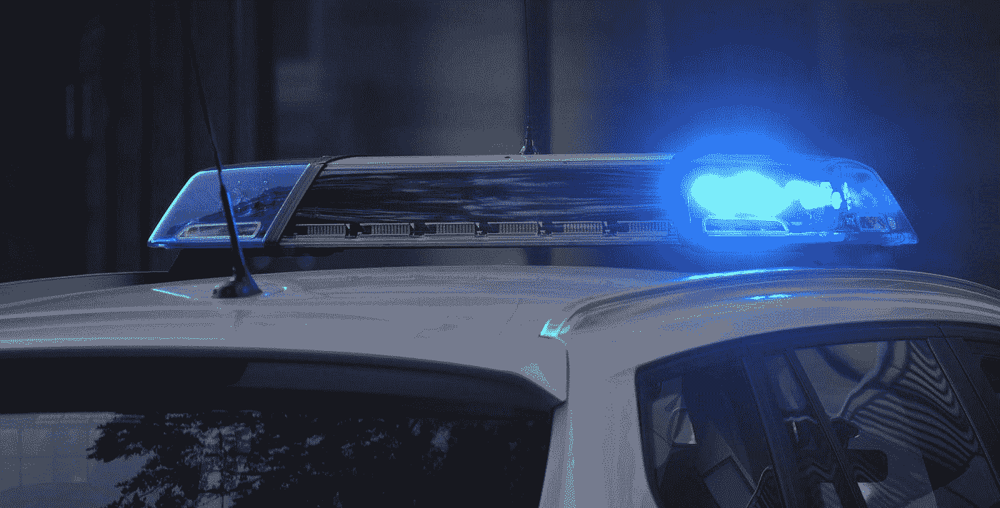

# SEC:打击诈骗犯罪的新警察单位

> 原文：<https://medium.com/hackernoon/new-sec-cyber-unit-launches-emergency-halt-against-ico-scam-cccde2566f82>

## 美国和加拿大政府如何阻止 ICO 骗局

# 介绍

加拿大魁北克省蒙特利尔，7 月 20 日。2017 —加拿大蒙特利尔金融当局宣布 *PlexCorps* 、 *PlexCoin* 、 *DL、Gestio Inc* 以及创始人 Dominic Lacroix*被禁止直接或间接交易任何*形式的投资。声明被忽略，2017 年 8 月[追加](https://cdn01.plexcoin.com/403.html) ICOs，融资 1500 万美元。

华盛顿 DC，2017 年 9 月-证券交易委员会成立了网络单位执法部门，以打击涉及区块链和 ICO 公司的网络相关不当行为。关注骗局、黑客、威胁和欺诈。

[昨天](https://www.sec.gov/news/press-release/2017-219)，美国证券交易委员会新成立的执法部门宣布了对 Plexcorp 的指控。他们利用这份文件冻结了从 ICO 公司获得的 1500 万美元，以及所有者 Lacroix 及其合伙人 Paradis-Royer 的资产。

# 为什么是 PlexCoin？

出于多种原因，PlexCorp 是一个有趣的案例。首先，创始人多米尼克·拉克鲁瓦之前与加拿大当局有过纠纷。[2011 年 12 月](https://lautorite.qc.ca/en/general-public/media-centre/news/fiche-dactualites/dossier-micro-prets-inc-lautorite-intente-une-poursuite-penale-1/)，魁北克省金融当局对他的公司 *Micro-Prêts inc.* 提起刑事诉讼，罪名是虚假陈述证券交易，罚款超过 35，000 加元。这段时间公司资金也被冻结。

拉克鲁瓦因违反证券法而受到严格审查。即便如此，他还是决定推出一个加拿大活动严格禁止推出的 ICO。美国当局发现了 ICO 并开始调查。

PlexCoin 通过承诺在 29 天内保证 1354%的利润回报，满足了 CSA 和 SEC 关于欺诈的指导原则。他们还主动发出投资要约、未经许可的卖家，并最终施加压力，要求投资者设定投资期限，这使他们成为新部门执法行动的主要目标。他们的网站关闭了，但 YouTube 频道 [Crytpo Freedom](https://youtu.be/Grbz7eSSp7U) 制作的视频显示了截至 2017 年 8 月 3 日的旧网站。

# ICOs 上的 SEC 和 CSA

在美国，证券交易和投资保护由证券交易委员会监管。美国证券交易委员会允许投资者投资，但警告称，有时投资可能是未注册的证券，投资资金不一定能收回。

在加拿大，证券交易由各省和地区独立监管。这意味着所有 10 个省和 3 个地区有不同的监管机构。为了使事情更容易，这些监管机构通过加拿大证券管理机构 CSA 进行沟通。

CSA 目前还不太清楚什么构成安全令牌，什么不构成。事实上，安大略省证券委员会(OSC)已要求 ico 直接与他们联系，以便逐案确定他们的安全状况。

此外，由于《洗钱法》正在修订，将虚拟货币包括在内，加拿大当局有可能对虚拟货币形式的未注册证券的投资者采取法律行动，而美国没有这样做。

CSA 采取了更强硬的立场，裁定大多数代币可能是证券，而 SEC 已经确定公用代币确实存在，并且公用代币和安全代币的数量各不相同。这就是为什么最大的 ico 之一:KIK 不允许加拿大投资者参与的原因之一，尽管该公司位于安大略省的滑铁卢。

加拿大的主流环境似乎是一个更加怀疑和不明确的指导方针，但是随着新的网络单位和以前的公告，SEC 似乎对 ico 采取了更明确的立场。这一点很重要，因为合法的 ICO 在美国更容易执行，我们建议加拿大当局迅速跟进，为加拿大 ICO 市场提供透明度，以便与美国市场保持同步。

# 结论

这一事件开创了一个先例。世界各地的金融当局现在对 ico 及其运作方式有了更多的了解，他们将冻结资产并起诉违反证券法规的人。SEC 为区块链和 ICOs 设立了一个专门的执法部门，这一事实表明，各国政府每天都在更加认真地对待这项技术。

不同管辖区的法律差别很大。公司应该采取正确的措施，确保他们符合其 ICO 正在处理的每个地理位置。随着该领域的发展和更多骗局、欺诈和问题的出现，我们将看到来自不同立法者和当局的更清晰的规则和法规。希望这将限制公众对大多数 ico 都是骗局的看法。

想帮忙吗？
**在 Bountey 上支持我们！**[【https://www.bountey.com/bestoficos】](https://www.bountey.com/bestoficos)

想在 ICOs 中保持最新？
**访问我们在**[**https://thebestoficos.com**](http://thebestoficos.com/)

有一个有趣的故事？
**写我们在 info@bestoficos.com**