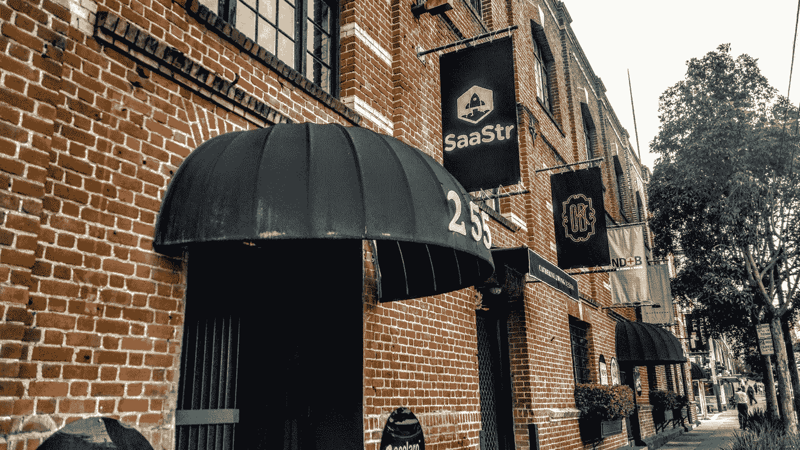

# 新的！！SaaStr 合作销售空间。15，000 平方英尺的销售和扩展空间。

> 原文：<https://medium.com/hackernoon/new-the-saastr-co-selling-space-15-000-square-ft-in-sf-to-sell-and-scale-together-bf4e116ac185>

好消息！

我们已经为此工作了一段时间，最后，我们在旧金山设计区(靠近 Zynga 和 Adobe)为 SaaStr 共同销售空间设计了一个令人惊叹的新“共同销售”办公室。

**大约在 10 月 1 日，我们将拥有 15，000 平方英尺的高端会议室，供 15-20 家最好的下一代、后收入初创企业使用**，所有人都在同一个高端办公室工作，一起学习销售、营销和扩展。SaaStr 社区公司已经占据了我们大约 50%的空间。

*   我们的目标是汇集一些最好的 SaaS 创业公司:
*   在 MRR，从 8 万美元(分钟)到 10 万美元左右——那些刚刚开始学习销售的人，或者
*   大 SaaS 公司的第一湾区办事处的收入已经超过 10 万美元

和

*   而不是在你的第一个肮脏的办公室里独自工作，不知道你在做什么…
*   取而代之的是在一个漂亮的 A+级空间里工作，和 15-20 家其他同行公司一起招聘，一起学习

我们称之为协同销售空间(CSS)，或者你也可以从概念上将其视为后加速器空间。

我们将拥有令人惊叹的内容、常驻首席收入官，以及足以吸引最高端潜在客户的高端会议室和会议空间。

**当我们几周后在这个领域开放时，我们正在寻找另外几个*初创企业*。**

**> >有兴趣吗？了解更多并在此申请:**[**www.cosellingspace.com**](http://email.contactually.com/wf/click?upn=mGOK2D5QQaM-2BfQM4TVCiXjRU-2B0EMz4zvdm8HksllYoj-2FfvcPn3WgciR5YlrAYOvTpmNneFxJpKYV-2Bv-2Bau6Iudw-3D-3D_NGBESygSTBsFU1zMM-2Ff740M9JGJAodTWtBqDO6zs409YITjP9Y7kD4oB-2FjyTedyhY4b4jg8R5mVkb6Rk3qaBHFK9iDjr8T4LSaObrRBTJojx6FV8XrzqNax-2BzaHG5-2F0kEl8bP6rFqqMY5jB7nmcTqegWlv7HiC23UVoOzMc3b5XRmsAjx8hImBaxurcZkaxsMsxKXWFKzWaQLVxP1gvWyqN8gtpUHLVHbZLr5t2CGT529WRl6Zk8RMq52F-2BMkeq-2BLgZSE-2FshIPdo9zXhrqTuiEYVF03lS8hxMDaImciIjTr5FxcBfMn74ONfaE8Jmk7M)

我们也为一些需要 1-2 个空间作为其旧金山总部的欧美公司和/或有相同需求的纽约和洛杉矶公司提供空间。

