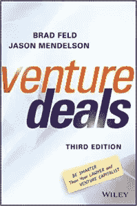

# 风险交易中的新事物 v3

> 原文：<https://medium.com/hackernoon/new-things-in-venture-deals-v3-a18352c9be39>

《冒险交易》《v3 》(第三版)现在有了[精装版](http://amzn.to/2h3Zkt7)和 [Kindle 版](http://amzn.to/2i8IerZ)两种版本。

如果你正在为你最喜欢的[企业家](https://hackernoon.com/tagged/entrepreneur)(或者律师、风险投资人或天使投资人)寻找最后一分钟的节日礼物，我们可以满足你。

杰森和我在 2011 年写了第一版的《风险投资交易》。当我们更新 v3 时，我把每个单词都读了好几遍。这本书在过去五年里保持了相当不错的成绩，我们很高兴它继续位居亚马逊风险投资书籍畅销书排行榜的榜首。

我们在 v3 中添加了一些新东西，并修复了一些不清楚或错误的东西。这包括:

*   来自 USV 的弗莱德·威尔森的新前言。
*   詹姆斯·帕克(Fitbit 首席执行官)的第二篇新前言。
*   更新第 1 章:玩家
*   第 8 章补充内容:可转换债券
*   众筹的新篇章(现在是第 9 章)
*   关于企业风险资本和战略投资者的部分
*   新的一章(现在是 15 章)是关于为什么投资意向书会存在？
*   一个新的非常完善的词汇表
*   到处都有很多小的编辑
*   马克·苏斯特(前期)、比尔·奥莱特(麻省理工学院)、海蒂·罗森(DFJ)、布拉德·伯恩索尔(科罗拉多大学博尔德分校)、杰夫·哈巴赫(考夫曼研究员)和杰夫·克拉维尔(软件技术风投)的新封底广告与新封面设计相呼应

杰森和我最终支持了 VentureDeals.com 域名，并把所有旧的 AskTheVC 帖子都挪了过去。我们在网站上有很多清理和更新工作要做——这将在下个月进行。然后，大约在一月底，我们将开始在网站上推出风险交易的教学指南，以及一些相关的辅助材料。

感谢所有一路支持我们的人，无论是通过买书、给我们反馈，还是帮助我们更明智地做生意。

*原载于* [*费尔德思*](http://www.feld.com/archives/2016/12/new-things-venture-deals-v3.html) *。*

> [黑客中午](http://bit.ly/Hackernoon)是黑客如何开始他们的下午。我们是 [@AMI](http://bit.ly/atAMIatAMI) 家庭的一员。我们现在[接受投稿](http://bit.ly/hackernoonsubmission)，并乐意[讨论广告&赞助](mailto:partners@amipublications.com)机会。
> 
> 如果你喜欢这个故事，我们推荐你阅读我们的[最新科技故事](http://bit.ly/hackernoonlatestt)和[趋势科技故事](https://hackernoon.com/trending)。直到下一次，不要把世界的现实想当然！

