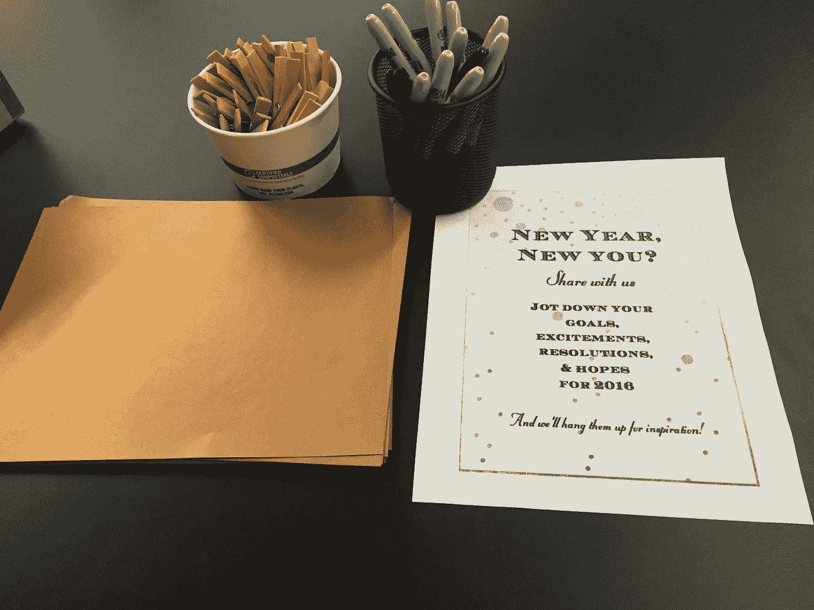
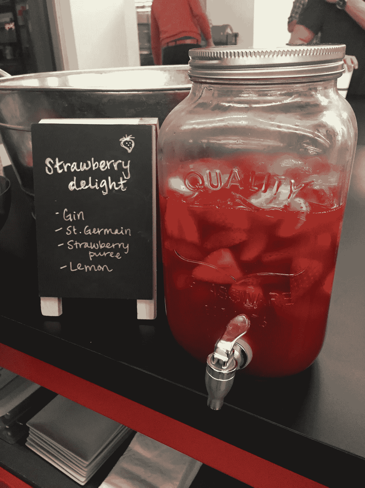
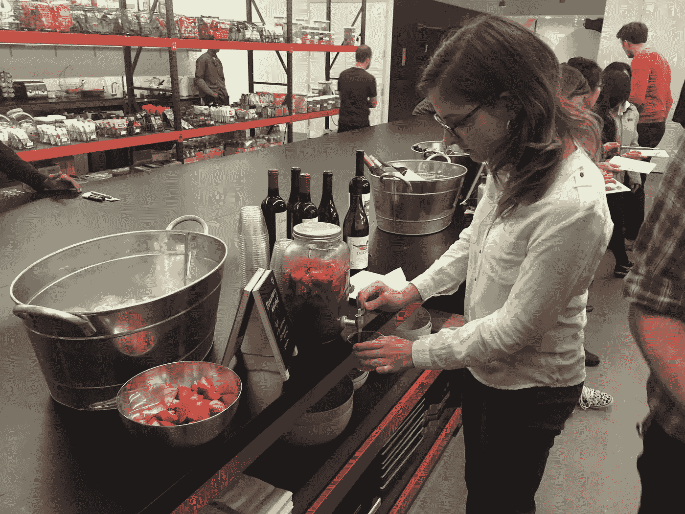

# 新的一年，新的你？快乐时光

> 原文：<https://medium.com/hackernoon/new-year-new-you-happy-hour-38069fb7be15>

总是试图在公司文化的基础上创造有趣愚蠢的活动，让人们[谈论他们通常不会谈论的事情。](https://hackernoon.com/tagged/mingling)

我们公司的宗旨就是制定目标，所以我创造了一个非常简单的小活动，让人们写下他们的目标、决心、兴奋或 2016 年的梦想，然后我们把它们挂在我在快乐时光挂起来的细绳上。这是一种活动，然后作为装饰。像这样的小事情有助于了解人们，让[的活动更令人难忘。](https://hackernoon.com/tagged/making)

Got this cute little chalk board to show the names of the drinks

> [黑客中午](http://bit.ly/Hackernoon)是黑客如何开始他们的下午。我们是 [@AMI](http://bit.ly/atAMIatAMI) 家庭的一员。我们现在[接受投稿](http://bit.ly/hackernoonsubmission)并乐意[讨论广告&赞助](mailto:partners@amipublications.com)机会。
> 
> 如果你喜欢这个故事，我们推荐你阅读我们的[最新科技故事](http://bit.ly/hackernoonlatestt)和[趋势科技故事](https://hackernoon.com/trending)。直到下一次，不要把世界的现实想当然！

