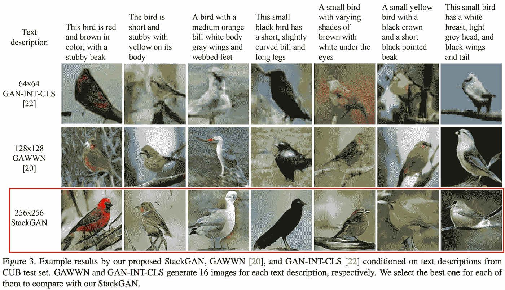

# 人工智能和机器学习新闻

> 原文：<https://medium.com/hackernoon/news-in-ai-and-machine-learning-3ab7407f90b6>

## 更多人工智能新闻和分析，[在这里注册我的时事通讯](http://www.nathan.ai)。

*报道从****2016 年 11 月 22 日至 2017 年 1 月 18 日***

欢迎来到我的时事通讯第 17 期，分析人工智能世界的方方面面。拿起你的热饮，享受阅读吧，☕！在我们开始之前，有几个要点:

1.最近写了两篇: [***为什么做多人工智能？***](/@NathanBenaich/why-go-long-on-artificial-intelligence-67bb7d0d6ff4#.kgidgyhd2)*[***人工智能和机器学习的 6 个领域密切关注***](/@NathanBenaich/6-areas-of-artificial-intelligence-to-watch-closely-673d590aa8aa#.w99zduj5i) 。请阅读并分享您的观点！*

*2.从 1 月 22 日到 2 月 5 日，我会在✈️️的旧金山。如果你想了解任何与人工智能相关的事情，请给我写信:投资、研究、建立或收购公司。*

*3.我们为下一次伦敦之行准备了一个很棒的阵容。3 月 2 日星期四的聚会。一起来了解强化学习、具有记忆的网络和算法的正式验证，这些来自才华横溢的**Raia Hadsell**(Google deep mind)**Vishal chat rath**(prowler . io)和 **Denis Ignatovich** (美学整合)。*

*4.2017 年在伦敦举行的我的研究和应用人工智能峰会定于 7 月举行。告诉我你想听的演讲者和主题的想法👍*

****** [**报名邮箱快讯版本**](http://www.nathan.ai) ***。***

# *🆕技术新闻、趋势和观点*

***🚗无人驾驶汽车部***

*这里有关于[自动驾驶汽车如何工作](http://www.nytimes.com/interactive/2016/12/14/technology/how-self-driving-cars-work.html?smid=tw-share)和[哪些行业参与者正在做什么](http://www.slideshare.net/Altimeter/the-race-to-2021-the-state-of-autonomous-vehicles-and-a-whos-who-of-industry-drivers/)的初级读本。*

*在[在旧金山**的公共道路上推出他们的无人驾驶汽车**](http://www.theverge.com/2016/12/14/13921514/uber-self-driving-car-san-francisco-launch-volvo-xc90)后，优步的运营[被迅速关闭](https://www.wired.com/2016/12/ubers-self-driving-car-ran-red-light-san-francisco/)。此外，纽约州的一个倡导机构要求优步的服务被封锁 50 年。*

*与此同时， **Nutonomy** 自 2016 年 4 月以来已经让他们的机器人出租车[在新加坡行驶了 6 公里的街道](http://spectrum.ieee.org/transportation/self-driving/after-mastering-singapores-streets-nutonomys-robotaxis-are-poised-to-take-on-new-cities)。与纯粹基于深度学习的系统相比，汽车使用基于手工制作的规则的形式逻辑来优先考虑它如何驾驶。虽然这是可以解释的，但使用形式验证这样的方法来证明所述算法的正确性和稳定性仍然很重要。*

***英伟达**凭借其 225%的市值增长，成为 2016 年标普 500 指数[表现最佳的公司](https://cdn.ampproject.org/c/s/www.yahoo.com/amphtml/finance/news/nvidia-the-yahoo-finance-company-of-the-year-173130275.html)。在 CES 2017 上，[公司宣布了](https://blogs.nvidia.com/blog/2017/01/04/ces-auto-home-gaming/)他们的 Xavier AI 汽车超级计算机，它内置了一个 8 核定制 ARM64 CPU，512 核 Volta GPU，功耗为 30W，每秒可进行 30 万亿次运算。它还展示了他们的车内人工智能副驾驶，可以观察车辆的前部、后部和侧面，以及使用面部识别、头部跟踪、目光跟踪和唇读的驾驶员。[英伟达还与奥迪和梅赛德斯-奔驰签署了合作伙伴关系](http://spectrum.ieee.org/cars-that-think/transportation/self-driving/nvidia-ceo-announces)以运送 4 级自动驾驶汽车，日本 Zenrin 地图公司(加入百度和 TomTom)，ZF 和博世为汽车用品。更多细节请关注底特律车展上的。*

*虽然看起来不会与英伟达合作，但福特也在 CES 上展示了他们自主开发的 Fusion 混合动力车。他们的首席项目工程师[也写了一篇关于车辆开发的文章](/@ford/building-fords-next-generation-autonomous-development-vehicle-82a6160a7965#.qtrq3imx3)。此外，在中国制造汽车的 [**百度**智能汽车部门和北汽集团](http://seekingalpha.com/pr/16707645-baidu-announces-strategic-partnership-baic)宣布，他们将在 2017 年 H1 的车辆和 2017 年底的路测 3 级车辆中实施百度远程信息技术。*

***Alphabet** [将其无人驾驶汽车项目](http://fortune.com/2017/01/08/waymo-detroit-future/)分拆为独立公司， [**Waymo**](http://www.waymo.com) ，由美国现代公司前总裁兼首席执行官约翰·克拉夫茨克领导。据说该公司为他们的自主技术内部设计和制造所有必要的硬件和软件。他们将推出一支由 100 辆自动驾驶货车组成的车队，配备雷达、8 个视觉模块和 3 个激光雷达，后者的价格下降了 90%。对于 Alphabet 来说，这是一个重大举措，因为它正在寻求新的产品线，以从非广告驱动的商业模式中产生有意义的收入。这是否是首席财务官露丝·波拉特(Ruth Porat)收紧 moonshot 项目的进一步迹象？*

*埃隆在圣诞节前宣布，特斯拉基于深度[学习](https://hackernoon.com/tagged/learning)的视觉系统运行良好，一周前，一款[修订版自动驾驶仪](https://techcrunch.com/2017/01/09/tesla-moves-towards-greater-autonomy-with-autopilot-rollout-for-hw2-cars/?ncid=rss)将为 1000 辆配备第二代硬件和软件的汽车推出(2016 年 10 月起)。*

*与此同时，埃隆自称的克星， **Comma.ai，**的乔治·霍兹宣布，他的公司将在[开源其技术](https://commaai.blogspot.co.uk/2016/12/the-android-of-self-driving-cars.html)的两个组件，因为它重新定义了自己的使命，要成为“无人驾驶汽车的安卓”。Comma.ai 发布了 [openpilot](https://github.com/commaai/openpilot) ，一个为本田和讴歌提供自适应巡航控制和车道保持辅助系统的包，以及 [NEO](https://github.com/commaai/neo) ，一个基于 OnePlus 3 智能手机的硬件套件，可以运行 openpilot。乔治在 Udacity 做了一个关于这项工作的报告。注意机器学习模型是*闭源* [二元 blob](https://en.wikipedia.org/wiki/Binary_blob)。他谈到如何在他们的状态/动作对数据集上使用逆向强化学习来学习自动驾驶汽车。*

*Rethink Robotics 的创始人兼首席技术官 Rodney Brookes 表示，无人驾驶汽车可能会成为社会弃儿，并引发车主的反社会行为。此外，他还提请人们注意围绕自动驾驶汽车(即电车实验)伦理的不必要的媒体狂热，并指出这些情况在现实世界中几乎不会遇到，所以为什么它们应该成为无人驾驶汽车的焦点呢？解决长尾感知问题更像是一个路障。简单地说，这场争论在他看来是“装扮成道德哲学的纯粹精神自慰”*

*💪**大家伙们***

*谷歌的 Eric Schmidt 认为我们应该[拥抱机器学习，而不是害怕它](http://europe.newsweek.com/google-eric-schmidt-embrace-machine-learning-not-fear-it-540369?rm=eu)。他指出了 ML 帮助我们解决我们自己无法解决的问题的例子，包括糖尿病视网膜病变的筛查，糖尿病视网膜病变是一种可预防的疾病，可导致失明。他声称，开源导致了机会的民主化，而 ML 不应该比他们创造的工作更多。更多内容，请在 [*频道查看一个新作品，这是即将到来的人工智能革命*](https://backchannel.com/the-ai-takeover-is-coming-lets-embrace-it-d764d61f83a#.1wturalk5) *的全部收获。**

*果然不出所料，**马克·扎克伯格**完成了他 2016 年的挑战:[打造家庭自动化系统](https://www.facebook.com/notes/mark-zuckerberg/building-jarvis/10154361492931634)，*贾维斯*。他面临的挑战(因此也是初创公司的机遇)包括:推断上下文意识，以便系统忠实地完成请求，硬件/软件的连通性和互操作性，以及口语化人类对话的开放性。*

*关于 **CES 2017** 上发生的事情的详细总结，[请参考 Evercore ISI 提供的这些笔记](https://drive.google.com/open?id=0Bxx383wVJ39PUkRwTXdfVVRUODg)。该银行还[发表了对展会明星亚马逊 Alexa 的深度剖析](https://drive.google.com/open?id=0Bxx383wVJ39PdjhkSUVVNERaRHc)，强调了所需的投资和该平台的可扩展属性。*

***英特尔**通过发布 [BigDL 加入开源俱乐部，BigDL 是一个用于 Apache Spark 的分布式深度学习库](https://github.com/intel-analytics/BigDL)，Apache Spark 是一个强大的内存集群计算框架。它针对在英特尔硬件上运行进行了优化，声称开箱即用的性能比 TensorFlow 快几个数量级。与 NVIDIA 相比，英特尔需要迎头赶上，NVIDIA 基本上拥有 GPU 市场。*

*人工智能的新兴战场是模拟环境。这些软件产品(实际上是游戏)可以再现真实世界中的状态、物理和行为。他们提供了一个沙箱，在其中训练人工智能系统，这些系统能够在环境中采取行动，以实现目标。围绕这一主题出现了几个重要的动向:*

*   *谷歌在去年 12 月宣布，它将提供 T2 空间服务，用于构建和运行由伦敦初创公司 Improbable 创建的数百万个持久实体组成的大型虚拟世界，作为谷歌云平台的一部分。我敢打赌，如果**不太可能**通过这次测试，我们将在年内看到谷歌支付一笔可观的金额来收购这项业务。至少可以说，他们是一支才华横溢的队伍。*
*   *[**OpenAI** 发布 Universe，](https://openai.com/blog/universe/)一个测量和训练 AI 一般智能的软件平台。通过 9 行代码，开发者可以在 1000 个不同的游戏、网站和其他应用程序中部署人工智能。目标？*“开发一个单一的人工智能代理，它可以灵活地将其过去在宇宙环境中的经验应用于快速掌握不熟悉的、困难的环境，这将是迈向通用智能的一大步。**
*   *[**谷歌 DeepMind** 发布了 DeepMind Lab](https://deepmind.com/blog/open-sourcing-deepmind-lab/) ，这是一个类似 3D 游戏的平台，可以在其中训练、测试和测量 AI 智能体。模拟环境是高度可定制和可扩展的。这些强调自主代理必须学会通过使用导航、记忆、第一人称的 3D 视觉、运动控制、规划、策略和时间来独立执行任务。这里是[研究论文](https://arxiv.org/abs/1612.03801)和 [GitHub repo](https://github.com/deepmind/lab) 。*

*请注意，像游戏这样的模拟环境可以被强化学习代理利用，如果他们发现游戏中的小故障，导致他们获得最多的奖励，但不是你真正想要的行为。来自 OpenAI 的更多信息。*Tl；仔细想想你如何根据你想要它学习的行为来奖励你的人工智能代理。或者用这个来寻找你游戏中的 bug！**

*💻**生产中的人工智能***

*虽然人工智能几乎每天都在新闻中出现，但很少有公司在生产中大规模运行人工智能系统。Salesforce/PredictionIO [的 Simon Chan 分享了如何跨越从实验到可扩展部署的鸿沟](https://techcrunch.com/2017/01/05/crossing-the-ai-chasm/)的指导方针。诱惑:为您的团队投资一个中央基础设施，在一个地方收集数据，并选择相关的评估指标。这个领域，*机器学习基础设施即服务*，是另一个我打赌我们会看到 M & A 的领域，因为现任者意识到拥有这个内部的价值。*

*关于同一主题的更详细的介绍，请阅读由谷歌 ML 研究员撰写的关于如何 [*搞定你的下一个 ML 工作*](http://res.cdn.sys-con.com/session/3214/Natalia_P.pdf) 的文章。这是一个很好的方式来理解什么是必需的，以及谷歌服务目前在哪里发挥作用。*

*你对脸书如何在新闻、图像、视频和直播产品中发展人工智能的使用感到好奇吗？[这一块](http://arstechnica.com/information-technology/2017/01/the-origins-and-future-of-artificial-intelligence-at-facebook/)贯穿故事始终。值得注意的是，它提到了 FBLearner 流程(公司的 ML 基础设施——看，拥有一个很重要！)目前被脸书 40 多个产品开发团队使用。理解视频是他们的下一个前沿领域，这并不奇怪。*

*《经济学人》发表了一篇关于深度学习如何改变翻译、语音识别和合成的全面而高质量的文章。它很好地解释了这些系统是如何工作的，不像[另一篇最近的文章](https://medium.freecodecamp.com/the-mind-blowing-ai-announcement-from-google-that-you-probably-missed-2ffd31334805#.7iginpjia)说谷歌的神经机器翻译已经*“发明了自己的语言来帮助它更有效地翻译。”*唉。当阅读一篇庸俗版本的[研究论文](https://research.googleblog.com/2016/11/zero-shot-translation-with-googles.html)时，一定要记得注意细节，尤其是前者是由非专家撰写的时候。不，该模型没有创造一种新的语言——它学习了可用于迁移学习的内部表示和参数。*

*日本保险公司 Fukoku Mutual Life Insurance 据说实施了一个价值 140 万英镑的基于 IBM Watson 的系统，根据投保人的医疗证明、病史和程序来计算对其的赔付。预计每年将节省 100 万英镑，并导致 30 名员工被解雇。作为背景，该公司在截至 2016 年 3 月的一年中盈利 4.5 亿英镑。*

*麦肯锡全球研究所发表了一份报告，[*分析时代:在数据驱动的世界中竞争*](http://www.mckinsey.com/business-functions/mckinsey-analytics/our-insights/the-age-of-analytics-competing-in-a-data-driven-world) ，他们在报告中介绍了对人工智能影响的市场研究。在其他可引用的发现和数据中，他们确定了 12 个行业中机器学习的 120 个潜在用例。让他们来吧:-)*

*🎮**游戏！***

*一个由加拿大和捷克研究人员组成的团队构建了一个人工智能代理 *DeepStack* ，它在单挑无限德州扑克中[击败了职业扑克玩家](https://www.technologyreview.com/s/603342/poker-is-the-latest-game-to-fold-against-artificial-intelligence/)，德州扑克每手牌有 10 种⁶⁰可能的玩法。这款游戏值得注意，因为与围棋或象棋不同，玩家不会观察到游戏和对方手中的完美信息。研究论文可以在[这里](https://arxiv.org/pdf/1701.01724v2.pdf)找到。*

*与此同时，谷歌 DeepMind 的 AlphaGo 一直在与顶级玩家进行秘密的在线竞争，取得了 60 比 0 的战绩。一位最近被打败的特级大师说，*“alpha Go 完全颠覆了我们围棋选手的控制力和判断力。”我敢肯定，我们尚未达到其能力的顶峰。**

*在人工智能玩雅达利游戏的问题上，麻省理工学院和哈佛大学的研究人员[展示了人类如何学习雅达利游戏](http://gershmanlab.webfactional.com/pubs/Tsividis17.pdf)的系统数据。它们表明，人类的学习速度比 DeepMind 的 deep RL AI 代理的版本快几个数量级。通过实验操纵游戏，作者表明，人类的快速学习率可以部分地解释为他们通过阅读指令和观察之前其他人的游戏来建立游戏的心理模型的能力，但不是通过事先了解游戏中对象的属性。*

*📚**政策和治理***

*欧洲议会法律事务委员会发布了一份关于人工智能和机器人技术决议的报告草案，称两者都已经“成为我们这个世纪最突出的技术趋势之一”它建议设计师必须:实现 kill switches，通过设计特征建立隐私，并确保代理人的决策服从于重建和可追溯性。该报告还建议创建一个机器人和人工智能的欧洲机构，该机构应该*“提供必要的技术、伦理和监管专业知识，以支持相关的公共行为者。”**

*IEEE 标准协会负责制定和管理我们今天使用的许多技术标准，该协会发布了第一版的 [*伦理一致的设计:用人工智能和自主系统优先考虑人类福祉的愿景*](http://standards.ieee.org/develop/indconn/ec/ead_v1.pdf) 。它包括许多需求和目标，这些需求和目标的解决方案大部分仍然是公开的问题。像许多类似的报告一样，它要求*“算法的可追溯性……关于什么计算导致了特定的结果”*和*“验证结果和检测危害的间接手段”*。*

*提醒:即将离任的奥巴马政府发布了两份报告，其中包含高水平的建议，请点击此处通过 HBR 获取。*

*骑士基金会、奥米迪亚网络和 LinkedIn 创始人雷德·霍夫曼决定资助哈佛/麻省理工学院的一个新中心 [*人工智能基金*](https://www.omidyar.com/news/knight-foundation-omidyar-network-and-linkedin-founder-reid-hoffman-create-27-million-fund) 的伦理和治理，总计 2700 万美元。*

# *🔬**研究***

*谷歌大脑团队讲述了 2016 年的主要成就，重点是他们的研究成果，而他们的伦敦同行 DeepMind 则重述了他们自己令人难以置信的 2016 年综述。如今有太多了不起的研究，很难选择哪些论文是特色，所以这里有 4 篇论文引起了我的注意，为什么:*

*[**StackGAN:利用堆叠式生成对抗网络**](https://arxiv.org/pdf/1612.03242v1.pdf) **进行文字到真实感图像合成。** *罗格斯大学、利哈伊大学、香港中文大学、北卡罗来纳大学夏洛特分校。从文本描述生成照片般逼真的图像以及将低质量图像的分辨率提升到更高质量图像的任务已经成为最近许多论文的主题。然而，可能有几个似乎合理的图像对应于任何给定的文本描述。这种对多模态数据建模和合成照片级逼真图像的问题非常适合生成式对抗网络(GANs，目前非常热门的领域)，但 GANs 产生的图像非常小(64x64 像素)，并且缺乏细节。为了克服这些问题，作者使用了两步堆叠 GAN 工艺(StackGAN)。首先，第一阶段 GAN 的任务是通过绘制对象的粗略形状和基本颜色并绘制背景，从目标文本描述生成低分辨率 64x64 图像。第二，作者采用这种粗糙且充满缺陷的低分辨率图像，并使其通过“第二阶段”GAN(也以目标文本描述为条件),该 GAN 必须仅专注于绘制纠正缺陷的细节，以创建高分辨率图像。以这种方式，第二阶段 GAN 学会添加第一阶段 GAN 遗漏的视觉表示的文本信息。结果是最先进的。看看吧！**

**

****麻省理工*基于复合对象的物理动力学学习方法。在这篇论文中， [Joshua Tenenbaum](http://web.mit.edu/cocosci/josh.html) 的实验室考虑了物理世界中的推理任务——这是人工智能中学习、感知、规划、推理和理解的基石问题。特别是，人工智能代理应该对物理对象的属性、它们如何相互关联以及它们如何影响复杂系统的未来动态表现出可概括的推理。在这里，作者介绍了*神经物理引擎(NPE)* ，这是一个结合了符号推理和神经网络的混合模型。NPE 体系结构创建了基于对象的状态表示，可用于预测涉及多个移动对象的系统的未来状态。这是通过将下一个直接的未来时间步长作为场景中一个对象和其他相邻对象之间成对交互的函数组合来实现的。在使用 [matter-js 物理引擎](http://brm.io/matter-js/)进行的涉及移动球和障碍物世界的实验中，作者表明，NPE 模型在预测未来 50 个时间步长的世界未来状态的能力方面一直表现出色。他们的比较是针对流行的 LSTM 架构或没有成对组合层(“NP”)的 NPE，该成对组合层将一个对象的未来与周围其他对象的功能联系起来。此外，NPE 的性能随着训练不断提高，对未来的预测几乎没有分歧，概括得更好，并可扩展到复杂的动态和世界配置([见图 3](http://imgur.com/a/x9B5U) )。这些特征中每一个都不能被 NP 或 LSTM 模型概括。这是令人兴奋的基础性工作，使人工智能代理更接近解决现实世界的问题。***

***[**用递归神经网络生成用于药物发现的聚焦分子库**](https://arxiv.org/pdf/1701.01329v1.pdf) **。** *阿斯利康明斯特大学和上海大学。*制药行业面临的一个长期挑战是从由 10⁶⁰合成可获得的类药物分子组成的搜索空间中识别、试验、优化和临床验证新药。计算方法是必要的，因为实验室中的体外高通量筛选方法只能测试大约 10⁶分子，这几乎不能在这个更广阔的搜索空间中取得进展。这项研究对单一模型中的计算结构生成和优化有两个主要贡献。首先，作者训练了一个递归神经网络(RNN)模型，该模型在 140 万个以 SMILES 格式(一串字符而不是 Lewis 结构)表示的分子上有三个堆叠的 LSTM 层。这个模型学习分子语法，并可以输出有效(但不集中)的化学结构时，从采样。为了获得*针对特定靶标*的新型活性药物分子，作者随后在已知活性分子的小数据集上重新拟合了一般分子预训练 RNN。在小数据集上的该转移学习循环(“时期”)的每次迭代中，对模型进行采样，以生成针对靶的新的活性分子。基于梯度推进树的目标预测模型用于验证生成的分子是否有活性。结果表明，从早期时期采样产生与训练样本密切相关的分子，而后期时期产生新的化学类型或支架想法。当对 1000 个针对*葡萄球菌*的活性分子进行训练时，该模型可以检索 6051 个测试分子中的 14%。将训练集缩小到只有 50 个分子(数据的 1%)，该模型仍然可以恢复测试集的 2.5%，与没有重新拟合感兴趣的活性分子的一般模型相比，性能提高了 21.6 倍。作者建议未来的工作在框架分子生成作为一个强化学习问题。这里，预先训练的分子生成器可以被视为策略，并且每个生成的分子从目标预测模型接收的分数可以是奖励函数。***

***[**【预调:端到端的学习和规划**](https://arxiv.org/pdf/1612.08810v1.pdf) **。** *谷歌 DeepMind* 。强化学习(RL)有两种风格:基于模型的(我们了解环境如何工作以及如何在状态之间转换)和无模型的(我们不了解)。基于模型的强化学习由两个子问题组成:1)学习模型；2)使用该模型评估和选择可能的策略以实现目标，即规划。在这里，作者提出了一种新的架构 *predictron* ，它将学习和规划结合到一个端到端的训练过程中(而不是更常见的单独训练)，使用原始像素输入来输出对可能动作的精确值预测。以视频游戏为例，模型是抽象的这一事实意味着，当它找到一个最佳计划来推进其目标(例如，预测游戏中给定一个动作的未来得分)时，该计划也将对应于底层游戏的最佳计划。事实上，该模型不需要使用与我们人类相同的游戏状态空间表示来实现最佳预测。在实验中，预控器与前馈和 RNN 无模型架构进行比较，作者表明预控器在 RL 环境中实现了更准确的值预测，例如预测迷宫的右下角是否连接到左上角。***

# ***📑**资源*****

***MMC Ventures 的 David Kelnar 写了两本详细的参考资料，分别是《人工智能初级读本》和《英国的人工智能:从 226 家初创公司学到的东西》,我鼓励你阅读这两本书。***

***鹦鹉螺公司发表了一篇关于沃尔特·皮茨的精彩文章，他是神经网络历史上的中心人物之一。***

***百度的吴恩达在 NIPS 2016 上发表了一场精彩的演讲，你可以[在这里](https://www.youtube.com/watch?v=F1ka6a13S9I&feature=youtu.be&t=1s)观看这个版本。[这篇文章总结了 Andrew 的主要观点](http://www.computervisionblog.com/2016/12/nuts-and-bolts-of-building-deep.html)，包括他对人工智能的分类框架(a .一般深度学习，b .序列模型，c .计算机视觉和 d .其他，即 RL/无监督学习/GANs 等。)和构建更好系统的 5 步方法。在这个视频中没有方程式受到伤害:-)***

***谷歌 DeepMind 的 Piotr Mirowski 在最近的伦敦机器学习会议上发表了一个彻底的演讲， [*深度学习和玩序列*](https://piotrmirowski.files.wordpress.com/2016/11/piotrmirowski_2016_meetup.pdf) 。他探索 3D 游戏环境中语言建模和控制的应用。***

***许多人写了 NIPS 总结报告——我发现这份报告相当容易理解。***

***人们对人工智能系统的设计含义越来越感兴趣— [这里有一篇文章](https://uxdesign.cc/human-first-vs-ai-first-approach-to-building-a-smart-and-fast-bot-895aea3fc8c#.5sbog3n7z)讲述了易贝如何驾驭他们创造购物机器人的经历。***

***继著名的商业画布之后，这里是*[*机器学习画布*](/louis-dorard/from-data-to-ai-with-the-machine-learning-canvas-part-i-d171b867b047#.sb9rptt6r) ，一个连接数据收集、机器学习和价值创造之间的点的框架。****

****微软发布了他们的[机器阅读理解数据集](http://www.msmarco.org/)，这是一个包含 10 万个问题和答案的阅读理解数据集。****

****CB Insights 公布了他们对 100 家人工智能初创公司的呼吁结果。又一张信息图来装饰你的办公室:-)****

# ****💰**融资和退出******

****63 家公司(48 家在美国，12 家在欧盟，3 家在亚洲)从 157 名投资者那里筹集了 5 . 85 亿美元。交易规模中值为 390 万美元(美国为 478 万美元，欧盟为 100 万美元)，交易前估值为 1900 万美元。****

*   ****最大的两轮是由总部位于北京的公司发起的，这两家公司都提供面部识别和图像分析产品。[**【face++】**](https://www.faceplusplus.com/)获得由富士康科技集团领投的 1 亿美元融资，而 [**Sensetime**](http://www.sensetime.com) 获得由鼎晖投资领投的 1.2 亿美元 B 轮融资。****
*   ****总部位于纽约的公司**提供点对点保险产品，将 ML 和机器人作为其产品的核心部分，[获得了由 General Catalyst Partners 牵头的 3300 万美元 B 轮融资](http://www.geektime.com/2016/12/05/insurtech-startup-lemonade-raises-34-million-from-google-and-general-catalyst/)。******
*   ******[**Starship Technologies**](http://www.starship.xyz)，由前 Skype 高管运营的爱沙尼亚自主地面送货无人机公司[，筹集了 1720 万美元的种子轮](http://www.wsj.com/articles/daimler-invests-in-last-mile-robotic-delivery-startup-1484224207)，由戴姆勒牵头，Shasta Ventures、Matrix Partners 和 Playfair Capital 的我们等参与。这个团队真的在推动议程，进步很大！******
*   ******[**numeri**](http://www.numer.ai)对冲基金，其量化交易策略由[“7500 名用比特币支付的匿名编码员”](https://www.wired.com/2016/12/7500-faceless-coders-paid-bitcoin-built-hedge-funds-brain/)建立，筹集了由 Union Square Ventures 牵头的 600 万美元 A 轮融资。虽然我可能有些偏见，因为我从一开始就支持这个团队，但我确实认为这家公司真的在推动[整合许多不同的基于(同态)加密数据的机器学习模型](/numerai/invisible-super-intelligence-for-the-stock-market-3c64b57b244c#.acbr1ute5)的界限，以实现更高的交易回报。******

********8 家公司被收购**，包括:******

*   ******[**PitchBook Data**](http://www.pitchbook.com) 被现有企业小股东晨星(NASDAQ: MORN)以 1.8 亿美元收购。该业务通过人工、机器学习和 NLP 驱动的方法收集私营和上市公司的数据，供并购、私募股权和风险投资者使用。它成立于 2007 年，雇佣了 600 名 FTE，总共筹集了 1425 万美元******
*   ******[**Maluuba**](http://www.maluuba.com/) 总部位于安大略省、专注于自然语言理解的深度学习和强化学习初创公司被微软收购。它成立于 2011 年，雇佣了 40 名 FTE，总共筹集了 837 万美元。深度学习的创始人之一 Yoshua Bengio 是该公司的顾问，并将以顾问身份与微软合作。此次收购增加了微软在 2016 年进行的三项与 AI 相关的收购:Genee (AI 驱动的调度程序)、Vexcel Imaging(空中成像硬件和软件)和 SwiftKey(智能键盘)。******
*   ******[**Geometric Intelligence**](http://www.geometric.ai)，这家总部位于纽约的隐形模式研究公司专注于从小型(稀疏)数据集进行高效学习的机器学习方法，被优步收购，并更名为[优步人工智能实验室](https://newsroom.uber.com/ailabs/)。这是一个超级有趣的领域，请注意！这家 15 人创业公司是由 NYU 心理学教授加里·马库斯和剑桥大学信息工程教授邹斌·格拉马尼在 2014 年共同创立的。它筹集的资金不超过 200 万美元。******
*   ******[**Harvest.ai**](http://www.harvest.ai) 专注于为财富 500 强公司提供数据丢失预防方法，使用包括 Google Drive、Box、Dropbox、Skydrive 在内的云文件存储提供商，据报道[被亚马逊网络服务](https://techcrunch.com/2017/01/09/amazon-aws-harvest-ai)以大约 2000 万美元收购。这家总部位于圣地亚哥的初创公司成立于 2014 年，雇佣了 12 名 FTE，从三一风险投资公司(Trinity Ventures)和其他公司筹集了至少 230 万美元的资本。******

******与此同时， [**【百合机器人】**](http://www.lily.camera)[停业](https://techcrunch.com/2017/01/11/unable-to-fund-production-of-its-camera-drone-lily-will-shut-down-and-refund-customers/)，该公司出售了 3400 万美元的预订单，用于购买一台与四轴飞行器无人机相连的相机，该相机可以自主为用户拍照和录像。它成立于 2013 年，雇佣了 99 名 FTE，迄今已从 Spark Capital、SV Angel、文克莱沃斯和宿舍基金(Dorm Room Fund)筹集了 1500 万美元的股权。其他几个像这样的还(有点)在飞…******

******还有什么吸引你的吗？就点击回复或者点击我的 [*推特*](http://www.twitter.com/nathanbenaich) *。*******

******— [内森·贝纳奇](http://www.nathanbenaich.com)******

************************************

> ******[黑客中午](http://bit.ly/Hackernoon)是黑客如何开始他们的下午。我们是 AMI 家庭的一员。我们现在[接受投稿](http://bit.ly/hackernoonsubmission)并乐意[讨论广告&赞助](mailto:partners@amipublications.com)机会。******
> 
> ******如果你喜欢这个故事，我们推荐你阅读我们的[最新科技故事](http://bit.ly/hackernoonlatestt)和[趋势科技故事](https://hackernoon.com/trending)。直到下一次，不要把世界的现实想当然！******

************