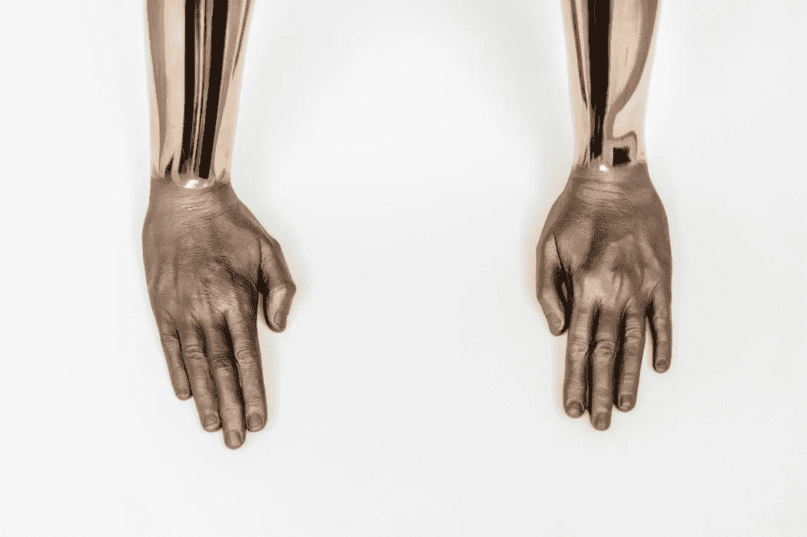
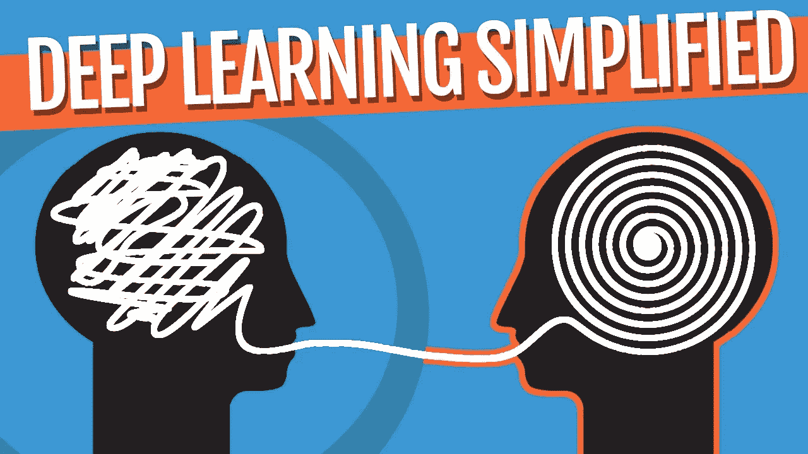
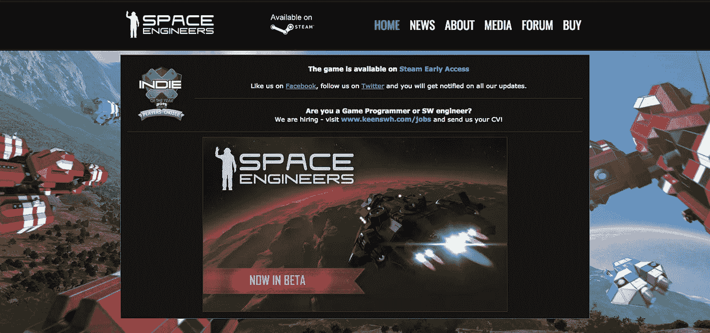
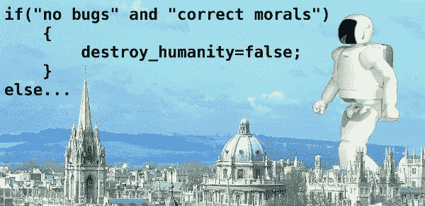

# 谷歌下一步将在 AutoML 上大展身手

> 原文：<https://medium.com/hackernoon/next-disruptive-wave-will-be-automl-4b0367347ab2>

## 宣布 AutoML

Image Source: Unsplash

## 这种转变意味着让人工智能构建人工智能的技术。

随着**技术奇点**在我们当前世界的大规模入侵，我们创造的每个人工智能执行特定任务的潜力开始爆炸。

深入技术奇点导致了一种技术的发展，在这种技术中，机器将复制自己。

**谷歌**在一年一度的 **I/O 开发者大会**上，披露了其一个古怪却又令人期待的项目，命名为— **AutoML** 。这是为了解决创建一个完整的人工智能本身最困难的部分。

AutoML by Google and Facebook

它主要围绕制作深度学习软件**。准确地说，通知其为**神经网络**选择适当的架构。**

**谷歌已经创建了一个机器学习系统，主要利用 ***强化学习*** ，这应该是一种久经考验的技术。据说这是谷歌在 msot 恶作剧中最常见的手法。**

> **该方法将有助于研究人员研究和开发高效的图像处理和语言识别系统。**

**在接受《麻省理工科技评论》采访时，谷歌提到这个项目离实用化还有很长的路要走。**

**此外，它指出了这项技术的明确用途，即它将有助于照看或处理人机学习和数据科学人才执行的任务，因为他们正在慢慢退出采用最新技术。**

> **除了谷歌的 AutoML，脸书正在研究另一个超级智能人工智能，根据 WIRED 的说法，它被称为自动机器学习工程师。**

**它也被称为 [**AutoML**](http://automl.chalearn.org/) ，它识别、选择并使用被证明可以在短时间内解决缺陷的参数。去年夏天，***AutoML Challenge***成为了一个巨大的成功，因为游戏设计师们开始面对面地组装机器学习“**黑盒**”。**

**不出所料，这些机器成功地选择了合适的模型，并在没有任何人工干预的情况下调整了参数。**

****

**Game: Space Engineers**

**赢家之一是 [*太空工程师*](http://www.spaceengineersgame.com/) 背后的工作人员，他们将他们的利润投入到组建一个专家团队，他们正在创造一个能够优化其自身*硬件*和*软件*的人工智能。**

> **虽然像这样的发明对于非专家重新分配系统会有很大的帮助，这很好，但也为机器决定自己的命运拓展了更大的可能性。**

**这也许可以理解为“**递归自我改进**，人工智能学习并把自己从一台智能机器转变为超级智能机器。**

**凭借自我学习和自我即兴创作的能力，在不久的将来，机器的智能将会大幅增长。**

****

**总的来说，在我们当前的世界中，能够做人类能做的事情的 AI，只是“**种子 AI** 版本。**

**这是人工智能和人工智能的基本水平，其他超级智能人工智能的创造肯定是具有*自我改进能力*的创造。**

## **让我们希望今天是个好天气😃**

## **再见。**