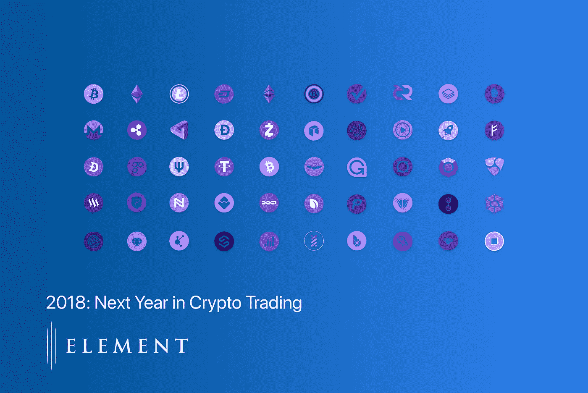

# 明年在 Crypto-11 预测 2018

> 原文：<https://medium.com/hackernoon/next-year-in-crypto-11-predictions-for-2018-7ac0e87cf18>

2017 年即将过去。加密货币市场观察人士将记得 2017 年是 ICO 繁荣、比特币的硬分叉、cryptokitties、一些重大黑客攻击的一年，也是每场晚宴都在某个时候转向谈论比特币价格的一年。今天，我们不看刚刚过去的一周，而是看等待我们的一年。当我们反思过去的一年时，我们看到了一些可能影响 2018 年市场的趋势。

以下是我们对未来一年的预测:

**1。某大交易所将被黑**

交易所领域正在迅速发展——中国关闭后，许多新进入者重新粉刷了这个领域。币安的出现和迅速占据主导地位，许多以前的大陆平台的重新启动，以及日本和韩国交易所的扩散，许多拥有其他原始技术的较小/区域性参与者的出现，将导致更多的交易所受到影响，更多的二手资金面临风险。有些是从零开始建设的。有些是买现成的。强大的安全/技术/区块链人才是不可能找到的。许多交易所将会受到攻击，而且由于宽松的运营标准和风险管理基础设施，一个主要交易所很可能会倒闭。

**2。比特币基地的极端影响将持续**

在美国，真正进入 crypto 的零售入口只有三个。比特币基地，双子座和北海巨妖。由于这一领域发展如此之快，而 MTL 各州之间的护城河又如此之宽，其他参与者的出现并进入美国银行业基础设施将需要相当长的时间。Bitfinex 实际上离开了美国市场，加剧了这种情况。Bittrex 有希望收购菲亚特，但目前还看不到其他好的解决方案。我们在美国看到的是一种有机的自然垄断，在这种情况下，分散式花园应该会蓬勃发展。即使是分散交换的梦想也预先假定了这些交换的“货币中心”的存在。

对于交易所来说，这将是有趣的一年。

**3。其他加密货币、更多期权结构和交易所交易基金的期货将会出现**

期货很容易…因为它们是现金结算工具，从根本上脱离了基础的 BTC 流动性。随着我们在 2017 年底看到的比特币期货的推出和运行，越来越多的此类产品将会出现。[我们之前评论过为什么比特币期货至关重要。](/@TheElementGrp/scrambling-for-the-future-how-the-cme-cboe-announcements-may-affect-the-bitcoin-market-fe757050e037)首先，它们代表了迎合更传统投资者的趋势，我们有信心在 2018 年看到更多产品迎合更成熟的交易受众。

ETF 很难，因为它们必须赢得硬币。他们从监管者那里获得了想象力的飞跃。他们接受一个波动可控的有序市场。BTC 的高绝对价格可能会成功。为他们在 2018 年的飞跃干杯。

**4。ALTS 将会有一次大的调整**

来得容易去得也快。许多人坐拥巨额账面收益，以换取浅薄且流动性差的硬币。许多硬币在容量有限的小型交易所交易。当大幅下跌来临时，卖家看不到买家，无法大规模出售，并寻找任何退出机会，我们将看到 alts 空间的大规模重新评级。虽然人们在谈论一级硬币的相对价值，但当这个行业真正变红时，很少有人会介入。购买下跌 85%的东西需要一定的勇气。钢铁般的意志。保持冷静，坚持下去。

**5。人群销售和有序市场将成为监管重点**

尽管“麦奇”案的判决给我们留下了几条清晰的线索，但仍有许多问题没有得到解答。董事长的声明是一种新的监管方法，正在被领先的律师事务所消化，未来的道路仍不明朗。执法姿态正在发生变化。加密律师协会期待 Q1 会议更加清晰，参与度更高。虽然在加密货币交易方面一直很安静，但一家或多家监管机构将会入股。各种形式的市场操纵——泵送和倾销企图、内幕交易、抢先交易和其他妨碍有序市场的方式。加密是第一个真正的全球市场——出现什么样的监管联盟来解决它将是有趣的。

**6。机构服务提供商将为该空间建造**

缺乏传统服务提供商(订单管理系统、对账软件、托管人等)。)让许多机构和受托人远离了加密货币。在这一类别中，合理的技术解决方案的出现将意味着一个相当大的操作风险缺口将被填补，为许多基金经理创造公平的竞争环境。2017 年出现的许多服务提供商将建立足够的跟踪记录，以证明对机构参与者的吸引力。

**7。基金经理将经历回报的分散。**

过去一年，买入并持有股票的基金经理将自己的非凡回报宣传为阿尔法并不罕见。当然，很明显，这些回报更多地与市场动态有关，而不是个人技能。随着市场不断成熟和提高效率，这一趋势将在明年发生变化。基金经理的技能和优势将变得更加明显，因为优秀的基金经理将比幸运的基金经理获得更高的回报。

**8。由于期货到期、期权到期和 ETF 再平衡，我们将会看到剧烈波动。**

随着这些新的金融产品越来越受欢迎，它们对市场趋势的影响将会更加明显。由于这些预定事件，即使是传统的股票市场每年也会经历几次高水平的波动。当期货和其他衍生品到期或需要重新平衡时，这种类型的波动性在加密货币世界中将会大一个数量级。

**9。我们将会看到至少有一家传统金融经纪公司因为对某个衍生产品的管理不善而亏损并倒闭。**

尽管有上市的期货衍生品(可能还有 ETF)，但事实是，交易和对冲基础资产仍是一项操作上棘手的考验。在一家不是加密货币交易专家的公司中，一次糟糕的交易或一行糟糕的代码可能会对利润造成不可挽回的伤害。

**10。情绪、动力和内部姿态——心理学拥有这个市场。**

有相当多的暴民心态推动着市场，因为散户投资者可以在社交媒体上进行公开的市场电话。这种表达观点的平台再加上一些好运气，让普通投资者觉得自己战无不胜，以至于他们不会去听内部人士在说什么或做什么。正如 12 月份发生的调整所证明的那样，关注内部人士的问题。很可能他们比普通人知道的更多，不管后者有多少。

**11。银行挤兑？**

在某个时候，很多人会试图将真正的法定美元撤出交易所..看到巨大的薄弱环节。从交易所获得美元完全依赖于它们的银行提供商继续合作。大多数交易所的高验证级别都有 10 万/月的取款限额…很难“兑现”和“飞到安全的地方”，而 Tether 也无济于事。如果有一个停顿呢…今年 Bitfinex 停顿的方式，但恢复了。如果加密、交换、冷钱包中的所有收益…开始变得很难兑换成美元，会怎么样？

这是一个年轻的、全球化的、风雨飘摇的、全天候的资本市场。2018 年将是它的一年。

*请务必在 Twitter 和 Medium 上关注我们，抢先了解我们对 crypto 发展的看法！*

@TheElementGrp

这是一个勇敢的新世界。