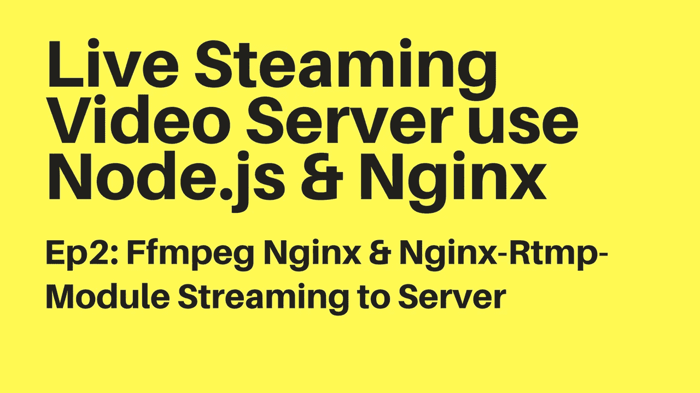

# Nginx，Nginx-Rtmp-Module & Ffmpeg 构建实时视频流服务器

> 原文：<https://medium.com/hackernoon/nginx-nginx-rtmp-module-ffmpeg-build-live-video-streaming-server-88a52f7bab6f>

本文档是在 MacOs 上设置开发环境。对于其他 Linux，如 Ubuntu 云服务器，我们将在稍后的部署任务中完成。看视频[这里](https://www.youtube.com/watch?v=TdELN27NkyY)

## 安装 Node.js

我们需要 nodejs 的开发和运行后端 resful 服务，websocket 服务器，所以要安装 Node.js 只需从官方网站下载这个包…