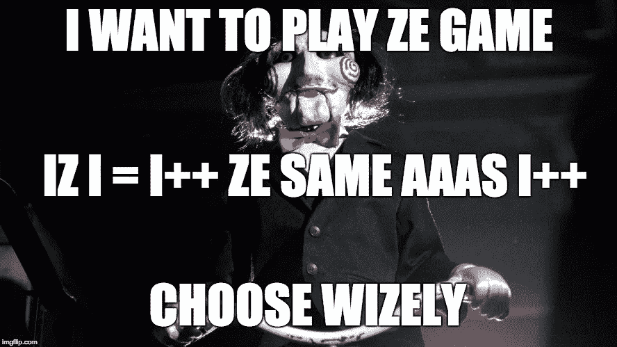
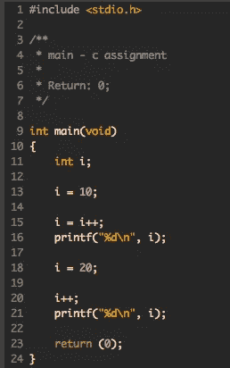
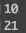
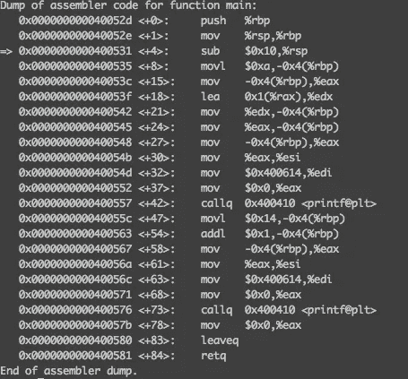
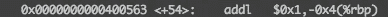

# 运营噩梦

> 原文：<https://medium.com/hackernoon/nightmare-of-operations-708dd0a67dc6>

Choose wisely or you’ll have an extra blog post assignment

我睁开眼睛。是[漆黑一片](https://hackernoon.com/tagged/pitch-black)。当我做最坏的打算时，恐慌开始了。我大声呼救，但尖叫中一道聚光灯打在了我的眼睛上，使我暂时失明。出于本能，我将手臂举到脸前挡住光线。当我的眼睛开始适应光线时，我看到了一个洋娃娃的轮廓。

几秒钟过去了，洋娃娃把头转向我，用法国口音说:

> *“我想玩 ze 游戏...Iz i = i++ ze 同 aaaz i++？”*

作为一个一个月大的软件工程学生，我回想起我所有的经历来尝试回答这个问题。

就这样，我输了。

我从床上惊起，耳边响起了手机闹铃。我向右滑动关闭我的闹钟。完全清醒，我抬头看着天花板，恢复我的梦想。

`i = i++`增加`i`然后把值分配给`i`吗？

关于这个问题的某些东西引起了人们的兴趣，让他们想更深入地研究。所以我跳下床来到我的电脑前，想弄清楚这个谜。

我戴上一些 KPOP，开始写一个简单的测试。

pretty self explanatory

程序运行时，我的心怦怦直跳。

i done messed up

妈的，你搞砸了阿伦。

在我不得不离开去上学之前，我有一段时间，所以我决定更深入地研究一下，看看汇编中到底发生了什么。

我用 gdb 打开了测试程序的可执行文件，并在 main 上设置了一个断点，这样程序就会一直运行，直到 main 返回，然后停止。

`(gdb) break main`

然后我用这个新的断点运行程序。

`(gdb) run`

最后，我想查看当前函数(main)的汇编指令，所以我使用了`disassemble`命令。

`(gdb) disassemble`

给了我这个。

assembly for test program

快速组装课。

立即值是常量，以`$`为前缀。像`$0xa`就是十六进制中的十进制 10。寄存器名称以`%`为前缀。

寄存器是计算机处理器中保存单个值的小内存空间。有两种类型的寄存器:通用寄存器和专用寄存器。在我们的代码示例中，`%eax`、`%edx`、`%esi`和`%edi`是通用寄存器，而`%rbp`和`%rsp`是专用寄存器。

前两行称为函数前同步码。这将旧的基指针推到堆栈上，以便以后保存。然后，它将堆栈指针的值复制到基指针。所以在前两行之后，`%rbp`将指向 main 堆栈框架的底部。

跳过几行，我们可以看到十六进制的值`$0xa`被`movl`指令复制到`-0x4(%rbp)`中。`movl`与`mov`命令相同，但 l 表示操作数将是一个`long`。`-0x4(%rbp)`与`%rbp + -0x4`相同，因为堆栈向下增长，所以从当前堆栈帧的基数减去 4 实际上是访问当前帧本身。这是本地变量`i`存储的地方。所以`$0xa`被复制到局部变量`i`中。

下一行是有趣的地方。

`lea`指令有点像`mov`指令。`mov`使用类似`mov <destination>, <source>`的语法，将内容从源移动到目的地。

然而，`lea`将源地址移动到目的地址。它计算由第二个操作数指定的地址，就好像要从该操作数加载或存储数据一样，但是它将计算出的地址存储到由第一个操作数指定的寄存器中。

所以上面指令的意思是`%edx = %rax + 1`。

然后在下一行我们看到。

这将把值为`$0xa`的局部变量`i`的内容移动到`%edx`中。所以这个操作存储在另一个临时寄存器中，而不是原来的寄存器中。所以增量完成了，只是在另一个临时寄存器中。

然后我将它与`i++`的第二次测试进行了比较。

这给`i`增加了`$0x1`。

这解释了为什么`i = i++`返回`i`而不是`i + 1`。

所以问题的关键是一个评价顺序的问题。

所以当`i = i++`被编译时:

1.  `i`的值被复制到一个临时位置
2.  临时值递增并保存为新值(不覆盖)
3.  新值存储在`i`中
4.  然后`i`返回临时值，与原始值相同

找到答案后，我收拾好东西，准备去上学。

我到达学校时正好赶上我们的同伴学习日。

当我的同事开始复习上周的作业时，我倾听并参与其中。然后不知从哪里，我听到了同样带着法国口音的问题:

# Iz i = i++ ze 同 aaaz i++？

> [黑客中午](http://bit.ly/Hackernoon)是黑客如何开始他们的下午。我们是阿妹家庭的一员。我们现在[接受投稿](http://bit.ly/hackernoonsubmission)并乐意[讨论广告&赞助](mailto:partners@amipublications.com)机会。
> 
> 如果你喜欢这个故事，我们推荐你阅读我们的[最新科技故事](http://bit.ly/hackernoonlatestt)和[趋势科技故事](https://hackernoon.com/trending)。直到下一次，不要把世界的现实想当然！

