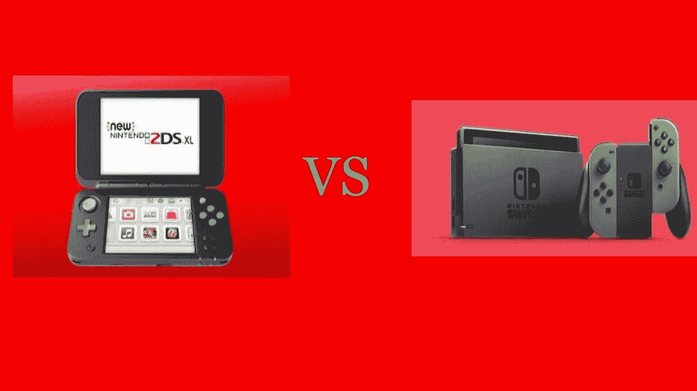

# 任天堂是自己最大的竞争对手

> 原文：<https://medium.com/hackernoon/nintendo-is-its-own-biggest-competitor-6eea078434e3>

## 任天堂对 2/3DS 的支持是如何让 Switch 的成功变得复杂的

We already know who will lose, but it’s not going to give up.

任天堂 Switch 的头两个月绝对可以被认为是成功的，因为它连续两个月高居游戏机销售排行榜榜首。当你与史上最畅销的 [Playstation](https://hackernoon.com/tagged/playstation) 和史上最畅销的 Xbox 竞争时，这可不是一个小壮举。但更令人印象深刻的是，尽管 Switch 存在各种问题，尽管他们坚持蚕食自己的成功，但任天堂仍实现了这一目标。

我想我们都同意，Switch 是任天堂证明它仍然可以成为游戏机制造商的最后机会，失败将意味着他们不得不转向专门为其他游戏机和移动设备开发软件。通常，当你有最后一次机会做某事时，你会尽最大努力，利用你所有的资源去成功。嗯，不是任天堂。

这个开关显然是一个移动控制台，不管[任天堂多么坚持它不是](https://www.gamefaqs.com/boards/189706-nintendo-switch/74857322)。但是因为他们觉得这不是掌机，所以不会放过 3DS 系统。他们刚刚[宣布了*新的任天堂 2DS XL*](https://www.polygon.com/2017/4/27/15463942/new-nintendo-2ds-xl-release-date-price) (是的，他们仍然像 1990 年一样给他们的产品起无限长的名字)，这基本上是一个没有 3D 屏幕的 3DS。他们究竟想借此达到什么目的？每售出一台 2/3DS 系统，就会少购买一台交换机。不仅如此，2/3DS 系统卖得越多，为它们开发的游戏就越多，为 Switch 开发的就越少。

假设一下，2/3DS 死了。是的，截至 2016 年底，它的销量已经超过 65 毫米，这在移动游戏时代是一个令人印象深刻的手持设备，但这些 2/3DS 用户中有多少人仍然在使用它？让我告诉你，很少。如果我们看看[这个月的 NPD 软件销售排行榜](https://venturebeat.com/2017/05/18/april-2017-npd/)没有一款 2/3DS 游戏上榜，尽管这个月发布了《马里奥体育巨星》,而且自《口袋妖怪太阳/月亮》发布以来还没有一款游戏上榜。另一方面，Switch 在 4 月份占据了最畅销游戏的前 1 名和前 3 名，在 3 月份占据了最畅销游戏的前 1 名，销量“仅”超过 300 万台。这意味着在售出的 65 毫米 2/3DS 系统中，可能只有不到 3 毫米仍在使用。

那么，任天堂究竟为什么要推出这款游戏机的升级版并进行推广呢？更明智的做法是将这笔钱投入到更多的 R&D、营销或交换机软件上。但是，嘿，这是任天堂。他们和我们生活在不同的空间。

然而他们并不满足于此，他们还利用自己的资源继续为 2/3DS 开发游戏。马里奥体育巨星，曾经的绿洲，嘿！Pikmin，Layton 的神秘之旅，Swapdoodle，Miitopia，3 Kirby games 和 Fire 徽回声正在由任天堂出版和/或开发。这 10 款游戏是为一个死系统开发的，任天堂已经推出了它的继任者。一个被批评缺少游戏的继任者。这些资源应该花在为 Switch 创造几个非常高质量的游戏上，而不是 10 个可能会变得平庸的游戏，除了火徽最有可能。3DS 已经有了 2 个火徽游戏，他们应该利用这些资源来改进为 Switch 开发的火徽游戏。此外，他们不应该制作 3 个 Kirby 游戏来庆祝专营权的周年纪念，而是应该制作一个好的 Switch 游戏来使专营权再次相关。

第三方正在为 3DS 开发大量游戏，所以对于那些买不起/不想买 Switch 的人来说，任天堂不会让系统没有游戏可玩。这肯定会给市场一个信号，尽管就任天堂的优先事项和它将支持什么而言，给出版商和开发商一个确定性，他们在开发 Switch 上的投资将得到任天堂的支持。

索尼/微软是否在他们的新一代游戏机发布后开发了 PS3/Xbox 360 独占游戏？当然不是。让我们希望任天堂在击沉他们的最后一艘船之前及时纠正他们的航向。

> [黑客中午](http://bit.ly/Hackernoon)是黑客如何开始他们的下午。我们是 [@AMI](http://bit.ly/atAMIatAMI) 家庭的一员。我们现在[接受投稿](http://bit.ly/hackernoonsubmission)，并乐意[讨论广告&赞助](mailto:partners@amipublications.com)机会。
> 
> 如果你喜欢这个故事，我们推荐你阅读我们的[最新科技故事](http://bit.ly/hackernoonlatestt)和[趋势科技故事](https://hackernoon.com/trending)。直到下一次，不要把世界的现实想当然！

