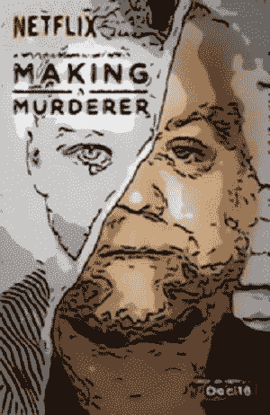

# 没有 BS 评论。制造一个杀人犯

> 原文：<https://medium.com/hackernoon/no-bs-review-making-a-murderer-9b1675788492>

## 我是一个糟糕的评论家。我没有记笔记的习惯，也缺乏耐心去解释那些让事情变得伟大、好、坏或糟糕的大大小小的事情。

## 但我是一个很好的说服者。我棒极了。包在你头上的锡纸再多也无法阻止我控制你的思想。

我有一种可怕的力量，你应该感谢你的幸运星，我只用它做好事，从不作恶。

我把我的评论叫做废话。不废话。它们简短扼要。我不按字数收费，而且**我从未看过一部特吕弗的电影。我认为《2001 太空漫游》很无聊，而且我不用斜体或外来词。**

我的评论不是废话，因为我告诉你我喜欢什么，不喜欢什么，以及为什么。然后我做了一件类似瓦肯人思维融合的事情，我告诉你要么看，要么不看。

# 没有 BS 评论。制造一个杀人犯

这是一部 10 集的纪录片，每集一小时。这太不可思议了，自从我看了这部电影，我就一直在想它。我已经和我的朋友以及不是我朋友的人讨论过了。这是令人不安的，它让你想知道这样一个大系统怎么会变得如此错误，它让你想知道也许我们都在其中运行的小系统也可能在它们自己更小的方面是错误的。

**我兴致勃勃地看着《杀人狂》，整个过程就像一个胖孩子吃巧克力蛋糕一样狼吞虎咽。**

我喜欢它。

你一定要看看。**(一定要看)**

最初发表于[亚当·汤森](http://www.adamtownsend.me/)

 [## 没有 BS 评论。制造一个杀人犯-亚当·汤森

### 我有一种可怕的力量，你应该感谢你的幸运星，我只用它做好事，从不做坏事。我把我的评论叫做…

www.adamtownsend.me](http://www.adamtownsend.me/no-bs-review-making-a-murderer/) 

> [黑客中午](http://bit.ly/Hackernoon)是黑客如何开始他们的下午。我们是阿妹家庭的一员。我们现在[接受投稿](http://bit.ly/hackernoonsubmission)并乐意[讨论广告&赞助](mailto:partners@amipublications.com)机会。
> 
> 如果你喜欢这个故事，我们推荐你阅读我们的[最新科技故事](http://bit.ly/hackernoonlatestt)和[趋势科技故事](https://hackernoon.com/trending)。直到下一次，不要把世界的现实想当然！

