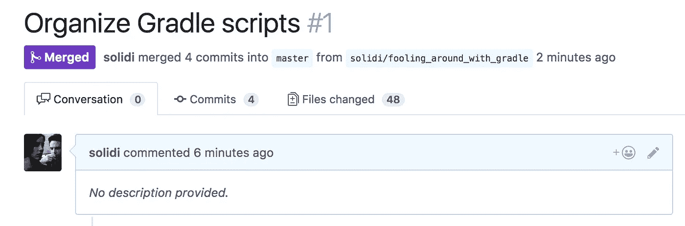
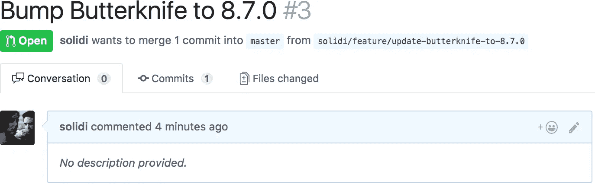
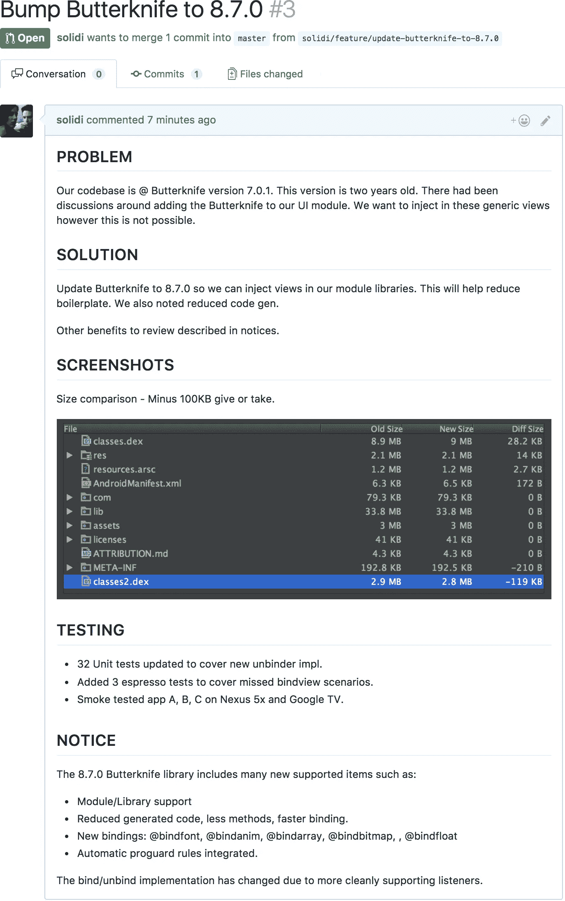
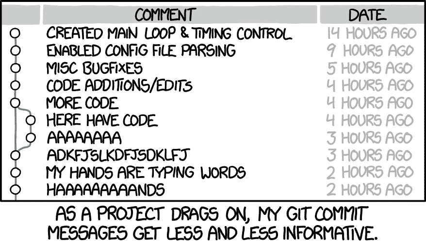
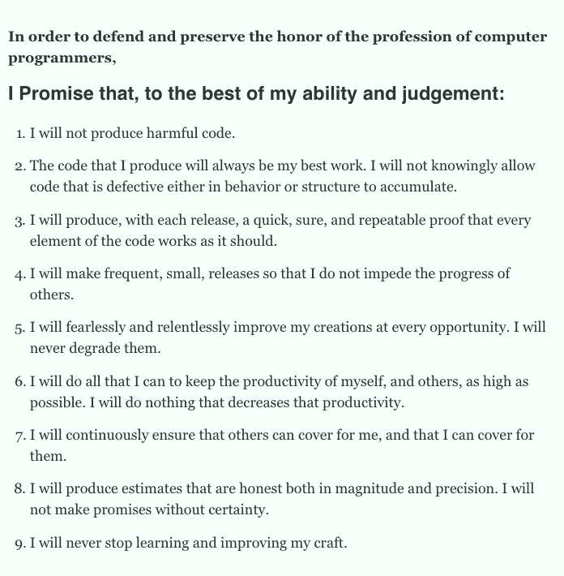

# 未提供描述

> 原文：<https://medium.com/hackernoon/no-description-provided-8d9e0f3a3abb>

## 通过识别代码评审模板来解释上下文

几个月前，我的一个同事推荐了一本书。出于好奇，我读了《智人:人类简史》。

这是一本引人入胜的读物，有许多值得思考的地方。随着各章节主题的交织，一篇被认为具有煽动性但易于理解的文章不断涌现。

[尤瓦尔](http://www.ynharari.com/)形容人类在大群体中进行合作；他们必须创造出被理解和重视的有序模式。如图所示，一种*神秘胶水*。

我质疑，有没有[这种胶水](/hackernoon/software-is-unlike-construction-c0284ee4b723)适用于我们工科专业？作为工程专业人员，我们是否有一种我们珍视的神秘纽带？

# 拉请求中的所有内容

毫无疑问，[拉请求](https://help.github.com/articles/about-pull-requests/)，或者说代码审查，已经成为每一个互动和贡献的开发团队的生命线。拉式请求是团队文化以某种方式存在的地方。从某种意义上说，这就是团队沟通和决策的方式。

正如尤瓦尔所描述的自由市场体系、货币和其他有价值的结构，我们作为工程专业人员相信拉动式请求。我们都明白什么是代码审查，它提供了什么价值。

还是我们？

在经历了许多其他代码评审之后，有些事情不太对劲。没有描述清楚地指出变更的*意图*。对于那些描述差异的人来说，他们显得杂乱和不一致。

价值，胶水，被稀释，粘合不好。当问题没有被描述时，拉取请求的成本是多少？

Perhaps the engineer was in a rush? The commit message was no better, and the commit diff was unclear.

软件工程最关键的方面是描述变更的意图。作为专业人士，我们必须解释*为什么*。

因为我们的手艺是全球性的，听力范围内的谈话是不行的。部落团队的知识也是不够的。描述必须是作为记录*的*文本*。*

那么，解决办法是什么呢？

# 呼唤统一的拉式请求模板

一段时间以来，社区一直在努力处理拉请求。社区里有很多[帖子](/google-developer-experts/a-comprehensive-introduction-to-perform-an-efficient-android-code-review-75975ccaa20a)让他们做得更好。

一些最好的例子提供了首选的[模板](https://github.com/blog/2111-issue-and-pull-request-templates)，指导贡献者回答特定的问题。模板是理解变更描述的好方法。

然而，社区还没有找到伪造描述性拉取请求的答案。许多专业团队经常跳过描述，错过了增强凝聚力的好机会。

# 一个例子

按照熟悉的节奏，工程团队必须更新外部依赖关系。这些更新发生的模式仍是个谜。

What are we trying to solve? What’s the gain?

*谷歌一下“黄油刀”*这个库是一个面向 Android 的视图依赖注入 SDK。但是，为什么会有颠簸呢？我们要解决什么？

An apparent problem and solution. Find the template [here](https://gist.github.com/solidi/6be9d733b40fd1b40d5f2d7c745d731b).

好吧，现在我们明白了。团队了解需要改进的*机会*。

描述指出了问题、解决方案和原因。该模板强调了测试、代码覆盖、度量变更以及其他[自动化和交流具体变更的独特方式](/square-corner-blog/surfacing-hidden-change-to-pull-requests-6a371266e479)。

统一模板的定义必须从一个*问题*和*解决方案*开始。一个团队应该意识到如何通过一个模板来传达变更，并且[友好地拒绝](https://www.jeffgeerling.com/blog/2016/why-i-close-prs-oss-project-maintainer-notes)那些没有展示它们的拉请求。

该模板给持续集成和交付系统中的灌篮原子合并提交消息带来了额外的好处。

# 提交可能是过度的

如果主题标题和描述不清楚，提交就没有价值。

[https://xkcd.com/1296/](https://xkcd.com/1296/)

事实上，这些年来有很多关于这些问题的帖子。非描述性提交最直接的解决方案是遵循 [50/72 规则](https://stackoverflow.com/questions/2290016/git-commit-messages-50-72-formatting)。这条规则鼓励以特定的方式传递主题和正文信息。

然而，大多数工程师并不遵循 50/72。一些工程师认为在主题标题后面加上句号是可以的。他们的提交包含票号，对于一些经验丰富的工程师来说，这些提交完全是谎言，没有恶意。提交消息几乎太难得到正确的。编写代码更加容易。

有一种哲学观点质疑提交的价值，即使写得很干净。我们应该关心步骤，还是应该只关心拉请求合并，只要它是良好的，并且不会让任何人理解？

有人会说，在大多数专业工程团队中，拉请求的合并提交是基本的描述，而不是形成它的小迭代。理由很简单。我们不是能在任何时候准确记住超过七次提交的机器，[加上或减去两次](https://en.wikipedia.org/wiki/The_Magical_Number_Seven,_Plus_or_Minus_Two)。有些团队还会压缩和重定基础，所以提交是微不足道的。

这个难题没有正确的答案。唯一真正不变的是拉请求模板，即版本控制系统中描述和记录的机会。

# 值是一种描述

拉请求花费的时间和编写遵循一致模式的干净代码一样多。代码被测试覆盖。我们重视拉取请求，因为它们服务于工程团队中的交叉授粉，并保护对商业、代理等有价值的用户体验。

工程师需要解决难题。第一步是写下问题是什么，为什么，以及我们如何着手解决它。有时在整个链式拉取请求中分阶段进行。

> 计算机科学中有两个难题:缓存失效、命名事物和一个接一个的错误。
> 
> — [未知](https://twitter.com/codinghorror/status/506010907021828096?lang=en)

*命名*事情很难。然而,*描述*事物更加困难，而且错误百出。作为专业人员，我们必须尽我们所能，根据*上下文*定义变革的意图。

> 最正确的代码是没有写出来的，但最正确的描述是写出来的。

如果我们不尽最大努力描述变化，上下文就会丢失。这种实践的缺乏对未来的贡献者和商业伙伴、机构和其他人都是不利的。

那么我们如何体现和捕捉上下文描述的价值，以便其他工程专业人员理解呢？

# 扩展鲍勃叔叔的程序员誓言

作为一个有组织的团体，我们的社区正在讨论我们的工程专业。我们只要看看鲍勃叔叔发出的这些烟雾信号就够了。

一段时间以来，他敦促我们作为工程师，或者说程序员，要体现一套具体的原则；否则，政府机构会替我们做。

鲍勃大叔的论点包括与其他专业团体的比较。一个这样的例子描述了病人是如何死于医疗行业缺乏绝育手术的；随着软件蚕食世界，一大批人将面临风险。医学专业人士不了解就像工程专业人士不了解一样，直到为时已晚。

为了纠正这些问题，医疗专业人员组织并形成了坚持如绝育技术的指导方针。这些医疗专业人员能够把他们的座右铭交给这些机构，因此他们制定了自己的规则。鲍勃叔叔对我们的要求也是如此。

他将被证明是正确的，这将发生在我们的有生之年。然而，问题是，作为一个有组织的专业团体，我们准备好接受这个挑战了吗？为了回答这个困境，鲍勃大叔创造了[程序员誓言](http://blog.cleancoder.com/uncle-bob/2015/11/18/TheProgrammersOath.html)。

誓言中有以上坚实的要点。鲍勃叔叔为我们创造了一种强力胶。然而，他错过了一个基本规则，我想提供一个扩展。

> 10.我将尽我所能传达尽可能多的改变意图。

第十条规则的要点是强制执行誓言中的所有其他规则。我们是尽最大努力进行交流的作家。

将我们作为[软件工程师](https://dev.to/solidi/what-is-a-software-engineer-anyway-3fb2)结合在一起的神秘胶水很多。其中一个纽带就是我们重视拉取请求。让我们尽自己的一份力量来详细描述*问题*和*解决方案*的背景，以便其他人能够及时做出贡献并保护我们的用户。它从思考和解释问题“是什么”开始。然后，我们必须用手头的新*机会*来描述解决方案。所有工程专业人员都应坚持最终传达变更意图。