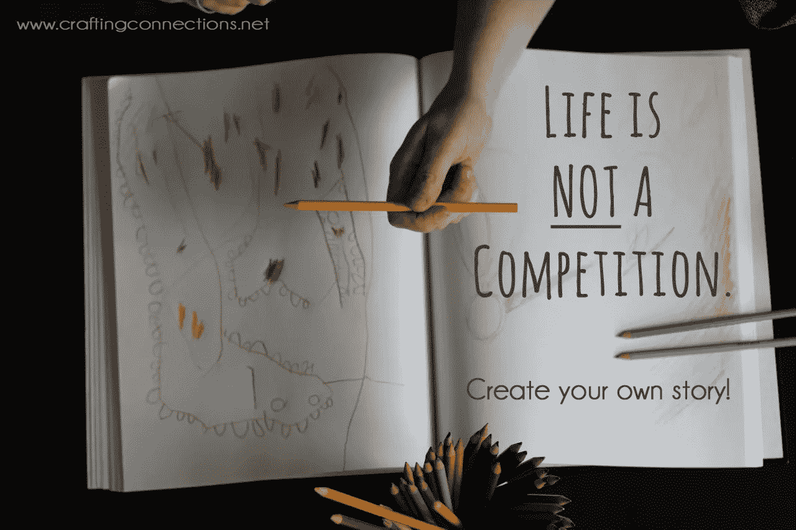

# 不，Kaggle 不适合学 AI & ML。给本·哈姆纳的回信

> 原文：<https://medium.com/hackernoon/no-kaggle-is-unsuitable-to-study-ai-ml-a-reply-to-ben-hamner-27283878cede>

人工智能和机器学习正在推动各行各业数十亿美元的收入。为了从这些不断增长的机会中受益，学生们纷纷涌向这个领域，他们中的许多人想知道如何获得这些宝贵的技能。他们可能会对丰富的网上资源感到有点失落和不知所措。

在最近的 Quora 会议上，Kaggle 首席技术官 Ben Hamner 概述了他对学习机器学习的建议。

事实上，本·哈姆纳把好的建议和宣传材料混在了一起。这加剧了混乱。事实是，Kaggle 对于现实世界的问题并不那么有用，尤其是如果你想在这个数十亿美元的市场上分一杯羹的话。

在这篇文章中，我提出了另一种更有用、更现实的学习方法。在帖子的最后，我建议一个替代平台， [Startcrowd](http://www.startcrowd.club) ，来构建真实世界的人工智能产品，而不是统计模型。

# 从在线课程开始

Start with online courses, but move on quickly!

如果你是从零开始，没有编码技能，也没有数据科学经验，我个人推荐 Codecademy 上的 [Python 课程](https://www.codecademy.com/learn/python)，Coursera 上的[吴恩达 ML 课程](https://www.coursera.org/learn/machine-learning)，Udacity 上的[数据科学导论](https://www.udacity.com/course/intro-to-data-science--ud359)，以及关于[卷积神经网络](http://cs231n.stanford.edu/)和 [NLP](http://web.stanford.edu/class/cs224n/) 的斯坦福课程。还有许多其他好的课程，每天都有新的课程出现，但不要停留在这个热身阶段。尽快跳起来练习。

# 找到一个你喜欢的问题，然后建立一个快速的解决方案

Pick ideas from various sources

我基本上同意本在他的文章中概述的前两步。重要的是从你喜欢的问题开始，以便随着时间的推移保持动力。有很多方法可以找到灵感:看看 AI 如何解决你自己的问题。看新闻， [Quora](https://quora.com) 。浏览[的学术论文](https://github.com/terryum/awesome-deep-learning-papers)。看看 AI 创业公司在 [AngelList](https://angel.co/) 和 [F6S](https://www.f6s.com/) 上的作品。而且是的，在某种程度上，看看 [Kaggle](https://kaggle.com) 。

第二，建立一个快速和肮脏的解决方案。避免重新发明轮子总是更好，所以 [Github](http://www.github.com) 和 [Stackoverflow](http://www.stackoverflow.com) 是你最好的朋友。尝试建立在他人的工作之上是一个很好的练习，即使贡献微乎其微。抓住你能找到的任何东西，Kaggle 上可能会有一些好东西。

# **根据客户反馈改进您的初始解决方案**

我强烈反对本的第三步。下一步不应该是提高初始解决方案的性能。这是一个大错误。

相反，是时候开始行动了:准备一个演示。向潜在用户展示您的解决方案。将你的模型包装成一个网络应用程序，一个可视化，一个视频剪辑，一篇博客文章，等等。例如，我准备了一个简单的面部识别演示，基于 [OpenFace 库](https://cmusatyalab.github.io/openface/):

Show a demo to get feedback

除了数据科学之外，与用户交流可能需要额外的技能:其他编码技能(HTML、Javascript、SQL、devo PS……)、讲故事，或者仅仅是人类社交技能。在这里，与其他人合作会很有效。

所以为了改进，听听用户的反馈。您需要以客户为中心的解决方案，而不是以数据为中心的解决方案。Kaggle 排行榜有那么重要吗？它能支付你的账单吗？

在我的面部识别演示中，反馈主要是隐私问题:许多人仍然觉得面部识别令人讨厌。很少有人担心 OpenFace 只有 91%的准确率。

找出你的解决方案没有被采纳的原因:是客户接触(营销…)？用户体验(设计…)？时机和有用性(产品-市场适合…)？还是模型性能差？

如果性能确实是个问题，那么你可以遵循 Ben 的第三个建议:获取更多数据，改进数据清理，或者像 Kaggle 玩家一样优化模型。

# 快速迭代并构建您的真实项目组合

如果你的产品符合市场，恭喜你，继续前进。否则，要坚持。或者用另一种产品再试一次，或者用另一个市场，看你的心情。

为了更快地迭代，遵循“先卖，后建”的方法:首先关注营销和销售方面的东西，抛出一个没有自己产品的登陆页面(就像我在这里做的)，如果你吸引了客户的注意力，就建一个原型。在采用这种方法之前，最好先掌握构建原型的技巧。

如果你所有的计划都失败了，你的现金用完了，那么你可以开始面试机器学习的职位。通过与世界上最好的雇主一起工作，你现在有了一份令人惊叹的简历:你。

在求职面试中，招聘人员会欣赏你在现实世界中的经历，以及你对人工智能行业的深刻理解。这将比你过度设计的 Kaggle 解决方案更令人印象深刻。

# 不要在 Kaggle 上浪费你的时间

Kaggle 是狭窄的。在一场与成千上万的参与者对抗的 Kaggle 比赛中尽你最大的努力是一种可怕的浪费，并且有巨大的机会成本:有如此多的原始问题存在，却没有人去解决。在自己的比赛中成为第一名。你应该强迫自己去发现那些机会，而不是等着被 Kaggle 一勺一勺喂。这是对每个人都在谈论的数十亿美元人工智能进行投资的最佳方式。

> 如果(像体育一样)将竞争置于一切之上，科学就会被毁掉。[伯努瓦·曼德尔布罗](http://www-history.mcs.st-and.ac.uk/Day_files/Day1120.html)

另一方面，考虑到赞助商奖品的价值和大量的竞争者，平均卡格勒的期望工资率低于 2 美元/小时。

醒醒吧，离开这个狡猾的剥削计划。

# 该不该加入另类平台学习 ML &AI？

Platforms should be community-owned, to avoid acquisitions by big corporations

Kaggle 肯定不是数据科学的家园:也许是数据科学的体育场，或者只是它的沙箱。数据科学是无家可归的，这个领域太广了，不能局限于单个平台。

不过我还是觉得学习 AI 可以通过合适的平台来促成。毕竟 Github 和 Stackoverflow 是真正有帮助的平台，一定程度上填补了这个需求。

在我概述的备选研究过程中，有许多痛点:很难获得市场能见度，很难与其他人合作，等等。一般来说，孵化器和加速器应该解决这些痛点。然而，它们往往是不够的。这就是为什么我建议一个新的平台来构建 AI 产品。在我看来，这个平台应该是:

*   社区所有，设计上不可及。
*   真正的协作:积累贡献应该是平台的核心，而不是像 Kaggle 那样的副产品。
*   奖励高质量的贡献，避免“柠檬问题”。

我准备了一个非常初步的原型，来看看[这里](https://startcrowd.club)。

*协同打造 AI 产品*[*www . start crowd . club*](https://startcrowd.club)

> [黑客中午](http://bit.ly/Hackernoon)是黑客如何开始他们的下午。我们是阿妹家庭的一员。我们现在[接受投稿](http://bit.ly/hackernoonsubmission)并乐意[讨论广告&赞助](mailto:partners@amipublications.com)机会。
> 
> 如果你喜欢这个故事，我们推荐你阅读我们的[最新科技故事](http://bit.ly/hackernoonlatestt)和[趋势科技故事](https://hackernoon.com/trending)。直到下一次，不要把世界的现实想当然！

