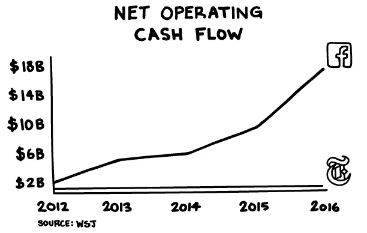
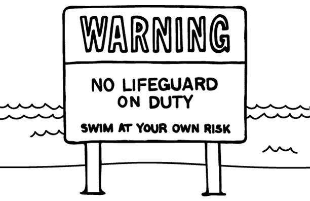
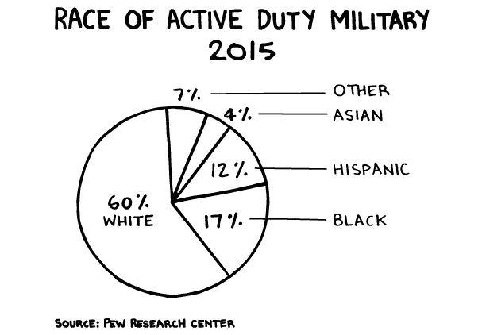

# 没有怜悯/没有恶意:给大型科技公司的 12 个问题

> 原文：<https://medium.com/hackernoon/no-mercy-no-malice-12-questions-for-big-tech-b8081402a3d5>

*每周随想来自* [*斯科特*加洛韦](https://medium.com/u/a76508074bec?source=post_page-----b8081402a3d5--------------------------------)

[脸书](https://hackernoon.com/tagged/facebook)、[谷歌](https://hackernoon.com/tagged/google)和推特本周已经与政府机构举行了[听证会，讨论他们在俄国入侵我们选举中的责任。以下是我想问他们的一些问题:](https://www.washingtonpost.com/news/the-switch/wp/2017/10/31/facebook-google-and-twitter-are-set-to-testify-on-capitol-hill-heres-what-to-expect/?utm_term=.b0dcfd65c367)

1.请举起你的右手，告诉我你是不是传媒公司，烟草是否会上瘾。

2.你似乎已经接受了媒体公司的名气、影响力和利润，但没有接受它的责任。为什么？

3.脸书对被指责为外国干涉工具的回应已经从一个"[疯狂的想法](https://www.theguardian.com/technology/2016/nov/10/facebook-fake-news-us-election-mark-zuckerberg-donald-trump)发展到承认"[数百万](https://www.theverge.com/2017/10/2/16405974/facebook-russian-election-ads-10-million-viewers)的广告，再到"[数亿](https://www.nytimes.com/2017/10/30/technology/facebook-google-russia.html?_r=1)"情况会变得多糟？

4.如果一家公司有意或无意地被俄罗斯情报机构武器化，关闭这家公司难道不是负责任的做法吗？

5.克利夫兰骑士队的平均年龄是 29 岁。底特律雄狮队也是 29 岁。一名脸书员工的平均年龄是 28 岁(T21)。脸书管理层是否没有历史背景来理解第四等级在我们社会中的重要作用？

6.当你声称不可能确保你的平台不武器化时，你的意思不就是“无利可图”吗？它可以被停止，但会对你的自由现金流造成实质性的损害。你不是选择了利润而不是国家吗？

7.如果《纽约时报》能够用 1 亿美元的自由现金流阻止武器化，为什么脸书不能用 160 亿美元呢？

8.你是否无意中犯下了非自愿叛国罪？

9.当你派首席执行官去预定和产品发布会和座谈会，却派[律师](https://www.recode.net/2017/10/31/16562342/facebook-russia-congress-google-twitter-lawyers-ads)去讨论我们的民主，这对美国人来说意味着什么？

10.你的商业模式不就是拥有一个没有救生员的游泳池吗——[不顾](http://www.reuters.com/article/us-facebook-results/facebook-profit-soars-with-no-sign-of-impact-from-russia-scandal-idUSKBN1D15SS)[风险](https://www.washingtonpost.com/business/economy/russians-took-a-page-from-corporate-america-by-using-facebook-tool-to-id-and-influence-voters/2017/10/02/681e40d8-a7c5-11e7-850e-2bdd1236be5d_story.html?utm_term=.ee55a821a552)而盈利？

11.你能像各大报纸、电视和数字媒体公司的首席执行官一样，向我们保证这种情况不会再发生吗？

12.如果你不能做出和其他媒体 CEO 一样的承诺，难道你的公司不应该保证额外的监督或监管吗？

# 从未送达

我从未在军队服役。我 16 岁的时候，伊朗革命者袭击了美国驻德黑兰大使馆，劫持了 52 名美国人作为人质。我妈妈尽了自己的职责，开始担心如果美国参战，我可能会被征召入伍。她最初的记忆是在闪电战期间住在伦敦，以及所有的年轻人是如何“去和杰里战斗”的经过六个月愤怒的写信和填表，我妈妈为我争取到了英国公民身份。我很安全。但她的缓解是短暂的。我们收到了女王陛下的通知，我需要在英国武装部队登记征兵。初露端倪的福克兰群岛危机提醒英国，它需要巩固自己的地位。

当我 17 岁的时候，我爸爸带我去了马里兰，我们游览了安纳波利斯。他希望这会激起我对海军的兴趣——他曾在皇家海军服役。我父亲告诉我，如果我去安纳波利斯上学，那是免费的，他会用为大学学费预留的资金给我买辆跑车。突然，我开始想象自己穿着经过认证的海军斜纹布。校园令人印象深刻。那天晚上晚些时候，我们去看电影，看了*——我、我爸爸和 400 名海军军官候补生。我注意到了帅气的制服，男人们的健康([仍然主要是 80 年代的男人](https://www.washingtonpost.com/news/grade-point/wp/2016/03/04/forty-years-of-women-at-the-u-s-naval-academy/?utm_term=.bf21abad2a6b))，以及他们是多么的守纪律和守规矩。回到韦斯特伍德，一个挤满 19 岁男人的剧院在看《动物之家》。*

*在参观过程中，我们了解到我们需要得到一位参议员的推荐信才能申请。那一刻我知道这不会发生。我们来自一个中下阶层的家庭，我们缺乏信心向参议员提出这样的问题。当你还是个孩子的时候，处于下半部分会产生一种侵蚀你自信的心态。我想，参议员们只有时间给有钱人，而且做梦也不会打电话来询问。顺便说一句，我相当肯定如果一个孩子打电话给他的参议员，要求这种类型的关注，办公室会认真对待。直到我开始在大学里，在一个更加公平的竞争环境中，和富家子弟混在一起，我才获得了自信和渴望去超越自己的能力。大一秋季的聚会、新朋友和足球比赛减轻了不能去安纳波利斯的打击。*

*我感到有些内疚，但更多的是失望，我从来没有服务。我喜欢认为自己是一个爱国者，并记录由于他人的牺牲而赋予我的巨大祝福。在斯特恩商学院，我们有一个很棒的项目，为退伍军人提供经济援助。他们是令人印象深刻的年轻男女。自律，坚强，有一种自我意识，这种自我意识来自于成为比自己更伟大的事物的一部分。*

*当你看到一个受伤的孩子时，这种牺牲是显而易见的，也是不和谐的。我的一个学生有一张 16 岁的脸，但是他的轮椅却让他看起来老了 30 岁。看到有人在行动中受伤，不仅会让你感受到这些年轻人的牺牲，还会让你感受到我们中的大多数人为国家付出的是多么少。如果我们有办法，我们几乎可以外包任何事情。我们的经济在各个层面都得到了优化，原因之一就是财富。*

*来自富裕家庭的孩子比来自低收入家庭的孩子上常春藤盟校的可能性高 77 倍(T2)。因此，普遍的看法是，我们的军队被低收入家庭的孩子所占据，他们的选择更少。这种看法是错误的。实际上，平均而言，应征入伍的士兵比普通美国人受教育程度更高，来自更富裕的家庭。此外，我们武装部队的种族构成与更广泛的人口相似。试图给士兵分配一个人口特征是徒劳的，而且没有抓住要点。他们没有种族或经济方面的束缚，但我们大多数人永远不会拥有的东西:成为比我们自己更大的事情的一部分的勇气，这涉及到真正的牺牲和风险。*

**

*汤姆·布罗考称参加二战的美国人为“最伟大的一代”，他们响应号召，为国效力。我很确定这是两代人之间谁更好/更坏的统计数据。然而，在这一代年轻人中，有一些人没有被召唤，但仍然服务。知道这一点肯定是有益的，不管他们在地球上剩余的时间里取得了什么成就，他们的生活是有目的的。*

*我们都在寻找一些需要大量投资才能有回报的东西(孩子、事业成功、人性的改善)，这样我们就不会带着空虚和一个困扰我们的可怕问题离开这个生活:*

*做了。我的。生活。有。意思？*

*这些年轻的男女已经检查了那个盒子。他们服过役。*

 *生活如此丰富，斯科特*

**订阅* [*没有怜悯/没有恶意*](https://www.l2inc.com/daily-insights/no-mercy-no-malice?utm_source=mediumblog&utm_medium=mediumblog&utm_content=tethered&utm_campaign=mediumblog) *在你的收件箱里获得每周的沉思。**

**最初发表于*[*www.l2inc.com*](https://www.l2inc.com/daily-insights/no-mercy-no-malice/12-questions-for-big-tech)*。**