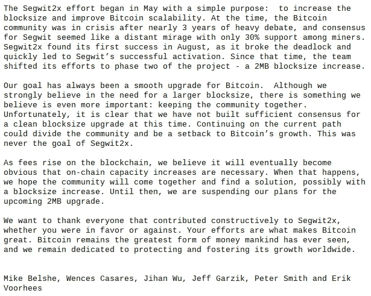

# 不再有 2x:由于缺乏共识，比特币硬分叉被取消

> 原文：<https://medium.com/hackernoon/no-more-2x-bitcoin-hard-fork-cancelled-due-to-lack-of-consensus-dca8775c3434>

这是正式的，没有更硬的叉子。

今天透露，有争议的比特币缩放提案 Segwit2x 背后的组织者和开发者暂时停止了软件升级的官方集成。

从广义上讲，Segwit2x 的一般目的是增加比特币在 494，784 块的块大小，这将在 11 月 16 日左右发生。然而，由于比特币社区内部缺乏协议和共识，2x 提案背后的团队已经决定暂停区块链的官方升级。

BitGo 的首席执行官兼 Segwit2x 项目的主要负责人 Mike Belshe 今天早些时候宣布了这一消息。在一封电子邮件中，Mike 声称扩展提案太有争议，无法推进。

他指出:

> “我们的目标一直是比特币的平稳升级。尽管我们坚信需要更大的块大小，但我们认为还有更重要的事情:保持社区的团结。不幸的是，很明显，我们目前还没有就
> 一次干净的块大小升级达成足够的共识。继续目前的道路可能会分裂社区，并阻碍比特币的发展。这从来都不是 Segwit2x 的目标。”

他接着补充道:

> "在那之前，我们暂停我们即将到来的 2MB 升级计划."

Mike Belshe Announcement Email

这封电子邮件公告还得到了最初支持升级提案的其他成员和公司的签名，如 Xapo 首席执行官温塞斯·卡萨雷斯、区块链首席执行官兼联合创始人彼得·史密斯、ShapeShift 首席执行官兼创始人埃里克·沃尔赫斯(Erik Vorhees)等人。

尽管如此，尽管增加块大小的提议被推迟了，但仍有希望在将来发生类似的协议变化。然而，这只有在比特币的社区和利益相关者达成一致、合理和有益的网络升级后才会发生。

更多这方面的发展故事即将推出。

## 结论

感谢你花时间阅读这篇文章，我希望你真的喜欢它。如果您发现这很有价值，请不要忘记点击👏按钮！也可以随时分享我的内容！

在所有社交媒体平台上关注@ TheCoinEconomy，了解加密货币市场和区块链科技发展的最新动态。( [TradingView](https://www.tradingview.com/u/thecoineconomy/) ， [Twitter](https://twitter.com/thecoineconomy) ， [Instagram](https://www.instagram.com/thecoineconomy/) ，[脸书](https://www.facebook.com/Thecoineconomy-353316841786257/)，[stock wit](https://stocktwits.com/TheCoinEconomy)s .)