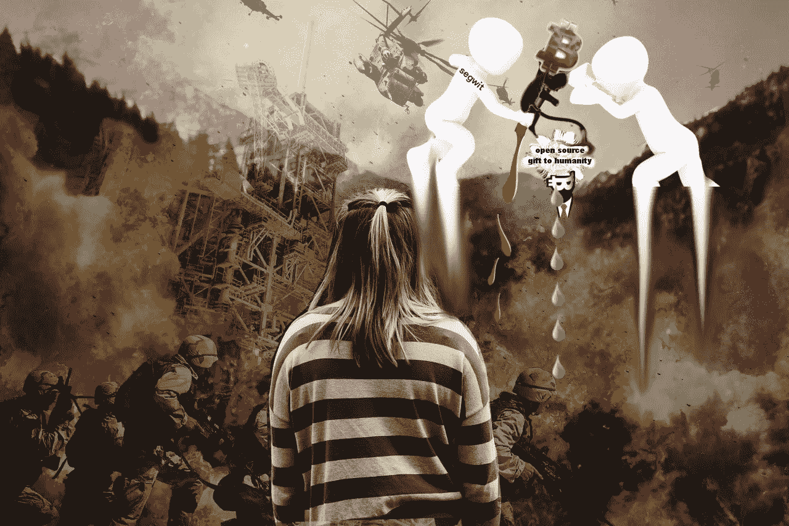

# 没有人想去一个充满敌意的书呆子为了一个麦克风而争斗的比特币派对

> 原文：<https://medium.com/hackernoon/no-one-wants-to-go-to-a-bitcoin-party-where-hostile-nerds-are-fighting-over-a-microphone-dd2c809c85bc>

watching hostile nerds wage Bitcoin war

# 除了最热情的比特币书呆子，没有人明白比特币缩放战争是怎么回事。

我也怀疑是否有很多普通人会在乎。大多数工作的成年人没有时间去钻研最新的比特币比例大战，并对比特币的未来形成有根据的看法。为了真正理解正在发生的事情，您必须首先深入了解区块链技术、块大小和其他真正高级的编程细节。如果你不是程序员，目前没有使用比特币，也没有全职工作，你可能不知道比特币到底是怎么回事。你根本没有时间去搞清楚。

然后，你必须研究比特币如何经历其网络的变化。它依赖于共识，过去比特币矿工在很大程度上控制着比特币的运作方式。但那是在比特币达到每枚 1800 美元之前。

## 小企业、风险资本家、大企业、比特币巨鲸、企业家、寻求专利的公司、程序员、懦弱的专家、龙穴巨魔、矿工和一大堆热情的比特币狂热主义者现在都在争夺比特币的控制权。

如果你想弄清楚到底发生了什么，你会很难找到事实。这是一个战区，比特币的推特世界充满了人身攻击、侮辱、贬低、诽谤、诽谤和一些非常罕见的理性声音。

## 那么，在这个深刻而有毒的比特币战区内，谁是理性的声音？

[Satoshi Nakamoto](https://medium.com/u/a0145b8b86d7?source=post_page-----dd2c809c85bc--------------------------------)

毫不奇怪，非官方的[中本聪推特简介](https://twitter.com/Satoshi_N_?lang=en)提供了最公正的信息，帮助我理解了比特币到底是怎么回事。这个账号发布了与 Segwit 相关的专利链接。我还没有得出任何确凿的结论，但事实开始看起来，SegWit 可能是比特币的一场灾难。

## Blockstream 背后似乎有一家大公司(该公司正在推动 SegWit)以及一些与 Blockstream 相关的潜在专利。

和许多人一样，我没有深入研究这些专利的细节，也没有研究它们可能的后果。你看，要做到这一点，你需要理解一些真正技术性的东西。和其他人一样，我没有深入的知识去真正地深入。然而，我对任何给比特币附加专利的公司都深表怀疑，不管是在*的任何一家*公司，无论规模大小。比特币是开源技术，它是免费提供给人类的，就像大自然给我们食物和水一样。比特币是一种免费的开源礼物，它需要保持这种状态。

# 专利和比特币不能混为一谈。比特币是专利的对立面。

同样，心胸狭窄、充满敌意的书呆子和比特币的巨大自我也不应该混为一谈。不幸的是，比特币似乎陷入了困扰人类数千年的境地:

# 一旦心胸狭窄的人从免费给予他们的东西(想想水、石油、空气、土地、海洋、海鱼、女人的身体、矿物)中赚了大笔的钱和/或自我利益，他们就躲进他们恶臭的地下室，制定周密的战争计划，以便利用和完全控制这一新发现的资源。

狂野西部和比特币没什么区别，只不过比特币是由社交能力为零的计算机呆子创造的。比特币淘金热正在上演，只有极少数人理解比特币催生的创新区块链技术的重要性。

[Greg Maxwell parody account](https://twitter.com/nullc_?lang=en)

Blockstream(以及比特币核心)发生了一些奇怪的事情:一个完全成型的巨魔军队(查阅“龙穴”)已经从 Blockstream 的首席开发者 Gregory Maxwell 发展出来。一旦你深入探究格雷戈里·马克斯韦尔背后的心理学，你会发现一个惊人的智力组合，书呆子气，部分形成的情商，和一个超级巨魔的条纹。你看，大多数容易受骗的人看不到过去的高智商。他们变得敬畏，面对精神上的辉煌无能为力，很容易陷入崇拜。大多数人不为自己考虑，而是依赖他人为他们考虑。我在格雷格·麦克斯韦尔的编程呆子形象背后看到了一个精神错乱的人。他在网上公开的尖酸刻薄立刻暴露了他。

## 但猜猜谁最终会在短期的比特币规模大战中胜出？

猜猜谁最终会做出最激烈的反应，从而调动起其他心胸狭窄的蜥蜴脑男人？拥有鲜有人拥有的神秘知识的精神病理学恶霸在比特币中尤其危险。他们的智慧愚弄了一般容易上当受骗的人，为了“事业”把他变成了巨魔战士。

贪婪、满嘴脏话、蜥蜴脑的男人们除了他们的豪宅、妓女、银行账户和他们膨胀的病态自我之外，什么都不在乎，他们被卷入了比特币的规模战争。你认为他们关心中本聪赐予他们的开源礼物吗？不，他们很久以前就忘记了这一点，一旦他们的鸡巴被银行账户上无止境的数字弄硬了。

## 这是一个没有人谈论的真实故事。

比特币发生的事情之前已经发生过无数次了。看着贪婪、没有灵魂的人在我们眼前进行这场无休止的可耻战争，令人不安。

我担心，一旦专利与比特币的 DNA 捆绑在一起，我们都会被搞砸，尤其是那些业务与比特币纠缠不清的人。看到聪给人类的礼物被扭曲，被限制，沦为一个被囚禁并获得专利的笼子里的发明，这将是一件悲惨和可怕的事情。

# 我有简单的答案给你吗？

不，但我鼓励你独立思考。在形成观点之前先阅读。注意警告信号:当有人猛烈抨击和发表贬低他人的人身攻击时(与他们的想法相反)，看看是否涉及专利或大公司。这就是你的答案。

现在，你明白我为什么决定把精力放在 Dash 上了。很久以前，Dash 在 24 小时内解决了块大小的争论。关于这件事我要说的就是这些。Dash 在 24 小时内就解决了比特币战争，这场战争耗时数年(至今仍未解决)。你不可能比这更清楚了。一群忠诚的人以一种成熟的方式相处并解决分歧，这是一件令人兴奋的事情。仍然有争论、意见分歧和激烈的争论。但是我们会及时解决我们的争论。我们致力于开源技术。这是 Dash 的核心理念。

达什就像上图中的这个人:有吸引力，善于社交，成熟，有组织，但足够分散，不需要穿衬衫。

> [黑客中午](http://bit.ly/Hackernoon)是黑客如何开始他们的下午。我们是 [@AMI](http://bit.ly/atAMIatAMI) 家庭的一员。我们现在[接受投稿](http://bit.ly/hackernoonsubmission)，并乐意[讨论广告&赞助](mailto:partners@amipublications.com)机会。
> 
> 如果你喜欢这个故事，我们推荐你阅读我们的[最新科技故事](http://bit.ly/hackernoonlatestt)和[趋势科技故事](https://hackernoon.com/trending)。直到下一次，不要把世界的现实想当然！

