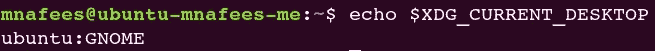

# 升级到 Ubuntu 17.10 后没有托盘图标？

> 原文：<https://medium.com/hackernoon/no-tray-icons-after-upgrade-to-ubuntu-17-10-60c1cd75841b>

我已经听说了很多问题，人们在升级到最近的 Ubuntu 17.10 后，无法访问他们在 Ubuntu 上的一些应用程序/后台进程的托盘图标，Ubuntu 17.10 使用 GNOME 作为其默认的桌面环境。那么，第一个解决办法是在登录时选择 Unity，或者如果你仍然喜欢新的 GNOME UI，像我一样，你可能需要做一点工作来实现它。不会很多，我保证。

# 那么，为什么会出现这种情况呢？

如果你在你的终端上输入如下代码:
*echo $ XDG _ 当前 _ 桌面* 它会显示“ubuntu:GNOME ”,这就是问题所在。你看，以前，也就是 Ubuntu 17.10 之前，这个环境变量曾经打印“Unity”(或者在某些情况下“Unity7”)作为它的值，一些程序开始依赖这个事实。所以我们也会这样做。我们将强制我们的程序与*XDG _ 当前 _ 桌面=统一*一起运行

Ubuntu 17.10 uses GNOME as its default desktop environment

# 修复

假设我们有一个非常喜欢的名为“foobar”的应用程序，现在无法显示它的托盘图标。我们所要做的就是编写一个愚蠢的小 shell 脚本，其内容如下:

那是完成的一部分。第二部分是找到各自的*。桌面*文件，并用类似于*“EXEC = ~/path/to/foobar _ run . sh”的内容替换现有的*“EXEC”*行。*你可以找到。桌面文件在任一 *~/中。本地/共享/应用程序/* 或*/usr/共享/应用程序/* 。一旦你这样做了，重新启动你的电脑，如果一切正常，然后瞧！你的托盘图标回来了！

*注意，如果您的流程已经使用了一个 shell 脚本来运行，那么您需要做的就是将上述 shell 脚本(foobar_run.sh)中的 export 语句放在用于执行程序的 shell 脚本的顶部。*

希望这有所帮助！😁