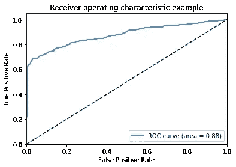
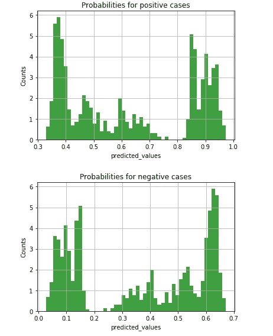
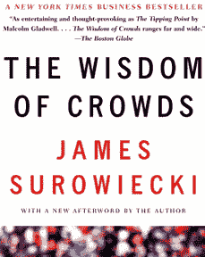

# 不，您不需要个人数据来进行个性化

> 原文：<https://medium.com/hackernoon/no-you-dont-need-personal-data-for-personalization-de9222cff8e4>

1.什么？所以所有那些宣称个性化是不可能的，除非你把你的最后一点个人数据给他们，让世界变得更好，否则这些文章都是谎言？毫无疑问。

2.在我介绍细节之前，这里有一个最近的分类用例的证据，在随机森林模型上，使用聚合的、符合 GDPR 标准的特性，准确率达到了 94%

3.结果不使用任何个人数据。诀窍是使用精心设计的功能，如在 [Resys 15 论文](https://github.com/romovpa/ydf-recsys2015-challenge)中使用的功能，以及大约 100G 点击流数据，并根据使用情况进行细微调整。使用了一个简单的随机森林分类器，默认参数没有模型堆叠，具有可扩展性和模型可解释性的明显优势，这是 GDPR 的一个重要元素。

4.GDPR 于 2018 年 5 月 25 日生效。这对在生产中部署的使用个人数据的机器学习模型产生了巨大的影响，即如果公司不遵守规定，就必须停止在生产中使用机器学习模型，否则将面临高达 2000 万欧元或全球营业额 4%的罚款，以较高者为准。

5.正如结果所证明的那样，不使用个人信息也可以实现个性化，尽管需要在特征工程和理解领域方面投入更多的大脑周期。一直以来都有可能，但是现在随着 GDPR 的加入，再也没有借口了

6.古老的群体智慧仍然有效，即聚集和伪人数化

7.如果你有任何问题，打电话给我，记住如果你没有为产品付款，你就是产品

