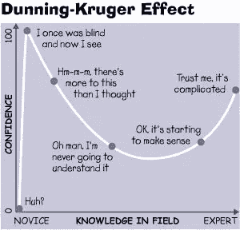
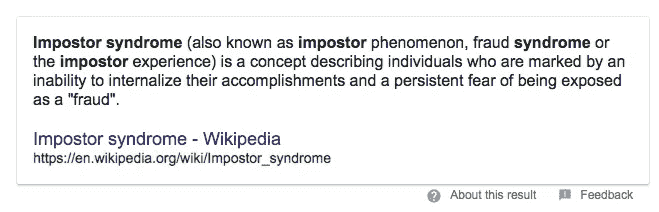

# 没有零时差:我 30 岁时从 Javascript 新手到全栈开发者的道路

> 原文：<https://medium.com/hackernoon/no-zero-days-my-path-from-code-newbie-to-full-stack-developer-in-12-months-214122a8948f>

*2019 编辑:我很欣慰这篇写好的文章在发表一年多后继续帮助人们！我在一篇名为* [*公开学习*](https://www.swyx.io/writing/learn-in-public/) *的新文章中更新了我的想法。*

在过去的一年里(也有一段时间)，我从 Javascript 的 Hello World，到部署 fullstack webapps，到获得自由职业者的工作，到在包括谷歌在内的顶级科技公司面试，并获得了多个六位数的专业软件工程师职位。我是这样做的。

# 简而言之，我做了什么

*   【2016 年 11 月 : [FreeCodeCamp](https://www.freecodecamp.org) 前端开发证书(HTML、CSS、basic JS)。决定我要做到这一点，没有零天。
*   **2016 年 12 月**:启动 FreeCodeCamp 数据即开发证书(SASS/D3/React)
*   **2017 年 1 月**:完成 FreeCodeCamp 数据即开发证书(主要是 React/Redux)
*   **2017 年 2 月**:启动 FreeCodeCamp 后端开发证书(Node，Express，MeteorJS)
*   **2017 年 3 月**:完成 FreeCodeCamp 后端开发证书(基本都是流星)
*   我在这里或多或少有些疲惫，在四月和五月没有做太多事情。
*   **2017 年 6 月**:应用 FreeCodeCamp 知识制作小型工作应用，包括 Vue 和 Firebase
*   **2017 年 7 月**:适用于总装、Hack 反应堆、全栈学院(FSA)。软件工程日报采访了 [Sacha Greif。对一个](https://softwareengineeringdaily.com/2017/08/09/state-of-javascript-with-sacha-greif/)[开源项目的第一个重大贡献](https://github.com/icebob/vue-express-mongo-boilerplate)。
*   **2017 年 8 月**:在 FSA 开始初级阶段(Node，Express，SQL，raw Javascript)。开始制作冒名顶替综合症音频纪录片，讲述我的同学们的进步。(2019 编辑:现已死亡)
*   **2017 年 9 月**:FSA 完成初级阶段(React，Redux)。领导我自己的 React 工作室。已开始高级阶段(React Native、PassportJS 身份验证、git 工作流、CI/CD)。
*   【2017 年 10 月 : [在 FSA 黑客马拉松上获得开发者奖](https://github.com/sw-yx/crossbones)。完成了高级阶段(技术面试准备，制作了[我自己的 GraphQL 游戏](https://graphql-of-thrones.herokuapp.com))。在 Hacktoberfest 期间成为 React 贡献者[。](https://hacktoberfest.digitalocean.com)
*   【2017 年 11 月:获得第一批自由职业客户。与 [AlgoExpert](https://www.algoexpert.io/) (由一名 FSA 校友发起)和 [CTCI](http://www.crackingthecodinginterview.com/) 每天准备 5 个小时的技术面试，从 FSA 招聘日和自己的联系人中进行搜索。先收到(> $12 万！)要约。拒绝了。
*   **2017 年 12 月**:给我的[第一次现场 React 演讲](https://www.youtube.com/watch?v=GWCcZ6fnpn4)100 多人。从 Spotify 到 MongoDB 再到谷歌，一系列杂乱的求职事件。收到多份工作邀请，最后接受一家大公司六位数的工作邀请。

就是这样！五分钟后我的一年。为了准备这篇文章，我在我的博客[和自由代码营](https://sw-yx.github.io/2017/12/19/fcc-blogpost-draft-2)的和[上详细写下了逐月的过程，所以如果你需要更多的信息，请前往那里。我在这里的唯一目标是向你展示我所做的事情的全貌，如果你想做类似的事情，给你一些启发。可以做到。](https://forum.freecodecamp.org/t/no-zero-days-my-roadmap-from-javascript-noob-to-full-stack-developer-in-12-months/164514)

**指导原则**

以上所有这些要点可能会让过渡过程看起来很容易，但它们掩盖了很多个漫漫长夜和几个星期，在这些日子里，我感觉自己在反复用头撞砖墙。Javascript 正以惊人的速度发展(见[这篇病毒式的文章指出了正在发生的巨大混乱](https://hackernoon.com/how-it-feels-to-learn-javascript-in-2016-d3a717dd577f)！)我想和你们分享一些帮助我渡过难关的总体原则。

*   **没有零时差**:我从[/r/非零时差](https://www.reddit.com/r/NonZeroDay/)那里学到了这个想法，它很有意义。简而言之，你只是决定每天朝着你的目标做点什么，不要失败。这听起来很难，但好处是，某样东西可能是最微小、最微不足道、最无关紧要的东西。想多锻炼吗？决定穿上鞋，走进健身房，只做一个俯卧撑，就大功告成了。你可以走出去。那一天不会是零。不。零天。这种方法的好处当然是你可能不会只做一个俯卧撑。你出现了。你会做得更多。这就是非零时差的概念。
*   **什么都做两遍**:训练营不是魔法机器。我的成绩超过了训练营毕业生的 90 %,这是因为运气加上我所做的准备，这基本上意味着我是第二次做所有的事情，而不是第一次。那些仅仅是不透明的从堆栈中复制粘贴的东西对我来说就像魔法咒语一样，第二次使用时变得清晰多了。在博客上记录我的旅程，并为我的纪录片采访我的同学，这意味着我在反复重温同一个训练营，并从对经历的反思中汲取见解。
*   **教与学**:我给我的同龄人开了自己的关于[反应](https://github.com/sw-yx/FSA-React-Trip-Planner)和通行证的研讨会，这不仅迫使我解释事情，还迫使我回答我自己狭隘思维中没有考虑到的问题。我[做了一个关于我成为 React 贡献者的经历的演讲](https://www.youtube.com/watch?v=GWCcZ6fnpn4),尽管我只是一个新来的新手。无论你在旅程的哪个阶段，你都有资格帮助比你新的人。从很多方面来说，你是做这件事的最佳人选。教学还有一个很好的副作用，就是在你做现场编码的时候训练你说话，以展示一个技术观点，这是一个了不起的精神杂耍行为。碰巧的是，这正是*你需要的*来赢得技术编码面试！我最喜欢的面试记忆是在我面试的时候教一位非常资深的谷歌员工关于 Javascript 生成器的知识。这让他们处于一种不同的精神状态，这表明你不仅仅是团队的累赘。他不知道的是，我只是从最近的前端大师工作室[凯尔辛普森](https://frontendmasters.com/teachers/kyle-simpson/)通灵！
*   时间比金钱更重要:人类对为可能对他们有帮助的东西付费有一种奇怪的厌恶。这有一个理性的基础:大多数事情都令人失望，我们不想浪费钱，尤其是当有免费选项时。我没有选择像[团队树屋](https://teamtreehouse.com/)、[前端大师](https://frontendmasters.com/)、 [Egghead.io](https://egghead.io/) 和 [Pluralsight](https://www.pluralsight.com/) 这样的付费程序，而是偏向于像[奥丁项目](https://www.theodinproject.com/)、 [Codecademy](https://www.codecademy.com/) 、[斯坦福 CS50](https://www.youtube.com/watch?v=BAs4VyEN-SM) 和 FreeCodeCamp 这样的免费选项。尽管我最后证明自己很好，但我相信，如果我早点选择付费选项，我可以在更短的时间内达到同样的结果。相反，如果我没有参加一个 17，000 美元的训练营，我相信我至少会再花一年时间才能到达我现在的位置，如果我当时没有放弃的话。(顺便说一句，有融资项目、奖学金和学费预付项目让训练营变得更加实惠，但我是用自己的积蓄支付的。)我新工作中增加的工资代表着这项投资至少 2 倍的 1 年回报，甚至包括机会成本，不包括未来几年的收入价值。不要吝啬 10 美元，40 美元，甚至 200 美元的课程材料，如果它能帮助你找到最受欢迎的工程师。
*   **找社群**:人类也是天生的群居动物。因为我没有理解我所经历的朋友或家人，我求助于在线支持网络。我下载了几十个[播客](https://softwareengineeringdaily.com/)，所以整天在我耳边说话的人也是程序员。我发现[**系统，而不是目标**:这要归功于](https://medium.com/u/95a6af9dcecb#代码新手</a>。我加入了 CodingBlocks Slack 小组,每天都发布我所学到的东西。当然，一个强大的社区伴随着一个好的训练营。这些人有他们自己的生活要过，可能永远不会以任何方式帮助你，但他们会庆祝你的小胜利。我无法低估你自己的拉拉队在你的懈怠信息上发送表情符号，或者让完全陌生的人回复说他们正在经历和你完全一样的经历所带来的心理影响。</li><li id=)[杨维理](https://medium.com/u/b9f566200028?source=post_page-----214122a8948f--------------------------------)，我的训练营的创始人[在这里采访](https://www.impostor-syndrome.org/episodes/26-fullstack-academy-with-david-yang-part-1-the-bootcamp)。不要执着于结果。也许你需要 24 个月，或者 6 个月。想成为一名软件工程师并不会告诉你如何去做。不要把我的故事理解为“我必须参加 FreeCodeCamp 和 bootcamp”。许多人在参加训练营几个月后仍然失业。关注我和其他与我有着完全不同道路的人是如何度过我们的每一天，以及如何处理路障的。拥有一个系统，如果这个系统不起作用，找出你还能做什么来修复它。执着于一个特定的目标，如果达不到就绝望，这是没有用的。

# **抗击冒名顶替综合症**

我想留给你们一个概念，它有很多名字。

伊拉·格拉斯(NPR 的优步播客)称之为差距:

社会科学家称之为邓宁-克鲁格效应:

对我们其余的人来说，这个术语叫做冒名顶替综合症:

这是我给我的音频纪录片(2019 编辑:现已死亡)起的名字，我的想法是，如果我能说出房间里的大象的名字，我就能与之战斗。有什么比花上几千美元和几个月的时间去学东西，实际上却得到几千美元的报酬更“冒名顶替”的呢？更糟糕的是，竟敢就此事与 T1 谈判？

一个永远不变的事实是，你知道的越多，你也就越了解那些你不知道的事情。所以，如果你做得*正确*，你会觉得自己做的事情**糟糕**。这是**好的**。不要止步于此，继续完善你的系统。

平静地面对这样一个事实:通往你想要的东西有多条途径，而找出哪一条适合你的唯一方法就是去尝试。经常是两次。如果你不得不付钱，因为这是有价值的东西。找支持的人。每天都这样做，然后把你学到的东西教给别人。这些是你在新的旅程中应该遵循的原则。

记住:没有零日。

*如果这篇文章对你有所帮助，并且你想在你自己的 2018 旅程中更新我，请在 Twitter 上找到我@*[*Swyx*](https://medium.com/u/547f259e265e?source=post_page-----214122a8948f--------------------------------)*(*[*https://twitter.com/swyx*](https://twitter.com/swyx)*)。我很乐意成为你们啦啦队的一员！*

*感谢 Jeff K、CodingBlocks 帮(Firro、Joe、dance2die 和 sowen)和 FreeCodeCamp 社区审阅了这篇文章* *的全文草稿！*