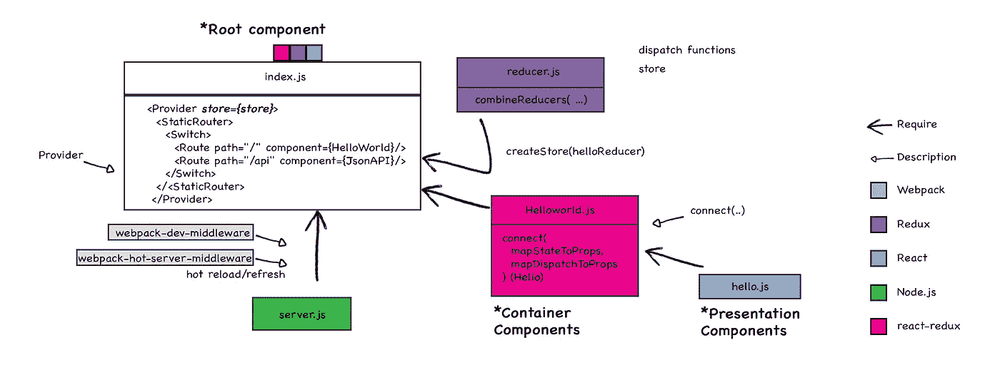
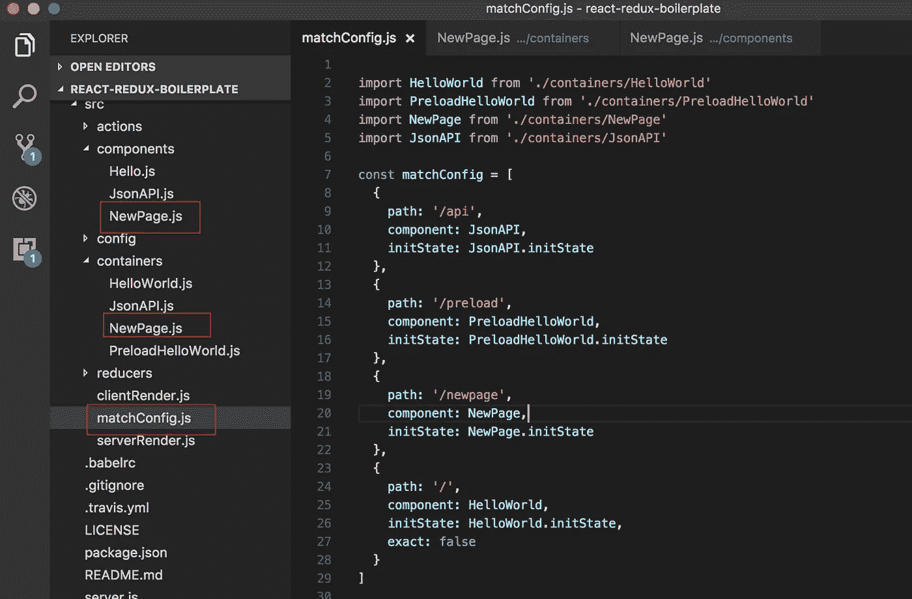
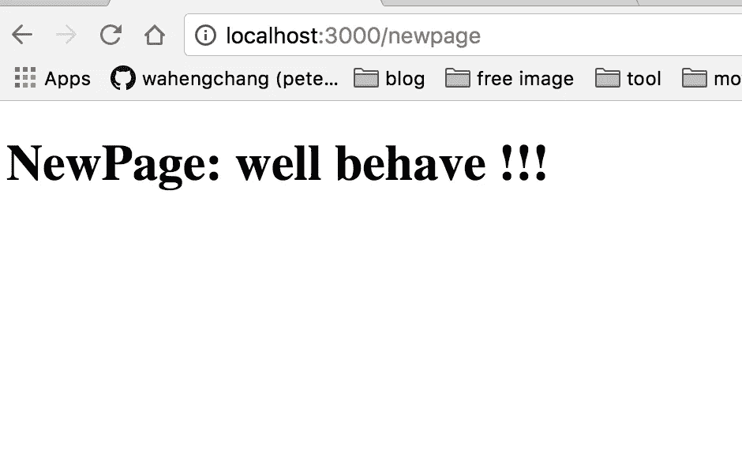

# [React][Redux]同构样板:添加新页面

> 原文：<https://medium.com/hackernoon/node-javascript-react-redux-isomorphic-boilerplate-tutorial-example-adding-new-page-component-router-match-f0347ad42c67>



这是一个基于 [react-redux 同构样板](https://hackernoon.com/isomorphic-universal-boilerplate-react-redux-server-rendering-tutorial-example-webpack-compenent-6e22106ae285)添加静态新页面(无动作分派)的示例，在连接服务器渲染、客户端渲染和路由器的配置后，只需修改(或添加)3 个文件即可创建一个非常简单的静态页面。



# 1.创建一个演示组件

**表示组件**是只关注事物外观的组件，与应用程序的其余部分没有任何依赖关系

`./src/components/NewPage.js`

```
import React, { PropTypes } from 'react'

const NewPage = ({ onClick, message }) => {
  return (
    <div>
      <h1>NewPage: { message }</h1>
    </div>
  )
}

NewPage.propTypes = {
  message: PropTypes.string.isRequired
}

export default NewPage
```

# 2.创建一个容器作为路由器的入口

`./src/containers/NewPage.js`

```
import { connect } from 'react-redux'
import NewPage from '../components/NewPage'

const mapStateToProps = (state, ownProps) => {
  return {
    message: 'well behave !!!'
  }
}

const mapDispatchToProps = (dispatch, ownProps) => {
  return {
  }
}

const newPage = connect(
  mapStateToProps,
  mapDispatchToProps
)(NewPage)

// initState is a function which is run before server, and keep consistency as a thunk middleware, and return a promise 
newPage.initState = (store,req,res) => {
    return (dispatch, getState) => {
      return new Promise( (resolve, reject)=> {
        resolve ()
      })
    }
}

export default newPage
```

# 3.在`matchConfig.js`中添加正确的配置

使用新 URL `/preload', as the first field`路径:'/preload ' `创建新页面

```
...
  {
    path: '/preload',
    component: PreloadHelloWorld,
    initState: PreloadHelloWorld.initState
  },
...
```

打开带有网址`localhost:3000/newpage`的浏览器



## 克隆

Git 储存库

```
$ git clone [https://github.com/wahengchang/react-redux-boilerplate/tree/addNewPage](https://github.com/wahengchang/react-redux-boilerplate/tree/addNewPage)
```

## 参考:

[阅读更多内容](https://hackernoon.com/isomorphic-universal-boilerplate-react-redux-server-rendering-tutorial-example-webpack-compenent-6e22106ae285)

[https://hacker noon . com/同构-universal-boilerplate-react-redux-server-rendering-tutorial-example-web pack-component-6e 22106 AE 285](https://hackernoon.com/isomorphic-universal-boilerplate-react-redux-server-rendering-tutorial-example-webpack-compenent-6e22106ae285)

[https://github . com/wahengchang/react-redux-boilerplate/tree/add new page](https://github.com/wahengchang/react-redux-boilerplate/tree/addNewPage)

[](http://bit.ly/HackernoonFB)[](https://goo.gl/k7XYbx)[](https://goo.gl/4ofytp)

> [黑客中午](http://bit.ly/Hackernoon)是黑客如何开始他们的下午。我们是这个大家庭的一员。我们现在[正在接受投稿](http://bit.ly/hackernoonsubmission)，并乐意[讨论广告&赞助](mailto:partners@amipublications.com)机会。
> 
> 如果你喜欢这个故事，我们推荐你阅读我们的[最新科技故事](http://bit.ly/hackernoonlatestt)和[趋势科技故事](https://hackernoon.com/trending)。直到下一次，不要把世界的现实想当然！

