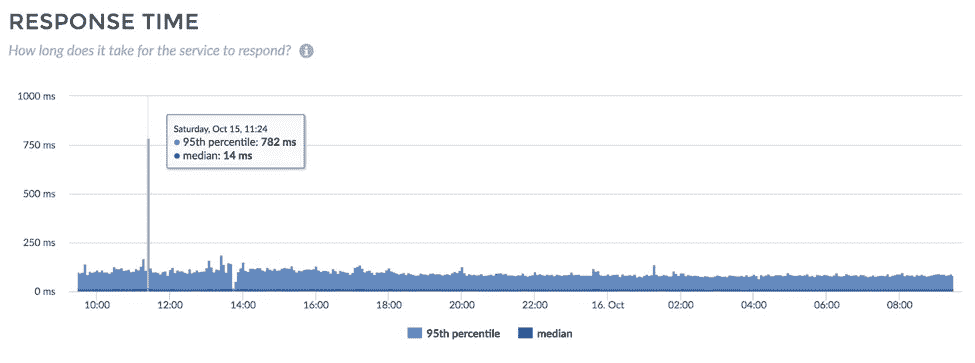
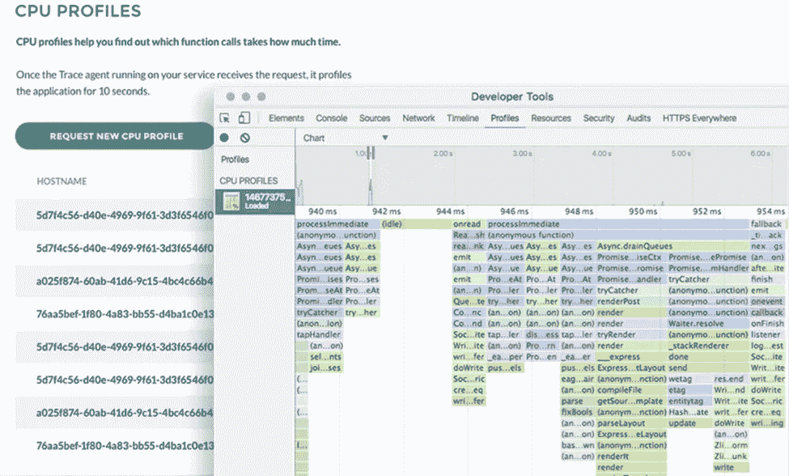
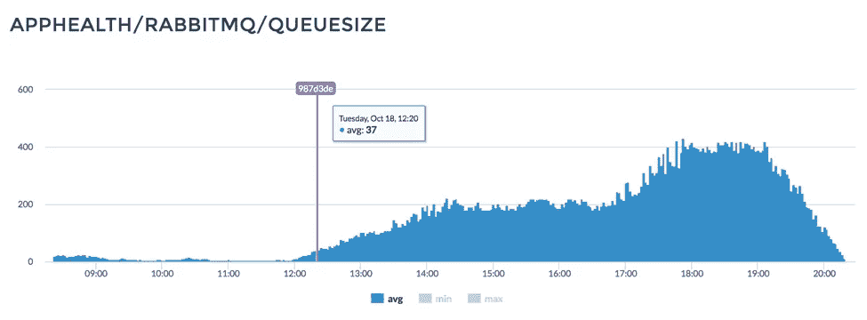
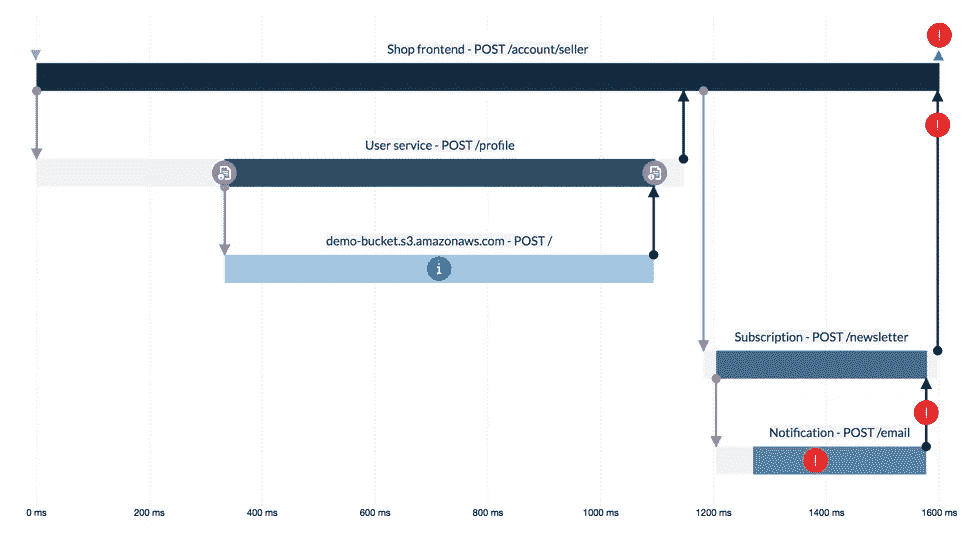

# Node.js 监控完成正确

> 原文：<https://medium.com/hackernoon/node-js-monitoring-done-right-70418ecbbff9>

Node.js 监控对于打造具有出色用户体验的竞争性产品的公司来说至关重要——本文的目标是讨论其原因。我还将提出一个论点，即监控能够节省大量的金钱，并有助于保持良好的声誉。

本文主要从开发人员、经理和客户的角度，关注在应用程序级别上监控您的产品。我们将只讨论软件问题，而不讨论硬件异常。

为了帮助您开始，我将为您提供应用程序性能监控的 11 个要点。

# 什么是监控？

根据牛津词典，监控意味着

> *观察并检查一段时间内(某事)的进展或质量；保持系统的审查。*

好吧，我们明白了。但是什么是应用性能监控/管理 *(APM)* ？

> *应用程序性能管理(APM)是对软件应用程序的性能和可用性进行监控和管理。*

这是否意味着应用程序和软件有不同的质量和数量指标，我们可以观察、比较甚至在发生变化时得到通知？是的，它是。为什么这对我很重要，为什么对你也很重要？让我们看看。

# 我为什么要在乎？

如果您是公司的经理或开发人员，那么您可能想知道您的应用程序何时停止运行，或者它何时不能满足客户的需求。为了获得这些信息，您需要监控服务停机时间，并建立一个适当的警报系统。很简单，谢天谢地，大多数公司已经在处理这个问题了。

当你更深入一点，开始不仅仅关心应用程序的运行时，你可能会对满足用户期望和最小化生产系统中的错误数量感兴趣。这很好，你有一个很好的理由这样做，即当你的用户面临错误和速度变慢时，他们会离开你的应用程序，寻找另一个能够提供相同好处而没有你的错误的应用程序。这就是你的错误、缺陷和速度变慢导致转化率降低，导致你的业务收入下降的原因。

有了好的监控解决方案，您可以捕获的不仅仅是错误和缓慢的响应时间！您还可以发现网络和代码级别的性能瓶颈，避免损失。

谈论赔钱:我相信你已经知道使用比你需要的更多的资源是昂贵的。此外，花时间在低效的调试上会影响你的最后期限，浪费你的开发时间。

**那么什么是监控呢？**

监控是防止资源和客户流失的一种方式，也是停止浪费时间的一种解决方案。为了不浪费金钱，监控是必不可少的。

我相信你同意这一点，但你可能不知道什么是你的应用程序必须具备的元素，你应该保持关注。让我来帮忙:

# 应该监控什么？

在本文的下一部分，我将为您提供一个清单，列出您应该监视的内容以及监视的原因。

# 1.密切关注服务停机时间

这是您可以监控的最简单的事情。

很容易理解，当你的应用程序不工作时，你的客户就不能在你的网站上花钱。除此之外，他们也会失望。如果这个问题经常出现，或者发生在客户获取过程中，你可能会永远失去用户。

设置您的监控解决方案，使其能够在服务停机时立即通知工程团队。

# 2.缓慢的响应时间会影响转化率，不要让它们得逞！

您还可以监控您的服务响应时间。从短期来看，缓慢的服务不太赚钱，但它会导致用户体验不佳。

研究人员证明，消费者更喜欢速度更快的网站和产品。有时他们也会提到速度是他们转用竞争对手产品的主要原因。

[也证明了](https://blog.kissmetrics.com/loading-time)，较慢的响应时间会影响你的转化率。找到响应时间和转化率之间的关联并不总是显而易见的，但有一点是肯定的:与同等但更快的产品相比，缓慢的服务总是表现不佳。

确保您使用的监控解决方案能够告诉您应用程序的每个服务的准确响应时间，并让您将其与历史数据进行比较。

Monitor slow response times

# 3.监控错误率和崩溃，找出糟糕的代码质量

一个损坏的功能可能会阻止你的客户在你的网站上注册或消费。要找出这些问题，您应该监控错误状态代码和应用程序崩溃的数量和类型。

大量的错误也可能是一些重要事情的迹象，即您正面临代码质量问题。作为一名经理，适当的监控会让你问这些问题:

*   我是否给了开发人员足够的时间来发布高质量的特性？
*   我有好的测试覆盖率吗？
*   我有 QA 吗？

糟糕的代码质量总是需要更多的开发人员时间来调试和修复损坏的东西。

# 4.不要把钱浪费在不必要的资源上

一个好的 APM 解决方案可以让您监控应用程序的资源使用情况。

效率低下的服务使用更多的资源，并且运行它们需要更多的资金。找到性能瓶颈有助于您以有效的方式扩展软件，并优化您的支出。

不要因为你写的糟糕代码而浪费你的钱在不必要的硬件上——相反，找一个工具让你知道你应该在哪里改进你的应用程序。

要做到这一点，请寻找支持 CPU 和内存分析的解决方案。CPU 分析允许您分析应用程序变慢时哪些函数正在运行，而内存堆转储对于查找内存泄漏很有用。

如果您找到并修复了系统中的性能瓶颈，那么当出现问题时，您不必进行扩展。

Finding bottlenecks using profiles

# 5.检查您的第三方 API 和服务

您是否使用了大量的外部 API？我想是的。你也在付钱，对吗？

如果您为外部服务支付了大量费用，那么监控这些服务的质量和可用性是有意义的。例如，您可以监控第三方支付提供商的出错率或响应时间。也许问题不在你的服务上。一个合适的 APM 工具将帮助您找到应用程序的低性能外部部分，并为您节省成本。

# 6.了解您的版本的质量和性能

您的应用程序的每个版本*(部署)*的性能和代码质量可能会有所不同。请确保您持续监控您的服务，并且您有一个好的解决方案来比较多个部署和发布之间的指标。如果这样做，您将立即看到何时需要恢复以保持之前良好的性能和用户体验。

新的不一定更好。不知道新的是否更好更糟糕！

Monitor using custom metrics

# 7.将应用程序性能与您的业务指标相关联

业务指标和性能指标可以相互关联，这将引导您获得有价值的见解。通常，检查一些关键业务指标和性能指标是值得的。

让我们看一个例子:您认识到，每当有大量新用户注册时，您的响应时间会比平时长。

在这种情况下，响应时间很可能会更长，因为您的服务向新用户发送了一封欢迎电子邮件，并且电子邮件呈现阻塞了您的事件循环，因此您的服务不能像通常那样快速地满足请求。

当您的 APM 能够收集和关联数据时，您将更容易发现性能问题，因为您可以看到它们背后的业务环境。

# 8.通过您的系统跟踪分布式事务

如果您正在构建一个分布式系统(一个具有微服务架构的系统)，您可能知道当问题发生在具有多个服务的调用链中时，跟踪它们是多么具有挑战性。较低级别的堆栈跟踪可能会导致较高级别的未知异常。

微服务需要稍微不同的工具来监控和调试。幸运的是，分布式事务跟踪可以帮助您捕捉服务之间的问题。

分布式跟踪是在 [Google Dapper 白皮书](http://research.google.com/pubs/pub36356.html)中首次提到的一种方法，它允许你监控复杂的、大规模的分布式系统。

有了能够进行分布式跟踪的 APM，您就可以用数据库和外部 API 来可视化您的服务调用。因此，不用从所有参与的服务中提取日志，您可以在时间轴可视化视图上看到您的整个事务，突出显示问题。

Find issues in distributed systems using distributed tracing

# 9.不要让安全漏洞毁了你的一天

大多数服务都是使用来自`npm`或其他包管理器的大量包构建的。这些模块可能并且通常包含安全漏洞。

知道何时应该升级依赖关系以防止安全漏洞是很好的。一些监控工具还提供安全问题警报—确保您使用它。没有什么比将用户数据泄露给恶意攻击者更尴尬的了。

# 10.做好预警工作

仅仅有一个我们可以检查所有这些重要指标的地方是不够的，因为我们不能全天候监视它们；这就是为什么一个好的监控解决方案也能提供警报功能。

# 成为第一个了解问题的人

应尽快发现问题；不要等你最大的客户来找他们。

为了及时了解应用程序中正在发生的事件，您应该根据这些事件设置警报。如果您正在构建一个关键服务，那么即使是在半夜，您也应该得到提醒。

永远记住:生产问题不尊重你的工作时间。

# 防止噪音

收到错误警报的通知不仅浪费时间，还会增加发现关键问题的难度。配置警报时，请务必使用正确的标准进行设置，并将其发送到正确的通道。

使用 Pagerduty 或 Opsgenie 这样的渠道以正确的方式*(电子邮件、短信、电话等)通知正确的人也是一个很好的做法。)*在合适的时间。通过电子邮件发送警报可能只会让你的邮箱变成垃圾邮件。

# 11.监控不容易，不要自己搭建工具！

一个完美的监控工具可以节省资金，并且可以轻松快速地找到复杂的问题。这样一来，你的服务会更健康、更快捷，你的客户也会欣赏。

构建一个合适的监控工具需要大量的时间、知识和努力，它就像是你公司中的一个独立产品。与其创建您自己的解决方案，我强烈建议您选择第三方 APM，并花时间让您的产品更棒，让您的客户更开心。

# Node.js 监控入门

如今，大多数监控工具都是 SaaS 解决方案。这意味着您不必花费时间来设置和维护它们，您可以直接使用它们，享受您节省的额外时间和金钱。

作为一名从事[分布式跟踪](https://trace.risingstack.com?utm_source=medium&utm_content=nodejsmonitoringdoneright)应用程序的软件工程师，我只能建议采用一种可靠且有洞察力的监控解决方案。使用它的好处是可以衡量的。那么，今天就开始攒钱怎么样？

> 关于作者:彼得·马顿(@slashdotpeter)是 RisingStack 的联合创始人兼 CTO，目前正在从事[Trace——一个 Node.js 性能监控和调试工具](https://trace.risingstack.com?utm_source=medium&utm_content=nodejsmonitoringdonerightbio)，旨在从进程层面上理解和排除基于微服务的应用程序的故障。

> [黑客中午](http://bit.ly/Hackernoon)是黑客如何开始他们的下午。我们是 [@AMI](http://bit.ly/atAMIatAMI) 家庭的一员。我们现在[接受投稿](http://bit.ly/hackernoonsubmission)并乐意[讨论广告&赞助](mailto:partners@amipublications.com)机会。
> 
> 如果你喜欢这个故事，我们推荐你阅读我们的[最新科技故事](http://bit.ly/hackernoonlatestt)和[趋势科技故事](https://hackernoon.com/trending)。直到下一次，不要把世界的现实想当然！

