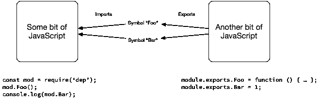
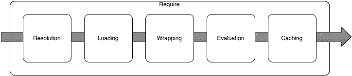
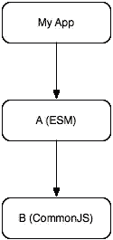
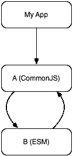
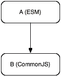

# Node.js、TC-39 和模块

> 原文：<https://medium.com/hackernoon/node-js-tc-39-and-modules-a1118aecf95e>

本周，我参加了第一次 TC-39 会议。对于那些不知道的人来说，TC-39 是定义 ECMAScript 语言(或更常见的“JavaScript ”)的 ECMA 工作组的代号。在这个论坛上，JavaScript 语言的各种细微差别和细节都得到了解决(通常很痛苦),以确保 JavaScript 编程语言继续发展，继续满足开发人员的需求。

我本周参加 TC-39 会议的原因很简单:TC-39 定义的一个较新的 JavaScript 语言特性——即模块——给 Node.js 核心团队带来了一点麻烦。我们(我说的我们主要是指 Bradley Farias——Twitter 上的@bradleymeck)一直在试图找出如何在 Node.js 中最好地实现对 ECMAScript 模块(ESM)的支持，而不会造成不必要的麻烦和混乱。

问题并不在于我们不能以规范当前定义的方式在 Node.js 中实现 ESM，而是按照规范的字面意思来做将意味着预期功能的减少和 Node.js 开发人员的次优体验。我们非常希望确保 Node.js 中的 ESM 实现既优化又可用。由于所涉问题的复杂性，与 TC-39 成员面对面坐下来谈判被认为是最有成效的前进道路。幸运的是，我认为我们取得了一些重大进展。

然而，为了理解事情的现状和发展方向，让我花些时间来解释一下哪些基本问题引起了我们最大的关注。

然而，首先要提出一个警告:下面的很多内容都是对代码背后实际发生的事情的过度简化。这主要是为了提供一个概述，而不是对模块系统的深入论述。

然后，另一个警告:这里的一切都是基于我自己对与 TC-39 对话的感知。我完全有可能弄错了一些细节，对话完全有可能继续发展，事情最终看起来会与我在这里描述的大不相同。我写这些只是为了提供正在讨论的内容的一个快照。

# ECMAScript 模块 vs. CommonJS:或者…什么是模块？

事实证明，Node.js 和 TC-39 对于什么是“模块”、如何定义它们以及如何将它们加载到内存中并使用它们有着非常不同的想法。

几乎从一开始，Node.js 就有一个模块系统，它是从一个定义相当宽松的规范“CommonJS”中派生出来的。



简而言之，一个 JavaScript 文件导出的符号(如函数和变量)可供另一个 JavaScript 文件使用。在 Node.js 中，这是使用 *require()* 函数完成的。当在 Node.js 中调用类似于 *require("foo")* 的调用时，会执行一系列非常特殊的步骤。



第一步是将说明符*“foo”*解析为 Node.js 理解的某种工件的绝对文件路径。这个解析过程涉及多个内部步骤，这些步骤基本上是遍历本地文件系统，寻找任何恰好匹配的本机模块、JavaScript 文件或 JSON 文档。解析步骤的结果是一个绝对文件路径，通过这个路径，由 *"foo"* 指定的工件可以被加载到 Node.js 中并被使用。

加载完全由解析步骤产生的绝对文件路径所指向的内容决定。例如，如果解析路径指向的对象是 Node.js 本地模块，那么加载就需要将引用的共享库动态链接到当前 Node.js 进程中。如果指向的是一个 JSON 文件或 JavaScript 文件，那么在文件被验证存在后，文件的内容被读入内存。值得注意的是，加载 JavaScript 与评估 JavaScript 是不同的。前者严格处理将文件的字符串内容放入内存，而后者处理将字符串传递给 JavaScript VM 进行解析和评估。

如果加载的工件是一个 JavaScript 文件，那么 Node.js 当前假设该文件是一个 CommonJS 模块。Node.js 下一步做什么是至关重要的，并且经常被创建 Node.js 应用程序的开发人员误解。在将加载的 JavaScript 字符串传递给 JavaScript VM 进行评估之前，字符串被*包装在函数*中。

例如，文件" *foo.js* "例如:

```
const m = 1;
module.exports.m = m;
```

实际上由 Node.js 作为一个函数进行评估，如下所示:

```
function (exports, require, module, __filename, __dirname) {
  const m = 1;
  module.exports.m = m;
}
```

Node.js 然后使用 JavaScript 运行时来评估这个函数。Node.js 模块中常用的各种“全局”工件，如“*导出*”、“*模块*”、“*_ _ 文件名*”和“*_ _ 目录名*”，并不是传统 JavaScript 意义上的真正全局。相反，它们是函数参数，当调用函数时，Node.js 会将这些参数的值提供给包装的函数。

这个包装函数本质上是一个*工厂*方法。导出对象是一个常规的 JavaScript 对象。包装函数将函数和属性附加到导出对象。一旦包装函数返回，exports 对象被缓存，然后作为 *require()* 方法的返回值返回。

对于这个特殊的讨论，需要理解的关键概念是，在包装器函数被求值之前，无法预先确定 CommonJS 模块将导出哪些符号。

这是 CommonJS 模块和 ECMAScript 模块之间的一个关键区别，因为 CommonJS 模块的导出是在评估包装函数时动态定义的，而 ESM 的导出是按词汇定义的*。也就是说，ESM 导出的符号是在 JavaScript 代码被实际评估之前进行*解析*时确定的。*

*例如，给定以下简单的 ECMAScript 模块:*

```
*export const m = 1;*
```

*当这个代码被*解析*时，但是在它被评估之前，一个叫做模块记录的内部结构被创建。在这个模块记录中，除了其他关键信息位之外，还有一个由模块输出的符号的静态列表。这些由寻找使用 *export* 关键字的解析器识别。由于缺乏更好的术语，模块记录中的符号本质上是指向尚不存在的事物的指针。只有在构造了这个模块记录之后，才真正评估模块代码。虽然这里隐藏了许多我要掩盖的细节，但关键是确定 ESM 输出什么符号发生在评估之前*。**

*当代码使用 ECMAScript 模块时，它使用一个 *import* 语句:*

```
*import {m} from “foo”;*
```

*这段代码基本上是在说，“我将使用模块‘foo’导出的 m 符号”。*

*该语句是一个*词法*语句，用于在*解析*代码时，在导入脚本和 *foo* 模块之间建立链接。按照目前编写 ECMAScript 模块规范的方式，在评估任何代码之前必须验证这个链接，这意味着在评估两个 JavaScript 文件之前，实现必须确保符号“m”确实是由“foo”导出的。*

*对于熟悉强类型面向对象编程语言(如 Java 或 C++)的人来说，这应该很熟悉，因为它类似于通过接口处理对象。导出的符号在执行前被验证和链接，如果符号在执行步骤中没有实际完成，将会抛出错误。*

*对于 Node.js，当" *foo* "不是一个具有一组词汇定义的导出的 ESM，而是一个具有一组动态定义的导出的 CommonJS 模块时，挑战就出现了。具体来说:当我说*从【foo】*进口{m}时，ESM 目前要求在评估之前能够确定 *m* 是由 *foo* 出口的；但是正如我们已经看到的，因为" *foo* "是一个 CommonJS 模块，所以在求值之后的*之前，不可能确定 *m* 被导出。最终结果是 CommonJS 的命名导出和导入(ECMAScript 模块的一个非常重要的特性)在当前定义的 ESM 规范下根本不可能实现。**

*这不是特别理想，所以我们(Node.js 的人)回到 TC-39，询问是否可以在规范中做一些改变。起初，我们有点不敢问。然而，事实证明 TC-39 非常关心确保 Node.js 可以有效地实现 ESM，并且正在考虑对规范进行一些更改，以便在 Node.js 环境中更好地工作。*

# *操作顺序*

*提议的一个具体变化是考虑动态定义的模块。本质上，当我从" foo" 执行 *import {m}时，结果是" *foo* "不是一个带有*词汇上*定义的导出的 ESM，而不是抛出一个错误并放弃(这正是规范当前所做的),该过程将把" *foo* 和导入脚本置于一种中间挂起状态，推迟对导入符号的验证，直到可以评估动态模块的代码。一旦评估完成，CommonJS 模块的模块记录就可以完成，导入的链接也可以被验证。对 ECMAScript 模块标准的修改允许从 CommonJS 模块进行命名导出和导入。(尽管如此，对于一些循环依赖边缘情况，还是有一些问题)。**

*让我们看几个例子。*

*我有一个应用依赖于 ESM A，它依赖于 CommonJS 模块 b。*

**

*我的应用程序( *myapp.js* )的代码是:*

```
*const foo = require('A').default
foo()*
```

*A 的代码是:*

```
*import {log} from "B"
export default function() {
  log('hello world')
}*
```

*B 的代码是:*

```
*module.exports.log = function(msg) {
  console.log(msg);
}*
```

*当我运行 *node myapp.js* 时，对 require(‘A’)的调用会检测到正在加载的东西是一个 ESM(见下文，了解如何进行这种检测)。Node.js 将使用 ECMAScript 模块规范来解析、初始化和评估“A ”,而不是使用当前用于 CommonJS 模块的包装函数来加载模块。当解析“A”的代码并创建模块记录时，它将检测到“B”不是 ESM，因此验证日志由“B”导出的验证步骤将挂起。然后，ESM 加载程序将开始其评估阶段。这将首先使用现有的 CommonJS 包装函数评估 B，其结果将被传递回 ESM 加载程序以完成模块记录的构造。其次，它将使用完整的模块记录来评估代码“A”。*

*改变依赖关系的顺序怎么样？假设 A 是一个 CommonJS，B 是一个 ESM。这里，事情只是工作，不需要做任何特殊的事情，因为如上面的例子所示，可能需要()一个 ESM。*

*对于绝大多数基本用例来说，这种加载模型应该工作得很好。当模块之间存在依赖循环时，事情就变得棘手了。任何以前使用过带有循环依赖的 CommonJS 模块的人都知道，根据这些模块的加载顺序，会出现一些相当奇怪的边缘情况。在 CommonJS 模块和 ESM 之间存在依赖循环的情况下，会存在许多相同类型的问题。*

**

*myapp.js 的代码与上面的一样。然而，A 依赖于 B，B 又依赖于 A。*

*的代码是:*

```
*const b = require('B')
exports.b = b.foo()
exports.a = 1*
```

*B 的代码是:*

```
*import {a} from "A"
export const foo () => a*
```

*这是一个相当人为的案例，主要是为了说明这个问题。这种循环在很大程度上变得不可能实现，因为当 ESM“B”被链接和评估时，符号“A”还没有被 CommonJS 模块“A”定义和导出。这种类型的情况可能*有*被视为参考误差。*

*但是，如果我们将 B 的代码改为:*

```
*import A from “A”
export foo () => A.a*
```

*循环依赖之所以有效，是因为当使用 import 语句导入 CommonJS 模块时，module.exports 对象变成了默认的*导出。在这种情况下，ESM 代码链接到 CommonJS 模块的默认导出，而不是链接到符号。**

*更简洁地说:只有在 ESM 和 CommonJS 模块之间不存在依赖循环的情况下，来自 CommonJS 模块的命名导入才会起作用。*

*CommonJS 和 ESM 之间的差异导致的另一个限制是，在初始评估之后，CommonJS 导出的任何突变都不会作为命名导入提供。例如，假设 ESM A 依赖于 CommonJS 模块 b。*

**

*假设 B 的代码是:*

```
*module.exports.foo = function(name, key) {
  module.exports[name] = key
}*
```

*当“B”由“A”导入时，可用作命名导入的唯一导出符号将是默认符号和“ *foo* ”。调用 foo 函数时添加到 module.exports 中的任何符号都不能作为命名导入使用。但是，它们可以通过默认导出获得。例如，以下内容应该可以正常工作:*

```
*import {foo} from “B”
import B from "B"
foo("abc", 123)
if (B.abc === 123) { /** ... **/ }*
```

# *require()与 import*

*关于 *require()* 和 *import* 有一个非常明显的区别:虽然可以使用 *require()* 加载 ESM，并且可以使用 *import* 导入 CommonJS 模块，但是不能从 CommonJS 模块内部使用 *import* 语句；默认情况下， *require()* 在 ESM 中不可用。*

*换句话说，如果我有一个 CommonJS 模块 A，下面的代码将 ***而不是*** 是可能的，因为 import 语句在 CommonJS 中是不可用的:*

```
*const b = require(‘B’)
import c from "C"*
```

*如果在 CommonJS 模块中操作，加载和使用 ESM 的正确方法是使用 require:*

```
*const b = require(‘B’)
const c = require('C')*
```

*在 ESM 中，require()只有在专门导入的情况下才可用。用于导入 require()的确切说明符尚未确定，但本质上应该是这样的:*

```
*import {require} from “nodejs”
require(“foo”)*
```

*但是，因为可以直接从 CommonJS 模块导入，所以这样做的理由应该很少。*

*作为一个边节点:Node.js 人员有许多其他的顾虑，比如 ESM 的加载是否总是*有*是异步的，这需要在整个依赖图中使用承诺。TC-39 向我们保证(并且上面描述的变化允许)装载不必是异步的。这是一件非常好的事情。*

## *进口呢()*

*TC-39 之前有一个提议，将引入一个新的 *import()* 功能。这与上面示例中显示的 import 语句截然不同。考虑下面的例子:*

```
*import {foo} from “bar”
import(“baz”).then((module)=>{/*…*/}).catch((err)=>{/**…*/})*
```

*第一个 import 语句是词法语句。如前所述，当代码被*解析*时，它被处理和验证。另一方面，import()函数是在求值时处理的。它还导入了一个 ESM(或 CommonJS 模块),但是像目前 Node.js 中的 *require()* 方法一样，完全在评估期间运行。然而，与 *require()* 不同的是， *import()* 返回一个承诺，允许(但不要求)底层模块的加载完全异步地执行。*

*因为 *import()* 函数返回一个承诺，所以像*等待导入(" foo")* 这样的事情将成为可能。但需要注意的是， *import()* 在 TC-39 内还远未完成，尚未成熟。也不完全清楚 Node.js 是否能够使用 *import()* 函数实现完全异步加载。*

# *检测常见故障与 ESM 故障*

*无论代码是否使用 *require()* 、 *import* 或 *import()* 来加载模块，都必须能够检测正在导入的内容的种类，以便 Node.js 能够知道加载和处理它的适当方式。*

*传统上， *require()* 函数的 Node.js 实现依赖于文件扩展名来区分如何加载不同类型的东西。比如， **。节点*文件作为本机模块 **加载。json* 文件只是通过 JSON.parse 和 **传递。js* 文件作为 CommonJS 模块处理。*

*随着 ESM 的引入，需要一种机制来区分 CommonJS 模块和 ESM。有几个建议的方法。*

*一个建议是确保 JavaScript 文件可以被明确地解析为 ESM 或其他文件。换句话说，当我解析一小段 JavaScript 时，解析操作的结果应该很明显地表明它是否是 ESM。这种方法被称为“明确语法”。不幸的是，要实现它可能会显得有点棘手。*

*已经考虑过的另一个提议是向 *package.json* 文件添加元数据。如果 package.json 文件中有某个特定的值，那么该模块将作为 ESM 而不是 CommonJS 模块加载。*

*第三个建议是使用新的文件扩展名( **)。mjs* )来标识 ECMAScript 模块。这是与 Node.js 目前所做的最接近的方法。*

*例如，假设我有一个应用程序脚本 *myapp.js* 和一个定义在单独文件中的 ESM 模块。*

*使用明确的语法方法，Node.js 应该能够解析第二个文件中的 JavaScript，并自动确定它正在处理 ESM。通过这种方法，ESM 文件可以使用 **。js* 文件扩展名之类的东西就可以了。然而，正如我所说的，明确的语法是很难正确理解的，并且有许多边缘情况使得它很难实现。*

*使用 *package.json* 方法，ESM 要么必须捆绑在它自己的目录中(本质上是它自己的包),要么必须在根目录中有一个 *package.json* ,它包含一些元数据，表明包含 ESM 文件的 JavaScript 实际上是一个 ESM。这种方法不太理想，因为需要对 *package.json* 进行额外的处理。*

*使用 **。mjs* 文件扩展方式，ESM 代码放入类似 *foo.mjs* 的文件中。在 Node.js 将说明符解析为绝对文件名后，它会查看文件扩展名，就像当前处理原生插件和 JSON 文件一样。如果它看到了 **。mjs* 文件扩展名，它知道作为一个 ESM 来加载和处理这个东西。如果它看到 **。js* ，但是，它会后退并加载一个 CommonJS 模块。*

*在当前时间点， **。mjs* 文件扩展名看起来是最可行的选择，除非明确语法的各种边缘情况都能解决。*

# *幂等问题*

*一般来说，多次调用 *require('foo')* 会返回完全相同的模块实例。然而，返回的对象是可变的，模块可以通过修改单个方法和符号或者完全替换功能来修改其他模块。这类事情目前在 Node.js 生态系统中极为常见。*

*例如，假设 myapp.js 有两个依赖项 A 和 b，它们都是 CommonJS 模块。a 也依赖于 B，以便扩展它。*

*myapp.js 的代码是:*

```
*const A = require('A')
const B = require('B')
B.foo()*
```

*的代码是:*

```
*const B = require(‘B’)
const foo = B.fooB.foo = function() {
  console.log('intercepted!')
  foo()
}*
```

*B 的代码是:*

```
*module.exports.foo = function() {
  console.log('foo bar baz')
}*
```

*在这种情况下，在中调用 require('B ')返回的结果与在 myapp.js 中调用 require('B ')返回的结果不同。*

*有了 ECMAScript 模块，这种跨模块的 monkeypatching】就不那么容易了。原因有两个:A)导入在求值之前被链接，B)导入需要是幂等的——每次在给定的上下文中调用导入时，总是返回完全相同的不可变符号集。这在实际意义上意味着，当使用指定的导入时，ESM A 不能轻易地篡改 ESM B。*

*这条规则的效果相当于 myapp.js 中的以下代码*

```
*const B = require('B')
const foo = B.foo
const A = require('A')
foo()*
```

*这里，模块 A 仍然修改 B 中的 foo，但是因为对 foo 的引用是在修改之前获取的，所以对 foo()的调用调用了原始函数，而不是修改后的函数。在 ESM 中，无法导入 B 来返回 a 所做的修改。*

*在许多情况下，这个等幂规则会引起问题。嘲讽、APM 和测试目的的间谍就是主要的例子。幸运的是，有很多方法可以解决这个限制。一种方法是在装载阶段增加挂钩，让 ESM 的出口被包装起来。另一个是 TC-39 允许装载的 ESM 在装载后被替换。这里考虑了几种机制。好消息是，虽然拦截 ESM 与拦截 CommonJS 模块不同，但拦截*将*成为可能。*

# *还有很多事要做*

*有一个*吨*的额外工作要做，上面讨论的一切都还没有最终在任何意义上。有许多细节需要解决，事情最终可能会变得非常不同。重要的是 Node.js 和 TC-39 正在共同努力解决所有这些问题，这是朝着正确方向迈出的非常好和非常受欢迎的一步。*

*[](http://bit.ly/HackernoonFB)**[](https://goo.gl/k7XYbx)**[](https://goo.gl/4ofytp)*

> *[黑客中午](http://bit.ly/Hackernoon)是黑客如何开始他们的下午。我们是 [@AMI](http://bit.ly/atAMIatAMI) 家庭的一员。我们现在[接受投稿](http://bit.ly/hackernoonsubmission)并乐意[讨论广告&赞助](mailto:partners@amipublications.com)机会。*
> 
> *如果你喜欢这个故事，我们推荐你阅读我们的[最新科技故事](http://bit.ly/hackernoonlatestt)和[趋势科技故事](https://hackernoon.com/trending)。直到下一次，不要把世界的现实想当然！*

*[](https://goo.gl/Ahtev1)*