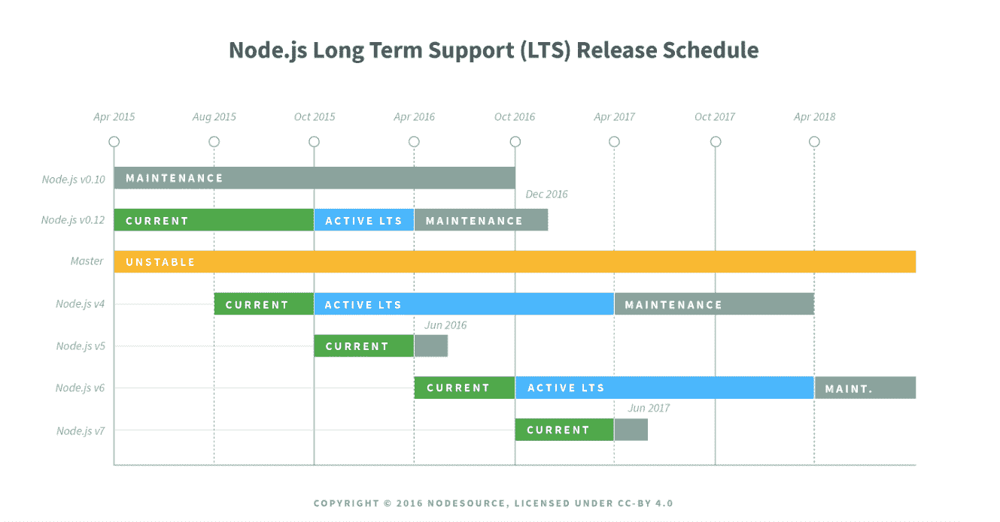
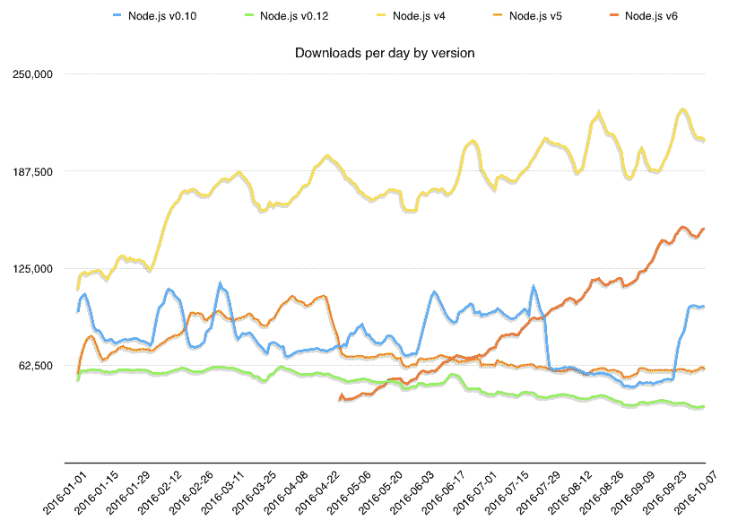

# Node.js v6 过渡到 LTS

> 原文：<https://medium.com/hackernoon/node-js-v6-transitions-to-lts-be7f18c17159>

Node.js 项目本月有三个主要更新:

*   Node.js v7 将成为当前发布行。
*   代号为“硼”的 Node.js v6 过渡到 LTS。
*   Node.js v0.10 将在月底达到“生命终结”。该系列将不会有进一步的发布，包括安全或稳定性补丁。

Node.js v6 过渡到 [LTS **线今天**](https://nodejs.org/en/) ，那我们就来说说这意味着什么，其他版本站在哪里，Node.js v7 有什么期待。

**Node.js 项目的 LTS 战略**

简而言之，长期支持(LTS)战略的重点是为具有复杂环境的组织创造稳定性和安全性，这些组织发现持续升级 Node.js 很麻烦。这些发布线是偶数编号的，支持 30 个月-有关 LTS 战略的更多信息可在此处找到。

**This image is under copyright of NodeSource.*

Node.js 发布系列的历史和策略的另一个好来源，可以在 Rod Vagg 的博客文章“告别 Node.js v5，准备迎接 Node.js v7 ”中找到 Rod 是 Node.js 项目的技术指导委员会主任和 Node.js 基金会董事会成员。

Node.js 遵循[语义版本化](http://semver.org) (semver)。本质上，semver 是我们如何表明变化将如何影响软件，以及升级是否会“破坏”软件，以帮助开发人员确定他们是否应该下载新版本，以及他们应该何时下载新版本。有一组简单的规则和要求规定了如何分配和增加版本号，以及它们是否属于以下类别:

*   **补丁发布**:是对一个 bug 的修复或者是对性能的一个小的提升。它没有增加新的功能或改变软件的工作方式。补丁是一种简单的升级。
*   **次要版本**:这是对软件进行的引入新功能的任何更改，但不改变软件的工作方式。假设有一个新特性要发布，通常最好是在测试和修补之后再升级到次要版本。
*   **重大发布**:这是一个重大的突破性变化。它改变了软件的工作方式和功能。使用 Node.js，可以像将错误消息更改为升级 V8 一样简单。

如果你想了解更多关于版本如何工作的信息，请观看 Myles Borins 在 JSConf Uruguay 上的演讲:[https://www.youtube.com/watch?v=5un1I2qkojg.](https://www.youtube.com/watch?v=5un1I2qkojg.)Myles 是 Node.js 项目和 Node.js 核心技术委员会的成员。

**Node.js v6 从“当前”移到“LTS”**

Node.js v6 将是 LTS 发布线，直到 2018 年 4 月，这意味着新功能( [semver](http://semver.org) -minor)只有在 Node.js 项目的核心技术委员会和 LTS 工作组同意的情况下才能登陆。这些功能不会经常出现。

LTS 涵盖的主要版本中的更改仅限于:

1.  错误修复；
2.  安全更新；
3.  非主要的国家预防机制更新；
4.  相关文件更新；
5.  某些性能改进，破坏现有应用程序的风险极小；
6.  引入大量代码变动的更改，其中破坏现有应用程序的风险较低，并且由于 diff 噪声的减少，有问题的更改可能会显著降低将来更改的反向移植能力。

2018 年 4 月后，Node.js v6 将过渡到“维护”模式，为期 12 个月。维护模式意味着只允许关键错误、关键安全修复和文档更新。

**Node.js v6 对于需要稳定性的企业和用户很重要。**如果你有一个大的生产环境，需要保持 Node.js 的运行，那么你希望在 LTS 发布。如果您属于这一类别，我们建议您更新到 Node.js v6，特别是如果您使用的是 v0.10 或 v0.12。

**功能、焦点和更多功能**

Node.js v6 于 2016 年 4 月成为当前发布线[。它的主要焦点是性能改进、增加可靠性和更好的安全性。一些值得注意的功能和更新包括:](https://nodejs.org/en/blog/announcements/v6-release/)

**安全增强措施**

*   创建新的缓冲 API 以提高安全性。
*   *对“v8_inspector”的实验支持*，一种新的实验调试协议。**如果您的环境无法处理更新或测试，请不要尝试这一新功能，因为它并不完全受支持，并且可能存在漏洞。*

**可靠性提高**

*   当发生本机承诺拒绝，但没有处理程序接收它时，打印标准错误警告。这对于分布式团队构建应用程序尤其重要。在具备这种能力之前，他们必须追踪问题，这相当于大海捞针。现在，他们可以很容易地找到问题所在并解决它。

**ES6 覆盖率**

*   支持 V8 JavaScript 引擎 5.1，包括[默认函数参数](https://developer.mozilla.org/en-US/docs/Web/JavaScript/Reference/Functions/Default_parameters)、[析构](https://developer.mozilla.org/en-US/docs/Web/JavaScript/Reference/Operators/Destructuring_assignment)、[休息参数](https://developer.mozilla.org/en-US/docs/Web/JavaScript/Reference/Functions/rest_parameters)等等。您可以在这里查看[功能的完整列表](https://www.chromestatus.com/features#milestone%3D51)。Node.js v6 现在支持 97%的 ES6 特性。

**Node.js v6 搭载 npm v3**

*   Npm3 解决依赖关系的方式不同于 npm2，因为它试图减少嵌套在 npm2 中导致的深树和冗余——关于这一点的更多信息可以在 [npm 关于该主题的博客文章](https://docs.npmjs.com/how-npm-works/npm3)中找到。展平的依赖关系树将非常重要，特别是对于有文件路径长度限制的 Windows 用户。
*   此外，npm 的包膜功能也发生了变化。当您使用 save 标志或调整依赖关系时，这些更新将提供一种更一致的方式来与 package.json 保持同步。一贯使用包膜来部署项目的用户(大多数企业都这样做)应该注意行为的变化。

**将 Node.js v4 更新为 Node.js v6**

如果你在 Node.js v4 上，你有 18 个月的时间从 Node.js v4 过渡到 Node.js v6。我们建议现在就开始。Node.js v4 将于 2018 年 4 月停止维护。

按照目前的下载速度，Node.js v6 将在今年年底前接管目前 LTS 线 v4 的下载量。这是一件好事，因为 v6 将成为 LTS 的产品线，并在未来 30 个月内处于维护模式。Node.js v4 将于 2018 年 4 月停止维护。

*Data pulled from Node.js metrics section: [https://nodejs.org/metrics/](https://nodejs.org/metrics/)

**过渡关闭 v0.12 的时间& v0.10**

在 v0.12，v0.10，v5 上？请升级！我们理解您可能有时间限制，但 Node.js v0.10 将在本月(10 月)后停止维护。这意味着没有进一步的官方发布，包括对关键安全漏洞的修复。Node.js v0.12 将于 2016 年 12 月停产。

你可能想知道我们这样做的主要原因是什么？12 月 31 日之后，我们将无法获得这些版本的 OpenSSL 更新。这意味着我们将无法提供任何安全更新。

此外，自从 Chromium 团队在四年前淘汰 V8 以来，Node.js 核心团队一直在维护 Node.js v0.10 中包含的 V8 版本。这对用户来说是一个风险，因为团队将不再维护它。

如果您有一个健壮的测试环境设置，那么我们建议升级到 Node.js v6。如果你不愿意进行这么大的版本升级，Node.js v4 也是一个很好的升级，但是它不会像 Node.js v6 那样受支持。

Node.js v4 和 Node.js v6 比 Node.js v0.10 和 v0.12 更稳定，拥有更现代的版本 V8、OpenSSL 和其他关键依赖项。底线:是时候更新了。

是什么阻碍了您的升级？请在下面的评论区告诉我们。如果你一路上有问题，请在本论坛提问:[https://github.com/nodejs/help](https://github.com/nodejs/help)

**好吧，那么 Node.js v7 是怎么回事？**

Node.js v7 于 9 月底发布测试版，预计将于 10 月 25 日发布。Node.js v7 是 Node.js 项目的一个检查点版本，将重点关注稳定性、对 Node.js v6 的增量改进，以及更新到 V8、libuv 和 ICU 的最新版本。

Node.js v7 将搭载 JavaScript 引擎 [V8 5.4](http://v8project.blogspot.com/2016/09/v8-release-54.html) ，专注于与内存相关的性能提升。其中包括新的 JavaScript 语言特性，比如指数运算符、新的对象属性迭代器和对异步函数的实验性支持。需要注意的是，在 V8 5.5 发布之前，不支持异步功能。这些特性仍处于实验模式，所以您可以试用它们，但是它们可能包含 bug，不应该在产品中使用。

鉴于这是一个奇数版本，它将只提供八个月，其生命周期将于 2017 年 6 月结束。它有一些非常棒的功能，但可能不适合你下载。如果您可以轻松升级您的部署，并且可以容忍一点不稳定性，那么这是一个很好的升级。

想要更多关于 Node.js v7 中突破性变化的技术信息吗？点击这里查看完整名单:[https://github.com/nodejs/node/pull/9099](https://github.com/nodejs/node/pull/9099)

除了 v7，我们还将致力于语言兼容性、采用现代 web 标准、VM 中立性和 API 开发的内部增长，以及对不断增长的 Node.js 用例的支持。要了解更多信息，请查看 James Snell 的“Node.js Interactive Amsterdam 最近的主题演讲”[Node.js Core State of the Union "](https://www.youtube.com/watch?v=uH5uQVJs6LI)，了解 node . js Core 在过去一年的发展情况以及我们的发展方向。James 是 Node.js 技术指导委员会的成员。围绕 Node.js v6 的其他技术细节和其他发布线可以在[这里](https://nodejs.org/en/blog/)找到。

> [黑客中午](http://bit.ly/Hackernoon)是黑客如何开始他们的下午。我们是 [@AMI](http://bit.ly/atAMIatAMI) 家庭的一员。我们现在[接受投稿](http://bit.ly/hackernoonsubmission)并乐意[讨论广告&赞助](mailto:partners@amipublications.com)机会。
> 
> 如果你喜欢这个故事，我们推荐你阅读我们的[最新科技故事](http://bit.ly/hackernoonlatestt)和[趋势科技故事](https://hackernoon.com/trending)。直到下一次，不要把世界的现实想当然！

