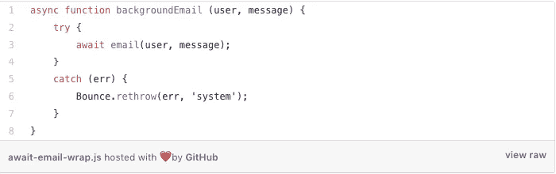
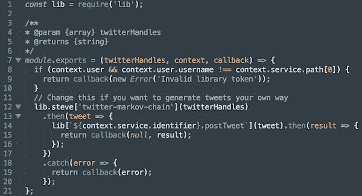

# Node.js 每周更新—2017 年 11 月 10 日

> 原文：<https://medium.com/hackernoon/node-js-weekly-update-10-november-2017-d8c257a9493c>

**下面你可以找到**[**rising stack**](https://risingstack.com/)**最重要的 Node.js 更新的集合，本周项目&教程:**

## [Node v9.1.0(当前)](https://nodejs.org/en/blog/release/v9.1.0/)11 月 7 日发布。

**显著变化:**

CLI:

*   NODE_OPTIONS 现在支持— stack-trace-limit 选项。

deps:

*   OpenSSL 升级到 1.0.2m

http:

*   “连接”事件处理程序泄漏已修复。
*   现在支持 103 早期提示状态代码。

## [节点 v8.9.1 (LTS)](https://nodejs.org/en/blog/release/v8.9.1/) 于 11 月 7 日发布。

**显著变化:**

openssl:

*   将 openssl 源代码升级到 1.0.2m (Shigeki Ohtsu)

还原“https:

*   重构以使用 http 内部机制”(Myles Borins)

## 更多节点版本:

*   [节点版本 6.12.0 (LTS)](https://nodejs.org/en/blog/release/v6.12.0/) 于 11 月 7 日发布。
*   [节点 v4.8.6(维护)](https://nodejs.org/en/blog/release/v4.8.6/)11 月 7 日发布。

## [不等不靠](/@eranhammer/catching-without-awaiting-b2cb7df45790)

> 有时你想一劳永逸地完成一项操作，而不必等待它完成。对于 async/await，这并不明显。如果不等待异步方法完成，就无法捕捉异常。

在这篇文章中，你将会看到一个错误通道是如何影响异步操作在后台执行的。

## [节点模块深度挖掘:查询字符串](https://blog.safia.rocks/post/167198565657/node-module-deep-dive-querystring)

萨菲娅·阿卜杜拉刚刚在她的博客上开始了一个新系列。首先，她向我们介绍了节点标准库中最基本的模块之一:`querystring`。

> 我想从节点标准库中最基本的模块之一开始:querystring。querystring 是一个模块，允许用户提取 URL 的查询部分的值，并从键值关联的对象构建查询。

## [节点核心中的 HTTP/2](https://blog.yld.io/2017/11/03/http-2-in-node-js-core/#.WgV9ghNSyuW)

> HTTP/2 开始被越来越多的人使用(它从今年年初的 11%跃升至网络总使用量的 18%)。

在 Twitter 宣布将在 8.x LTS 版本中移除该标志后，Node.js 最终在 8.8.0 版本中取消了该标志(10 月 24 日)。HTTP/2 仍然被认为是实验性的，尽管事实上它还没有 100%完成，但是你已经可以开始用它做实验并查看 HTTP/2 API 文档了。

## [用马尔可夫链、Node.js 和 StdLib 创建一个 Twitter 政客机器人](https://hackernoon.com/create-a-twitter-politician-bot-with-markov-chains-node-js-and-stdlib-14df8cc1c68a)

> *在当今世界的政治气候下，宣传是游戏的名字，推特是首选的媒介。自动化是王道，如果你不使用 Twitter 机器人来影响大众，你就做错了。*

学习如何建立一个吸引大众的 twitter 机器人，并创建自己的“政治终结者”。

## [节点淘汰赛 2018](/the-node-js-collection/node-knockout-2018-54096b8de807)

> Node Knockout 是一个不受地点限制的 48 小时 Node.js 黑客马拉松。比赛从世界协调时 11 月 11 日星期六上午 00:00 开始，一直持续到世界协调时星期一上午 00:00。

虽然没有保证获胜的公式或想法，但你可以做一些事情来最大化你完成比赛的机会。在这篇文章中，你可以读到内森·霍德关于如何确保成功拥抱一个项目的建议。

## [Node.js 核心价值观](/the-node-js-collection/node-js-core-values-ab5387c4fd49)

> *过去，Node.js 依赖于对社区成员期望的隐性理解。展望未来，我们需要记录这些隐含的期望，以便我们能够有效地合作，并授权所有成员以 Node.js 的最大利益行事*

为了实现这一点，在 Node Interactive 2017 之后的 Node.js 合作者峰会上，举办了首届 Node.js 核心价值观工作坊。

## [我如何进入#Node: Matteo Collina](/@nodejs/how-i-got-into-node-matteo-collina-8542d43afcc2)

Matteo 目前是 nearForm 的软件架构师，并且是 Node.js 项目的技术指导委员会成员。

在*我如何进入#Node* 系列中，他接受了采访，以揭示他是如何参与编程的，以及他是如何开始为 Node.js 做出贡献的。

# Node.js 每周更新前情提要

在之前的 [Node.js 每周更新](https://community.risingstack.com/node-js-weekly-update-november-3/)中，我们收集了 Node.js 的最新消息，例如 Node.js 的轻量级作业调度，如何使用 Getopts，或者如何使用 Node.js 创建零依赖 HTTP/2 静态文件服务器。[如果您错过了，请单击](https://community.risingstack.com/node-js-weekly-update-november-3/)！

*我们也每天帮助您更新 Node.js。查看我们的* [*Node.js 新闻*](https://news.risingstack.com/) *页面及其* [*推特供稿*](https://twitter.com/NodeJS_Daily) *！*

*原载于 2017 年 11 月 10 日 community.risingstack.com**的* [*。*](https://community.risingstack.com/node-js-weekly-update-november-10/)